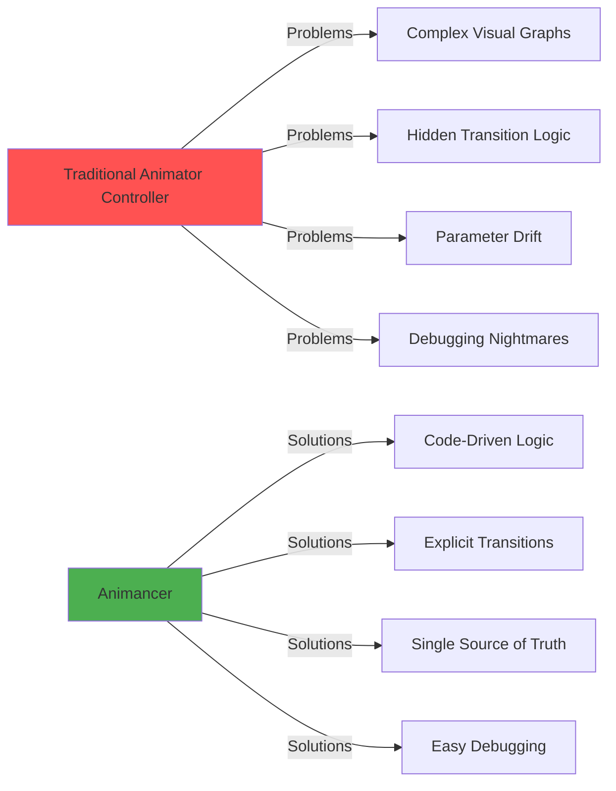

# Getting Started with Animancer Pro 8

## What is Animancer?

**Animancer** is a powerful animation system for Unity that replaces the traditional Animator
Controller with a code-first approach. Instead of managing complex state machines in a visual graph,
you control animations directly through C# scripts—making your animation logic **transparent**,
**flexible**, and **easy to debug**.

Think of it as "animations on demand": you play exactly what you want, when you want, with full
control over every detail.

---

## Why Choose Animancer Over Animator Controllers?



### Problems with Animator Controllers

| Problem                   | Description                                      | Impact                                               |
| ------------------------- | ------------------------------------------------ | ---------------------------------------------------- |
| **Hidden Logic**          | Transitions buried in visual graphs              | Hard to understand "why didn't that animation play?" |
| **Dual Sources of Truth** | Parameters in Animator + enums in code           | Easy to drift apart and cause bugs                   |
| **Complex Edge Cases**    | Interrupting, restarting, or blending animations | Requires messy transition rules                      |
| **Implicit Behaviors**    | Exit times and conditions                        | Only surface during QA testing                       |
| **Poor Version Control**  | Binary asset files                               | Difficult to review changes in PRs                   |

### How Animancer Solves These Problems

| Solution                     | Benefit                                                   |
| ---------------------------- | --------------------------------------------------------- |
| **Code-First**               | All animation logic in C# scripts—easy to read and review |
| **Explicit Control**         | You decide what plays, when, and how                      |
| **Direct Manipulation**      | Set speed, time, events directly on animation states      |
| **Deterministic**            | Predictable behavior—no hidden state machine magic        |
| **Version Control Friendly** | Plain C# files with clear diffs                           |

---

## Core Concept: Play What You Want, When You Want

With Animator Controllers, you **request** animations by setting parameters and hoping the state
machine transitions correctly.

With Animancer, you **command** animations directly:

```csharp
// That's it! No parameters, no state machine setup
animancer.Play(walkClip);
```

---

## Quick Start: Your First Animancer Animation

### Step 1: Add AnimancerComponent

Replace your GameObject's `Animator` component with `AnimancerComponent`:

```csharp
using Animancer;

public class SimpleCharacter : MonoBehaviour
{
    [SerializeField] private AnimancerComponent _animancer;
    [SerializeField] private AnimationClip _idleClip;
    [SerializeField] private AnimationClip _walkClip;

    void Start()
    {
        // Play idle animation on startup
        _animancer.Play(_idleClip);
    }
}
```

### Step 2: Play Animations On Demand

```csharp
public void Walk()
{
    // Instantly switch to walk animation
    _animancer.Play(_walkClip);
}

public void Idle()
{
    // Switch back to idle
    _animancer.Play(_idleClip);
}
```

That's it! No state machine setup, no parameters, no transitions to configure.

---

## What Makes Animancer Awesome?

### 🎯 **1. Zero Setup Overhead**

**Before (Animator Controller):**

1. Create Animator Controller asset
2. Add states for each animation
3. Create parameters (triggers, bools, floats)
4. Draw transition lines
5. Configure transition conditions
6. Set blend times and exit times
7. Write code to set parameters
8. Debug why transitions don't work

**After (Animancer):**

```csharp
animancer.Play(myClip);  // Done!
```

### ⚡ **2. Full Runtime Control**

```csharp
// Control every aspect of your animation
AnimancerState state = animancer.Play(clip);
state.Speed = 2.0f;                    // Play at 2x speed
state.Time = 1.5f;                     // Jump to 1.5 seconds in
state.NormalizedTime = 0.5f;           // Jump to 50% through
state.Weight = 0.75f;                  // Blend at 75% influence
```

> **💡 Pro Tip:** Have directional animations (walk_left, walk_right, etc.) that are all the same
> length? You can seamlessly switch between them mid-animation by preserving `NormalizedTime`! See
> [Code Examples - Directional Animation](./05-code-examples.md#directional-animation-switching-seamless)

### 🎪 **3. Easy Animation Events**

Replace Unity's clunky Animation Events with clean C# delegates:

```csharp
AnimancerState state = animancer.Play(attackClip);

// Clear and add events (v8 API uses OwnedEvents)
state.OwnedEvents.Clear();
state.OwnedEvents.Add(0.3f, () => Debug.Log("Swing started!"));
state.OwnedEvents.Add(0.7f, () => ApplyDamage());
state.OwnedEvents.Add(1.0f, () => ReturnToIdle());
```

### 🔄 **4. Smart Transitions**

```csharp
// Smooth blend over 0.3 seconds
animancer.Play(runClip, fadeDuration: 0.3f);

// Instant switch (no blend)
animancer.Play(jumpClip, fadeDuration: 0f);

// Custom fade curve
animancer.Play(landClip, fadeDuration: 0.5f, fadeMode: FadeMode.FromStart);
```

---

## When Should You Use Animancer?

### ✅ **Perfect For:**

- **Dynamic gameplay** where animations change based on code logic
- **Characters with many states** (players, complex NPCs)
- **State machine-driven gameplay** where you already have code managing states
- **Procedural or data-driven animation systems**
- **Teams that prefer code over visual tools**
- **Projects requiring precise animation control**

### 🤔 **Consider Alternatives When:**

- Your game has very simple animations (2-3 states total)
- Your team strongly prefers visual tools over code
- You're using Unity's Timeline for everything already

---

## Animancer vs Animator Controller: Quick Comparison

| Feature                | Animator Controller                 | Animancer Pro                      |
| ---------------------- | ----------------------------------- | ---------------------------------- |
| **Animation Playback** | Set parameters, hope for transition | Direct: `Play(clip)`               |
| **Transition Logic**   | Visual graph                        | C# code                            |
| **Runtime Control**    | Limited (parameters only)           | Full (speed, time, weight, events) |
| **Debugging**          | Difficult (hidden state)            | Easy (explicit code)               |
| **Events**             | Unity Animation Events              | Clean C# delegates                 |
| **Version Control**    | Binary files                        | Plain C#                           |
| **Learning Curve**     | Medium (UI + parameters)            | Low (just C#)                      |
| **Setup Time**         | High                                | Very Low                           |
| **Code Integration**   | Indirect (parameters)               | Direct (method calls)              |

---

## What You'll Learn Next

Now that you understand what Animancer is and why it's awesome, let's dive deeper:

1. **[Core Concepts](./02-core-concepts.md)** - Understanding states, transitions, and the animation
   graph
2. **[Advanced Techniques](./03-advanced-techniques.md)** - Layers, mixers, state machines, and more
3. **[Best Practices & Pitfalls](./04-best-practices.md)** - Do's, don'ts, and common mistakes
4. **[Code Examples & Recipes](./05-code-examples.md)** - Ready-to-use patterns for common scenarios

---

## Your First Complete Example

Here's a simple character controller showcasing Animancer's elegance:

```csharp
using UnityEngine;
using Animancer;

public class SimpleCharacterController : MonoBehaviour
{
    [Header("Components")]
    [SerializeField] private AnimancerComponent _animancer;

    [Header("Animation Clips")]
    [SerializeField] private AnimationClip _idle;
    [SerializeField] private AnimationClip _walk;
    [SerializeField] private AnimationClip _run;
    [SerializeField] private AnimationClip _jump;

    private bool _isGrounded = true;

    void Start()
    {
        _animancer.Play(_idle);
    }

    void Update()
    {
        // Handle jump
        if (_isGrounded && Input.GetKeyDown(KeyCode.Space))
        {
            Jump();
            return;
        }

        // Handle ground movement
        if (!_isGrounded) return;

        float speed = Input.GetAxis("Horizontal");

        if (Mathf.Abs(speed) < 0.1f)
        {
            PlayIdle();
        }
        else if (speed < 0.5f)
        {
            PlayWalk();
        }
        else
        {
            PlayRun();
        }
    }

    void PlayIdle()
    {
        if (!_animancer.IsPlaying(_idle))
            _animancer.Play(_idle, fadeDuration: 0.2f);
    }

    void PlayWalk()
    {
        if (!_animancer.IsPlaying(_walk))
            _animancer.Play(_walk, fadeDuration: 0.25f);
    }

    void PlayRun()
    {
        if (!_animancer.IsPlaying(_run))
            _animancer.Play(_run, fadeDuration: 0.3f);
    }

    void Jump()
    {
        _isGrounded = false;

        AnimancerState jumpState = _animancer.Play(_jump, fadeDuration: 0.1f);

        // Return to idle when jump finishes (v8 uses OwnedEvents)
        jumpState.OwnedEvents.Clear();
        jumpState.OwnedEvents.Add(1.0f, () => {
            _isGrounded = true;
            PlayIdle();
        });
    }
}
```

**Notice how:**

- ✅ No Animator Controller needed
- ✅ Clear, readable logic
- ✅ Easy to add new animations
- ✅ Events handled inline
- ✅ Full control over transitions

---

## Next Steps

Ready to dive deeper? Head to **[Core Concepts](./02-core-concepts.md)** to learn about animation
states, the Animancer graph, and powerful control techniques.

---

**Official Resources:**

- [Animancer Documentation](https://kybernetik.com.au/animancer/docs/)
- [Unity Asset Store](https://assetstore.unity.com/packages/tools/animation/animancer-pro-v8-293522)
- Minimum Unity Version: **2022.3**
