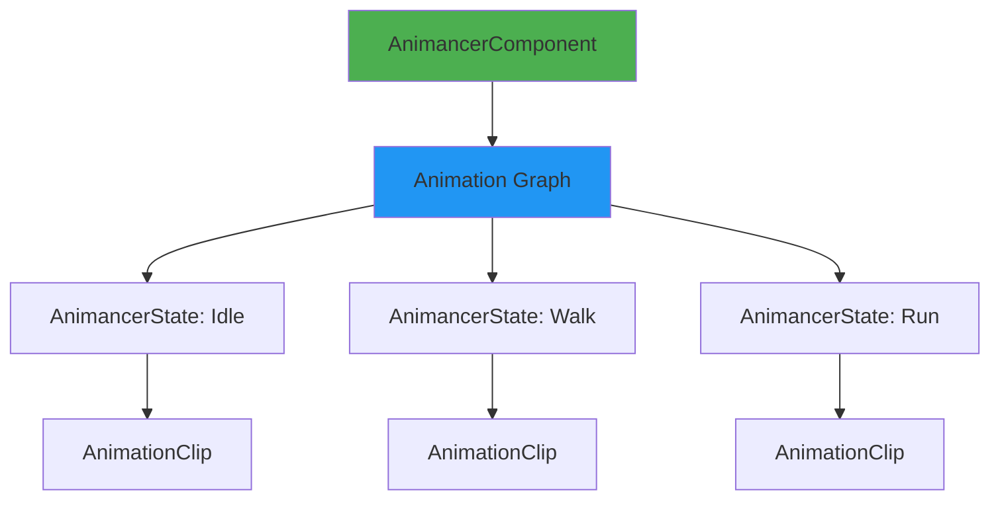
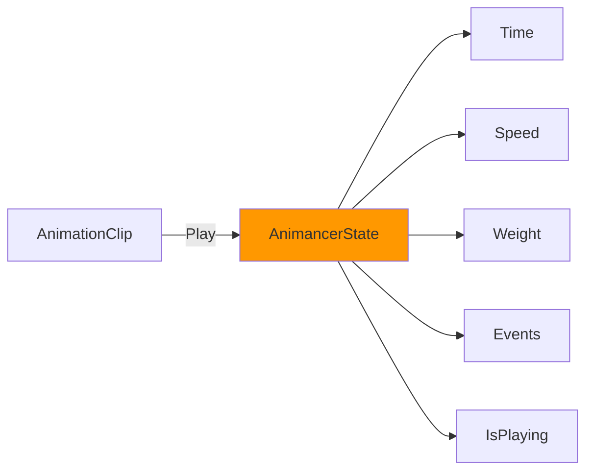
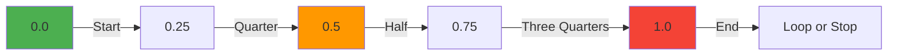
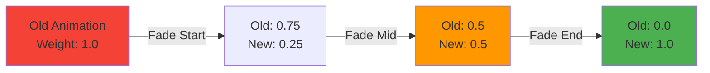

# Core Concepts: Understanding Animancer

This guide covers the fundamental building blocks of Animancer—understanding these concepts will
unlock the full power of the system.

> **⚡ TL;DR:** AnimancerComponent plays clips, returns AnimancerStates you control (speed, time,
> weight), add events with `state.OwnedEvents`, use `NormalizedTime` (0-1) to sync animations, check
> `IsPlaying()` before replaying. [Skip to Key Takeaways](#key-takeaways)

---

## Table of Contents

1. [The Animation Graph](#the-animation-graph)
2. [AnimancerComponent](#animancercomponent)
3. [AnimancerStates](#animancerstates)
4. [Playing Animations](#playing-animations)
5. [Controlling Playback](#controlling-playback)
6. [Animation Events](#animation-events)
7. [Normalized Time](#normalized-time)
8. [Transitions and Blending](#transitions-and-blending)
9. [Checking What's Playing](#checking-whats-playing)

---

## The Animation Graph

Animancer builds a **runtime animation graph** behind the scenes—just like Animator Controller—but
you control it directly through code.



**Key Points:**

- The graph is **automatically managed**—you don't need to wire nodes manually
- Each animation clip gets an **AnimancerState** when played
- States are **reused** when you play the same clip again
- The graph **updates every frame** to blend weights and advance time

---

## AnimancerComponent

The `AnimancerComponent` is your gateway to the animation system. It replaces Unity's `Animator`
component.

**Official Docs:**
[Animancer Component](https://kybernetik.com.au/animancer/docs/manual/playing/component-types/)

### Setup

```csharp
using Animancer;

public class MyCharacter : MonoBehaviour
{
    [SerializeField] private AnimancerComponent _animancer;

    void Awake()
    {
        // Optional: Get it at runtime if not assigned
        if (_animancer == null)
            _animancer = GetComponent<AnimancerComponent>();
    }
}
```

### Key Properties (AnimancerState)

| Property         | Description                                    |
| ---------------- | ---------------------------------------------- |
| `States`         | Dictionary of all AnimancerStates in the graph |
| `States.Current` | The currently playing state (highest weight)   |
| `IsPlaying`      | Whether any animation is playing               |
| `Playable`       | The underlying PlayableGraph (advanced)        |

### Common Methods

```csharp
// Play an animation
AnimancerState state = _animancer.Play(clip);

// Play with custom fade duration
_animancer.Play(clip, fadeDuration: 0.3f);

// Stop all animations
_animancer.Stop();

// Manually evaluate the graph (rare)
_animancer.Evaluate();
```

---

## AnimancerStates

Every animation clip you play creates or reuses an **AnimancerState**—think of it as the runtime
representation of your animation.

**Official Docs:**
[Animancer States](https://kybernetik.com.au/animancer/docs/manual/playing/states/)



### Accessing States

```csharp
// Get state when playing
AnimancerState state = _animancer.Play(myClip);

// Get existing state later
AnimancerState state = _animancer.States.Current;

// Get state by clip reference
AnimancerState state = _animancer.States.GetOrCreate(myClip);
```

### Key Properties (State API)

```csharp
AnimancerState state = _animancer.Play(myClip);

// Playback control
state.Time = 2.0f;                    // Jump to 2 seconds
state.NormalizedTime = 0.5f;          // Jump to 50% through
state.Speed = 1.5f;                   // Play at 1.5x speed
state.Weight = 0.8f;                  // Blend weight (0-1)

// Information
state.Length;                          // Total duration in seconds
state.IsPlaying;                       // Is this state active?
state.IsLooping;                       // Does this clip loop?
state.Clip;                           // The source AnimationClip

// Events (v8 API)
state.OwnedEvents;                     // Event system for this state instance
state.SharedEvents;                    // Persistent events shared across playbacks
```

---

## Playing Animations

The core of Animancer: telling it what to play.

### Basic Playback

```csharp
// Play an animation (with default 0.25s fade)
_animancer.Play(walkClip);

// Play with custom fade
_animancer.Play(runClip, fadeDuration: 0.3f);

// Play instantly (no blend)
_animancer.Play(jumpClip, fadeDuration: 0f);
```

### Capturing the State

```csharp
// Get the state to control it further
AnimancerState state = _animancer.Play(attackClip);
state.Speed = 2.0f;  // Play attack at double speed
```

### Preventing Restarts

A common pattern: only play if not already playing.

```csharp
// Check before playing
if (!_animancer.IsPlaying(idleClip))
{
    _animancer.Play(idleClip);
}

// Extension helper
if (!_animancer.IsPlaying(idleClip))
    _animancer.Play(idleClip);
```

This prevents the animation from restarting every frame, which would cause stuttering.

---

## Controlling Playback

Once you have an AnimancerState, you have full control.

### Speed Control

```csharp
AnimancerState state = _animancer.Play(walkClip);

// Play at different speeds
state.Speed = 2.0f;   // Double speed
state.Speed = 0.5f;   // Half speed
state.Speed = 0f;     // Pause (freeze frame)
state.Speed = -1f;    // Play backwards!
```

**Use Case:** Match walk speed to actual movement velocity.

```csharp
void Update()
{
    float moveSpeed = _rigidbody.velocity.magnitude;
    AnimancerState walkState = _animancer.States.Current;

    if (walkState != null && walkState.Clip == _walkClip)
    {
        // Scale animation speed to match movement
        walkState.Speed = moveSpeed / baseWalkSpeed;
    }
}
```

### Time Manipulation

```csharp
AnimancerState state = _animancer.Play(attackClip);

// Jump to specific time (in seconds)
state.Time = 1.5f;

// Jump to specific percentage (0-1)
state.NormalizedTime = 0.75f;  // 75% through the animation

// Rewind to start
state.NormalizedTime = 0f;
```

### Weight Control

For layering and blending multiple animations simultaneously (advanced):

```csharp
// Play two animations at once
AnimancerState idle = _animancer.Play(_idleClip);
idle.Weight = 0.7f;  // 70% influence

AnimancerState wave = _animancer.Play(_waveClip);
wave.Weight = 0.3f;  // 30% influence
```

---

## Animation Events

One of Animancer's most powerful features: **event callbacks at specific times** in your animation.

**Official Docs:** [Animancer Events](https://kybernetik.com.au/animancer/docs/manual/events/)

### Why Events?

Unity's Animation Events require:

1. Adding events in the Animation window
2. Having a method with a matching name on the GameObject
3. Hoping the method signature matches

**Animancer's way is simpler:**

```csharp
AnimancerState state = _animancer.Play(attackClip);

// v8 API: Use OwnedEvents for per-instance event management
state.OwnedEvents.Clear();

// Add events at specific normalized times (0-1)
state.OwnedEvents.Add(0.3f, () => {
    Debug.Log("Swing started!");
});

state.OwnedEvents.Add(0.7f, () => {
    ApplyDamage();
});

state.OwnedEvents.Add(1.0f, () => {
    Debug.Log("Attack finished!");
    ReturnToIdle();
});
```

### OwnedEvents vs SharedEvents (v8.0)

Animancer v8 introduced a reworked event system with two access patterns:

```csharp
// OwnedEvents: Per-instance events that belong to this specific playback
// Best for dynamic gameplay logic that changes each time
state.OwnedEvents.Clear();
state.OwnedEvents.Add(0.5f, OnHalfway);

// SharedEvents: Persistent events defined once and reused
// Best for consistent effects like footsteps or sound triggers
// Note: SharedEvents may be null if not set up in a Transition Asset
if (state.SharedEvents != null)
{
    state.SharedEvents.Add(0.2f, OnFootstep);
    state.SharedEvents.Add(0.8f, OnFootstep);
}
```

**Rule of Thumb:** Use `OwnedEvents` for dynamic gameplay (99% of cases), `SharedEvents` for
reusable event configurations in Transition Assets.

### Practical Event Examples

#### Example 1: Attack with Damage Window

```csharp
void Attack()
{
    AnimancerState state = _animancer.Play(_attackClip);
    state.OwnedEvents.Clear();

    // Damage window starts 30% through
    state.OwnedEvents.Add(0.3f, () => _damageCollider.enabled = true);

    // Damage window ends 70% through
    state.OwnedEvents.Add(0.7f, () => _damageCollider.enabled = false);

    // Return to idle when done
    state.OwnedEvents.Add(1.0f, ReturnToIdle);
}
```

#### Example 2: Chain Animations

```csharp
void PlayEntrance()
{
    AnimancerState entrance = _animancer.Play(_entranceClip);
    entrance.OwnedEvents.Clear();

    // When entrance finishes, play idle loop
    entrance.OwnedEvents.Add(1.0f, () => {
        _animancer.Play(_idleLoopClip);
    });
}
```

#### Example 3: Spawn VFX at Exact Moment

```csharp
void CastSpell()
{
    AnimancerState cast = _animancer.Play(_castClip);
    cast.OwnedEvents.Clear();

    // Spawn effect halfway through cast
    cast.OwnedEvents.Add(0.5f, () => {
        Instantiate(_spellEffect, _spellSpawnPoint.position, Quaternion.identity);
    });

    cast.OwnedEvents.Add(1.0f, OnCastComplete);
}
```

---

## Normalized Time

**Normalized time** is one of Animancer's most important concepts. It represents animation progress
as a value between **0 and 1**.



### Why Normalized Time?

- **Clip-independent**: Works with any animation length
- **Easy synchronization**: Keep multiple animations in sync
- **Percentage-based**: Intuitive (0.5 = 50% through)

### Using Normalized Time

```csharp
AnimancerState state = _animancer.Play(myClip);

// Get current progress
float progress = state.NormalizedTime;  // 0.0 to 1.0 (and beyond if looping)

// Jump to 75% through
state.NormalizedTime = 0.75f;

// For looping animations, use modulo to get 0-1 range
float loopProgress = state.NormalizedTime % 1f;
```

### The Magic of Directional Animations

**Here's where Normalized Time truly shines:** If you have animations of the same length but
different directions (walk left, walk right, walk up, walk down), you can seamlessly switch between
them mid-animation!

```csharp
void PlayDirectionalWalk(AnimationClip newDirectionClip)
{
    // 1. Check if we need to switch
    if (_animancer.States.Current?.Clip == newDirectionClip)
        return; // Already playing this direction

    // 2. Grab current progress (where are we in the walk cycle?)
    float normalizedTime = _animancer.States.Current?.NormalizedTime % 1f ?? 0f;

    // 3. Play the new direction clip
    AnimancerState newState = _animancer.Play(newDirectionClip);

    // 4. Set it to the same progress point (seamless!)
    newState.NormalizedTime = normalizedTime;
}
```

**Result:** When you change from walking right → walking left, the character's feet stay in the same
position in the cycle. No jarring restarts!

**Official Documentation:**
[Animancer States - Time](https://kybernetik.com.au/animancer/docs/manual/playing/states/#time)

### Syncing Multiple Sprites

Another common use case: keeping multiple sprite layers in sync (like separate arm/body sprites).

```csharp
void PlaySyncedAnimation(AnimationClip clip)
{
    // Check if already playing
    if (_bodyAnimancer.States.Current?.Clip == clip) return;

    // Get current progress of body animation
    float normalizedTime = _bodyAnimancer.States.Current?.NormalizedTime % 1f ?? 0f;

    // Play new clip on all layers at the same progress point
    AnimancerState bodyState = _bodyAnimancer.Play(clip);
    bodyState.NormalizedTime = normalizedTime;

    AnimancerState leftArmState = _leftArmAnimancer.Play(clip);
    leftArmState.NormalizedTime = normalizedTime;

    AnimancerState rightArmState = _rightArmAnimancer.Play(clip);
    rightArmState.NormalizedTime = normalizedTime;
}
```

This prevents "popping" when switching animations—all sprites stay aligned.

---

## Transitions and Blending

When you play a new animation, Animancer automatically **fades** (blends) from the old to the new.

**Official Docs:** [Transitions](https://kybernetik.com.au/animancer/docs/manual/transitions/)

### Fade Duration

```csharp
// Default fade: 0.25 seconds
_animancer.Play(walkClip);

// Custom fade: 0.5 seconds (smooth transition)
_animancer.Play(runClip, fadeDuration: 0.5f);

// Instant switch (no blend)
_animancer.Play(jumpClip, fadeDuration: 0f);

// Very slow blend (dramatic effect)
_animancer.Play(deathClip, fadeDuration: 2.0f);
```

### Fade Modes

Animancer v8 introduced fade modes for more control:

```csharp
// Fade from the start of the new animation (default)
_animancer.Play(clip, fadeDuration: 0.3f, FadeMode.FromStart);

// Fade starting from the current state
_animancer.Play(clip, fadeDuration: 0.3f, FadeMode.FromEnd);

// Custom easing curve
_animancer.Play(clip, fadeDuration: 0.3f, FadeMode.Custom);
```

### How Blending Works



During the fade, both animations play simultaneously with changing weights. Unity blends their poses
together.

---

## Checking What's Playing

Prevent unnecessary replays and stutters by checking state before playing.

### IsPlaying Method

```csharp
// Check if a specific clip is playing
if (_animancer.IsPlaying(idleClip))
{
    Debug.Log("Already idling!");
}
else
{
    _animancer.Play(idleClip);
}
```

### Current State Check

```csharp
// Check what's currently playing
AnimancerState current = _animancer.States.Current;

if (current != null && current.Clip == _walkClip)
{
    Debug.Log("Currently walking");
}
```

### IsPlayingClip Extension

Your project might have a helper extension:

```csharp
public static bool IsPlayingClip(this AnimancerComponent animancer, AnimationClip clip)
{
    return animancer.States.Current?.Clip == clip;
}

// Usage
if (_animancer.IsPlayingClip(runClip))
{
    // Already running
}
```

---

## Putting It All Together

Here's a complete example showcasing all core concepts:

```csharp
using UnityEngine;
using Animancer;

public class CharacterAnimator : MonoBehaviour
{
    [Header("Components")]
    [SerializeField] private AnimancerComponent _animancer;

    [Header("Clips")]
    [SerializeField] private AnimationClip _idle;
    [SerializeField] private AnimationClip _walk;
    [SerializeField] private AnimationClip _attack;

    void Start()
    {
        PlayIdle();
    }

    public void PlayIdle()
    {
        // Only play if not already playing (prevents restart stutter)
        if (_animancer.IsPlaying(_idle)) return;

        _animancer.Play(_idle, fadeDuration: 0.25f);
    }

    public void PlayWalk(float speedMultiplier)
    {
        if (_animancer.IsPlaying(_walk))
        {
            // Just update speed if already walking
            _animancer.States.Current.Speed = speedMultiplier;
            return;
        }

        // Play with smooth blend
        AnimancerState state = _animancer.Play(_walk, fadeDuration: 0.3f);
        state.Speed = speedMultiplier;
    }

    public void PlayAttack()
    {
        // Instant switch to attack
        AnimancerState state = _animancer.Play(_attack, fadeDuration: 0f);

        // Clear old events (v8 uses OwnedEvents)
        state.OwnedEvents.Clear();

        // Add damage window
        state.OwnedEvents.Add(0.4f, () => {
            Debug.Log("Deal damage now!");
        });

        // Return to idle when finished
        state.OwnedEvents.Add(1.0f, PlayIdle);
    }

    void Update()
    {
        // Display current animation progress
        AnimancerState current = _animancer.States.Current;
        if (current != null)
        {
            float progress = (current.NormalizedTime % 1f) * 100f;
            Debug.Log($"Playing: {current.Clip.name} ({progress:F0}%)");
        }
    }
}
```

---

## Key Takeaways

✅ **AnimancerComponent** replaces Animator—it's your control center ✅ **AnimancerState**
represents each playing animation with full control ✅ **Play()** is your main method—simple and
powerful ✅ **Events** replace Animation Events with clean C# delegates ✅ **Normalized Time** (0-1)
makes timing clip-independent ✅ **Transitions** blend smoothly with configurable fade durations ✅
**Always check IsPlaying()** to prevent stuttering restarts

---

## Next Steps

Now that you understand the fundamentals, you're ready for:

- **[Advanced Techniques](./03-ADVANCED-TECHNIQUES.md)** - Layers, mixers, state machines,
  transitions
- **[Best Practices & Pitfalls](./04-BEST-PRACTICES.md)** - Common mistakes and how to avoid them
- **[Code Examples & Recipes](./05-CODE-EXAMPLES.md)** - Ready-to-use patterns for every scenario

---

**Official Documentation:**
[kybernetik.com.au/animancer/docs/](https://kybernetik.com.au/animancer/docs/)
