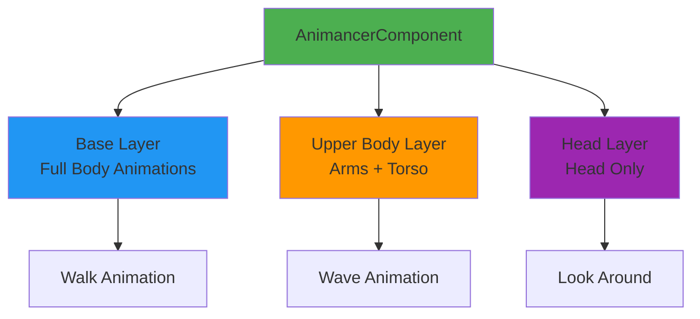
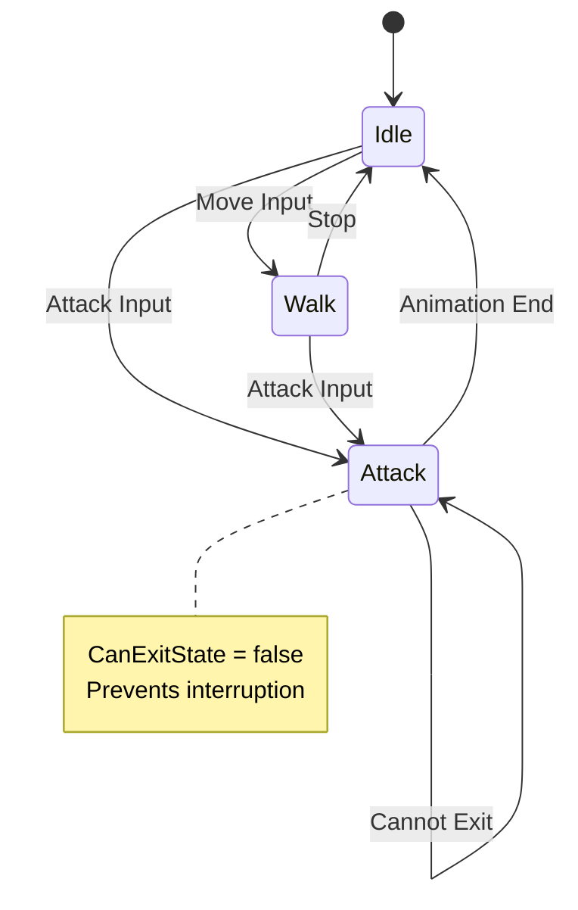

# Advanced Techniques: Mastering Animancer

Take your animations to the next level with layers, mixers, state machines, and Animancer Pro 8's
powerful new features.

> **⚡ TL;DR:** Layers = blend body parts, Mixers = blend based on parameters (like Blend Trees),
> State Machines = organize complex logic, v8 adds Transition Libraries + Weighted Masks.
> [Skip to Key Takeaways](#key-takeaways)

---

## Table of Contents

1. [Animation Layers](#animation-layers)
2. [Mixers and Blending](#mixers-and-blending)
3. [State Machines](#state-machines)
4. [Transition Assets](#transition-assets)
5. [Transition Libraries (v8.0)](#transition-libraries-v80)
6. [Weighted Mask Layers (v8.0)](#weighted-mask-layers-v80)
7. [Parameter Binding (v8.0)](#parameter-binding-v80)
8. [Custom Fade Curves](#custom-fade-curves)
9. [Working with Multiple Sprites](#working-with-multiple-sprites)
10. [Inverse Kinematics (IK)](#inverse-kinematics-ik)

---

## Animation Layers

Layers let you play multiple animations **simultaneously** on different parts of the body. Think of
it like Photoshop layers—each one affects a different region.

**Official Docs:**
[Animation Layers](https://kybernetik.com.au/animancer/docs/manual/blending/layers/)



### Why Use Layers?

| Use Case                | Example                                      |
| ----------------------- | -------------------------------------------- |
| **Upper body actions**  | Walk while waving or aiming                  |
| **Facial animations**   | Talking while running                        |
| **Additive animations** | Breathing or idle fidgets on top of movement |
| **Injury effects**      | Limping overlay on walk cycle                |

### Creating Layers

```csharp
using UnityEngine;
using Animancer;

public class LayeredCharacter : MonoBehaviour
{
    [SerializeField] private AnimancerComponent _animancer;

    [Header("Clips")]
    [SerializeField] private AnimationClip _walk;
    [SerializeField] private AnimationClip _wave;

    void Start()
    {
        // Layer 0 (base): Full body walk
        _animancer.Layers[0].Play(_walk);

        // Layer 1: Upper body wave
        AnimancerLayer upperBodyLayer = _animancer.Layers[1];
        upperBodyLayer.Play(_wave);

        // Set the layer to only affect upper body (requires Avatar Mask)
        // upperBodyLayer.Mask = _upperBodyMask;
    }
}
```

### Layer Properties

```csharp
AnimancerLayer layer = _animancer.Layers[1];

// Control layer influence
layer.Weight = 0.75f;  // 75% influence (0 = none, 1 = full)

// Set avatar mask (which bones this layer affects)
layer.Mask = myAvatarMask;

// Additive blending (adds to base instead of overriding)
layer.IsAdditive = true;

// Get current state on this layer
AnimancerState currentState = layer.CurrentState;
```

### Practical Example: Walk + Wave

```csharp
public class WalkAndWave : MonoBehaviour
{
    [SerializeField] private AnimancerComponent _animancer;
    [SerializeField] private AnimationClip _walk;
    [SerializeField] private AnimationClip _wave;
    [SerializeField] private AvatarMask _upperBodyMask;

    void Start()
    {
        // Base layer: walk
        _animancer.Layers[0].Play(_walk);
    }

    public void StartWaving()
    {
        // Create/get upper body layer
        AnimancerLayer upperLayer = _animancer.Layers[1];
        upperLayer.Mask = _upperBodyMask;

        // Fade in the wave
        AnimancerState waveState = upperLayer.Play(_wave);

        // Fade out when done (v8 uses OwnedEvents)
        waveState.OwnedEvents.Clear();
        waveState.OwnedEvents.Add(1.0f, StopWaving);
    }

    void StopWaving()
    {
        // Fade out the entire layer
        _animancer.Layers[1].Weight = 0f;
    }
}
```

---

## Mixers and Blending

**Mixers** blend multiple animations based on a parameter—like Unity's Blend Trees, but in code.

**Official Docs:** [Mixers](https://kybernetik.com.au/animancer/docs/manual/blending/mixers/)

### Types of Mixers

| Mixer Type            | Use Case              | Parameter     |
| --------------------- | --------------------- | ------------- |
| **Linear Mixer**      | Idle → Walk → Run     | Speed (float) |
| **2D Mixer**          | Movement in X/Y       | Vector2       |
| **Cartesian Mixer**   | Directional movement  | X, Y floats   |
| **Directional Mixer** | Rotate around a point | Angle         |

### Linear Mixer Example

Blend between idle, walk, and run based on speed:

```csharp
using UnityEngine;
using Animancer;

public class MovementMixer : MonoBehaviour
{
    [SerializeField] private AnimancerComponent _animancer;

    [Header("Movement Clips")]
    [SerializeField] private AnimationClip _idle;
    [SerializeField] private AnimationClip _walk;
    [SerializeField] private AnimationClip _run;

    private LinearMixerState _movementMixer;

    void Start()
    {
        // Create a linear mixer
        _movementMixer = new LinearMixerState();

        // Add animations at different threshold values
        _movementMixer.Add(_idle, threshold: 0f);    // 0 = idle
        _movementMixer.Add(_walk, threshold: 5f);    // 5 = walk
        _movementMixer.Add(_run,  threshold: 10f);   // 10 = run

        // Play the mixer
        _animancer.Play(_movementMixer);
    }

    void Update()
    {
        // Get movement speed from input or physics
        float speed = Input.GetAxis("Vertical") * 10f;

        // Update mixer parameter (automatically blends)
        if (_movementMixer != null)
        {
            _movementMixer.Parameter = speed;
        }
    }
}
```

**Result:**

- Speed 0: 100% idle
- Speed 2.5: 50% idle, 50% walk
- Speed 5: 100% walk
- Speed 7.5: 50% walk, 50% run
- Speed 10+: 100% run

### 2D Mixer Example

Blend based on X/Y movement (e.g., strafing):

```csharp
public class StrafeMixer : MonoBehaviour
{
    [SerializeField] private AnimancerComponent _animancer;

    [SerializeField] private AnimationClip _idleClip;
    [SerializeField] private AnimationClip _forwardClip;
    [SerializeField] private AnimationClip _backwardClip;
    [SerializeField] private AnimationClip _leftClip;
    [SerializeField] private AnimationClip _rightClip;

    private CartesianMixerState _strafeMixer;

    void Start()
    {
        _strafeMixer = new CartesianMixerState();

        // Add animations at different positions
        _strafeMixer.Add(_idleClip,     new Vector2(0,  0));
        _strafeMixer.Add(_forwardClip,  new Vector2(0,  1));
        _strafeMixer.Add(_backwardClip, new Vector2(0, -1));
        _strafeMixer.Add(_leftClip,     new Vector2(-1, 0));
        _strafeMixer.Add(_rightClip,    new Vector2(1,  0));

        _animancer.Play(_strafeMixer);
    }

    void Update()
    {
        float horizontal = Input.GetAxis("Horizontal");
        float vertical = Input.GetAxis("Vertical");

        _strafeMixer.Parameter = new Vector2(horizontal, vertical);
    }
}
```

---

## State Machines

Animancer includes a **flexible Finite State Machine (FSM)** system that works perfectly with
animations but is **separate** from the animation system itself.

**Official Docs:** [Finite State Machines](https://kybernetik.com.au/animancer/docs/manual/fsm/)

### Why Use Animancer's FSM?

- ✅ Keeps gameplay logic separate from animation playback
- ✅ Works with any state pattern (not just animations)
- ✅ Easy to extend and debug
- ✅ Pairs naturally with Animancer's event-driven approach

### Creating a State Machine

```csharp
using UnityEngine;
using Animancer;
using Animancer.FSM;

public class CharacterFSM : MonoBehaviour
{
    [SerializeField] private AnimancerComponent _animancer;

    // Define states
    private StateMachine<CharacterState>.WithDefault _stateMachine;

    private IdleState _idleState;
    private WalkState _walkState;
    private AttackState _attackState;

    void Awake()
    {
        _stateMachine = new StateMachine<CharacterState>.WithDefault();

        _idleState = new IdleState(this);
        _walkState = new WalkState(this);
        _attackState = new AttackState(this);

        // Set initial state
        _stateMachine.DefaultState = _idleState;
    }

    void Update()
    {
        // Handle input
        if (Input.GetKeyDown(KeyCode.Space))
        {
            _stateMachine.TrySetState(_attackState);
        }
        else if (Input.GetAxis("Horizontal") != 0)
        {
            _stateMachine.TrySetState(_walkState);
        }
        else
        {
            _stateMachine.TrySetState(_idleState);
        }
    }

    public AnimancerComponent Animancer => _animancer;
}

// Base state class
public abstract class CharacterState : IState
{
    protected CharacterFSM _character;

    public CharacterState(CharacterFSM character)
    {
        _character = character;
    }

    public virtual bool CanEnterState => true;
    public virtual bool CanExitState => true;

    public virtual void OnEnterState() { }
    public virtual void OnExitState() { }
}

// Idle state
public class IdleState : CharacterState
{
    public IdleState(CharacterFSM character) : base(character) { }

    public override void OnEnterState()
    {
        _character.Animancer.Play(_idleClip);
    }
}

// Walk state
public class WalkState : CharacterState
{
    public WalkState(CharacterFSM character) : base(character) { }

    public override void OnEnterState()
    {
        _character.Animancer.Play(_walkClip);
    }
}

// Attack state
public class AttackState : CharacterState
{
    public AttackState(CharacterFSM character) : base(character) { }

    public override bool CanExitState => false;  // Can't interrupt attack

    public override void OnEnterState()
    {
        AnimancerState state = _character.Animancer.Play(_attackClip);
        state.OwnedEvents.Clear();

        // Return to idle when attack finishes (v8 uses OwnedEvents)
        state.OwnedEvents.Add(1.0f, () => {
            _character.StateMachine.TrySetState(_character.IdleState);
        });
    }
}
```

### State Machine Benefits



---

## Transition Assets

**Transition Assets** are ScriptableObjects that store animation configurations. They make it easy
to configure animations in the Inspector while keeping code clean.

### Creating a Transition Asset

```csharp
using UnityEngine;
using Animancer;

[CreateAssetMenu(menuName = "Animations/Attack Transition")]
public class AttackTransition : ScriptableObject
{
    [SerializeField] private ClipTransition _transition;

    public void Play(AnimancerComponent animancer)
    {
        AnimancerState state = animancer.Play(_transition);

        // Add custom logic (v8 uses OwnedEvents)
        state.OwnedEvents.Clear();
        state.OwnedEvents.Add(0.5f, () => Debug.Log("Damage dealt!"));
    }
}
```

### Using Transition Assets

```csharp
public class Character : MonoBehaviour
{
    [SerializeField] private AnimancerComponent _animancer;
    [SerializeField] private AttackTransition _attackTransition;

    void Update()
    {
        if (Input.GetKeyDown(KeyCode.Space))
        {
            _attackTransition.Play(_animancer);
        }
    }
}
```

**Benefits:**

- ✅ Configure fade times, speeds in Inspector
- ✅ Reusable across multiple characters
- ✅ Designer-friendly
- ✅ Easy to swap without code changes

---

## Transition Libraries (v8.0)

**NEW in Animancer v8:** Transition Libraries allow you to **alter transitions based on the previous
state**. Perfect for combo systems and contextual animations.

**Official Docs:**
[Transition Libraries](https://kybernetik.com.au/animancer/docs/manual/transitions/libraries/)

### Use Cases

- Fighting game combos (light → heavy → special)
- Contextual transitions (idle → walk is smooth, but crouch → walk is instant)
- Direction-aware movement (left walk → right walk needs a turn animation)

### Creating a Transition Library

```csharp
using Animancer;
using UnityEngine;

public class ComboSystem : MonoBehaviour
{
    [SerializeField] private AnimancerComponent _animancer;
    [SerializeField] private TransitionLibrary _comboLibrary;

    [Header("Attacks")]
    [SerializeField] private AnimationClip _lightAttack;
    [SerializeField] private AnimationClip _heavyAttack;
    [SerializeField] private AnimationClip _finisher;

    void Start()
    {
        // Register transitions in the library
        // If current state is lightAttack, and we request heavyAttack, use special transition
        _comboLibrary.RegisterTransition(_lightAttack, _heavyAttack,
            fadeTime: 0.1f,
            allowInterrupt: true);

        // Heavy attack can combo into finisher
        _comboLibrary.RegisterTransition(_heavyAttack, _finisher,
            fadeTime: 0.05f,
            allowInterrupt: true);
    }

    public void LightAttack()
    {
        // Transition library automatically picks the right transition
        _comboLibrary.Play(_animancer, _lightAttack);
    }

    public void HeavyAttack()
    {
        _comboLibrary.Play(_animancer, _heavyAttack);
    }

    public void Finisher()
    {
        _comboLibrary.Play(_animancer, _finisher);
    }
}
```

### Benefits

- ✅ Automatic combo chaining
- ✅ Context-aware transitions
- ✅ Cleaner code (no manual state checking)
- ✅ Easy to configure in Inspector

---

## Weighted Mask Layers (v8.0)

**NEW in Animancer v8:** More precise control than Avatar Masks. Instead of "all or nothing" bone
masking, you can specify **per-bone weights** and **fade between weight groups**.

### Use Case: Precise Layering

```csharp
// Traditional Avatar Mask: Upper body = 100% or 0%
// Weighted Mask: Left arm = 100%, right arm = 50%, spine = 30%
```

### Setting Up Weighted Masks

```csharp
using Animancer;
using UnityEngine;

public class WeightedLayerExample : MonoBehaviour
{
    [SerializeField] private AnimancerComponent _animancer;
    [SerializeField] private AnimationClip _walkClip;
    [SerializeField] private AnimationClip _waveClip;

    void Start()
    {
        // Base layer: walk
        _animancer.Layers[0].Play(_walkClip);

        // Upper layer: wave with custom weights
        AnimancerLayer waveLayer = _animancer.Layers[1];
        AnimancerState waveState = waveLayer.Play(_waveClip);

        // Set custom bone weights (requires Pro)
        // waveLayer.SetBoneWeight("LeftArm", 1.0f);
        // waveLayer.SetBoneWeight("RightArm", 1.0f);
        // waveLayer.SetBoneWeight("Spine", 0.3f);  // Slight spine influence
    }
}
```

**Note:** Weighted Mask Layers are a Pro-only feature and currently limited to 2 layers.

---

## Parameter Binding (v8.0)

**NEW in Animancer v8:** Central parameter management across mixers and states. Perfect for complex
blending setups.

```csharp
using Animancer;
using UnityEngine;

public class ParameterBindingExample : MonoBehaviour
{
    [SerializeField] private AnimancerComponent _animancer;

    void Start()
    {
        // Create a shared parameter for "Speed"
        var speedParameter = _animancer.Parameters.GetOrCreate<float>("Speed");

        // Multiple mixers/states can bind to the same parameter
        // speedParameter.Value = 5.0f;  // Updates all bound states
    }
}
```

---

## Custom Fade Curves

Control exactly how animations blend using custom easing functions.

```csharp
using Animancer;
using UnityEngine;

public class CustomFadeExample : MonoBehaviour
{
    [SerializeField] private AnimancerComponent _animancer;
    [SerializeField] private AnimationClip _clip;

    void PlayWithEase()
    {
        // Use AnimationCurve for custom fade
        AnimationCurve easeCurve = AnimationCurve.EaseInOut(0, 0, 1, 1);

        AnimancerState state = _animancer.Play(_clip, fadeDuration: 0.5f);

        // Apply custom curve (requires accessing fade internals)
        // state.FadeCurve = easeCurve;
    }
}
```

---

## Working with Multiple Sprites

A common 2D pattern: separate sprites for arms, body, legs. Keep them synchronized.

### The Challenge

```csharp
// Playing animations separately can cause desync
_bodyAnimancer.Play(walkClip);
_leftArmAnimancer.Play(walkClip);   // Might start 1 frame later!
_rightArmAnimancer.Play(walkClip);  // Desynced!
```

### The Solution: Shared Normalized Time

```csharp
public class MultiSpriteCharacter : MonoBehaviour
{
    [SerializeField] private AnimancerComponent _bodyAnimancer;
    [SerializeField] private AnimancerComponent _leftArmAnimancer;
    [SerializeField] private AnimancerComponent _rightArmAnimancer;

    public void PlaySyncedAnimation(AnimationClip clip, bool keepTime)
    {
        // Get current progress
        float normalizedTime = 0f;
        if (keepTime && _bodyAnimancer.States.Current != null)
        {
            normalizedTime = _bodyAnimancer.States.Current.NormalizedTime % 1f;
        }

        // Play on all sprites at the same time point
        AnimancerState bodyState = _bodyAnimancer.Play(clip);
        bodyState.NormalizedTime = normalizedTime;

        AnimancerState leftState = _leftArmAnimancer.Play(clip);
        leftState.NormalizedTime = normalizedTime;

        AnimancerState rightState = _rightArmAnimancer.Play(clip);
        rightState.NormalizedTime = normalizedTime;
    }
}
```

**Key:** Always set `NormalizedTime` after playing to sync all sprites.

---

## Inverse Kinematics (IK)

Animancer supports Unity's IK system via `OnAnimatorIK()`.

```csharp
using UnityEngine;
using Animancer;

public class IKController : MonoBehaviour
{
    [SerializeField] private AnimancerComponent _animancer;
    [SerializeField] private Transform _lookTarget;
    [SerializeField] private Transform _leftHandTarget;

    [Range(0, 1)]
    [SerializeField] private float _lookWeight = 1f;

    [Range(0, 1)]
    [SerializeField] private float _leftHandWeight = 1f;

    void OnAnimatorIK(int layerIndex)
    {
        if (_animancer == null || _animancer.Animator == null)
            return;

        Animator animator = _animancer.Animator;

        // Look IK
        if (_lookTarget != null)
        {
            animator.SetLookAtWeight(_lookWeight);
            animator.SetLookAtPosition(_lookTarget.position);
        }

        // Hand IK
        if (_leftHandTarget != null)
        {
            animator.SetIKPositionWeight(AvatarIKGoal.LeftHand, _leftHandWeight);
            animator.SetIKPosition(AvatarIKGoal.LeftHand, _leftHandTarget.position);
        }
    }
}
```

**Note:** Requires humanoid rig with IK-enabled animations.

---

## Key Takeaways

✅ **Layers** let you play multiple animations on different body parts simultaneously ✅ **Mixers**
blend animations based on parameters (like Blend Trees in code) ✅ **State Machines** keep gameplay
logic clean and testable ✅ **Transition Libraries** (v8.0) enable smart context-aware transitions
✅ **Weighted Mask Layers** (v8.0) provide precise per-bone control ✅ **Multi-sprite sync**
requires careful NormalizedTime management ✅ **IK support** works via Unity's standard OnAnimatorIK
callback

---

## Next Steps

- **[Best Practices & Pitfalls](./04-BEST-PRACTICES.md)** - Avoid common mistakes
- **[Code Examples & Recipes](./05-CODE-EXAMPLES.md)** - Ready-to-use implementations

---

**Official Documentation:**
[kybernetik.com.au/animancer/docs/](https://kybernetik.com.au/animancer/docs/)
