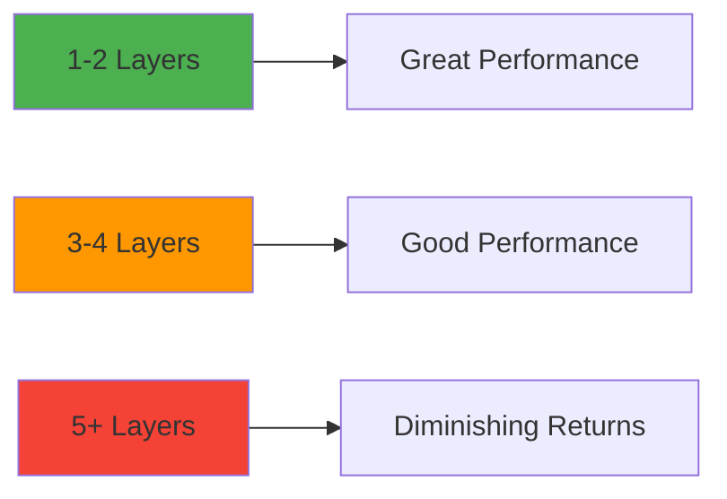

# Best Practices & Pitfalls

Learn from common mistakes and follow proven patterns to make the most of Animancer.

> **⚡ TL;DR:** Always check `IsPlaying()`, clear `OwnedEvents`, separate animation from game logic,
> disable when idle, use NormalizedTime for sync, set ActionOnDisable for pooling.
> [Skip to Common Pitfalls](#common-pitfalls)

---

## Table of Contents

1. [Do's and Don'ts](#dos-and-donts)
2. [Common Pitfalls](#common-pitfalls)
3. [Performance Best Practices](#performance-best-practices)
4. [Event Management](#event-management)
5. [State Management Patterns](#state-management-patterns)
6. [Debugging Tips](#debugging-tips)
7. [Architecture Patterns](#architecture-patterns)

---

## Do's and Don'ts

### ✅ DO

#### Always Check IsPlaying Before Replaying

```csharp
// ✅ GOOD: Prevents stuttering from restarting every frame
if (!_animancer.IsPlaying(_idleClip))
{
    _animancer.Play(_idleClip);
}

// ❌ BAD: Restarts animation every frame, causes stuttering
_animancer.Play(_idleClip);
```

#### Clear OwnedEvents Before Adding New Ones

```csharp
// ✅ GOOD: Clean slate for each playback
AnimancerState state = _animancer.Play(attackClip);
state.OwnedEvents.Clear();
state.OwnedEvents.Add(1.0f, OnAttackEnd);

// ❌ BAD: Events accumulate, callbacks fire multiple times
AnimancerState state = _animancer.Play(attackClip);
state.OwnedEvents.Add(1.0f, OnAttackEnd);  // Gets added again each play!
```

#### Separate Animation Logic from Gameplay Logic

```csharp
// ✅ GOOD: AnimancerComponent just plays animations
public class CharacterAnimator : MonoBehaviour
{
    [SerializeField] private AnimancerComponent _animancer;

    public void PlayWalk() => _animancer.Play(_walkClip);
    public void PlayAttack() => _animancer.Play(_attackClip);
}

// Gameplay logic lives elsewhere
public class CharacterController : MonoBehaviour
{
    [SerializeField] private CharacterAnimator _animator;

    void Update()
    {
        if (Input.GetAxis("Horizontal") != 0)
            _animator.PlayWalk();
    }
}

// ❌ BAD: Mixing concerns
public class Character : MonoBehaviour
{
    private AnimancerComponent _animancer;
    private Rigidbody2D _rb;
    private int _health;
    private bool _isAttacking;
    // Animation + Physics + Health + State all in one class...
}
```

#### Use Normalized Time for Synchronization

```csharp
// ✅ GOOD: Keep multiple sprites in sync
float time = _bodyAnimancer.States.Current?.NormalizedTime % 1f ?? 0f;
AnimancerState leftArm = _leftArmAnimancer.Play(newClip);
leftArm.NormalizedTime = time;

// ❌ BAD: Sprites become desynced
_bodyAnimancer.Play(newClip);
_leftArmAnimancer.Play(newClip);  // Starts 1 frame later!
```

#### Disable AnimancerComponent When Not Needed

```csharp
// ✅ GOOD: Save CPU when idle
_animancer.enabled = false;

// Re-enable when needed
_animancer.enabled = true;
_animancer.Play(_nextClip);
```

### ❌ DON'T

#### Don't Keep Redundant References

```csharp
// ❌ BAD: Mixing Animator and AnimancerComponent
public class Character : MonoBehaviour
{
    [SerializeField] private Animator _animator;  // Don't need this!
    [SerializeField] private AnimancerComponent _animancer;
}

// ✅ GOOD: Just use AnimancerComponent
public class Character : MonoBehaviour
{
    [SerializeField] private AnimancerComponent _animancer;
}
```

#### Don't Manually Manage the PlayableGraph

```csharp
// ❌ BAD: Animancer handles this for you
var graph = _animancer.Playable.GetGraph();
graph.Evaluate();  // Don't do this!

// ✅ GOOD: Let Animancer manage it
_animancer.Play(clip);  // Automatically evaluated each frame
```

#### Don't Mix Animation Systems

```csharp
// ❌ BAD: Using both systems simultaneously
_animator.SetTrigger("Attack");  // Using Animator
_animancer.Play(_attackClip);    // Using Animancer - conflicts!

// ✅ GOOD: Pick one system and stick with it
_animancer.Play(_attackClip);
```

#### Don't Forget to Set Speed/Time After Playing

```csharp
// ❌ BAD: State may be null if Play() fails
_animancer.Play(clip);
_animancer.States.Current.Speed = 2.0f;  // NullReferenceException if Play failed!

// ✅ GOOD: Capture the state
AnimancerState state = _animancer.Play(clip);
if (state != null)
{
    state.Speed = 2.0f;
}
```

---

## Common Pitfalls

### Pitfall 1: Forgetting to Check IsPlaying

**Problem:** Animation restarts every frame, causing stuttering.

```csharp
// ❌ Causes stuttering
void Update()
{
    if (_isIdle)
        _animancer.Play(_idleClip);  // Restarts every frame!
}
```

**Solution:**

```csharp
// ✅ Only play when not already playing
void Update()
{
    if (_isIdle && !_animancer.IsPlaying(_idleClip))
        _animancer.Play(_idleClip);
}
```

---

### Pitfall 2: Event Accumulation

**Problem:** Not clearing events causes callbacks to fire multiple times.

```csharp
// ❌ Events accumulate
void Attack()
{
    AnimancerState state = _animancer.Play(_attackClip);
    state.OwnedEvents.Add(1.0f, DealDamage);
    // Each attack adds another event!
    // After 3 attacks, DealDamage fires 3 times!
}
```

**Solution:**

```csharp
// ✅ Clear before adding
void Attack()
{
    AnimancerState state = _animancer.Play(_attackClip);
    state.OwnedEvents.Clear();
    state.OwnedEvents.Add(1.0f, DealDamage);
}
```

---

### Pitfall 3: Not Handling Null States

**Problem:** Assuming Play() always succeeds.

```csharp
// ❌ Can throw NullReferenceException
void PlayAnimation(AnimationClip clip)
{
    _animancer.Play(clip).Speed = 2.0f;
    // What if clip is null? Play() returns null!
}
```

**Solution:**

```csharp
// ✅ Check for null
void PlayAnimation(AnimationClip clip)
{
    if (clip == null) return;

    AnimancerState state = _animancer.Play(clip);
    if (state != null)
    {
        state.Speed = 2.0f;
    }
}
```

---

### Pitfall 4: Desynced Multi-Sprite Animations

**Problem:** Separate sprites play at different times.

```csharp
// ❌ Sprites become desynced over time
void PlayAnimation(AnimationClip clip)
{
    _bodyAnimancer.Play(clip);
    _leftArmAnimancer.Play(clip);   // Plays 1-2 frames later
    _rightArmAnimancer.Play(clip);  // Even later!
}
```

**Solution:**

```csharp
// ✅ Synchronize with NormalizedTime
void PlayAnimation(AnimationClip clip)
{
    float time = _bodyAnimancer.States.Current?.NormalizedTime % 1f ?? 0f;

    AnimancerState body = _bodyAnimancer.Play(clip);
    body.NormalizedTime = time;

    AnimancerState leftArm = _leftArmAnimancer.Play(clip);
    leftArm.NormalizedTime = time;

    AnimancerState rightArm = _rightArmAnimancer.Play(clip);
    rightArm.NormalizedTime = time;
}
```

---

### Pitfall 5: Forgetting ActionOnDisable

**Problem:** Pooled objects resume animations from where they left off.

```csharp
// ❌ Pooled enemy spawns mid-animation
public class Enemy : MonoBehaviour
{
    [SerializeField] private AnimancerComponent _animancer;

    void OnEnable()
    {
        _animancer.Play(_spawnClip);
        // If this was pooled, animation might be at 50% from last time!
    }
}
```

**Solution:**

```csharp
// ✅ Reset on disable
void Awake()
{
    _animancer.ActionOnDisable = AnimancerComponent.DisableAction.Reset;
}
```

---

### Pitfall 6: Overusing Layers

**Problem:** Too many layers hurt performance and complicate debugging.

```csharp
// ❌ Overkill - do you really need this many?
_animancer.Layers[0].Play(_bodyClip);      // Body
_animancer.Layers[1].Play(_leftArmClip);   // Left arm
_animancer.Layers[2].Play(_rightArmClip);  // Right arm
_animancer.Layers[3].Play(_headClip);      // Head
_animancer.Layers[4].Play(_legsClip);      // Legs
_animancer.Layers[5].Play(_breathClip);    // Breathing
// This is excessive!
```

**Solution:**

```csharp
// ✅ Use layers only when necessary
_animancer.Layers[0].Play(_fullBodyClip);  // Base: full body animation
_animancer.Layers[1].Play(_waveClip);      // Additive: temporary upper body action
// Most of the time, 1-2 layers is enough
```

---

### Pitfall 7: Not Caching Animation Clips

**Problem:** Searching for clips at runtime is slow.

```csharp
// ❌ BAD: Looking up clips every frame
void Update()
{
    if (_isWalking)
        _animancer.Play(Resources.Load<AnimationClip>("Walk"));  // SLOW!
}
```

**Solution:**

```csharp
// ✅ GOOD: Cache references
[SerializeField] private AnimationClip _walkClip;

void Update()
{
    if (_isWalking)
        _animancer.Play(_walkClip);
}
```

---

## Performance Best Practices

### 1. Disable When Idle

```csharp
// Save CPU by disabling AnimancerComponent
if (!_hasActiveAnimation)
{
    _animancer.enabled = false;
}
```

### 2. Use Object Pooling with ActionOnDisable

```csharp
void Awake()
{
    // Reset animations when pooled object is disabled
    _animancer.ActionOnDisable = AnimancerComponent.DisableAction.Reset;
}
```

### 3. Minimize Layer Count



**Rule of Thumb:** Use only as many layers as you truly need. Most characters need 1-2 max.

### 4. Avoid Playing the Same Clip Repeatedly

```csharp
// ❌ BAD: Restarts every frame
void Update()
{
    _animancer.Play(_idleClip);  // Unnecessary work!
}

// ✅ GOOD: Only play when needed
void Update()
{
    if (!_animancer.IsPlaying(_idleClip))
        _animancer.Play(_idleClip);
}
```

### 5. Use Mixers Instead of Branching

```csharp
// ❌ BAD: Branching logic
if (speed < 2f)
    _animancer.Play(_idle);
else if (speed < 5f)
    _animancer.Play(_walk);
else
    _animancer.Play(_run);

// ✅ GOOD: Use a mixer
_movementMixer.Parameter = speed;  // Automatic blending
```

---

## Event Management

### Best Practices for Events

#### 1. Always Clear OwnedEvents

```csharp
AnimancerState state = _animancer.Play(clip);
state.OwnedEvents.Clear();  // Essential!
state.OwnedEvents.Add(1.0f, OnEnd);
```

#### 2. Use OwnedEvents for Gameplay, SharedEvents for Reusables

```csharp
// OwnedEvents: Dynamic per-playback logic
state.OwnedEvents.Clear();
state.OwnedEvents.Add(0.5f, () => DealDamage(targetEnemy));

// SharedEvents: Consistent effects set up in Transition Assets
// (Footsteps, swoosh sounds, etc.)
```

#### 3. Avoid Capturing Heavy Objects in Lambdas

```csharp
// ❌ BAD: Captures entire enemy list
state.OwnedEvents.Add(1.0f, () => {
    foreach (var enemy in _allEnemies)  // Captures _allEnemies!
        enemy.TakeDamage(10);
});

// ✅ GOOD: Capture only what you need
Enemy target = _currentTarget;
state.OwnedEvents.Add(1.0f, () => target.TakeDamage(10));
```

#### 4. Use Named Methods for Clarity

```csharp
// ❌ Harder to debug
state.OwnedEvents.Add(1.0f, () => {
    Debug.Log("Done!");
    _isAttacking = false;
    PlayIdle();
});

// ✅ Easier to debug and reuse
state.OwnedEvents.Add(1.0f, OnAttackComplete);

void OnAttackComplete()
{
    Debug.Log("Done!");
    _isAttacking = false;
    PlayIdle();
}
```

---

## State Management Patterns

### Pattern 1: Simple State Machine

For characters with 3-5 states, use a simple enum:

```csharp
public enum CharacterState { Idle, Walk, Attack }

private CharacterState _currentState;

void UpdateAnimation()
{
    switch (_currentState)
    {
        case CharacterState.Idle:
            if (!_animancer.IsPlaying(_idle)) _animancer.Play(_idle);
            break;
        case CharacterState.Walk:
            if (!_animancer.IsPlaying(_walk)) _animancer.Play(_walk);
            break;
        case CharacterState.Attack:
            if (!_animancer.IsPlaying(_attack)) _animancer.Play(_attack);
            break;
    }
}
```

### Pattern 2: Animancer FSM

For complex characters (6+ states), use Animancer's FSM:

```csharp
private StateMachine<CharacterState> _stateMachine;

void Awake()
{
    _stateMachine = new StateMachine<CharacterState>();
    _stateMachine.Add(new IdleState(this));
    _stateMachine.Add(new WalkState(this));
    _stateMachine.Add(new AttackState(this));
}
```

### Pattern 3: Message-Driven

For event-driven gameplay:

```csharp
void OnMessage(GameMessage msg)
{
    switch (msg.Type)
    {
        case MessageType.StartAttack:
            _animancer.Play(_attackClip);
            break;
        case MessageType.TakeDamage:
            _animancer.Play(_hurtClip);
            break;
    }
}
```

---

## Debugging Tips

### 1. Log Current State

```csharp
void Update()
{
    AnimancerState current = _animancer.States.Current;
    if (current != null)
    {
        Debug.Log($"Playing: {current.Clip.name} ({current.NormalizedTime:F2})");
    }
}
```

### 2. Visualize in Inspector

Enable Animancer's **Live Inspector** (Pro feature) to see:

- Current state
- Weight
- Time
- Events

### 3. Check for Null Clips

```csharp
void Awake()
{
    if (_idleClip == null) Debug.LogError("Idle clip not assigned!");
    if (_walkClip == null) Debug.LogError("Walk clip not assigned!");
    if (_attackClip == null) Debug.LogError("Attack clip not assigned!");
}
```

### 4. Add Assertions

```csharp
void PlayAttack()
{
    AnimancerState state = _animancer.Play(_attackClip);
    Debug.Assert(state != null, "Failed to play attack clip!");
    Debug.Assert(_attackClip != null, "Attack clip is null!");
}
```

### 5. Use [Required] Attribute

```csharp
// Unity 2022.3+: Mark critical fields
[SerializeField, Required] private AnimancerComponent _animancer;
[SerializeField, Required] private AnimationClip _attackClip;
```

---

## Architecture Patterns

### Pattern 1: Component Separation

```csharp
// Animation component
public class CharacterAnimator : MonoBehaviour
{
    [SerializeField] private AnimancerComponent _animancer;

    public void PlayIdle() => _animancer.Play(_idleClip);
    public void PlayWalk() => _animancer.Play(_walkClip);
}

// Movement component
public class CharacterMovement : MonoBehaviour
{
    [SerializeField] private CharacterAnimator _animator;

    void Update()
    {
        if (IsMoving)
            _animator.PlayWalk();
        else
            _animator.PlayIdle();
    }
}
```

### Pattern 2: Transition Assets for Reusability

```csharp
// Create once, use everywhere
[CreateAssetMenu]
public class AttackAnimation : ScriptableObject
{
    [SerializeField] private AnimationClip _clip;
    [SerializeField] private float _fadeTime = 0.1f;

    public AnimancerState Play(AnimancerComponent animancer)
    {
        return animancer.Play(_clip, _fadeTime);
    }
}
```

### Pattern 3: Data-Driven Animations

```csharp
[System.Serializable]
public class AnimationData
{
    public string stateName;
    public AnimationClip clip;
    public float fadeTime;
    public bool loops;
}

public class CharacterAnimator : MonoBehaviour
{
    [SerializeField] private AnimationData[] _animations;

    public void Play(string stateName)
    {
        var anim = Array.Find(_animations, a => a.stateName == stateName);
        if (anim != null)
            _animancer.Play(anim.clip, anim.fadeTime);
    }
}
```

---

## Key Takeaways

✅ **Always check IsPlaying()** to avoid restart stuttering ✅ **Clear OwnedEvents** before adding
new ones ✅ **Separate animation from gameplay logic** ✅ **Disable AnimancerComponent** when not
animating ✅ **Cache animation clip references** (don't load at runtime) ✅ **Use NormalizedTime**
to sync multi-sprite characters ✅ **Set ActionOnDisable** for pooled objects ✅ **Keep layer count
low** (1-2 is usually enough) ✅ **Use named methods** for event callbacks (easier debugging) ✅
**Validate clip assignments** in Awake/Start

---

## Next Steps

- **[Code Examples & Recipes](./05-CODE-EXAMPLES.md)** - Ready-to-use implementations
- **[Getting Started](./01-GETTING-STARTED.md)** - Back to basics
- **[Core Concepts](./02-CORE-CONCEPTS.md)** - Deep dive into fundamentals

---

**Official Documentation:**
[kybernetik.com.au/animancer/docs/](https://kybernetik.com.au/animancer/docs/)
