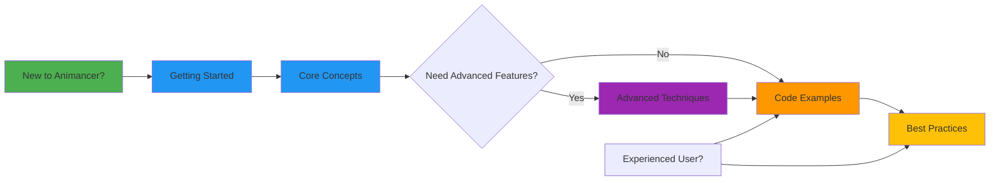

# Animancer Pro 8 - Complete Guide

Welcome to the comprehensive guide for **Animancer Pro 8**, the powerful animation system for Unity
that replaces complex Animator Controllers with elegant, code-driven animation control.

---

## 💰 Free Alternatives & Lite Version

### Animancer Lite (Free Trial)

**[Animancer Lite](https://kybernetik.itch.io/animancer-lite)** is the FREE version from the same
developer:

- ✅ **FREE for Unity Editor** — Try all Pro features during development
- ✅ **Perfect for prototyping** — Test before you commit
- ❌ **Runtime build restrictions** — Pro features disabled in actual builds
- ❌ **No source code access** — Uses pre-compiled DLLs
- 💡 **Best for:** Evaluating Animancer before purchase, small hobby projects

**Upgrade path:** Purchase Animancer Pro (~$50-75) when you need to build/ship

### Free Open-Source Alternatives

**[Reanimation](https://github.com/aarthificial/reanimation)** (GitHub - Free & Open Source)

- ⚠️ Unmaintained
- ✅ Completely free, MIT licensed
- ✅ Tailored for traditional frame-by-frame animation (sprite sheets)
- ✅ Tree-based graph structure (not state machines)
- ⚠️ Different paradigm than Animancer — specialized use case
- 💡 **Best for:** 2D sprite-based games with cel animation

**Unity's Playables API** (Built-in - Free)

- ✅ Native Unity API, no extra package needed
- ✅ Full control and performance
- ❌ Much more complex to use than Animancer
- ❌ Requires deep understanding of Unity's animation system
- 💡 **Best for:** Advanced users who want zero dependencies

**Custom Animation Scripts**

- ✅ Complete control, zero dependencies
- ❌ Time-consuming to build
- ❌ Requires significant programming expertise
- 💡 **Best for:** Very simple animation needs or extreme performance requirements

### Which Should You Choose?

| Use Case                       | Recommendation                        |
| ------------------------------ | ------------------------------------- |
| **Evaluating Animancer**       | Start with **Animancer Lite**         |
| **Hobby/learning project**     | **Animancer Lite** (free in Editor)   |
| **Commercial game**            | **Animancer Pro** (~$50-75, one-time) |
| **2D sprite/cel animation**    | Consider **Reanimation** (free)       |
| **Zero external dependencies** | **Playables API** (built-in)          |
| **Very tight budget**          | **Unity Animator** or custom scripts  |

---

## 📚 What is Animancer?

Animancer is a plugin that gives you **direct control** over Unity animations through C# code.
Instead of managing complex state machines in visual graphs, you simply tell Animancer what to
play—making your animation logic transparent, flexible, and easy to debug.

```csharp
// That's it! No state machines, no parameters, just code
animancer.Play(walkClip);
```

---

## 🎯 Why Animancer?

| Traditional Animator Controller  | Animancer Pro 8              |
| -------------------------------- | ---------------------------- |
| Complex visual state machines    | Simple C# method calls       |
| Hidden transition logic          | Explicit, readable code      |
| Parameter synchronization issues | Direct control               |
| Difficult to debug               | Stack traces and breakpoints |
| Poor version control (binary)    | Clean, diffable C# files     |

**Result:** Faster development, fewer bugs, easier collaboration.

---

## 🚀 Quick Start

```csharp
using UnityEngine;
using Animancer;

public class SimpleCharacter : MonoBehaviour
{
    [SerializeField] private AnimancerComponent _animancer;
    [SerializeField] private AnimationClip _idleClip;
    [SerializeField] private AnimationClip _walkClip;

    void Start()
    {
        _animancer.Play(_idleClip);
    }

    void Update()
    {
        if (Input.GetAxis("Horizontal") != 0)
            _animancer.Play(_walkClip);
        else
            _animancer.Play(_idleClip);
    }
}
```

---

## 📖 Documentation Structure

This guide is organized into five comprehensive sections:

### 1. 🟢 [Getting Started](./01-GETTING-STARTED.md)

**Perfect for:** First-time users and those evaluating Animancer

**What's inside:**

- What is Animancer and why use it?
- Quick setup guide (just add AnimancerComponent!)
- Your first animation in 5 lines of code
- Side-by-side comparison with Animator Controllers
- When to use Animancer vs alternatives

**⏱️ Time to read:** 10-15 minutes | **📄 Skip to:**
[Quick Start Example](./01-GETTING-STARTED.md#your-first-complete-example)

---

### 2. 🔵 [Core Concepts](./02-CORE-CONCEPTS.md)

**Perfect for:** Understanding how Animancer works under the hood

**What's inside:**

- The animation graph (automatic management)
- AnimancerComponent and AnimancerStates
- Playing and controlling animations (speed, time, weight)
- Animation events (OwnedEvents vs SharedEvents)
- **Normalized time for seamless directional switching** ⭐
- Transitions and blending
- Checking what's playing

**⏱️ Time to read:** 20-25 minutes | **📄 TL;DR available** at top of guide

---

### 3. 🟣 [Advanced Techniques](./03-ADVANCED-TECHNIQUES.md)

**Perfect for:** Taking your animations to the next level

**What's inside:**

- Animation layers (blend body parts independently)
- Mixers and blending (Linear, 2D, Cartesian - like Blend Trees)
- State machines (clean, testable state management)
- Transition assets (designer-friendly ScriptableObjects)
- **NEW in v8.0:** Transition Libraries (context-aware transitions)
- **NEW in v8.0:** Weighted Mask Layers (per-bone weights)
- **NEW in v8.0:** Parameter Binding (centralized parameters)
- Multi-sprite synchronization
- IK support

**⏱️ Time to read:** 30-40 minutes | **📄 TL;DR available** | **Skip sections you don't need!**

---

### 4. 🟡 [Best Practices & Pitfalls](./04-BEST-PRACTICES.md)

**Perfect for:** Avoiding common mistakes and writing production-quality code

**What's inside:**

- Do's and don'ts (with code examples)
- 7 common pitfalls and their solutions
- Performance optimization tips
- Event management best practices
- State management patterns
- Debugging tips and tools
- Architecture patterns

**⏱️ Time to read:** 25-30 minutes | **📄 TL;DR available** | **Jump to:**
[Common Pitfalls](./04-BEST-PRACTICES.md#common-pitfalls)

---

### 5. 🟠 [Code Examples & Recipes](./05-CODE-EXAMPLES.md)

**Perfect for:** Copy-paste solutions to common scenarios

**What's inside:** 13 complete, production-ready examples

- **Directional animation switching** (seamless walk direction changes) ⭐
- Basic character controller
- Attack system with events
- Multi-sprite character synchronization
- Movement mixer (idle/walk/run blending)
- State machine character
- Combat system with combos
- Footstep system
- Hit reaction system
- Interactable NPC
- Platformer character
- Animation chaining
- Object pooling with Animancer

**⏱️ Time to read:** Browse as needed—each example is self-contained!

---

## 🎓 Learning Path



### For Beginners

1. Start with **[Getting Started](./01-GETTING-STARTED.md)** to understand what Animancer is
2. Read **[Core Concepts](./02-CORE-CONCEPTS.md)** to learn the fundamentals
3. Browse **[Code Examples](./05-CODE-EXAMPLES.md)** to see patterns in action
4. Reference **[Best Practices](./04-BEST-PRACTICES.md)** as you build

### For Experienced Developers

1. Skim **[Getting Started](./01-GETTING-STARTED.md)** for the quick comparison
2. Jump to **[Code Examples](./05-CODE-EXAMPLES.md)** for implementation patterns
3. Check **[Best Practices](./04-BEST-PRACTICES.md)** for optimization tips
4. Reference **[Advanced Techniques](./03-ADVANCED-TECHNIQUES.md)** as needed

### For Migrating from Animator Controllers

1. Read **"Why Choose Animancer?"** in **[Getting Started](./01-GETTING-STARTED.md)**
2. Study **[Core Concepts](./02-CORE-CONCEPTS.md)** to learn the new paradigm
3. Follow **[Code Examples](./05-CODE-EXAMPLES.md)** to rebuild your features
4. Apply lessons from **[Best Practices](./04-BEST-PRACTICES.md)**

---

## 🔥 Key Features of Animancer Pro 8

### Core Features

| Feature                  | Description                                             |
| ------------------------ | ------------------------------------------------------- |
| **Code-First Control**   | Play animations directly: `animancer.Play(clip)`        |
| **Zero Setup**           | No state machines, no parameters, just clips            |
| **Full Runtime Control** | Modify speed, time, weight on the fly                   |
| **Clean Events**         | C# delegates instead of Animation Events                |
| **Smooth Transitions**   | Configurable fade durations and curves                  |
| **Animation Layers**     | Blend multiple animations on different body parts       |
| **Mixers**               | Blend between animations like Blend Trees, in code      |
| **State Machines**       | Optional FSM system that works perfectly with Animancer |
| **Source Code Included** | Full C# source with detailed comments                   |

### New in Version 8.0

| Feature                  | Description                                             |
| ------------------------ | ------------------------------------------------------- |
| **Transition Libraries** | Context-aware transitions based on previous state       |
| **Weighted Mask Layers** | Precise per-bone weight control (Pro only)              |
| **Parameter Binding**    | Centralized parameter management across mixers          |
| **Improved Events**      | OwnedEvents vs SharedEvents for better event management |
| **Fade Groups**          | Unified fade management with custom easing              |
| **Enhanced Inspector**   | Better visualization and debugging tools                |

---

## 💡 Quick Reference

### Essential Code Patterns

#### Playing Animations

```csharp
// Basic play
_animancer.Play(clip);

// With fade duration
_animancer.Play(clip, fadeDuration: 0.3f);

// Check if playing to avoid restart stutter
if (!_animancer.IsPlaying(idleClip))
    _animancer.Play(idleClip);
```

#### Controlling Playback

```csharp
AnimancerState state = _animancer.Play(clip);

// Speed control
state.Speed = 2.0f;        // Double speed
state.Speed = 0.5f;        // Half speed
state.Speed = -1f;         // Reverse

// Time control
state.Time = 1.5f;         // Jump to 1.5 seconds
state.NormalizedTime = 0.5f; // Jump to 50%
```

#### Animation Events

```csharp
AnimancerState state = _animancer.Play(attackClip);
state.OwnedEvents.Clear();

// Add events at normalized times (0-1)
state.OwnedEvents.Add(0.5f, () => {
    Debug.Log("Halfway through!");
});

state.OwnedEvents.Add(1.0f, OnAttackComplete);
```

#### Seamless Directional Switching

```csharp
// Switch directions mid-animation without restarting!
void PlayDirectional(AnimationClip newDirection)
{
    if (_animancer.States.Current?.Clip == newDirection) return;

    // Preserve walk cycle position
    float time = _animancer.States.Current?.NormalizedTime % 1f ?? 0f;

    AnimancerState state = _animancer.Play(newDirection);
    state.NormalizedTime = time;  // Continue from same point!
}
```

#### Multi-Sprite Sync

```csharp
// Get current time
float time = _bodyAnimancer.States.Current?.NormalizedTime % 1f ?? 0f;

// Play on all sprites at same time
AnimancerState body = _bodyAnimancer.Play(clip);
body.NormalizedTime = time;

AnimancerState arm = _armAnimancer.Play(clip);
arm.NormalizedTime = time;
```

---

## 🎮 Common Use Cases

| Use Case                                 | Recommended Approach        | Guide Section                                                                          |
| ---------------------------------------- | --------------------------- | -------------------------------------------------------------------------------------- |
| **Directional animations** (same length) | **Preserve NormalizedTime** | **[Code Examples](./05-CODE-EXAMPLES.md#directional-animation-switching-seamless)** ⭐ |
| Simple character (3-5 animations)        | Direct Play() calls         | [Code Examples](./05-CODE-EXAMPLES.md#basic-character-controller)                      |
| Complex character (6+ states)            | Animancer FSM               | [Advanced Techniques](./03-ADVANCED-TECHNIQUES.md#state-machines)                      |
| Smooth movement blending                 | Linear Mixer                | [Advanced Techniques](./03-ADVANCED-TECHNIQUES.md#mixers-and-blending)                 |
| Attack combos                            | Event chaining              | [Code Examples](./05-CODE-EXAMPLES.md#combat-system)                                   |
| Upper body actions (wave, aim)           | Animation Layers            | [Advanced Techniques](./03-ADVANCED-TECHNIQUES.md#animation-layers)                    |
| Multi-sprite character                   | Normalized time sync        | [Code Examples](./05-CODE-EXAMPLES.md#multi-sprite-character)                          |
| Footsteps/sound effects                  | SharedEvents                | [Code Examples](./05-CODE-EXAMPLES.md#footstep-system)                                 |
| Object pooling                           | ActionOnDisable             | [Code Examples](./05-CODE-EXAMPLES.md#object-pooling-with-animancer)                   |

---

## ⚠️ Common Mistakes to Avoid

| Mistake                     | Problem                                   | Solution                           |
| --------------------------- | ----------------------------------------- | ---------------------------------- |
| Not checking IsPlaying      | Animation restarts every frame            | Always check before playing        |
| Not clearing OwnedEvents    | Events accumulate and fire multiple times | Clear before adding new events     |
| Mixing Animator + Animancer | Conflicts and unpredictable behavior      | Choose one system                  |
| Not syncing multi-sprites   | Sprites desync over time                  | Use NormalizedTime                 |
| Too many layers             | Performance issues                        | Use 1-2 layers max                 |
| Loading clips at runtime    | Slow performance                          | Cache references in SerializeField |
| Forgetting ActionOnDisable  | Pooled objects have stale animations      | Set to Reset for pooled objects    |

See **[Best Practices](./04-BEST-PRACTICES.md)** for detailed solutions.

---

## 🔧 System Requirements

- **Unity Version:** 2022.3 or newer
- **Animancer Version:** Pro 8.x
- **Scripting:** C# (basic to intermediate knowledge)

---

## 📦 What's Included in This Guide

✅ Complete beginner-to-advanced tutorial ✅ 12+ ready-to-use code examples ✅ Visual diagrams and
flowcharts ✅ Do's and don'ts with explanations ✅ Performance optimization tips ✅ Common pitfall
solutions ✅ Project-specific patterns (based on IshoBoy) ✅ Official documentation references

---

## 🌐 Additional Resources

### Official Resources

- **[Official Documentation](https://kybernetik.com.au/animancer/docs/)** - Complete API reference
- **[Asset Store](https://assetstore.unity.com/packages/tools/animation/animancer-pro-v8-293522)** -
  Purchase and download
- **[Unity Forum](https://forum.unity.com/)** - Community support

### This Guide

- **Getting Started**: Introduction and basics
- **Core Concepts**: How Animancer works
- **Advanced Techniques**: Layers, mixers, state machines
- **Best Practices**: Avoid mistakes, optimize performance
- **Code Examples**: Copy-paste solutions

---

## 🎯 Quick Navigation

### I want to...

- **Learn what Animancer is** → [Getting Started](./01-GETTING-STARTED.md)
- **Understand the fundamentals** → [Core Concepts](./02-CORE-CONCEPTS.md)
- **Use layers or mixers** → [Advanced Techniques](./03-ADVANCED-TECHNIQUES.md)
- **Avoid common mistakes** → [Best Practices](./04-BEST-PRACTICES.md)
- **Copy working code** → [Code Examples](./05-CODE-EXAMPLES.md)
- **Build a character controller** →
  [Code Examples: Basic Character](./05-CODE-EXAMPLES.md#basic-character-controller)
- **Implement combat** → [Code Examples: Combat System](./05-CODE-EXAMPLES.md#combat-system)
- **Sync multiple sprites** →
  [Code Examples: Multi-Sprite](./05-CODE-EXAMPLES.md#multi-sprite-character)
- **Optimize performance** →
  [Best Practices: Performance](./04-BEST-PRACTICES.md#performance-best-practices)

---

## 💬 Feedback & Contributions

This guide is based on:

- Official Animancer Pro 8 documentation
- Real-world usage in the IshoBoy project
- Community best practices

Found an error? Have a suggestion? Please let us know!

---

## 🚀 Ready to Get Started?

### New to Animancer?

**Start here:** [Getting Started Guide](./01-GETTING-STARTED.md)

Learn what Animancer is, why it's awesome, and write your first animation code in under 10 minutes.

### Already familiar with Animancer?

**Jump to:** [Code Examples](./05-CODE-EXAMPLES.md)

Browse 12+ ready-to-use implementation patterns for common game scenarios.

### Need to optimize or debug?

**Check out:** [Best Practices](./04-BEST-PRACTICES.md)

Avoid common pitfalls and learn performance optimization techniques.

---

**Happy Animating! 🎬**

_This guide covers Animancer Pro 8 for Unity 2022.3+_
