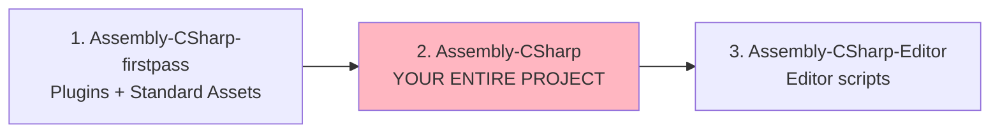
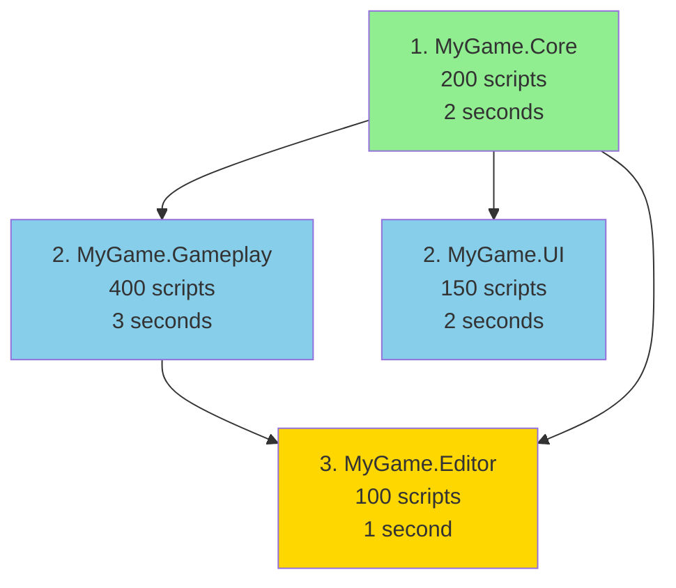
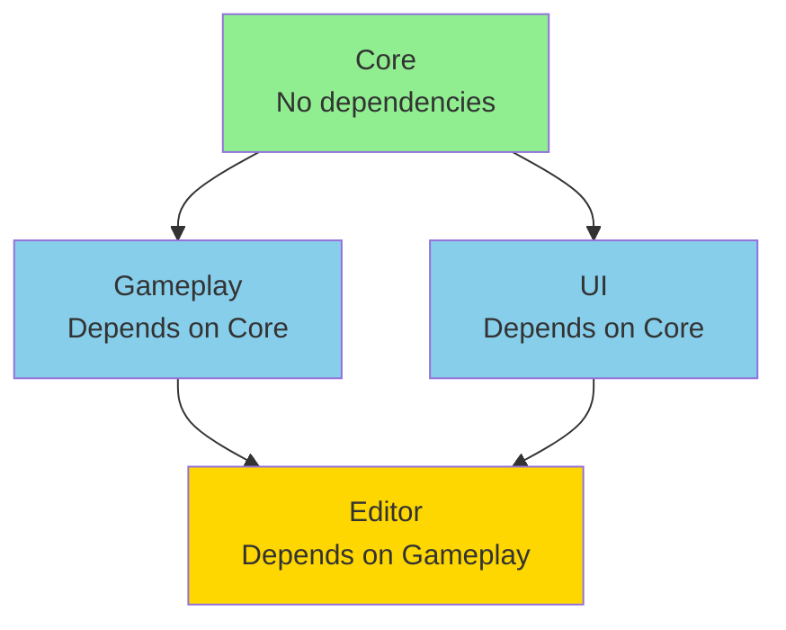
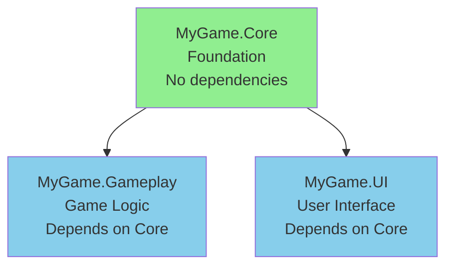

# Getting Started with Assembly Definitions

> **Quick Start**: Right-click your Scripts folder → Create → Assembly Definition → Name it → Done!
> You just made Unity compile faster.

## What Problem Do Assembly Definitions Solve?

Unity's default compilation is **slow**. Every time you change a script, Unity recompiles your
**entire project**. On a large project, this means waiting 30-120 seconds after every tiny change.

Assembly Definitions let you split your code into separate assemblies. When you change a script,
Unity only recompiles **that assembly** (and anything that depends on it). This turns a 60-second
wait into a 2-second wait.

### The Problem in Detail

**Unity's Default Behavior:**

```
Your Project (10,000 scripts)
    ↓
Unity compiles everything as ONE giant assembly
    ↓
Change 1 script → Recompile all 10,000 scripts
    ↓
Wait 60+ seconds
    ↓
😭
```

**With Assembly Definitions:**

```
Your Project (10,000 scripts split into 10 assemblies)
    ↓
Unity compiles 10 separate assemblies
    ↓
Change 1 script in Assembly A → Recompile only Assembly A (1,000 scripts)
    ↓
Wait 6 seconds
    ↓
😊
```

## How Unity Compilation Works

### Without Assembly Definitions

Unity automatically creates these assemblies:

```
Assets/
├── Standard Assets/         → Assembly-CSharp-firstpass.dll
├── Plugins/                 → Assembly-CSharp-firstpass.dll
├── Scripts/                 → Assembly-CSharp.dll
└── Editor/                  → Assembly-CSharp-Editor.dll
```

**Compilation Order:**



**The Problem:**

- Everything in `Scripts/` is **one assembly**
- Change **any script** → Recompile **everything**
- Even if you only touched UI code, gameplay code recompiles too

### With Assembly Definitions

You control the assemblies:

```
Assets/
├── Scripts/
│   ├── Core/
│   │   ├── MyGame.Core.asmdef
│   │   └── Database.cs
│   ├── Gameplay/
│   │   ├── MyGame.Gameplay.asmdef
│   │   └── Player.cs
│   └── UI/
│       ├── MyGame.UI.asmdef
│       └── MainMenu.cs
└── Editor/
    ├── MyGame.Editor.asmdef
    └── Tools.cs
```

**Compilation Order:**



**The Benefit:**

- Change script in `UI/` → Only `MyGame.UI` recompiles (2 seconds)
- Change script in `Core/` → `Core`, `Gameplay`, `UI`, and `Editor` recompile (8 seconds)
- Change script in `Gameplay/` → Only `Gameplay` and `Editor` recompile (4 seconds)

## Creating Your First Assembly Definition

### Step 1: Choose a Folder

Start with a folder that **changes frequently** and has **few dependencies**. UI is often a good
choice.

```
Assets/Scripts/UI/  ← This folder
```

### Step 2: Create the Assembly Definition

```
1. Right-click "UI" folder in Project window
2. Create → Assembly Definition
3. Name it: "MyGame.UI" (use your game's name)
4. Unity creates "MyGame.UI.asmdef" file
```

### Step 3: Configure It

Select the `.asmdef` file and look at the Inspector:

```
Name: MyGame.UI
Root Namespace: MyGame.UI (recommended!)
Assembly Definition References: (empty for now)
Platforms: Any (default)
```

**Root Namespace** is optional but highly recommended. It automatically wraps all scripts in this
folder with:

```csharp
namespace MyGame.UI
{
    public class MainMenu : MonoBehaviour
    {
        // Your code
    }
}
```

### Step 4: Test It

1. **Unity recompiles** (one-time cost while it creates the new assembly)
2. Change a script in the `UI/` folder
3. **Watch the Console** — Unity should only recompile `MyGame.UI`
4. **Measure the time** — It should be much faster!

### Example: Before and After

**Before Assembly Definition:**

```
Project: 5000 scripts
Change MainMenu.cs → Unity recompiles all 5000 scripts
Compile time: 45 seconds
```

**After Assembly Definition:**

```
Project: 5000 scripts (split into 10 assemblies)
Change MainMenu.cs → Unity recompiles MyGame.UI (300 scripts)
Compile time: 3 seconds
```

**15x faster!**

## Basic Dependency Management

### The Rule: Dependencies Flow Downward



**Good Architecture:**

- `Core` has **no dependencies** (foundation)
- `Gameplay` depends on `Core`
- `UI` depends on `Core` (not Gameplay!)
- `Editor` depends on everything (for debug tools)

### Adding a Dependency (Gameplay → Core)

Let's say `MyGame.Gameplay` needs to access `MyGame.Core`:

```
1. Select "MyGame.Gameplay.asmdef" in Project window
2. In Inspector, find "Assembly Definition References"
3. Click "+" button
4. Drag "MyGame.Core.asmdef" into the new slot
   (or click the circle icon and select it)
5. Unity recompiles
```

Now you can do this:

```csharp
// In MyGame.Gameplay assembly
using MyGame.Core;  // ✅ Works now!

public class Player : MonoBehaviour
{
    private Database _database;  // Database is in MyGame.Core
}
```

### Dependency Rules

**✅ Allowed:**


Higher-level assemblies can depend on lower-level assemblies.

**❌ Not Allowed:**


Lower-level assemblies cannot depend on higher-level assemblies (this would be circular).

**❌ Not Allowed:**


Circular dependencies are not allowed. Unity will give a compile error.

## Visual Compilation Improvement

### Before Assembly Definitions

```mermaid
gantt
    title Compile Time After Each Change
    dateFormat X
    axisFormat %S

    section Change 1
    Full Compile: 0, 45

    section Change 2
    Full Compile: 0, 45

    section Change 3
    Full Compile: 0, 45

    section Change 4
    Full Compile: 0, 45
```



**Total wait time for 4 changes: 180 seconds (3 minutes)**

### After Assembly Definitions

```mermaid
gantt
    title Compile Time After Each Change
    dateFormat X
    axisFormat %S

    section Change 1
    UI Only: 0, 3

    section Change 2
    UI Only: 0, 3

    section Change 3
    UI Only: 0, 3

    section Change 4
    UI Only: 0, 3
```



**Total wait time for 4 changes: 12 seconds**

**15x faster iteration!**

## Quick Win: Your First Assembly Definition

Let's create a simple 3-assembly setup:

### Structure

```
Assets/Scripts/
├── MyGame.Core.asmdef
├── Core/
│   ├── Database.cs
│   └── Settings.cs
├── MyGame.Gameplay.asmdef
├── Gameplay/
│   ├── Player.cs
│   └── Enemy.cs
└── MyGame.UI.asmdef
    UI/
    ├── MainMenu.cs
    └── HUD.cs
```

### Steps

1. **Create Core Assembly (no dependencies)**

   ```
   - Right-click "Core" folder
   - Create → Assembly Definition
   - Name: "MyGame.Core"
   - Root Namespace: "MyGame.Core"
   - Done!
   ```

1. **Create Gameplay Assembly (depends on Core)**

   ```
   - Right-click "Gameplay" folder
   - Create → Assembly Definition
   - Name: "MyGame.Gameplay"
   - Root Namespace: "MyGame.Gameplay"
   - Assembly Definition References: + MyGame.Core
   - Done!
   ```

1. **Create UI Assembly (depends on Core)**

   ```
   - Right-click "UI" folder
   - Create → Assembly Definition
   - Name: "MyGame.UI"
   - Root Namespace: "MyGame.UI"
   - Assembly Definition References: + MyGame.Core
   - Done!
   ```

### Result



**Now:**

- Edit scripts in `UI/` → Only `MyGame.UI` recompiles ⚡
- Edit scripts in `Gameplay/` → Only `MyGame.Gameplay` recompiles ⚡
- Edit scripts in `Core/` → All 3 recompile (but still faster than before!)

## Common First-Time Issues

### Issue 1: "Type or namespace name could not be found"

```csharp
// In MyGame.UI assembly
using MyGame.Gameplay;  // ❌ Error!

public class MainMenu : MonoBehaviour
{
    private Player _player;  // ❌ Error: 'Player' could not be found
}
```

**Problem:** `MyGame.UI` doesn't reference `MyGame.Gameplay`

**Solution:** Either:

- Add `MyGame.Gameplay` to `MyGame.UI`'s references (if UI really needs Gameplay)
- Refactor so UI doesn't depend on Gameplay (better architecture!)

### Issue 2: "Circular dependency detected"

```
❌ Error: Circular dependency detected:
   MyGame.Core → MyGame.Gameplay → MyGame.Core
```

**Problem:** You created a circular reference

**Solution:** Restructure your dependencies. The dependent code needs to move to a lower-level
assembly.

### Issue 3: "Scripts in folder must be in assembly"

```
❌ Warning: Assets/Scripts/UI/Button.cs is not in any assembly
```

**Problem:** You have an `.asmdef` file in a parent folder, but this script is outside it

**Solution:** Either:

- Move the script into the assembly folder
- Create a separate `.asmdef` for that folder
- Use an Assembly Definition Reference (see [Core Concepts](02-core-concepts.md))

## Measuring Improvement

### Before You Start

1. Make a note of your current compile time:

   ```
   - Change any script
   - Watch the Console for "Compilation complete"
   - Time it: _____ seconds
   ```

### After Creating Assembly Definitions

1. Change a script in your most-edited folder
2. Watch the Console
3. Time it: **\_** seconds

**Expected improvement: 5-20x faster on large projects**

### Monitoring Compile Times

Unity logs compile times in the Console:

```
CompilationPipeline: Compiled 'MyGame.UI' in 2.3 seconds
```

Watch for:

- **Which assemblies recompile** — Should only be the one you changed (+ dependents)
- **How long it takes** — Should be much faster than before

## Next Steps

Now that you understand the basics:

1. **[Core Concepts](02-core-concepts.md)** — Deep dive into `.asmdef` files and all their options
2. **[Common Patterns](04-common-patterns.md)** — Real-world project structures that scale
3. **[Best Practices](05-best-practices.md)** — Avoid common mistakes and optimize your setup

## Quick Reference

### Creating an Assembly Definition

```
Right-click folder → Create → Assembly Definition → Name it
```

### Adding a Dependency (Quick Reference)

```
Select .asmdef → Inspector → Assembly Definition References → + → Select dependency
```

### Good Starting Structure

```
Assets/Scripts/
├── MyGame.Core.asmdef       (no dependencies)
├── MyGame.Gameplay.asmdef   (→ Core)
├── MyGame.UI.asmdef         (→ Core)
└── MyGame.Editor.asmdef     (→ Core, Editor-only)
```

### When It's Working

- ✅ Edit UI script → Only UI assembly recompiles
- ✅ Edit Gameplay script → Only Gameplay assembly recompiles
- ✅ Compile times are 5-20x faster
- ✅ No circular dependency errors

---

**Pro Tip:** Start small! Create one assembly for your most-edited code first. Measure the
improvement. Then gradually add more assemblies as needed.

**Next:** Learn about all the `.asmdef` file options in [Core Concepts](02-core-concepts.md) →
