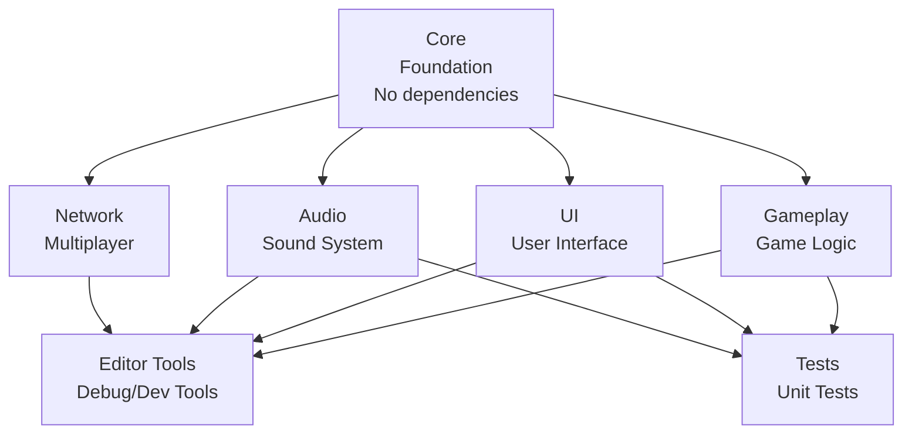
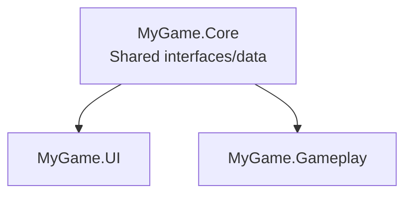

# Core Concepts: Assembly Definitions

> **Deep Dive:** Everything you need to know about `.asmdef` files, dependencies, platforms, and
> Unity's compilation pipeline.

## Assembly Definition Files (.asmdef)

An Assembly Definition file is a JSON file that tells Unity how to compile a specific folder of
scripts into a separate assembly (DLL).

### The .asmdef File Structure

```json
{
  "name": "MyGame.Core",
  "rootNamespace": "MyGame.Core",
  "references": ["Unity.InputSystem", "Unity.TextMeshPro"],
  "includePlatforms": [],
  "excludePlatforms": [],
  "allowUnsafeCode": false,
  "overrideReferences": false,
  "precompiledReferences": [],
  "autoReferenced": true,
  "defineConstraints": [],
  "versionDefines": [],
  "noEngineReferences": false
}
```

Let's break down each field:

### 1. `name` (Required)

The name of the assembly that will be generated.

```json
"name": "MyGame.Core"
```

**Rules:**

- Must be unique across your project
- Use namespaced naming: `CompanyName.ProjectName.Module`
- Common convention: `MyGame.Core`, `MyGame.Gameplay`, `MyGame.UI`

**Generated DLL:**

```
Library/ScriptAssemblies/MyGame.Core.dll
```

### 2. `rootNamespace` (Recommended)

Automatically wraps all scripts in this folder with a namespace.

```json
"rootNamespace": "MyGame.Core"
```

**Without rootNamespace:**

```csharp
// You write:
public class Database : MonoBehaviour { }

// Unity compiles as-is (no namespace)
```

**With rootNamespace:**

```csharp
// You write:
public class Database : MonoBehaviour { }

// Unity compiles:
namespace MyGame.Core
{
    public class Database : MonoBehaviour { }
}
```

**Benefits:**

- Avoids naming conflicts
- Clearer where classes come from
- Better code organization
- IDE autocomplete groups classes by namespace

### 3. `references` (Dependencies)

Lists other assemblies this assembly depends on.

```json
"references": [
    "MyGame.Core",
    "Unity.InputSystem",
    "Unity.TextMeshPro"
]
```

**Effect:**

```csharp
// Now you can use:
using MyGame.Core;
using UnityEngine.InputSystem;
using TMPro;

public class Player : MonoBehaviour
{
    private Database _database;     // From MyGame.Core
    private PlayerInput _input;     // From Unity.InputSystem
    private TextMeshProUGUI _label; // From Unity.TextMeshPro
}
```

**Without the reference:**

```csharp
using MyGame.Core;  // ❌ Compiler error: "The type or namespace name 'MyGame.Core' could not be found"
```

### 4. `includePlatforms` and `excludePlatforms`

Control which platforms this assembly is compiled for.

#### Include Specific Platforms Only

```json
{
  "name": "MyGame.Mobile",
  "includePlatforms": ["iOS", "Android"]
}
```

**Effect:**

- ✅ Compiles for iOS and Android
- ❌ Excluded from Windows, Mac, Linux, Console, WebGL, etc.
- Smaller build sizes for non-mobile platforms
- No need for `#if UNITY_IOS || UNITY_ANDROID` everywhere

#### Exclude Specific Platforms

```json
{
  "name": "MyGame.Steamworks",
  "excludePlatforms": ["iOS", "Android", "WebGL"]
}
```

**Effect:**

- ✅ Compiles for all platforms except iOS, Android, and WebGL
- Useful for platform-specific plugins (e.g., Steam integration)

#### Available Platforms

```
- Editor
- WindowsStandalone32
- WindowsStandalone64
- OSXStandalone
- LinuxStandalone64
- iOS
- Android
- WebGL
- WSAPlayer
- PS4
- PS5
- XboxOne
- Switch
- tvOS
```

**Common Patterns:**

```json
// Editor-only tools
"includePlatforms": ["Editor"]

// Mobile-only features
"includePlatforms": ["iOS", "Android"]

// Console-only features
"includePlatforms": ["PS4", "PS5", "XboxOne", "Switch"]

// Everything except mobile
"excludePlatforms": ["iOS", "Android"]
```

### 5. `allowUnsafeCode`

Enables `unsafe` code blocks (pointers, etc.).

```json
"allowUnsafeCode": true
```

**When to use:**

- High-performance code requiring pointers
- Interop with native plugins
- Direct memory manipulation
- Unity DOTS/ECS code

**Example:**

```csharp
public unsafe void ProcessData(float* data, int length)
{
    for (int i = 0; i < length; i++)
    {
        data[i] *= 2f;
    }
}
```

**Warning:** Only enable if you actually need it. Unsafe code bypasses C#'s safety checks.

### 6. `overrideReferences` and `precompiledReferences`

Used for referencing precompiled DLLs (plugins).

```json
{
  "overrideReferences": true,
  "precompiledReferences": ["Newtonsoft.Json.dll", "SomePlugin.dll"]
}
```

**When to use:**

- Referencing third-party DLLs
- Custom compiled assemblies
- Unity packages with precompiled code

**Default behavior** (`overrideReferences: false`):

- Automatically references all precompiled assemblies in the project

**Override behavior** (`overrideReferences: true`):

- Only references assemblies listed in `precompiledReferences`
- Use this to avoid unwanted dependencies on large plugin DLLs

### 7. `autoReferenced`

Controls whether other assemblies can reference this one by default.

```json
"autoReferenced": true  // Default
```

**When `true` (default):**

- Any assembly can reference this one
- Automatically available to all code

**When `false`:**

- Other assemblies must explicitly reference this one
- Useful for optional/plugin assemblies

**Example: Editor Tools**

```json
{
  "name": "MyGame.EditorTools",
  "autoReferenced": false,
  "includePlatforms": ["Editor"]
}
```

Why `autoReferenced: false`?

- Prevents accidental dependencies on editor-only code
- Forces explicit opt-in for editor tool usage

### 8. `defineConstraints`

Only compile this assembly if certain scripting defines are set.

```json
{
  "name": "MyGame.SteamFeatures",
  "defineConstraints": ["STEAM_ENABLED"]
}
```

**Effect:**

- Assembly only compiles if `STEAM_ENABLED` is defined in Player Settings
- Useful for optional features or plugins

**Setting Defines:**

```
Player Settings → Other Settings → Scripting Define Symbols
Add: STEAM_ENABLED
```

**Use Cases:**

- Feature flags (enable/disable entire systems)
- Platform-specific features beyond platforms
- Debug-only assemblies

### 9. `versionDefines`

Create scripting defines based on package versions.

```json
{
  "versionDefines": [
    {
      "name": "com.unity.inputsystem",
      "expression": "1.0.0",
      "define": "INPUT_SYSTEM_INSTALLED"
    }
  ]
}
```

**Effect:**

- If Input System package version >= 1.0.0 is installed
- Unity automatically defines `INPUT_SYSTEM_INSTALLED`

**Use Case:**

```csharp
#if INPUT_SYSTEM_INSTALLED
    using UnityEngine.InputSystem;
    // New input system code
#else
    using UnityEngine;
    // Legacy input code
#endif
```

### 10. `noEngineReferences`

Excludes Unity engine references (advanced/rare).

```json
"noEngineReferences": true
```

**Effect:**

- Cannot use `UnityEngine` namespace
- Pure C# assembly with no Unity dependencies

**Use Cases:**

- Shared code between Unity and non-Unity projects
- Utility libraries
- Game logic that should be engine-agnostic

**Example:**

```csharp
// ✅ Allowed
using System;
using System.Collections.Generic;

public class MathUtils
{
    public static int Add(int a, int b) => a + b;
}

// ❌ Not allowed
using UnityEngine;  // Error: Cannot reference UnityEngine
```

## Assembly Definition References (.asmref)

Sometimes you need an assembly to **span multiple folders** that aren't parent/child.

### The Problem

```
Assets/Scripts/
├── UI/
│   ├── MyGame.UI.asmdef
│   └── MainMenu.cs
└── Shared/
    └── UIHelper.cs  ← How to include this in MyGame.UI?
```

**Problem:** `UIHelper.cs` is outside the `UI/` folder, so it's not in `MyGame.UI` assembly.

### The Solution: Assembly Definition Reference

```
Assets/Scripts/
├── UI/
│   ├── MyGame.UI.asmdef
│   └── MainMenu.cs
└── Shared/
    ├── MyGame.UI.asmref  ← Reference to MyGame.UI
    └── UIHelper.cs       ← Now part of MyGame.UI!
```

**MyGame.UI.asmref contents:**

```json
{
  "reference": "MyGame.UI"
}
```

**Effect:**

- `UIHelper.cs` is now compiled as part of `MyGame.UI.dll`
- Even though it's in a different folder!

**Use Cases:**

- Shared code folders
- Generated code folders
- Third-party assets that need to be in your assembly

## Dependency Management

### Dependency Flow Best Practices



**Rules:**

1. **Core** has no dependencies (foundation layer)
2. **Feature assemblies** depend only on Core
3. **Editor** and **Tests** can depend on everything
4. **No circular dependencies**

### Circular Dependency Detection

**Example of a Circular Dependency:**


```
❌ Error: Circular dependency detected:
   'MyGame.UI' references 'MyGame.Gameplay'
   'MyGame.Gameplay' references 'MyGame.UI'
```

**Solution: Extract Common Code**



Move the shared code (interfaces, data classes, etc.) into `Core`, then both `UI` and `Gameplay` can
depend on `Core`.

### Finding Hidden Dependencies

Use Unity's Assembly Inspector to visualize dependencies:

```
Window → Analysis → Assembly Inspector
```

This shows:

- All assemblies in your project
- What each assembly depends on
- What depends on each assembly
- Compile times for each assembly

## Platform-Specific Assemblies

### Example: Mobile-Only Assembly

**Folder Structure:**

```
Assets/Scripts/
├── Mobile/
│   ├── MyGame.Mobile.asmdef
│   ├── TouchControls.cs
│   └── MobileOptimizations.cs
```

**MyGame.Mobile.asmdef:**

```json
{
  "name": "MyGame.Mobile",
  "rootNamespace": "MyGame.Mobile",
  "references": ["MyGame.Core"],
  "includePlatforms": ["iOS", "Android"]
}
```

**TouchControls.cs:**

```csharp
// No need for #if UNITY_IOS || UNITY_ANDROID
// This entire assembly only exists on mobile!

using UnityEngine;

namespace MyGame.Mobile
{
    public class TouchControls : MonoBehaviour
    {
        void Update()
        {
            if (Input.touchCount > 0)
            {
                // Handle touch
            }
        }
    }
}
```

**Benefits:**

- No platform `#if` directives needed
- Cleaner code
- Smaller builds on non-mobile platforms
- Faster compilation on non-mobile platforms

## Editor-Only Assemblies

### Example: Debug Tools

**Folder Structure:**

```
Assets/Editor/
├── MyGame.Editor.asmdef
├── DatabaseEditor.cs
└── DebugMenu.cs
```

**MyGame.Editor.asmdef:**

```json
{
  "name": "MyGame.Editor",
  "rootNamespace": "MyGame.Editor",
  "references": ["MyGame.Core", "MyGame.Gameplay"],
  "includePlatforms": ["Editor"],
  "autoReferenced": false
}
```

**Why `includePlatforms: ["Editor"]`?**

- Only compiles in the Unity Editor
- Never included in builds
- Zero runtime overhead

**Why `autoReferenced: false`?**

- Prevents runtime code from accidentally depending on editor code

**DatabaseEditor.cs:**

```csharp
using UnityEditor;
using MyGame.Core;

namespace MyGame.Editor
{
    public static class DatabaseEditor
    {
        [MenuItem("Tools/Validate Database")]
        public static void ValidateDatabase()
        {
            // Editor-only tool
            // Never in builds
        }
    }
}
```

## Test Assemblies

Unity has special support for test assemblies.

### Creating a Test Assembly

**Folder Structure:**

```
Assets/Tests/
├── MyGame.Tests.asmdef
├── PlayerTests.cs
└── DatabaseTests.cs
```

**MyGame.Tests.asmdef:**

```json
{
  "name": "MyGame.Tests",
  "rootNamespace": "MyGame.Tests",
  "references": [
    "UnityEngine.TestRunner",
    "UnityEditor.TestRunner",
    "MyGame.Core",
    "MyGame.Gameplay"
  ],
  "includePlatforms": ["Editor"],
  "optionalUnityReferences": ["TestAssemblies"]
}
```

**Key Field:**

```json
"optionalUnityReferences": ["TestAssemblies"]
```

This tells Unity this is a test assembly. It:

- Shows up in Test Runner window
- Can use `[Test]` and `[UnityTest]` attributes
- Runs with Unity's test framework

**PlayerTests.cs:**

```csharp
using NUnit.Framework;
using UnityEngine;
using MyGame.Gameplay;

namespace MyGame.Tests
{
    public class PlayerTests : TestBase
    {
        [Test]
        public void PlayerInitialHealthIs100()
        {
            // Track() ensures cleanup even if assertion fails
            var player = TrackGameObject("TestPlayer").AddComponent<Player>();

            Assert.AreEqual(100, player.Health);
            // No manual cleanup - TestBase.TearDown handles it automatically
        }
    }
}
```

> **Tip:** Always use a `TestBase` class that tracks instantiated objects and cleans them up in
> `[TearDown]`. This prevents leaks when assertions fail and eliminates try/finally boilerplate. See
> [Automated Testing](../best-practices/16-automated-testing-ci.md) for the full `TestBase`
> implementation.

## Assembly Reload Optimization

### The Problem: Domain Reload

By default, Unity does a **full domain reload** after every compilation:

1. Recompiles changed assemblies
2. Unloads ALL assemblies
3. Reloads ALL assemblies
4. Re-initializes everything

This is **slow** on large projects.

### The Solution: Disable Domain Reload

```
Edit → Project Settings → Editor → Enter Play Mode Settings
☑ Enter Play Mode Options (Experimental)
☐ Reload Domain
☐ Reload Scene
```

**Benefits:**

- Enter play mode **instantly** (no domain reload)
- 10-50x faster iteration

**Trade-offs:**

- Static fields don't reset automatically
- You must manually reset state
- Requires careful initialization code

**Best Practice:**

```csharp
[RuntimeInitializeOnLoadMethod(RuntimeInitializeLoadType.SubsystemRegistration)]
static void ResetStatics()
{
    // Reset all static fields here
    _instance = null;
    _cachedData = null;
}
```

## Precompiled Assemblies and Plugins

### Unity's Plugin Import Settings

When you import a `.dll` plugin, Unity automatically:

- Detects platform compatibility
- Assigns it to the correct assembly (usually `Assembly-CSharp-firstpass`)

**Problem:** You might not want ALL your code to reference ALL plugins.

**Solution:** Use `overrideReferences` in your asmdef:

```json
{
  "name": "MyGame.Core",
  "overrideReferences": true,
  "precompiledReferences": ["Newtonsoft.Json.dll"]
}
```

**Effect:**

- `MyGame.Core` ONLY references `Newtonsoft.Json.dll`
- Doesn't reference other plugins in the project
- Faster compilation
- Clearer dependencies

## Real-World Example: Complete Setup

### Folder Structure

```
Assets/
├── Scripts/
│   ├── Core/
│   │   ├── MyGame.Core.asmdef
│   │   ├── Database.cs
│   │   └── Settings.cs
│   ├── Gameplay/
│   │   ├── MyGame.Gameplay.asmdef
│   │   ├── Player.cs
│   │   └── Enemy.cs
│   ├── UI/
│   │   ├── MyGame.UI.asmdef
│   │   ├── MainMenu.cs
│   │   └── HUD.cs
│   └── Mobile/
│       ├── MyGame.Mobile.asmdef
│       └── TouchControls.cs
├── Editor/
│   ├── MyGame.Editor.asmdef
│   └── DebugTools.cs
└── Tests/
    ├── MyGame.Tests.asmdef
    └── GameplayTests.cs
```

### MyGame.Core.asmdef

```json
{
  "name": "MyGame.Core",
  "rootNamespace": "MyGame.Core",
  "references": ["Unity.InputSystem"],
  "includePlatforms": [],
  "excludePlatforms": [],
  "allowUnsafeCode": false,
  "overrideReferences": false,
  "precompiledReferences": [],
  "autoReferenced": true,
  "defineConstraints": [],
  "versionDefines": [],
  "noEngineReferences": false
}
```

### MyGame.Gameplay.asmdef

```json
{
  "name": "MyGame.Gameplay",
  "rootNamespace": "MyGame.Gameplay",
  "references": ["MyGame.Core"],
  "includePlatforms": [],
  "excludePlatforms": [],
  "allowUnsafeCode": false,
  "overrideReferences": false,
  "precompiledReferences": [],
  "autoReferenced": true,
  "defineConstraints": [],
  "versionDefines": [],
  "noEngineReferences": false
}
```

### MyGame.UI.asmdef

```json
{
  "name": "MyGame.UI",
  "rootNamespace": "MyGame.UI",
  "references": ["MyGame.Core", "Unity.TextMeshPro"],
  "includePlatforms": [],
  "excludePlatforms": [],
  "allowUnsafeCode": false,
  "overrideReferences": false,
  "precompiledReferences": [],
  "autoReferenced": true,
  "defineConstraints": [],
  "versionDefines": [],
  "noEngineReferences": false
}
```

### MyGame.Mobile.asmdef

```json
{
  "name": "MyGame.Mobile",
  "rootNamespace": "MyGame.Mobile",
  "references": ["MyGame.Core"],
  "includePlatforms": ["iOS", "Android"],
  "excludePlatforms": [],
  "allowUnsafeCode": false,
  "overrideReferences": false,
  "precompiledReferences": [],
  "autoReferenced": true,
  "defineConstraints": [],
  "versionDefines": [],
  "noEngineReferences": false
}
```

### MyGame.Editor.asmdef

```json
{
  "name": "MyGame.Editor",
  "rootNamespace": "MyGame.Editor",
  "references": ["MyGame.Core", "MyGame.Gameplay"],
  "includePlatforms": ["Editor"],
  "excludePlatforms": [],
  "allowUnsafeCode": false,
  "overrideReferences": false,
  "precompiledReferences": [],
  "autoReferenced": false,
  "defineConstraints": [],
  "versionDefines": [],
  "noEngineReferences": false
}
```

### MyGame.Tests.asmdef

```json
{
  "name": "MyGame.Tests",
  "rootNamespace": "MyGame.Tests",
  "references": [
    "UnityEngine.TestRunner",
    "UnityEditor.TestRunner",
    "MyGame.Core",
    "MyGame.Gameplay"
  ],
  "includePlatforms": ["Editor"],
  "excludePlatforms": [],
  "allowUnsafeCode": false,
  "overrideReferences": false,
  "precompiledReferences": [],
  "autoReferenced": false,
  "defineConstraints": [],
  "versionDefines": [],
  "optionalUnityReferences": ["TestAssemblies"],
  "noEngineReferences": false
}
```

## Summary

### Key Takeaways

1. **`.asmdef` files define assemblies** — Control how Unity compiles your code
2. **`references` specify dependencies** — Make dependencies explicit and compile-time checked
3. **`includePlatforms`/`excludePlatforms`** — Platform-specific code without `#if` directives
4. **Editor-only assemblies** — Zero runtime overhead for tools
5. **Test assemblies** — Integrate with Unity Test Runner
6. **`rootNamespace`** — Automatic namespace organization
7. **Circular dependencies are forbidden** — Forces better architecture

### Next Steps

- **[Advanced Techniques](03-advanced-techniques.md)** — Version defines, complex hierarchies, CI/CD
- **[Common Patterns](04-common-patterns.md)** — Proven project structures for different use cases
- **[Best Practices](05-best-practices.md)** — Avoid pitfalls and optimize your workflow

---

**Pro Tip:** Use the Assembly Inspector (`Window → Analysis → Assembly Inspector`) to visualize your
dependency graph and find optimization opportunities.
