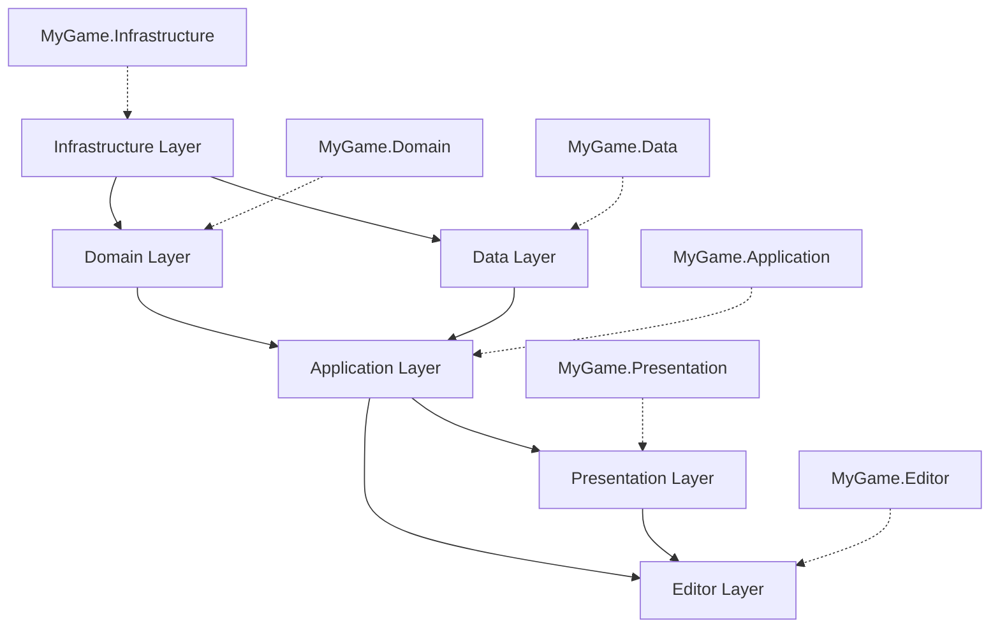

# Advanced Techniques: Assembly Definitions

> **Master Level:** Complex dependency hierarchies, version defines, conditional compilation, and
> advanced build pipeline integration.

## Complex Dependency Hierarchies

### Layered Architecture with Assembly Definitions



**Infrastructure Layer** (MyGame.Infrastructure.asmdef)

```json
{
  "name": "MyGame.Infrastructure",
  "rootNamespace": "MyGame.Infrastructure",
  "references": [] // No dependencies - pure utilities
}
```

Contains:

- Math utilities
- Data structures
- Extension methods
- Pure C# code (no Unity dependencies if possible)

**Domain Layer** (MyGame.Domain.asmdef)

```json
{
  "name": "MyGame.Domain",
  "rootNamespace": "MyGame.Domain",
  "references": ["MyGame.Infrastructure"]
}
```

Contains:

- Game rules/logic
- Business entities
- Domain events
- Game state

**Data Layer** (MyGame.Data.asmdef)

```json
{
  "name": "MyGame.Data",
  "rootNamespace": "MyGame.Data",
  "references": ["MyGame.Infrastructure", "MyGame.Domain"]
}
```

Contains:

- Save/load systems
- Databases
- Serialization
- Data access

**Application Layer** (MyGame.Application.asmdef)

```json
{
  "name": "MyGame.Application",
  "rootNamespace": "MyGame.Application",
  "references": ["MyGame.Infrastructure", "MyGame.Domain", "MyGame.Data"]
}
```

Contains:

- Game systems
- Services
- Managers
- Gameplay logic

**Presentation Layer** (MyGame.Presentation.asmdef)

```json
{
  "name": "MyGame.Presentation",
  "rootNamespace": "MyGame.Presentation",
  "references": ["MyGame.Infrastructure", "MyGame.Application"]
}
```

Contains:

- UI
- Rendering
- Input handling
- Audio

### Benefits of Layered Architecture

1. **Clear Separation of Concerns**

   - Each layer has a specific responsibility
   - Easy to reason about where code belongs

2. **Testability**

   - Domain layer can be tested without Unity
   - Infrastructure has no external dependencies

3. **Compile Time**

   - Change UI → Only Presentation recompiles
   - Change gameplay → Application + Presentation recompile
   - Domain rarely changes → Fast iteration

4. **Enforced Dependencies**
   - Presentation can't access Data directly
   - Forces proper architecture

## Version Defines

Version defines let you conditionally compile code based on package versions.

### Use Case: Supporting Multiple Package Versions

**Problem:** You want to support both old and new versions of Input System.

**Solution: Version Defines**

**MyGame.Core.asmdef:**

```json
{
  "name": "MyGame.Core",
  "versionDefines": [
    {
      "name": "com.unity.inputsystem",
      "expression": "1.0.0",
      "define": "INPUT_SYSTEM_1_0_OR_NEWER"
    },
    {
      "name": "com.unity.inputsystem",
      "expression": "1.5.0",
      "define": "INPUT_SYSTEM_1_5_OR_NEWER"
    }
  ]
}
```

**Usage in Code:**

```csharp
using UnityEngine;

#if INPUT_SYSTEM_1_5_OR_NEWER
using UnityEngine.InputSystem;
#endif

public class InputManager : MonoBehaviour
{
    #if INPUT_SYSTEM_1_5_OR_NEWER
    private PlayerInput _playerInput;

    void Start()
    {
        // Use new Input System features from 1.5+
        _playerInput = GetComponent<PlayerInput>();
    }
    #else
    void Start()
    {
        // Fallback for older versions
        Debug.LogWarning("Input System 1.5+ required for full features");
    }
    #endif
}
```

### Expression Syntax

```json
"expression": "1.0.0"        // Exactly 1.0.0
"expression": "[1.0.0]"      // Exactly 1.0.0
"expression": "[1.0,2.0]"    // >= 1.0 and <= 2.0
"expression": "[1.0,2.0)"    // >= 1.0 and < 2.0
"expression": "(1.0,2.0]"    // > 1.0 and <= 2.0
"expression": "(1.0,2.0)"    // > 1.0 and < 2.0
"expression": "1.0"          // >= 1.0 (any version >= 1.0)
```

### Multiple Package Detection

```json
{
  "versionDefines": [
    {
      "name": "com.unity.inputsystem",
      "expression": "1.0.0",
      "define": "HAS_INPUT_SYSTEM"
    },
    {
      "name": "com.unity.textmeshpro",
      "expression": "3.0.0",
      "define": "HAS_TEXTMESHPRO"
    },
    {
      "name": "com.unity.addressables",
      "expression": "1.0.0",
      "define": "HAS_ADDRESSABLES"
    }
  ]
}
```

**Code:**

```csharp
#if HAS_INPUT_SYSTEM
    // Use Input System
#else
    // Use legacy input
#endif

#if HAS_TEXTMESHPRO
    using TMPro;
    public TextMeshProUGUI label;
#else
    using UnityEngine.UI;
    public Text label;
#endif

#if HAS_ADDRESSABLES
    // Use Addressables for loading
#else
    // Use Resources.Load fallback
#endif
```

## Root Namespace Organization

### Automatic Namespace Generation

When you set `rootNamespace`, Unity wraps all scripts in that namespace.

**MyGame.UI.asmdef:**

```json
{
  "name": "MyGame.UI",
  "rootNamespace": "MyGame.UI"
}
```

**MainMenu.cs (you write):**

```csharp
using UnityEngine;

public class MainMenu : MonoBehaviour
{
    // Your code
}
```

**MainMenu.cs (Unity compiles):**

```csharp
using UnityEngine;

namespace MyGame.UI
{
    public class MainMenu : MonoBehaviour
    {
        // Your code
    }
}
```

### Nested Namespaces

You can still add nested namespaces:

**MainMenu.cs:**

```csharp
using UnityEngine;

namespace Menus
{
    public class MainMenu : MonoBehaviour
    {
        // Your code
    }
}
```

**Compiled as:**

```csharp
namespace MyGame.UI.Menus  // Nested!
{
    public class MainMenu : MonoBehaviour { }
}
```

### Benefits of Root Namespaces

1. **No Manual Namespace Typing**

   - Unity adds it automatically
   - Fewer mistakes

2. **Consistent Naming**

   - All scripts in assembly have same root namespace
   - Easy to find code

3. **Refactoring**

   - Change root namespace in one place
   - All scripts updated

4. **IDE Features**
   - Better autocomplete
   - Organized code navigation

## Auto-Referenced vs Manual Assemblies

### Auto-Referenced (Default)

```json
{
  "name": "MyGame.Core",
  "autoReferenced": true // Default
}
```

**Effect:**

- Any new assembly can use this one without explicitly referencing it
- Similar to how Unity's default assemblies work

**Use When:**

- Core utilities everyone needs
- Foundation code

### Manual Reference Required

```json
{
  "name": "MyGame.OptionalFeature",
  "autoReferenced": false
}
```

**Effect:**

- Other assemblies must explicitly reference this one
- Not automatically available

**Use When:**

- Optional features (mods, DLC)
- Editor-only assemblies
- Platform-specific code
- Large optional dependencies

**Example: Optional Steam Integration**

**MyGame.SteamIntegration.asmdef:**

```json
{
  "name": "MyGame.SteamIntegration",
  "autoReferenced": false,
  "defineConstraints": ["STEAM_ENABLED"]
}
```

**MyGame.Application.asmdef:**

```json
{
  "name": "MyGame.Application",
  "references": [
    "MyGame.Core"
    // NOT referencing MyGame.SteamIntegration
  ]
}
```

**Conditional Usage:**

```csharp
// In MyGame.Application
#if STEAM_ENABLED
using MyGame.SteamIntegration;
#endif

public class GameManager : MonoBehaviour
{
    void Start()
    {
        #if STEAM_ENABLED
        SteamManager.Initialize();
        #endif
    }
}
```

## Assembly Definition Overrides

Unity lets you override assembly settings per platform in Player Settings.

### Use Case: Platform-Specific References

**Problem:** You want to reference a plugin that only exists on specific platforms.

**Solution: Define Constraints + Platform Settings**

**MyGame.Core.asmdef:**

```json
{
  "name": "MyGame.Core",
  "defineConstraints": [],
  "versionDefines": []
}
```

**Player Settings → Scripting Define Symbols:**

- **iOS:** `PLATFORM_IOS;MOBILE`
- **Android:** `PLATFORM_ANDROID;MOBILE`
- **PC:** `PLATFORM_PC;DESKTOP`

**Code:**

```csharp
#if MOBILE
using MobilePlugin;
#elif DESKTOP
using DesktopPlugin;
#endif
```

## Build Pipeline Integration

### Stripping Assemblies from Builds

**Problem:** You have debug/dev assemblies you don't want in production builds.

**Solution: Build Callbacks**

**MyGame.Editor/BuildProcessor.cs:**

```csharp
using UnityEditor;
using UnityEditor.Build;
using UnityEditor.Build.Reporting;

public class AssemblyStripper : IPreprocessBuildWithReport
{
    public int callbackOrder => 0;

    public void OnPreprocessBuild(BuildReport report)
    {
        // Remove debug assemblies from production builds
        if (report.summary.options.HasFlag(BuildOptions.Development))
        {
            // Keep debug assemblies in dev builds
            return;
        }

        // Strip debug assemblies from release builds
        StripAssembly("MyGame.DebugTools");
        StripAssembly("MyGame.Cheats");
    }

    void StripAssembly(string assemblyName)
    {
        // Implementation depends on your needs
        // You can delete the .asmdef temporarily,
        // or use defineConstraints to disable it
        Debug.Log($"Stripping assembly: {assemblyName}");
    }
}
```

### Conditional Assembly Compilation

**MyGame.DebugTools.asmdef:**

```json
{
  "name": "MyGame.DebugTools",
  "defineConstraints": ["ENABLE_DEBUG_TOOLS"]
}
```

**Build Script:**

```csharp
// Development build
PlayerSettings.SetScriptingDefineSymbolsForGroup(
    BuildTargetGroup.Standalone,
    "ENABLE_DEBUG_TOOLS"
);

// Production build (no debug tools)
PlayerSettings.SetScriptingDefineSymbolsForGroup(
    BuildTargetGroup.Standalone,
    ""
);
```

## Package Manager Integration

### Creating a Package with Assembly Definitions

**Folder Structure:**

```
Packages/
└── com.mycompany.mygamepackage/
    ├── package.json
    ├── Runtime/
    │   ├── MyCompany.MyGamePackage.asmdef
    │   └── PackageCode.cs
    ├── Editor/
    │   ├── MyCompany.MyGamePackage.Editor.asmdef
    │   └── PackageEditor.cs
    └── Tests/
        ├── Runtime/
        │   ├── MyCompany.MyGamePackage.Tests.asmdef
        │   └── RuntimeTests.cs
        └── Editor/
            ├── MyCompany.MyGamePackage.Editor.Tests.asmdef
            └── EditorTests.cs
```

**package.json:**

```json
{
  "name": "com.mycompany.mygamepackage",
  "version": "1.0.0",
  "displayName": "My Game Package",
  "description": "A package for my game",
  "unity": "2021.3",
  "dependencies": {
    "com.unity.inputsystem": "1.0.0"
  }
}
```

**Runtime/MyCompany.MyGamePackage.asmdef:**

```json
{
  "name": "MyCompany.MyGamePackage",
  "rootNamespace": "MyCompany.MyGamePackage",
  "references": [],
  "includePlatforms": [],
  "excludePlatforms": [],
  "allowUnsafeCode": false,
  "overrideReferences": false,
  "precompiledReferences": [],
  "autoReferenced": true,
  "defineConstraints": [],
  "versionDefines": [
    {
      "name": "com.unity.inputsystem",
      "expression": "1.0.0",
      "define": "MYPACKAGE_HAS_INPUT_SYSTEM"
    }
  ],
  "noEngineReferences": false
}
```

**Editor/MyCompany.MyGamePackage.Editor.asmdef:**

```json
{
  "name": "MyCompany.MyGamePackage.Editor",
  "rootNamespace": "MyCompany.MyGamePackage.Editor",
  "references": ["MyCompany.MyGamePackage"],
  "includePlatforms": ["Editor"],
  "excludePlatforms": [],
  "allowUnsafeCode": false,
  "overrideReferences": false,
  "precompiledReferences": [],
  "autoReferenced": false,
  "defineConstraints": [],
  "versionDefines": [],
  "noEngineReferences": false
}
```

### Benefits of Splitting Runtime and Editor Assemblies

1. **Isolated Dependencies**

   - Package assemblies don't pollute project assemblies
   - Clear separation

2. **Versioning**

   - Version defines let you support multiple Unity versions

3. **Testing**

   - Separate test assemblies for runtime and editor

4. **Distribution**
   - Easy to share via Package Manager
   - Users can easily add to their projects

## CI/CD Considerations

### Assembly Validation in CI

**CI Script (C#):**

```csharp
using UnityEditor;
using UnityEditor.Compilation;
using System.Linq;

public static class AssemblyValidator
{
    [MenuItem("Tools/Validate Assemblies")]
    public static void ValidateAssemblies()
    {
        var assemblies = CompilationPipeline.GetAssemblies();

        // Check for circular dependencies
        foreach (var assembly in assemblies)
        {
            if (HasCircularDependency(assembly))
            {
                Debug.LogError($"Circular dependency in {assembly.name}");
                EditorApplication.Exit(1);
            }
        }

        // Check for missing references
        foreach (var assembly in assemblies)
        {
            foreach (var reference in assembly.assemblyReferences)
            {
                if (!assemblies.Any(a => a.name == reference.name))
                {
                    Debug.LogError($"Missing reference: {reference.name} in {assembly.name}");
                    EditorApplication.Exit(1);
                }
            }
        }

        // Check compile times
        foreach (var assembly in assemblies)
        {
            if (GetCompileTime(assembly) > 10f)
            {
                Debug.LogWarning($"Slow assembly: {assembly.name} takes >{GetCompileTime(assembly)}s");
            }
        }

        Debug.Log("✅ Assembly validation passed!");
    }

    static bool HasCircularDependency(Assembly assembly)
    {
        // Implementation...
        return false;
    }

    static float GetCompileTime(Assembly assembly)
    {
        // Implementation...
        return 0f;
    }
}
```

**CI Command:**

```bash
unity-editor \
  -batchmode \
  -nographics \
  -projectPath . \
  -executeMethod AssemblyValidator.ValidateAssemblies \
  -quit
```

### Incremental Builds in CI

**Problem:** CI rebuilds everything from scratch every time.

**Solution: Cache Compiled Assemblies**

**CI Configuration (GitHub Actions):**

```yaml
- name: Cache Library folder
  uses: actions/cache@v2
  with:
    path: Library
    key: Library-${{ hashFiles('Assets/**/*.asmdef') }}
    restore-keys: |
      Library-

- name: Build Unity Project
  run: |
    unity-editor \
      -batchmode \
      -nographics \
      -projectPath . \
      -buildTarget StandaloneWindows64 \
      -quit
```

**Benefits:**

- Only changed assemblies recompile
- 5-10x faster CI builds

## Advanced Patterns

### Plugin Wrapper Assemblies

**Problem:** Third-party plugin has no assembly definition.

**Solution: Wrap It**

**Folder Structure:**

```
Assets/Plugins/
├── ThirdPartyPlugin/  ← No .asmdef
│   └── PluginCode.cs
└── ThirdPartyPlugin.Wrapper/
    ├── MyGame.ThirdPartyWrapper.asmdef
    └── PluginExtensions.cs
```

**MyGame.ThirdPartyWrapper.asmdef:**

```json
{
  "name": "MyGame.ThirdPartyWrapper",
  "rootNamespace": "MyGame.ThirdPartyWrapper",
  "references": [],
  "autoReferenced": false
}
```

**Usage:**

```json
// In your code assemblies
{
  "references": ["MyGame.ThirdPartyWrapper"]
}
```

**Benefits:**

- Explicit dependency on plugin
- Easier to swap plugins later
- Compile isolation

### Feature Flags with Assembly Definitions

**Folder Structure:**

```
Assets/Scripts/
├── Features/
│   ├── Feature_Multiplayer/
│   │   ├── MyGame.Multiplayer.asmdef
│   │   └── MultiplayerSystem.cs
│   ├── Feature_Analytics/
│   │   ├── MyGame.Analytics.asmdef
│   │   └── AnalyticsSystem.cs
│   └── Feature_CloudSave/
│       ├── MyGame.CloudSave.asmdef
│       └── CloudSaveSystem.cs
```

**Each feature assembly:**

```json
{
  "name": "MyGame.Multiplayer",
  "defineConstraints": ["FEATURE_MULTIPLAYER"]
}
```

**Build Script:**

```csharp
// Enable features for this build
var enabledFeatures = new[] { "FEATURE_MULTIPLAYER", "FEATURE_ANALYTICS" };

PlayerSettings.SetScriptingDefineSymbolsForGroup(
    BuildTargetGroup.Standalone,
    string.Join(";", enabledFeatures)
);
```

**Benefits:**

- Enable/disable features per build
- Smaller builds (disabled features not included)
- A/B testing infrastructure

## Summary

### Advanced Techniques Covered

1. **Layered Architecture** — Infrastructure → Domain → Data → Application → Presentation
2. **Version Defines** — Conditional compilation based on package versions
3. **Root Namespace** — Automatic namespace organization
4. **Auto-Referenced vs Manual** — Control assembly visibility
5. **Assembly Overrides** — Platform-specific settings
6. **Build Pipeline Integration** — Strip assemblies, conditional compilation
7. **Package Manager** — Create distributable packages
8. **CI/CD** — Validation, caching, incremental builds
9. **Plugin Wrappers** — Isolate third-party dependencies
10. **Feature Flags** — Enable/disable features per build

### Next Steps

- **[Common Patterns](04-common-patterns.md)** — Real-world project structures and recipes
- **[Best Practices](05-best-practices.md)** — Avoid pitfalls and optimize workflow

---

**Pro Tip:** Don't over-engineer from the start. Begin with a simple 3-4 assembly structure, then
add complexity only when you need it.
