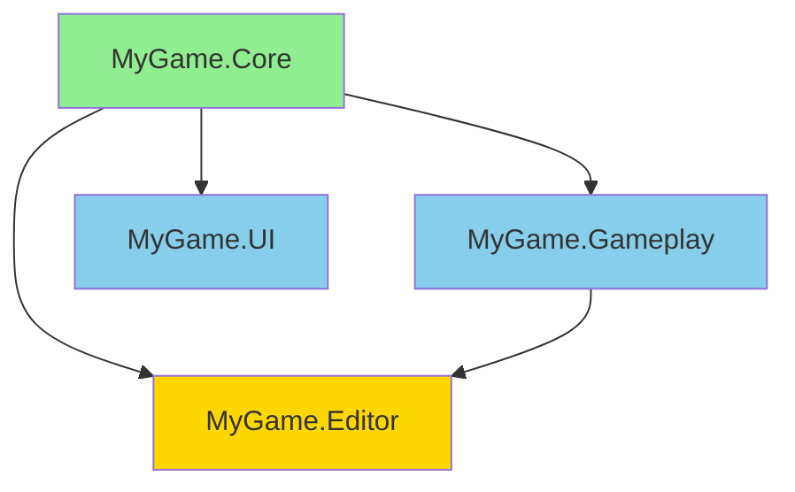
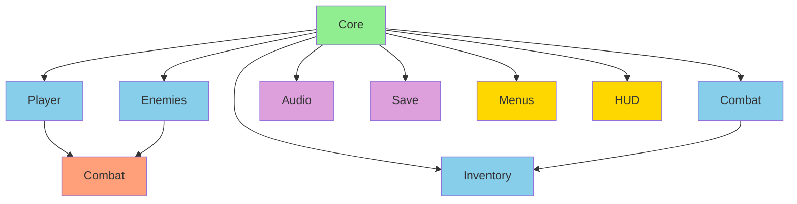
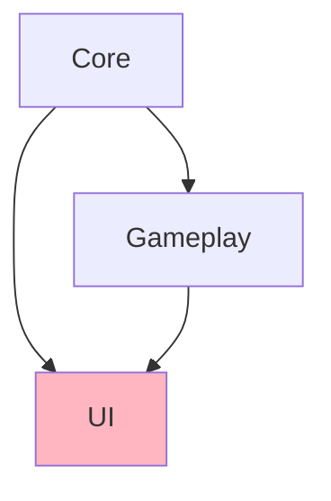
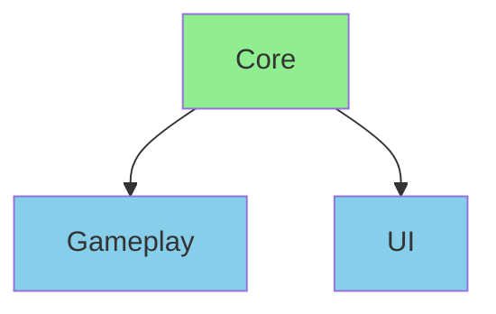

# Common Patterns: Assembly Definitions

> **Cookbook:** Battle-tested assembly structures for different project types and use cases.

## Standard Project Structures

### Pattern 1: Small-to-Medium Game (3-5 Assemblies)

**Best For:** Games with 500-2000 scripts

**Folder Structure:**

```
Assets/Scripts/
├── MyGame.Core.asmdef
├── Core/
│   ├── Database.cs
│   ├── Settings.cs
│   └── Utilities.cs
├── MyGame.Gameplay.asmdef
├── Gameplay/
│   ├── Player.cs
│   ├── Enemy.cs
│   └── Items.cs
├── MyGame.UI.asmdef
└── UI/
    ├── MainMenu.cs
    ├── HUD.cs
    └── Dialogs.cs

Assets/Editor/
├── MyGame.Editor.asmdef
└── CustomTools.cs
```

**Dependency Graph:**



**MyGame.Core.asmdef:**

```json
{
  "name": "MyGame.Core",
  "rootNamespace": "MyGame.Core",
  "references": []
}
```

**MyGame.Gameplay.asmdef:**

```json
{
  "name": "MyGame.Gameplay",
  "rootNamespace": "MyGame.Gameplay",
  "references": ["MyGame.Core"]
}
```

**MyGame.UI.asmdef:**

```json
{
  "name": "MyGame.UI",
  "rootNamespace": "MyGame.UI",
  "references": ["MyGame.Core"]
}
```

**MyGame.Editor.asmdef:**

```json
{
  "name": "MyGame.Editor",
  "rootNamespace": "MyGame.Editor",
  "references": ["MyGame.Core", "MyGame.Gameplay"],
  "includePlatforms": ["Editor"],
  "autoReferenced": false
}
```

**Benefits:**

- ✅ Simple structure, easy to understand
- ✅ UI doesn't depend on Gameplay (clean separation)
- ✅ Core is foundation for everything
- ✅ Editor tools can access everything for debugging

**Typical Compile Times:**

- Change Core → 8 seconds (all recompile)
- Change Gameplay → 4 seconds (Gameplay + Editor)
- Change UI → 2 seconds (UI only)

---

### Pattern 2: Large Game with Feature Modules (10+ Assemblies)

**Best For:** Games with 2000+ scripts, multiple teams

**Folder Structure:**

```
Assets/Scripts/
├── Core/
│   ├── MyGame.Core.asmdef
│   └── (foundation code)
├── Gameplay/
│   ├── Player/
│   │   ├── MyGame.Gameplay.Player.asmdef
│   │   └── Player.cs
│   ├── Enemies/
│   │   ├── MyGame.Gameplay.Enemies.asmdef
│   │   └── Enemy.cs
│   ├── Combat/
│   │   ├── MyGame.Gameplay.Combat.asmdef
│   │   └── Weapon.cs
│   └── Inventory/
│       ├── MyGame.Gameplay.Inventory.asmdef
│       └── InventorySystem.cs
├── UI/
│   ├── Menus/
│   │   ├── MyGame.UI.Menus.asmdef
│   │   └── MainMenu.cs
│   └── HUD/
│       ├── MyGame.UI.HUD.asmdef
│       └── HealthBar.cs
└── Systems/
    ├── Audio/
    │   ├── MyGame.Systems.Audio.asmdef
    │   └── AudioManager.cs
    └── Save/
        ├── MyGame.Systems.Save.asmdef
        └── SaveSystem.cs
```

**Dependency Graph:**



**Benefits:**

- ✅ Very granular compilation (only changed features recompile)
- ✅ Multiple teams can work independently
- ✅ Clear feature boundaries
- ✅ Easy to enable/disable features

**Trade-offs:**

- ⚠️ More complex setup
- ⚠️ More `.asmdef` files to manage
- ⚠️ Requires discipline to maintain boundaries

---

### Pattern 3: Multi-Platform Game

**Best For:** Games targeting PC, Console, Mobile, VR

**Folder Structure:**

```
Assets/Scripts/
├── Core/
│   ├── MyGame.Core.asmdef
│   └── (shared code)
├── Gameplay/
│   ├── MyGame.Gameplay.asmdef
│   └── (gameplay code)
├── Platforms/
│   ├── Mobile/
│   │   ├── MyGame.Platform.Mobile.asmdef
│   │   ├── TouchControls.cs
│   │   └── MobileOptimizations.cs
│   ├── Desktop/
│   │   ├── MyGame.Platform.Desktop.asmdef
│   │   ├── KeyboardControls.cs
│   │   └── DesktopSettings.cs
│   ├── Console/
│   │   ├── MyGame.Platform.Console.asmdef
│   │   └── ConsoleIntegration.cs
│   └── VR/
│       ├── MyGame.Platform.VR.asmdef
│       └── VRControls.cs
└── UI/
    ├── Shared/
    │   ├── MyGame.UI.Shared.asmdef
    │   └── CommonUI.cs
    ├── Mobile/
    │   ├── MyGame.UI.Mobile.asmdef
    │   └── TouchUI.cs
    └── Desktop/
        ├── MyGame.UI.Desktop.asmdef
        └── KeyboardUI.cs
```

**MyGame.Platform.Mobile.asmdef:**

```json
{
  "name": "MyGame.Platform.Mobile",
  "rootNamespace": "MyGame.Platform.Mobile",
  "references": ["MyGame.Core"],
  "includePlatforms": ["iOS", "Android"]
}
```

**MyGame.Platform.Desktop.asmdef:**

```json
{
  "name": "MyGame.Platform.Desktop",
  "rootNamespace": "MyGame.Platform.Desktop",
  "references": ["MyGame.Core"],
  "includePlatforms": ["WindowsStandalone64", "OSXStandalone", "LinuxStandalone64"]
}
```

**MyGame.Platform.Console.asmdef:**

```json
{
  "name": "MyGame.Platform.Console",
  "rootNamespace": "MyGame.Platform.Console",
  "references": ["MyGame.Core"],
  "includePlatforms": ["PS4", "PS5", "XboxOne", "Switch"]
}
```

**MyGame.Platform.VR.asmdef:**

```json
{
  "name": "MyGame.Platform.VR",
  "rootNamespace": "MyGame.Platform.VR",
  "references": ["MyGame.Core"],
  "defineConstraints": ["ENABLE_VR"]
}
```

**Benefits:**

- ✅ No `#if UNITY_IOS` throughout codebase
- ✅ Platform-specific code automatically excluded from other platforms
- ✅ Smaller build sizes
- ✅ Easier to test platform-specific features

---

## Core/Gameplay/UI Separation Strategy

### The Golden Rule: UI Doesn't Depend on Gameplay

**❌ Bad:**



UI depends on Gameplay → Changes to gameplay recompile UI

**✅ Good:**



UI and Gameplay both depend on Core only

### Implementation

**MyGame.Core.asmdef** — Contains interfaces and events:

```csharp
namespace MyGame.Core
{
    // Interface that Gameplay implements
    public interface IPlayerData
    {
        int Health { get; }
        int MaxHealth { get; }
        int Gold { get; }
    }

    // Events that Gameplay fires
    public static class GameEvents
    {
        public static event Action<IPlayerData> OnPlayerDataChanged;

        public static void FirePlayerDataChanged(IPlayerData data)
        {
            OnPlayerDataChanged?.Invoke(data);
        }
    }
}
```

**MyGame.Gameplay.asmdef** — Implements interfaces:

```csharp
using MyGame.Core;

namespace MyGame.Gameplay
{
    public class Player : MonoBehaviour, IPlayerData
    {
        [SerializeField] private int _health = 100;
        [SerializeField] private int _maxHealth = 100;
        [SerializeField] private int _gold = 0;

        public int Health => _health;
        public int MaxHealth => _maxHealth;
        public int Gold => _gold;

        void OnValidate()
        {
            GameEvents.FirePlayerDataChanged(this);
        }
    }
}
```

**MyGame.UI.asmdef** — Listens to events:

```csharp
using MyGame.Core;
using UnityEngine;
using UnityEngine.UI;

namespace MyGame.UI
{
    public class HealthBar : MonoBehaviour
    {
        [SerializeField] private Slider _slider;

        void OnEnable()
        {
            GameEvents.OnPlayerDataChanged += UpdateHealthBar;
        }

        void OnDisable()
        {
            GameEvents.OnPlayerDataChanged -= UpdateHealthBar;
        }

        void UpdateHealthBar(IPlayerData player)
        {
            _slider.value = (float)player.Health / player.MaxHealth;
        }
    }
}
```

**Benefits:**

- ✅ UI doesn't depend on Gameplay
- ✅ Change Gameplay → UI doesn't recompile
- ✅ Enforces loose coupling
- ✅ Easier to test

---

## Editor Tooling Assemblies

### Pattern: Debug Tools Assembly

**Folder Structure:**

```
Assets/Editor/
├── MyGame.Editor.Tools.asmdef
├── DebugMenu.cs
├── CheatCommands.cs
└── LevelValidator.cs
```

**MyGame.Editor.Tools.asmdef:**

```json
{
  "name": "MyGame.Editor.Tools",
  "rootNamespace": "MyGame.Editor.Tools",
  "references": ["MyGame.Core", "MyGame.Gameplay"],
  "includePlatforms": ["Editor"],
  "autoReferenced": false,
  "defineConstraints": ["DEVELOPMENT_BUILD"]
}
```

**DebugMenu.cs:**

```csharp
using UnityEditor;
using MyGame.Gameplay;

namespace MyGame.Editor.Tools
{
    public static class DebugMenu
    {
        [MenuItem("Debug/Player/Full Heal")]
        static void FullHeal()
        {
            var player = Object.FindAnyObjectByType<Player>();
            if (player != null)
            {
                // Use reflection or public methods to heal
                player.Heal(9999);
            }
        }

        [MenuItem("Debug/Player/Add Gold")]
        static void AddGold()
        {
            var player = Object.FindAnyObjectByType<Player>();
            if (player != null)
            {
                player.AddGold(1000);
            }
        }

        [MenuItem("Debug/Level/Validate All")]
        static void ValidateLevel()
        {
            LevelValidator.ValidateCurrentLevel();
        }
    }
}
```

**Benefits:**

- ✅ Debug tools don't compile in production builds
- ✅ Zero runtime overhead
- ✅ Can access all game assemblies for debugging
- ✅ `defineConstraints` ensures only in dev builds

---

## Test Assembly Organization

### Pattern: Tests Mirror Production Structure

**Folder Structure:**

```
Assets/Scripts/
├── Core/
│   ├── MyGame.Core.asmdef
│   └── Database.cs
├── Gameplay/
│   ├── MyGame.Gameplay.asmdef
│   └── Player.cs
└── UI/
    ├── MyGame.UI.asmdef
    └── MainMenu.cs

Assets/Tests/
├── Core/
│   ├── MyGame.Tests.Core.asmdef
│   └── DatabaseTests.cs
├── Gameplay/
│   ├── MyGame.Tests.Gameplay.asmdef
│   └── PlayerTests.cs
└── UI/
    ├── MyGame.Tests.UI.asmdef
    └── MainMenuTests.cs
```

**MyGame.Tests.Core.asmdef:**

```json
{
  "name": "MyGame.Tests.Core",
  "rootNamespace": "MyGame.Tests.Core",
  "references": ["UnityEngine.TestRunner", "UnityEditor.TestRunner", "MyGame.Core"],
  "includePlatforms": ["Editor"],
  "autoReferenced": false,
  "optionalUnityReferences": ["TestAssemblies"]
}
```

**MyGame.Tests.Gameplay.asmdef:**

```json
{
  "name": "MyGame.Tests.Gameplay",
  "rootNamespace": "MyGame.Tests.Gameplay",
  "references": [
    "UnityEngine.TestRunner",
    "UnityEditor.TestRunner",
    "MyGame.Core",
    "MyGame.Gameplay"
  ],
  "includePlatforms": ["Editor"],
  "autoReferenced": false,
  "optionalUnityReferences": ["TestAssemblies"]
}
```

**Benefits:**

- ✅ Test structure mirrors production structure
- ✅ Each test assembly only references what it needs
- ✅ Fast test compilation
- ✅ Easy to find tests for specific code

---

## Plugin and Third-Party Integration

### Pattern 1: Wrapper Assembly for Plugin Without Asmdef

**Problem:** Third-party plugin has no assembly definition.

**Solution:**

```
Assets/Plugins/
├── ThirdPartyPlugin/
│   └── PluginCode.cs  ← No .asmdef
└── Wrappers/
    └── ThirdParty/
        ├── MyGame.ThirdParty.asmdef
        └── ThirdPartyExtensions.cs
```

**MyGame.ThirdParty.asmdef:**

```json
{
  "name": "MyGame.ThirdParty",
  "rootNamespace": "MyGame.ThirdParty",
  "references": [],
  "autoReferenced": false
}
```

**Usage in Your Code:**

```json
{
  "name": "MyGame.Gameplay",
  "references": ["MyGame.Core", "MyGame.ThirdParty"]
}
```

**Benefits:**

- ✅ Explicit dependency on plugin
- ✅ Compile isolation
- ✅ Easy to swap plugins later

---

### Pattern 2: Conditional Plugin Integration

**Folder Structure:**

```
Assets/Plugins/
├── SteamIntegration/
│   ├── MyGame.Steam.asmdef
│   └── SteamManager.cs
├── PlayFabIntegration/
│   ├── MyGame.PlayFab.asmdef
│   └── PlayFabManager.cs
└── AnalyticsIntegration/
    ├── MyGame.Analytics.asmdef
    └── AnalyticsManager.cs
```

**MyGame.Steam.asmdef:**

```json
{
  "name": "MyGame.Steam",
  "rootNamespace": "MyGame.Steam",
  "references": ["MyGame.Core"],
  "defineConstraints": ["STEAM_ENABLED"],
  "autoReferenced": false
}
```

**MyGame.PlayFab.asmdef:**

```json
{
  "name": "MyGame.PlayFab",
  "rootNamespace": "MyGame.PlayFab",
  "references": ["MyGame.Core"],
  "defineConstraints": ["PLAYFAB_ENABLED"],
  "autoReferenced": false
}
```

**Usage:**

```csharp
// In MyGame.Core or MyGame.Gameplay
public interface ICloudSaveProvider
{
    void SaveToCloud(string data);
    void LoadFromCloud();
}

// In MyGame.Steam
#if STEAM_ENABLED
public class SteamCloudSave : ICloudSaveProvider
{
    // Implementation
}
#endif

// In MyGame.PlayFab
#if PLAYFAB_ENABLED
public class PlayFabCloudSave : ICloudSaveProvider
{
    // Implementation
}
#endif
```

**Benefits:**

- ✅ Enable/disable plugins per build
- ✅ No unused plugin code in builds
- ✅ Easy A/B testing

---

## Package Development Patterns

### Pattern: Reusable Package with Assembly Definitions

**Folder Structure:**

```
Packages/com.mycompany.utilities/
├── package.json
├── Runtime/
│   ├── MyCompany.Utilities.asmdef
│   ├── MathUtils.cs
│   └── Extensions.cs
├── Editor/
│   ├── MyCompany.Utilities.Editor.asmdef
│   └── UtilitiesWindow.cs
├── Tests/
│   ├── Runtime/
│   │   ├── MyCompany.Utilities.Tests.asmdef
│   │   └── MathUtilsTests.cs
│   └── Editor/
│       ├── MyCompany.Utilities.Editor.Tests.asmdef
│       └── EditorTests.cs
└── Documentation~/
    └── index.md
```

**package.json:**

```json
{
  "name": "com.mycompany.utilities",
  "version": "1.0.0",
  "displayName": "My Company Utilities",
  "description": "Reusable utilities for Unity projects",
  "unity": "2021.3",
  "dependencies": {},
  "keywords": ["utilities", "helpers", "extensions"]
}
```

**Runtime/MyCompany.Utilities.asmdef:**

```json
{
  "name": "MyCompany.Utilities",
  "rootNamespace": "MyCompany.Utilities",
  "references": [],
  "includePlatforms": [],
  "excludePlatforms": [],
  "allowUnsafeCode": false,
  "autoReferenced": true
}
```

**Benefits:**

- ✅ Easy to share across projects
- ✅ Versioned via Package Manager
- ✅ Includes tests
- ✅ No conflicts with project code

---

## Multi-Project Shared Code

### Pattern: Shared Core Package

**Problem:** Multiple Unity projects need to share code.

**Solution:**

**Shared Package Structure:**

```
Packages/com.mycompany.gamecore/
├── package.json
└── Runtime/
    ├── MyCompany.GameCore.asmdef
    ├── Database.cs
    └── Utilities.cs
```

**Project A:**

```json
{
  "dependencies": {
    "com.mycompany.gamecore": "file:../SharedPackages/com.mycompany.gamecore"
  }
}
```

**Project B:**

```json
{
  "dependencies": {
    "com.mycompany.gamecore": "file:../SharedPackages/com.mycompany.gamecore"
  }
}
```

**Benefits:**

- ✅ Single source of truth for shared code
- ✅ Update once, affects all projects
- ✅ Each project can use different versions

---

## Summary

### Pattern Quick Reference

| Pattern              | Use Case                      | Assemblies    | Complexity  |
| -------------------- | ----------------------------- | ------------- | ----------- |
| **Small-to-Medium**  | 500-2000 scripts              | 3-5           | ⭐ Low      |
| **Large Game**       | 2000+ scripts, multiple teams | 10+           | ⭐⭐⭐ High |
| **Multi-Platform**   | PC/Console/Mobile/VR          | 8-12          | ⭐⭐ Medium |
| **Core/Gameplay/UI** | Any size, clean architecture  | 3+            | ⭐ Low      |
| **Debug Tools**      | Development features          | 1             | ⭐ Low      |
| **Tests**            | Unit/integration tests        | 1 per feature | ⭐ Low      |
| **Plugin Wrapper**   | Third-party plugins           | 1 per plugin  | ⭐ Low      |
| **Package**          | Reusable code                 | 2-4           | ⭐⭐ Medium |

### Choosing the Right Pattern

**Start Small:**

- Begin with Core/Gameplay/UI (3 assemblies)
- Add more as project grows

**Grow Gradually:**

- Split large assemblies when compile times suffer
- Don't over-engineer from day 1

**Measure:**

- Watch compile times in Console
- Use Assembly Inspector to visualize dependencies

### Next Steps

- **[Best Practices & Pitfalls](05-best-practices.md)** — Avoid common mistakes and optimize
  workflow

---

**Pro Tip:** Copy a pattern that matches your project size, then adapt it as you learn what works
for your team.
