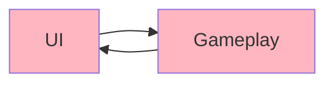
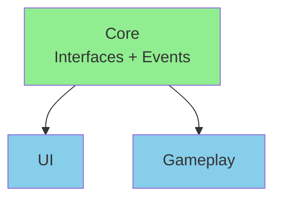
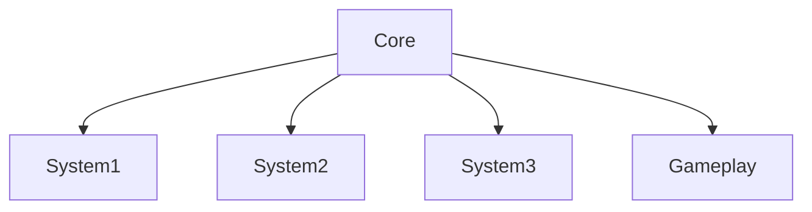

# Best Practices & Pitfalls: Assembly Definitions

> **Lessons Learned:** What to do, what NOT to do, and how to avoid common mistakes when using Assembly Definitions.

## When to Use Assembly Definitions

### ✅ Use Assembly Definitions When:

**1. Your project has 500+ scripts**
- Compile times start becoming noticeable (>10 seconds)
- Iteration speed matters

**2. You want clean architecture**
- Enforce separation between UI/Gameplay/Core
- Prevent spaghetti dependencies
- Make dependencies explicit

**3. You're building for multiple platforms**
- Mobile + PC + Console
- Platform-specific code without `#if` everywhere
- Smaller builds per platform

**4. You have editor tools**
- Debug menus
- Level editors
- Custom inspectors
- Want zero runtime overhead

**5. You're creating Unity packages**
- Sharing code between projects
- Distributing on Asset Store
- Internal package libraries

**6. Your team is growing**
- Multiple developers working on different features
- Need clear boundaries
- Want to avoid merge conflicts in single giant assembly

---

### ❌ Skip Assembly Definitions When:

**1. Your project is small (<100 scripts)**
- Overhead not worth it
- Compile times already fast
- Keep it simple

**2. You're prototyping rapidly**
- Architecture changes frequently
- Don't know final structure yet
- Speed of development > compile speed

**3. You're on a tight deadline**
- Mid-production crunch
- Don't have time to restructure
- "If it ain't broke, don't fix it"

**4. Your team is unfamiliar with assemblies**
- Training overhead
- Potential for mistakes
- Might slow down development initially

**5. You're just learning Unity**
- One more thing to learn
- Focus on game development first
- Add later when project grows

---

## Granularity: Too Many vs Too Few Assemblies

### ❌ Too Few Assemblies

**Example: Only 1 Assembly**
```
Assets/Scripts/MyGame.Everything.asmdef  ← All 5000 scripts
```

**Problems:**
- No compile time improvement
- Defeats the purpose
- Same as not using assembly definitions

---

### ❌ Too Many Assemblies

**Example: Every Folder is an Assembly**
```
Assets/Scripts/
├── Player/
│   ├── Movement/
│   │   └── MyGame.Player.Movement.asmdef  ← 5 scripts
│   ├── Combat/
│   │   └── MyGame.Player.Combat.asmdef    ← 3 scripts
│   └── Inventory/
│       └── MyGame.Player.Inventory.asmdef ← 4 scripts
└── (50 more tiny assemblies...)
```

**Problems:**
- Management overhead (50+ `.asmdef` files)
- Dependency complexity
- Merge conflicts on `.asmdef` files
- Actually SLOWER (assembly overhead > compile savings)
- Hard to understand structure

---

### ✅ Just Right

**Rule of Thumb: 100-500 scripts per assembly**

```
Assets/Scripts/
├── MyGame.Core.asmdef           (200 scripts)
├── MyGame.Gameplay.asmdef       (800 scripts)
├── MyGame.UI.asmdef             (300 scripts)
└── MyGame.Editor.asmdef         (150 scripts)
```

**Benefits:**
- Meaningful separation
- Fast compile times
- Easy to understand
- Low management overhead

**When to Split an Assembly:**
- Compile time >5 seconds
- Clear conceptual boundary (e.g., split Gameplay into Player + Enemies)
- Different teams working on different parts

---

## Circular Dependency Detection and Fixes

### Common Causes of Circular Dependencies

**Cause 1: Mutual References**



**Problem:**
```
UI needs to call Gameplay.Player
Gameplay needs to call UI.HealthBar
```

**Solution: Extract to Core**



**Implementation:**
```csharp
// In Core
public interface IPlayerData
{
    int Health { get; }
}

public static class GameEvents
{
    public static event Action<IPlayerData> OnPlayerChanged;
}

// In Gameplay
public class Player : MonoBehaviour, IPlayerData
{
    public int Health { get; private set; }

    void TakeDamage(int damage)
    {
        Health -= damage;
        GameEvents.OnPlayerChanged?.Invoke(this);
    }
}

// In UI
public class HealthBar : MonoBehaviour
{
    void OnEnable()
    {
        GameEvents.OnPlayerChanged += UpdateUI;
    }

    void UpdateUI(IPlayerData player)
    {
        // Update health bar
    }
}
```

---

**Cause 2: Hidden Dependencies Through Static Classes**

```csharp
// In MyGame.Gameplay
public static class GameManager
{
    public static void ShowDialog(string text)
    {
        // Calls UI code!
        DialogManager.Show(text);  ← UI dependency!
    }
}

// In MyGame.UI
public static class UIManager
{
    public static void SpawnEnemy()
    {
        // Calls Gameplay code!
        EnemySpawner.Spawn();  ← Gameplay dependency!
    }
}
```

**Solution: Dependency Inversion**

```csharp
// In Core
public interface IDialogService
{
    void Show(string text);
}

// In Gameplay
public class GameManager
{
    private readonly IDialogService _dialogService;

    public void ShowDialog(string text)
    {
        _dialogService.Show(text);  ← No direct UI dependency!
    }
}

// In UI
public class DialogService : IDialogService
{
    public void Show(string text)
    {
        DialogManager.Show(text);
    }
}
```

---

**Cause 3: Editor Code Dependencies**

```
MyGame.Gameplay references MyGame.Editor
MyGame.Editor references MyGame.Gameplay
```

**Solution:**
```json
// MyGame.Editor should be autoReferenced: false
{
    "name": "MyGame.Editor",
    "autoReferenced": false,
    "includePlatforms": ["Editor"]
}
```

Editor assemblies should almost always:
- Be `autoReferenced: false`
- Only be `includePlatforms: ["Editor"]`
- Reference runtime assemblies (not vice versa)

---

## Common Migration Mistakes

### Mistake 1: Migrating Everything at Once

**❌ Don't:**
```
Day 1: Create 20 assemblies for entire project
Day 2: Fix 500 compile errors
Day 3: Give up, revert everything
```

**✅ Do:**
```
Week 1: Create MyGame.UI.asmdef (safest, most isolated)
Week 2: Create MyGame.Core.asmdef (foundation)
Week 3: Create MyGame.Gameplay.asmdef (references Core)
Week 4: Refine and optimize
```

Start with the **most isolated** code (usually UI or Editor tools).

---

### Mistake 2: Not Using Root Namespace

**❌ Don't:**
```json
{
    "name": "MyGame.Core",
    "rootNamespace": ""  // Empty!
}
```

**Result:**
```csharp
// Your scripts have no namespace
public class Database { }  // Name collision likely!
```

**✅ Do:**
```json
{
    "name": "MyGame.Core",
    "rootNamespace": "MyGame.Core"
}
```

**Result:**
```csharp
namespace MyGame.Core
{
    public class Database { }  // Clear, organized
}
```

---

### Mistake 3: Forgetting to Add References

**Symptom:**
```
error CS0246: The type or namespace name 'MyGame' could not be found
```

**Cause:**
```json
// MyGame.Gameplay.asmdef
{
    "name": "MyGame.Gameplay",
    "references": []  // Missing MyGame.Core!
}
```

**Fix:**
```json
{
    "name": "MyGame.Gameplay",
    "references": ["MyGame.Core"]  // Add reference
}
```

**Tip:** If you get "type not found" errors after adding assemblies, check `references`.

---

### Mistake 4: Wrong Platform Settings

**❌ Don't:**
```json
// Editor assembly
{
    "name": "MyGame.Editor",
    "includePlatforms": []  // Wrong! Will be in builds!
}
```

**✅ Do:**
```json
{
    "name": "MyGame.Editor",
    "includePlatforms": ["Editor"],
    "autoReferenced": false
}
```

**Always:**
- Editor assemblies: `includePlatforms: ["Editor"]`
- Mobile assemblies: `includePlatforms: ["iOS", "Android"]`
- Verify with a test build!

---

## Performance Considerations

### Compile Time Optimization

**1. Measure First**
```
Window → Analysis → Assembly Inspector
```

Look for:
- Assemblies with >1000 scripts → Consider splitting
- Long dependency chains → Consider flattening
- Assemblies that compile every time → Check dependencies

**2. Reduce Dependency Depth**

**❌ Deep Chain (Slow):**

Change Core → All 5 recompile sequentially (slow!)

**✅ Flat Structure (Fast):**

Change Core → All 4 recompile in parallel (fast!)

**3. Break Circular Dependencies Early**

Circular dependencies force Unity to recompile multiple times.

**4. Use `autoReferenced: false` for Optional Assemblies**

```json
{
    "name": "MyGame.DebugTools",
    "autoReferenced": false
}
```

Prevents unnecessary dependencies on debug/dev code.

---

### Runtime Performance

**Good News: Assembly Definitions have ZERO runtime overhead!**

`.asmdef` files only affect:
- ✅ Compile time (faster)
- ✅ Dependencies (explicit)
- ✅ Build size (smaller with platform filtering)

They don't affect:
- ❌ Runtime speed (same)
- ❌ Memory usage (same)
- ❌ Loading time (same)

**Exception:** Platform filtering can reduce build size:
- Mobile assembly excluded from PC build
- Editor assembly never in builds
- Smaller builds = faster loading

---

## Team Workflow and Merge Conflicts

### Best Practices for Teams

**1. Establish Assembly Structure Early**
```
Sprint 0: Define assembly structure
Sprint 1+: Developers follow structure
```

**2. Document the Structure**
```markdown
# Assembly Structure

- MyGame.Core: Foundation code, no dependencies
- MyGame.Gameplay: Game logic, depends on Core
- MyGame.UI: User interface, depends on Core only
- MyGame.Editor: Debug tools, Editor-only
```

**3. Code Review `.asmdef` Changes**
- Adding dependencies? Discuss first
- New assembly? Make sure it fits the architecture
- Platform changes? Verify with test builds

**4. Use Meaningful Names**
```
✅ MyGame.Gameplay.Player
✅ MyGame.UI.Menus
✅ MyGame.Systems.Audio

❌ MyGame.Scripts1
❌ MyGame.Stuff
❌ MyGame.Test (conflicts with Tests!)
```

---

### Avoiding Merge Conflicts

**Problem:** Two developers add different dependencies to same `.asmdef`.

**Developer A:**
```json
{
    "references": ["MyGame.Core", "Unity.InputSystem"]
}
```

**Developer B:**
```json
{
    "references": ["MyGame.Core", "Unity.TextMeshPro"]
}
```

**Merge Result (Broken):**
```json
{
<<<<<<< HEAD
    "references": ["MyGame.Core", "Unity.InputSystem"]
=======
    "references": ["MyGame.Core", "Unity.TextMeshPro"]
>>>>>>> branch
}
```

**Solution: Both Add**
```json
{
    "references": [
        "MyGame.Core",
        "Unity.InputSystem",
        "Unity.TextMeshPro"
    ]
}
```

**Prevention:**
- Communicate when adding dependencies
- Use feature branches
- Merge main frequently
- Keep assembly structure stable

---

## Build Size Management

### Platform Filtering for Smaller Builds

**Before Assembly Definitions:**
```
MyGame.exe (Windows):
- Mobile code included ❌
- Console code included ❌
- VR code included ❌
- Editor code excluded ✅

Build size: 500 MB
```

**After Assembly Definitions:**
```
MyGame.exe (Windows):
- Mobile code excluded ✅ (includePlatforms: ["iOS", "Android"])
- Console code excluded ✅ (includePlatforms: ["PS4", "Xbox"])
- VR code excluded ✅ (defineConstraints: ["ENABLE_VR"])
- Editor code excluded ✅ (includePlatforms: ["Editor"])

Build size: 350 MB
```

**Savings: 150 MB (30% smaller!)**

---

### Conditional Features

**Pattern:**
```json
{
    "name": "MyGame.Analytics",
    "defineConstraints": ["ANALYTICS_ENABLED"]
}
```

**Build Script:**
```csharp
// Free version: No analytics
PlayerSettings.SetScriptingDefineSymbolsForGroup(
    BuildTargetGroup.Standalone,
    ""
);

// Premium version: With analytics
PlayerSettings.SetScriptingDefineSymbolsForGroup(
    BuildTargetGroup.Standalone,
    "ANALYTICS_ENABLED"
);
```

**Benefits:**
- Free version doesn't include analytics assembly
- Smaller download size
- Faster loading

---

## Pre-Ship Checklist

### Before Releasing Your Game

**✅ 1. Verify Platform Settings**
```
[ ] Mobile assemblies only on iOS/Android
[ ] Editor assemblies only in Editor
[ ] Platform-specific plugins configured correctly
```

**✅ 2. Test All Platform Builds**
```
[ ] Windows build: No mobile/console code
[ ] iOS build: No desktop/console code
[ ] Android build: No desktop/console code
```

**✅ 3. Remove Debug Assemblies**
```json
// MyGame.DebugTools.asmdef
{
    "defineConstraints": ["DEVELOPMENT_BUILD"]
}
```

```
[ ] Production builds don't include debug tools
[ ] Cheat menus not accessible
```

**✅ 4. Check Assembly Sizes**
```
Window → Analysis → Assembly Inspector

[ ] No single assembly >50% of codebase
[ ] Compile times reasonable (<10 seconds typical case)
```

**✅ 5. Verify Dependencies**
```
[ ] No circular dependencies
[ ] UI doesn't depend on Gameplay (if desired)
[ ] Clean dependency graph
```

**✅ 6. Test Without Unity Editor**
```
[ ] Build and run standalone
[ ] No missing references
[ ] All assemblies load correctly
```

**✅ 7. Code Stripping**
```
Player Settings → Managed Stripping Level

[ ] Set to Medium or High
[ ] Test that nothing breaks
[ ] Verify all assemblies strip correctly
```

---

## Common Pitfalls and Solutions

### Pitfall 1: Assembly Definition in Wrong Folder

**Problem:**
```
Assets/Scripts/
├── MyGame.Core.asmdef  ← Here
└── Core/
    └── Database.cs     ← Won't be in MyGame.Core!
```

**Solution:**
```
Assets/Scripts/Core/
├── MyGame.Core.asmdef  ← Move here
└── Database.cs         ← Now in MyGame.Core
```

`.asmdef` file must be in the folder (or parent folder) of scripts it contains.

---

### Pitfall 2: Special Folders Behavior

**Unity's Special Folders:**
```
Plugins/     → Compiles first (Assembly-CSharp-firstpass)
Standard Assets/ → Compiles first
Editor/      → Editor-only
```

**Problem:**
```
Assets/Plugins/MyCode/
└── MyGame.Core.asmdef  ← Ignored in Plugins!
```

**Solution:**
Move out of special folders, or don't use `.asmdef` there.

---

### Pitfall 3: Tests Not Running

**Problem:**
```json
{
    "name": "MyGame.Tests",
    "references": [
        "UnityEngine.TestRunner",
        "MyGame.Core"
    ]
    // Missing optionalUnityReferences!
}
```

**Solution:**
```json
{
    "name": "MyGame.Tests",
    "references": [
        "UnityEngine.TestRunner",
        "UnityEditor.TestRunner",
        "MyGame.Core"
    ],
    "optionalUnityReferences": ["TestAssemblies"]  ← Required!
}
```

---

### Pitfall 4: Slow Enter Play Mode

**Problem:** Domain reload still happening even with assembly definitions.

**Solution: Disable Domain Reload**
```
Edit → Project Settings → Editor → Enter Play Mode Settings
☑ Enter Play Mode Options (Experimental)
☐ Reload Domain
☐ Reload Scene
```

**Trade-off:** Static fields don't reset. You must reset them manually:
```csharp
[RuntimeInitializeOnLoadMethod(RuntimeInitializeLoadType.SubsystemRegistration)]
static void ResetStatics()
{
    _instance = null;
    _cachedData = null;
}
```

---

### Pitfall 5: Assembly Name Collisions

**Problem:**
```
Assets/MyProject/MyGame.Core.asmdef
Packages/ThirdParty/MyGame.Core.asmdef  ← Collision!
```

**Error:**
```
Assembly with name 'MyGame.Core' already exists
```

**Solution:** Use unique names
```
Assets/MyProject/MyCompany.MyGame.Core.asmdef
Packages/ThirdParty/TheirCompany.TheirGame.Core.asmdef
```

**Convention:** `CompanyName.ProjectName.Module`

---

## Summary Checklist

### Do's ✅

- ✅ Start with 3-5 assemblies (Core/Gameplay/UI/Editor)
- ✅ Use `rootNamespace` for all assemblies
- ✅ Add references explicitly
- ✅ Use `includePlatforms` for Editor assemblies
- ✅ Use `autoReferenced: false` for optional assemblies
- ✅ Keep assemblies at 100-500 scripts each
- ✅ Document your assembly structure
- ✅ Use Assembly Inspector to visualize dependencies
- ✅ Test all platform builds
- ✅ Measure compile times before/after

### Don'ts ❌

- ❌ Don't create too many tiny assemblies
- ❌ Don't migrate everything at once
- ❌ Don't forget platform settings
- ❌ Don't allow circular dependencies
- ❌ Don't put editor code in runtime assemblies
- ❌ Don't skip `rootNamespace`
- ❌ Don't add unnecessary dependencies
- ❌ Don't ignore compile time warnings
- ❌ Don't use assembly definitions on tiny projects (<100 scripts)
- ❌ Don't modify `.asmdef` files without team discussion

### When Things Go Wrong

**Compile Errors After Adding Assembly:**
1. Check `references` array
2. Verify namespace imports
3. Look for circular dependencies
4. Check Assembly Inspector

**Slow Compile Times:**
1. Use Assembly Inspector to find bottlenecks
2. Split large assemblies (>1000 scripts)
3. Flatten dependency hierarchy
4. Remove unnecessary dependencies

**Runtime Errors:**
1. Verify all assemblies in build
2. Check platform settings
3. Test without Editor
4. Check code stripping settings

---

## Further Reading

- **[Getting Started](01-GETTING-STARTED.md)** — Basics of assembly definitions
- **[Core Concepts](02-CORE-CONCEPTS.md)** — Deep dive into `.asmdef` files
- **[Advanced Techniques](03-ADVANCED-TECHNIQUES.md)** — Complex patterns and integrations
- **[Common Patterns](04-COMMON-PATTERNS.md)** — Real-world project structures

---

**Final Advice:** Assembly Definitions are powerful but not magic. Start simple, measure results, and iterate. Focus on solving real problems (slow compile times, tangled dependencies) rather than perfect architecture.

**Happy Coding!** ⚡
