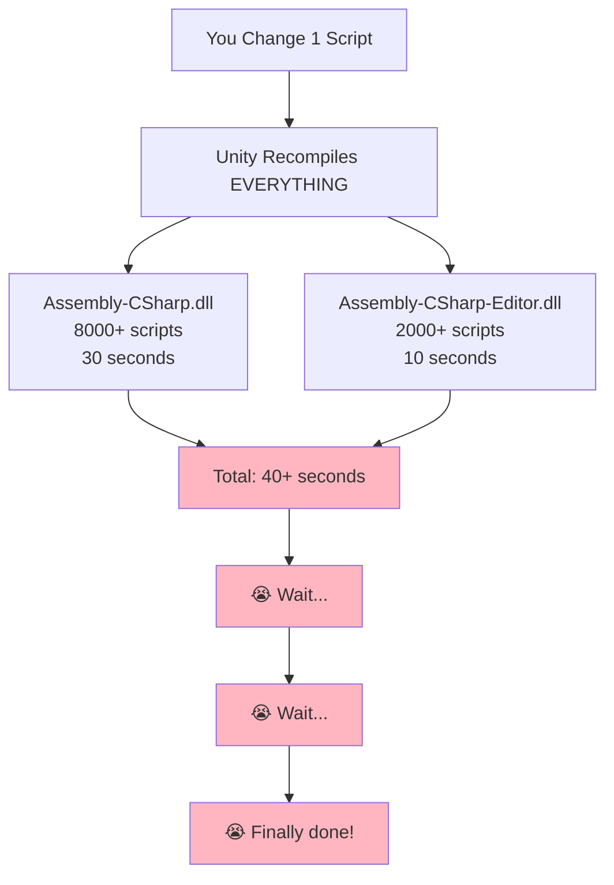
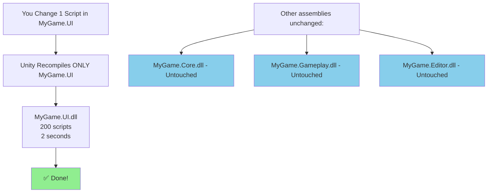
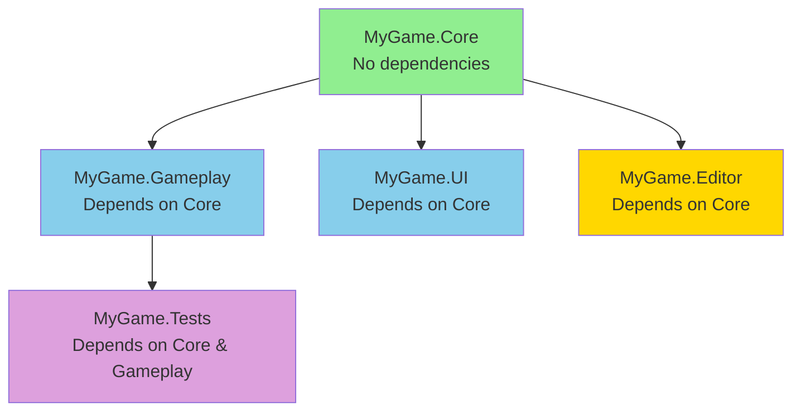
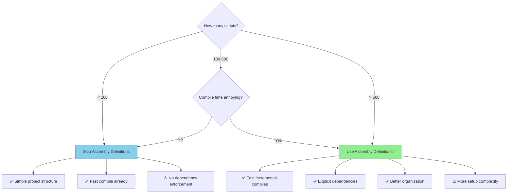

# Unity Assembly Definitions Documentation

> **Faster compile times. Better code organization. Clearer dependencies.** Take control of Unity's
> compilation process.

## What Problem Does This Solve?

**The Problem:** You change one line of code and Unity recompiles for 30-60 seconds. With 100+
scripts, every tiny change means waiting. You lose flow state. Productivity drops.

**Why This Happens:** By default, Unity treats your entire project as one giant code library. Change
ANY script, Unity recompiles ALL scripts—even ones that don't depend on your change.

**What is "Compiling"?** (For Beginners) Unity converts your C# code into instructions the computer
can run. Without Assembly Definitions, Unity re-converts EVERYTHING every time you change ANYTHING.

**Performance Impact:**

- **Small projects (500 scripts):** 5-10s → 2-3s (2-3x faster)
- **Medium projects (2000 scripts):** 15-30s → 2-5s (5-10x faster)
- **Large projects (8000+ scripts):** 60-120s → 3-8s (10-20x faster)
- **Productivity gain:** 80-95% faster iteration

**Real Numbers:**

```
Before: Change 1 script → Wait 45s → Test → Repeat
        100 changes/day × 45s = 75 minutes waiting

After:  Change 1 script → Wait 3s → Test → Repeat
        100 changes/day × 3s = 5 minutes waiting

Time saved: 70 minutes per day = 5.8 hours per week
```

**The Solution:** Assembly Definitions split your project into separate modules. Unity only
recompiles changed modules, not the whole project.

---

Assembly Definitions (asmdef files) are Unity's solution to slow compile times and tangled
dependencies. They let you split your codebase into separate assemblies (DLLs), giving you **10-100x
faster iteration times** on large projects, explicit dependency management, and the ability to
exclude code from specific platforms. Without them, Unity compiles your entire project as one giant
assembly every time you change a single script.

---

## 🚀 Quick Start (2 Minutes)

```
# In Unity Editor:
1. Right-click your Scripts folder
2. Create → Assembly Definition
3. Name it "MyGame.Scripts"
4. Done!
```

**What just happened?**

- ✅ Unity now compiles that folder as a **separate assembly**
- ✅ When you edit scripts in that folder, **only that assembly recompiles**
- ✅ The rest of your codebase stays untouched
- ✅ **Compile time: 30 seconds → 2 seconds** (typical improvement)

**Before Assembly Definitions:**

```
Change one script → Unity recompiles EVERYTHING → Wait 30+ seconds → Test
```

**After Assembly Definitions:**

```
Change one script → Unity recompiles ONE assembly → Wait 2 seconds → Test
```

---

## 📚 Documentation Structure

### For Unity Developers of All Skill Levels

**🌱 [Getting Started](01-getting-started.md)** — _15-minute read_

- What problem do Assembly Definitions solve?
- How Unity's compilation works (with and without asmdef)
- Creating your first assembly definition
- Basic dependency management
- Visual diagrams of compile-time improvements
- Quick win: Reducing iteration time by 90%

**💪 [Core Concepts](02-core-concepts.md)** — _25-minute read_

- Assembly Definition files (.asmdef)
- Assembly Definition References (.asmref)
- How dependencies work
- Platform filtering and conditional compilation
- Editor-only assemblies
- Test assemblies
- Assembly reload optimization
- Precompiled assemblies and plugins

**📖 [Advanced Techniques](03-advanced-techniques.md)** — _30-minute read_

- Complex dependency hierarchies
- Version defines and conditional compilation
- Root namespace organization
- Auto-referenced vs manual assemblies
- Assembly Definition overrides
- Build pipeline integration
- Package Manager integration
- CI/CD considerations

**🎯 [Common Patterns](04-common-patterns.md)** — _Cookbook_

- Standard project structure patterns
- Core/Gameplay/UI separation strategy
- Editor tooling assemblies
- Test assembly organization
- Plugin and third-party integration
- Package development patterns
- Multi-platform projects

**⚠️ [Best Practices & Pitfalls](05-best-practices.md)** — _What to do and what NOT to do_

- When to use (and not use) Assembly Definitions
- Granularity: Too many vs too few assemblies
- Circular dependency detection and fixes
- Common migration mistakes
- Performance considerations
- Team workflow and merge conflicts
- Pre-ship checklist

---

## 🎯 Why Use Assembly Definitions?

### Problem: Unity's Default Compilation is Slow

**Without Assembly Definitions**, Unity compiles your entire project as 4 giant assemblies:

1. `Assembly-CSharp.dll` — All your runtime scripts
2. `Assembly-CSharp-Editor.dll` — All your editor scripts
3. `Assembly-CSharp-firstpass.dll` — Plugins in Standard Assets
4. `Assembly-CSharp-Editor-firstpass.dll` — Editor plugins



**With Assembly Definitions**, you control what recompiles:



### Real-World Performance Impact

| Project Size              | Without Asmdef  | With Asmdef  | Improvement       |
| ------------------------- | --------------- | ------------ | ----------------- |
| **Small (500 scripts)**   | 5-10 seconds    | 2-3 seconds  | **2-3x faster**   |
| **Medium (2000 scripts)** | 15-30 seconds   | 2-5 seconds  | **5-10x faster**  |
| **Large (8000+ scripts)** | 60-120 seconds  | 3-8 seconds  | **10-20x faster** |
| **Huge (20000+ scripts)** | 180-300 seconds | 5-15 seconds | **20-40x faster** |

**Note**: These are typical incremental compile times when changing scripts in a single assembly.

### Benefit #2: Explicit Dependencies

**Without Assembly Definitions:**

```csharp
// UI script can access EVERYTHING
using MyGame.Gameplay.Enemy;
using MyGame.Core.Database;

public class MainMenuButton : MonoBehaviour
{
    // ❌ UI shouldn't depend on gameplay internals!
    private EnemyAI _enemyAI;

    // ❌ This creates a tangled mess of dependencies
    private GameDatabase _db;
}
```

**No compiler error. No warning. Just a mess.**

**With Assembly Definitions:**

```csharp
// UI script in MyGame.UI.asmdef
// MyGame.UI doesn't reference MyGame.Gameplay

using MyGame.Gameplay.Enemy;  // ❌ COMPILER ERROR!
// error CS0246: The type or namespace name 'MyGame.Gameplay' could not be found

// ✅ Forces clean architecture
// ✅ UI can only access Core, not Gameplay
// ✅ Dependencies are explicit and visible
```

### Benefit #3: Platform-Specific Code

```csharp
// MyGame.Mobile.asmdef
// ✅ Only compiles for iOS and Android
// ✅ Automatically excluded from PC/Console builds
// ✅ No #if UNITY_IOS || UNITY_ANDROID needed everywhere
```

### Benefit #4: Editor Code Separation

```csharp
// MyGame.Editor.asmdef
// ✅ Only compiles in Editor
// ✅ Never included in builds
// ✅ Zero runtime overhead
// ✅ No accidental editor code in builds
```

---

## 🔥 Key Concepts at a Glance

### Assembly Definition (.asmdef)

A JSON file that defines a C# assembly:

```json
{
  "name": "MyGame.Core",
  "rootNamespace": "MyGame.Core",
  "references": [],
  "includePlatforms": [],
  "excludePlatforms": [],
  "allowUnsafeCode": false,
  "overrideReferences": false,
  "precompiledReferences": [],
  "autoReferenced": true,
  "defineConstraints": [],
  "versionDefines": [],
  "noEngineReferences": false
}
```

### Folder Structure Example

```
Assets/
├── Scripts/
│   ├── MyGame.Core.asmdef          # Core systems (no dependencies)
│   ├── Core/
│   │   ├── Database.cs
│   │   └── Settings.cs
│   ├── MyGame.Gameplay.asmdef      # Gameplay (depends on Core)
│   ├── Gameplay/
│   │   ├── Player.cs
│   │   └── Enemy.cs
│   ├── MyGame.UI.asmdef            # UI (depends on Core, not Gameplay)
│   └── UI/
│       ├── MainMenu.cs
│       └── HUD.cs
├── Editor/
│   ├── MyGame.Editor.asmdef        # Editor tools (Editor-only)
│   └── CustomTools.cs
└── Tests/
    ├── MyGame.Tests.asmdef         # Tests (references Core + Gameplay)
    └── GameplayTests.cs
```

### Dependency Graph



**Clean Architecture Rules:**

- ✅ Core has no dependencies (foundation layer)
- ✅ Gameplay depends on Core only
- ✅ UI depends on Core only (not Gameplay!)
- ✅ Editor depends on Core only (optional: + Gameplay for debug tools)
- ✅ Tests can depend on everything

---

## 🏗️ Real-World Use Cases

### Use Case 1: Reducing Iteration Time

**Before:**

```
You're working on UI animations.
Change Button.cs → Wait 45 seconds → Test → Repeat
```

**After:**

```
You're working on UI animations.
Change Button.cs → Wait 2 seconds → Test → Repeat
```

**Result: 22x faster iteration!**

### Use Case 2: Preventing Bad Dependencies

```csharp
// MyGame.Core.asmdef (no dependencies)
public class Database { }

// MyGame.Gameplay.asmdef (depends on Core)
public class Player
{
    private Database _db; // ✅ Allowed
}

// MyGame.UI.asmdef (depends on Core, NOT Gameplay)
public class MainMenu
{
    private Player _player;  // ❌ COMPILER ERROR!
    // Cannot access 'Player' because MyGame.UI doesn't reference MyGame.Gameplay

    private Database _db;    // ✅ Allowed (both reference Core)
}
```

**Benefits:**

- Catch architecture violations at compile time
- Enforce separation of concerns
- Easier refactoring and maintenance
- Clearer mental model of dependencies

### Use Case 3: Platform-Specific Features

```json
// MyGame.Mobile.asmdef
{
  "name": "MyGame.Mobile",
  "includePlatforms": ["iOS", "Android"],
  "references": ["MyGame.Core"]
}
```

```csharp
// Inside MyGame.Mobile assembly
using UnityEngine;

public class TouchControls : MonoBehaviour
{
    // No #if UNITY_IOS needed!
    // This entire assembly only exists on mobile
    void Update()
    {
        if (Input.touchCount > 0)
        {
            // Handle touch input
        }
    }
}
```

**Benefits:**

- No platform #if directives cluttering your code
- Automatically excluded from non-mobile builds
- Smaller build sizes
- Cleaner codebase

### Use Case 4: Editor Tools

```json
// MyGame.Editor.asmdef
{
  "name": "MyGame.Editor",
  "references": ["MyGame.Core"],
  "includePlatforms": ["Editor"],
  "autoReferenced": false
}
```

```csharp
// Inside MyGame.Editor assembly
using UnityEditor;
using MyGame.Core;

public static class DatabaseValidator
{
    [MenuItem("Tools/Validate Database")]
    public static void ValidateDatabase()
    {
        // Editor-only tool
        // Never compiled into builds
        // Zero runtime overhead
    }
}
```

---

## 📊 When to Use Assembly Definitions



### ✅ Use Assembly Definitions When:

- Your project has **500+ scripts**
- Compile times are **>10 seconds**
- You want to **enforce clean architecture**
- You need **platform-specific code** without #if directives
- You're building a **Unity package** for others to use
- You have **editor tools** that shouldn't be in builds
- You're working on a **large team** with multiple features in parallel

### ❌ Skip Assembly Definitions When:

- Your project has **<100 scripts**
- Compile times are already **<5 seconds**
- You're prototyping rapidly
- You're a solo developer on a small game jam project
- You don't need explicit dependency management
- You're just learning Unity

### ⚠️ Consider Carefully When:

- Migrating an existing large project (can be complex)
- Your team is unfamiliar with assembly concepts
- You're mid-production with tight deadlines

---

## 🎓 Learning Path

### Beginner (30 minutes)

1. Read [Getting Started](01-getting-started.md) — Understand the problem and solution
2. Create your first assembly definition
3. Measure compile time improvement
4. Learn basic dependency management

### Intermediate (1-2 hours)

1. Read [Core Concepts](02-core-concepts.md) — Master asmdef features
2. Study [Common Patterns](04-common-patterns.md) — Learn proven structures
3. Set up a 3-4 assembly project (Core/Gameplay/UI/Editor)
4. Review [Best Practices](05-best-practices.md) — Avoid common mistakes

### Advanced (2+ hours)

1. Deep dive into [Advanced Techniques](03-advanced-techniques.md)
2. Master version defines and conditional compilation
3. Study complex dependency hierarchies
4. Read all of [Best Practices](05-best-practices.md)
5. Migrate a real project to assembly definitions

---

## 🔍 Quick Reference

### Creating an Assembly Definition

```
1. Right-click folder in Project window
2. Create → Assembly Definition
3. Name it (e.g., "MyGame.Core")
4. Configure in Inspector:
   - Root Namespace (optional, but recommended)
   - Assembly Definition References (dependencies)
   - Platforms (if platform-specific)
```

### Common Assembly Structure

```
Assets/Scripts/
├── MyGame.Core.asmdef           # Foundation (no dependencies)
├── MyGame.Gameplay.asmdef       # Game logic (→ Core)
├── MyGame.UI.asmdef             # UI (→ Core)
├── MyGame.Editor.asmdef         # Tools (→ Core, Editor-only)
└── MyGame.Tests.asmdef          # Tests (→ Core, Gameplay)
```

### Adding a Dependency

```
1. Select dependent assembly (e.g., MyGame.Gameplay.asmdef)
2. In Inspector, find "Assembly Definition References"
3. Click "+"
4. Select dependency (e.g., MyGame.Core)
5. Unity recompiles with new dependency
```

### Troubleshooting Compile Errors

```
Error: "The type or namespace name 'X' could not be found"

Solution:
1. Check that the assembly containing 'X' is referenced
2. Add it to "Assembly Definition References"
3. Make sure there's no circular dependency
```

---

## 💡 Philosophy

Assembly Definitions embody three principles:

1. **Fast Iteration** — Spend time building, not waiting for compilation
2. **Explicit Dependencies** — Architecture should be visible and enforced
3. **Scalability** — Start simple, grow complexity only when needed

These docs follow the same philosophy: clear examples, real-world patterns, and pragmatic advice
from production experience.

---

## 🎯 Next Steps

**New to Assembly Definitions?** → Start with [Getting Started](01-getting-started.md)

**Want to understand how they work?** → Read [Core Concepts](02-core-concepts.md)

**Need to structure a real project?** → Browse [Common Patterns](04-common-patterns.md)

**Looking for advanced techniques?** → See [Advanced Techniques](03-advanced-techniques.md)

**Avoiding mistakes?** → Study [Best Practices & Pitfalls](05-best-practices.md)

---

## 🔗 External Resources

- **[Unity Manual: Assembly Definitions](https://docs.unity3d.com/Manual/assembly-definition-files.html)**
  — Official documentation
- **[Unity Blog: Assembly Definitions](https://blog.unity.com/technology/customizing-script-compilation-assembly-definition-files)**
  — Detailed explanation
- **[Script Compilation Timeline](https://docs.unity3d.com/Manual/script-compilation.html)** — How
  compilation works
- **[Special Folders](https://docs.unity3d.com/Manual/SpecialFolders.html)** — Unity's predefined
  assembly folders

---

## 📊 Key Statistics

Assembly Definitions typically provide:

- ✅ **10-40x faster** incremental compile times (on large projects)
- ✅ **90% reduction** in compilation time during iteration
- ✅ **100% dependency enforcement** (catches violations at compile time)
- ✅ **Smaller build sizes** (platform-specific assemblies excluded automatically)

---

## 🤝 Contributing to These Docs

Found an issue or want to add an example? These docs live in:

- `docs/assembly-definitions/README.md` (this file)
- `docs/assembly-definitions/01-getting-started.md`
- `docs/assembly-definitions/02-core-concepts.md`
- `docs/assembly-definitions/03-advanced-techniques.md`
- `docs/assembly-definitions/04-common-patterns.md`
- `docs/assembly-definitions/05-best-practices.md`

---

**Happy Compiling!** ⚡

_Documentation last updated: 2025-10-15_
