# Unity Lifecycle Methods Best Practices

## What Problem Does This Solve?

**The Problem:** You write `rb.velocity = Vector3.zero` in `Awake()` but your Rigidbody is null. You
check player health in `Start()` but it hasn't been initialized yet. Your game breaks in mysterious
ways because code runs in the wrong order.

**Why This Happens:** Unity calls lifecycle methods (`Awake`, `Start`, `Update`, etc.) in a specific
order. If you don't know this order, you'll access components before they're ready or initialize
systems in the wrong sequence.

**The Solution:** Understanding Unity's lifecycle method execution order prevents "null reference"
bugs and ensures your systems initialize correctly.

**Analogy:** Think of building a house. You can't install windows (Update) before building walls
(Start) or pour a foundation (Awake). Unity's lifecycle methods are like construction phases—each
must happen in the right order.

**Real-World Impact:**

- ✅ Prevents 60-70% of "NullReferenceException" bugs in new projects
- ✅ Eliminates initialization order issues
- ✅ Makes multiplayer and complex scenes work reliably

---

## ⚠️ Critical Rules

**The most common lifecycle mistakes:**

1. Using `Start()` when you need `Awake()` (or vice versa)
2. Not understanding execution order between scripts
3. Initializing in constructors instead of lifecycle methods
4. Accessing other objects in `Awake()` before they're initialized

## Table of Contents

- [Lifecycle Methods Overview](#lifecycle-methods-overview)
- [Awake vs Start](#awake-vs-start)
- [Execution Order](#execution-order)
- [Update Methods](#update-methods)
- [Enable/Disable Methods](#enabledisable-methods)
- [Best Practices](#best-practices)
- [Common Pitfalls](#common-pitfalls)

## Lifecycle Methods Overview

Unity MonoBehaviours have specific lifecycle methods that run at different times:

```mermaid
flowchart TD
    subgraph INIT["🚀 INITIALIZATION"]
        A1["1. Constructor<br/><i>avoid using!</i>"]
        A2["2. Awake<br/><i>once, before any Start</i>"]
        A3["3. OnEnable<br/><i>if active</i>"]
        A4["4. Start<br/><i>once, before first Update</i>"]
        A1 --> A2 --> A3 --> A4
    end

    subgraph PHYSICS["⚙️ PHYSICS"]
        B1["FixedUpdate<br/><i>50 times/sec by default</i>"]
        B2["Physics calculations"]
        B3["Rigidbody operations"]
        B1 --- B2
        B1 --- B3
    end

    subgraph GAMELOGIC["🎮 GAME LOGIC"]
        C1["Update<br/><i>every frame</i>"]
        C2["Input / Game logic / Non-physics movement"]
        C3["LateUpdate<br/><i>after all Updates</i>"]
        C4["Camera following / Ordered operations"]
        C1 --- C2
        C1 --> C3
        C3 --- C4
    end

    subgraph RENDER["🖼️ RENDERING"]
        D1["OnWillRenderObject"]
        D2["OnPreRender"]
        D3["OnRenderObject"]
        D1 --> D2 --> D3
    end

    subgraph CLEANUP["🧹 CLEANUP"]
        E1["OnDisable<br/><i>when disabled</i>"]
        E2["OnDestroy<br/><i>when destroyed</i>"]
        E3["OnApplicationQuit<br/><i>when game exits</i>"]
        E1 --> E2 --> E3
    end

    INIT --> PHYSICS
    PHYSICS --> GAMELOGIC
    GAMELOGIC --> RENDER
    RENDER --> CLEANUP

    style INIT fill:#90EE90
    style PHYSICS fill:#87CEEB
    style GAMELOGIC fill:#FFD700
    style RENDER fill:#DDA0DD
    style CLEANUP fill:#FFB6C1
```



## Awake vs Start

### The Key Difference

```csharp
// Awake runs FIRST, before any Start
// - Use for self-initialization
// - Cache components
// - Set up references within this GameObject
private void Awake()
{
    Debug.Log("Awake runs first");
}

// Start runs SECOND, after all Awakes
// - Use for initialization that depends on other objects
// - Access other GameObjects/Components
// - They're guaranteed to be initialized
private void Start()
{
    Debug.Log("Start runs second");
}
```

### Execution Timeline


All `Awake()` methods complete before any `Start()` method begins.

### When to Use Awake

```csharp
// ✓ Use Awake for:
private void Awake()
{
    // 1. Caching components on THIS GameObject
    rb = GetComponent<Rigidbody>();
    animator = GetComponent<Animator>();

    // 2. Setting up internal state
    currentHealth = maxHealth;
    isAlive = true;

    // 3. Singleton pattern
    if (Instance == null)
    {
        Instance = this;
        DontDestroyOnLoad(gameObject);
    }
    else
    {
        Destroy(gameObject);
    }

    // 4. Initializing data structures
    enemyList = new List<Enemy>();
    inventory = new Dictionary<string, Item>();
}
```

### When to Use Start

```csharp
// ✓ Use Start for:
private void Start()
{
    // 1. Finding other objects in scene
    player = GameObject.FindGameObjectWithTag("Player");
    gameManager = FindObjectOfType<GameManager>();

    // 2. Accessing other scripts (they're initialized now)
    playerHealth = player.GetComponent<Health>();
    gameManager.RegisterEnemy(this);

    // 3. Initial game state setup
    SetDifficulty(gameManager.CurrentDifficulty);

    // 4. Spawning initial objects
    SpawnStartingEnemies();
}
```

### Side-by-Side Comparison

```csharp
public class Enemy : MonoBehaviour
{
    // Components
    private Rigidbody rb;
    private Animator animator;

    // References to other objects
    private Transform player;
    private GameManager gameManager;

    // ✓ CORRECT - Cache own components in Awake
    private void Awake()
    {
        rb = GetComponent<Rigidbody>();
        animator = GetComponent<Animator>();
    }

    // ✓ CORRECT - Find other objects in Start
    private void Start()
    {
        GameObject playerObj = GameObject.FindGameObjectWithTag("Player");
        if (playerObj != null)
            player = playerObj.transform;

        gameManager = FindObjectOfType<GameManager>();
        if (gameManager != null)
            gameManager.RegisterEnemy(this);
    }
}

// ❌ WRONG - Don't mix responsibilities
public class BadEnemy : MonoBehaviour
{
    private void Awake()
    {
        // Bad! Other objects might not be initialized yet
        gameManager = FindObjectOfType<GameManager>();
        gameManager.RegisterEnemy(this); // Might fail!
    }
}
```

## Execution Order

### Script Execution Order

By default, Unity executes scripts in an undefined order. You can control this:

**Project Settings → Script Execution Order**

```csharp
// If you need guaranteed order:
// 1. GameManager (execute first: -100)
// 2. PlayerController (default: 0)
// 3. UIManager (execute last: 100)
```

**Best Practice**: Don't rely on execution order if you can avoid it. Use `Awake` vs `Start`
instead.

### Execution Order Example

```csharp
// Script A
public class GameManager : MonoBehaviour
{
    public static GameManager Instance { get; private set; }

    // Awake runs BEFORE all Start methods
    private void Awake()
    {
        Instance = this;
    }
}

// Script B
public class Player : MonoBehaviour
{
    // Start can safely access GameManager
    // because Awake has already run
    private void Start()
    {
        GameManager.Instance.RegisterPlayer(this);
    }
}
```

## Update Methods

### Update - Every Frame

```csharp
private void Update()
{
    // ✓ Use for:
    // - Input handling
    // - Non-physics movement
    // - Timers (Time.deltaTime)
    // - Animation triggers
    // - UI updates

    if (Input.GetKeyDown(KeyCode.Space))
    {
        Jump();
    }

    moveTimer += Time.deltaTime;
}
```

**Call frequency**: Variable (60fps = 60 calls/sec, 144fps = 144 calls/sec)

### FixedUpdate - Fixed Timestep

```csharp
private void FixedUpdate()
{
    // ✓ Use for:
    // - Physics operations
    // - Rigidbody forces
    // - Character controller physics
    // - Anything requiring consistent timestep

    rb.AddForce(transform.forward * speed);
}
```

**Call frequency**: Fixed (default 50 calls/sec, regardless of frame rate)

### LateUpdate - After All Updates

```csharp
private void LateUpdate()
{
    // ✓ Use for:
    // - Camera following (after player moved)
    // - Ordered operations
    // - Ensuring something happens after all Updates

    // Camera follows player (runs after player's Update)
    transform.position = player.position + offset;
}
```

**Call frequency**: Variable (same as Update, but runs after)

### Update Methods Timeline


## Enable/Disable Methods

### OnEnable

```csharp
private void OnEnable()
{
    // ✓ Use for:
    // - Subscribing to events
    // - Registering with managers
    // - Resetting state when re-enabled

    // Called when:
    // 1. GameObject is activated
    // 2. Component is enabled
    // 3. Scene loads with object active

    GameEvents.OnPlayerDeath += HandlePlayerDeath;
    StartCoroutine(IdleAnimation());
}
```

**Important**: `OnEnable` runs **after** `Awake` but can be called multiple times (whenever the
GameObject is enabled)!

### OnDisable

```csharp
private void OnDisable()
{
    // ✓ Use for:
    // - Unsubscribing from events
    // - Cleanup that should happen when disabled
    // - Stopping coroutines

    // Called when:
    // 1. GameObject is deactivated
    // 2. Component is disabled
    // 3. Scene unloads
    // 4. Before OnDestroy

    GameEvents.OnPlayerDeath -= HandlePlayerDeath;
    StopAllCoroutines();
}
```

**Important**: Always unsubscribe in `OnDisable` to prevent memory leaks!

### OnDestroy

```csharp
private void OnDestroy()
{
    // ✓ Use for:
    // - Final cleanup
    // - Disposing resources
    // - Unsubscribing from static events

    // Called when:
    // 1. GameObject is destroyed
    // 2. Scene unloads
    // 3. Application quits

    if (objectPool != null)
        objectPool.Dispose();

    // Unsubscribe from static events
    GameManager.OnGameEnd -= HandleGameEnd;
}
```

### Enable/Disable Pattern

```csharp
public class EventListener : MonoBehaviour
{
    // ✓ CORRECT pattern for event subscriptions
    private void OnEnable()
    {
        GameEvents.OnScoreChanged += UpdateScore;
    }

    private void OnDisable()
    {
        GameEvents.OnScoreChanged -= UpdateScore;
    }

    private void UpdateScore(int newScore)
    {
        // Handle event
    }
}
```

## Best Practices

### 1. Never Use Constructors for Initialization

```csharp
// ❌ WRONG - Don't use constructors
public class BadComponent : MonoBehaviour
{
    private Rigidbody rb;

    public BadComponent()
    {
        // This won't work! Unity does not allow GetComponent to be called from Constructor
        rb = GetComponent<Rigidbody>(); // Always returns null!
    }
}

// ✓ CORRECT - Use Awake
public class GoodComponent : MonoBehaviour
{
    private Rigidbody rb;

    private void Awake()
    {
        rb = GetComponent<Rigidbody>(); // Works!
    }
}
```

**Why**: MonoBehaviours are created by Unity, not by you. The GameObject doesn't exist during
construction.

### 2. Initialize in Correct Method

```csharp
public class ProperInitialization : MonoBehaviour
{
    // Cached components
    private Rigidbody rb;
    private Animator animator;

    // References to other objects
    private Transform player;
    private GameManager gameManager;

    // ✓ Awake: Cache own components
    private void Awake()
    {
        rb = GetComponent<Rigidbody>();
        animator = GetComponent<Animator>();
    }

    // ✓ Start: Find other objects
    private void Start()
    {
        GameObject playerObj = GameObject.FindGameObjectWithTag("Player");
        if (playerObj != null)
            player = playerObj.transform;

        gameManager = FindObjectOfType<GameManager>();
    }

    // ✓ OnEnable: Subscribe to events
    private void OnEnable()
    {
        if (gameManager != null)
            gameManager.OnGameStateChanged += HandleGameStateChanged;
    }

    // ✓ OnDisable: Unsubscribe from events
    private void OnDisable()
    {
        if (gameManager != null)
            gameManager.OnGameStateChanged -= HandleGameStateChanged;
    }
}
```

### 3. Use [ExecuteAlways] Carefully (Not [ExecuteInEditMode])

```csharp
// ⚠️ NOT RECOMMENDED - Don't use ExecuteInEditMode (not compatible with prefab editing)
[ExecuteInEditMode]
public class OldEditorHelper : MonoBehaviour
{
    // Avoid this attribute - use ExecuteAlways instead
}

// ✓ RECOMMENDED - Use ExecuteAlways instead
[ExecuteAlways]
public class ModernEditorHelper : MonoBehaviour
{
    private void Update()
    {
        // IMPORTANT: Update() does NOT run every frame in Edit Mode!
        // It only runs when the Scene/Game view redraws:
        // - When something in the scene changes
        // - When you navigate with mouse/keyboard
        // - When GameObject positions update

        // This is event-driven, not continuous like Play Mode

        if (!Application.IsPlaying(gameObject))
        {
            // Edit mode behavior - runs on redraws only
            UpdateEditorVisualization();
        }
        else
        {
            // Play mode behavior - runs every frame
            UpdateGameLogic();
        }
    }

    private void UpdateEditorVisualization() { }
    private void UpdateGameLogic() { }
}

// ✓ GOOD - Use for editor-time visualization
[ExecuteAlways]
public class GizmoHelper : MonoBehaviour
{
    [SerializeField] private float radius = 5f;

    private void Update()
    {
        // Only runs when scene view updates (not every frame in Edit Mode)
        if (!Application.IsPlaying(gameObject))
        {
            // Update visualization when radius changes in inspector
            DrawDebugCircle();
        }
    }

    private void DrawDebugCircle()
    {
        // Expensive operations are OK here since it's event-driven
    }
}
```

**Key Points:**

- `[ExecuteInEditMode]` is deprecated - use `[ExecuteAlways]` instead
- `Update()` in Edit Mode is **NOT** called every frame - only on Scene/Game view redraws
- Always use `Application.IsPlaying(gameObject)` to separate Edit vs Play mode logic
- `ExecuteAlways` works properly with prefab editing mode

### 4. Don't Rely on Field Initializers

```csharp
// ⚠️ RISKY - Field initializers run before Awake
public class RiskyInitialization : MonoBehaviour
{
    // This runs BEFORE Awake
    private int health = 100;

    // But this might not work as expected
    private Rigidbody rb = GetComponent<Rigidbody>(); // Always null! Unity will complain!

    private void Awake()
    {
        // rb is still null here!
        Debug.Log(rb); // null
    }
}

// ✓ CORRECT - Initialize in Awake
public class SafeInitialization : MonoBehaviour
{
    private int health;
    private Rigidbody rb;

    private void Awake()
    {
        health = 100;
        rb = GetComponent<Rigidbody>(); // Works!
    }
}
```

## Common Pitfalls

### Pitfall 1: Accessing Other Objects in Awake

```csharp
// ❌ WRONG - Other object might not be initialized yet
public class Enemy : MonoBehaviour
{
    private void Awake()
    {
        // GameManager.Instance might be null!
        GameManager.Instance.RegisterEnemy(this);
    }
}

// ✓ CORRECT - Use Start for cross-object references
public class Enemy : MonoBehaviour
{
    private void Start()
    {
        // Safe - all Awake methods have run
        if (GameManager.Instance != null)
            GameManager.Instance.RegisterEnemy(this);
    }
}
```

### Pitfall 2: Not Unsubscribing from Events

```csharp
// ❌ BAD - Memory leak!
public class BadEventListener : MonoBehaviour
{
    private void Start()
    {
        GameEvents.OnScoreChanged += UpdateScore;
        // Never unsubscribes - memory leak!
    }

    private void UpdateScore(int score) { }
}

// ✓ GOOD - Proper cleanup
public class GoodEventListener : MonoBehaviour
{
    private void OnEnable()
    {
        GameEvents.OnScoreChanged += UpdateScore;
    }

    private void OnDisable()
    {
        GameEvents.OnScoreChanged -= UpdateScore;
    }

    private void UpdateScore(int score) { }
}
```

### Pitfall 3: Expensive Operations in Update

```csharp
// ❌ TERRIBLE - Called every frame!
private void Update()
{
    GameObject player = GameObject.Find("Player"); // Very slow!
    Rigidbody rb = GetComponent<Rigidbody>(); // Slow!

    // Expensive operations every frame
}

// ✓ CORRECT - Cache in Awake/Start
private GameObject player;
private Rigidbody rb;

private void Awake()
{
    rb = GetComponent<Rigidbody>();
}

private void Start()
{
    player = GameObject.Find("Player");
}

private void Update()
{
    // Use cached references - fast!
}
```

### Pitfall 4: Not Null Checking in Start

```csharp
// ❌ RISKY - Might crash if object not found
private void Start()
{
    GameObject player = GameObject.FindGameObjectWithTag("Player");
    player.transform.position = Vector3.zero; // Crash if null!
}

// ✓ SAFE - Always null check
private void Start()
{
    GameObject player = GameObject.FindGameObjectWithTag("Player");
    if (player != null)
    {
        player.transform.position = Vector3.zero;
    }
    else
    {
        Debug.LogError("Player not found!");
    }
}
```

### Pitfall 5: Physics in Update Instead of FixedUpdate

```csharp
// ❌ WRONG - Inconsistent physics
private void Update()
{
    rb.AddForce(Vector3.forward * speed);
    // Force varies with frame rate!
}

// ✓ CORRECT - Consistent physics
private void FixedUpdate()
{
    rb.AddForce(Vector3.forward * speed);
    // Applied at consistent intervals
}
```

### Pitfall 6: Camera Follow in Update

```csharp
// ⚠️ PROBLEMATIC - Might jitter
private void Update()
{
    // Camera updates before or during player movement
    transform.position = player.position + offset;
}

// ✓ BETTER - Use LateUpdate
private void LateUpdate()
{
    // Camera updates after all player movement finished
    transform.position = player.position + offset;
}
```

### Pitfall 7: Forgetting OnDestroy Cleanup

```csharp
// ❌ BAD - Resources not cleaned up
public class ResourceManager : MonoBehaviour
{
    private ObjectPool<Bullet> bulletPool;

    private void Awake()
    {
        bulletPool = new ObjectPool<Bullet>(...);
    }

    // Missing OnDestroy - pool never disposed!
}

// ✓ GOOD - Proper cleanup
public class ResourceManager : MonoBehaviour
{
    private ObjectPool<Bullet> bulletPool;

    private void Awake()
    {
        bulletPool = new ObjectPool<Bullet>(...);
    }

    private void OnDestroy()
    {
        bulletPool?.Dispose();
    }
}
```

## Quick Reference

### Initialization Order

1. Constructor (don't use for Unity objects!)
2. Field initializers
3. **Awake** (all scripts, before any Start)
4. **OnEnable** (if GameObject starts active)
5. **Start** (all scripts, after all Awakes)

### Per-Frame Order

1. **FixedUpdate** (0+ times, physics)
2. **Update** (once, game logic)
3. **LateUpdate** (once, after all Updates)
4. Rendering

### Cleanup Order

1. **OnDisable** (when disabled)
2. **OnDestroy** (when destroyed)

### Decision Tree


## Summary

**Golden Rules:**

1. **Use Awake for self-initialization** - Cache own components
2. **Use Start for cross-object setup** - Access other GameObjects
3. **Use OnEnable/OnDisable for events** - Subscribe/unsubscribe
4. **Never use constructors** - They don't work for MonoBehaviours
5. **FixedUpdate for physics** - Update for everything else
6. **LateUpdate for cameras** - Runs after all Updates
7. **Always clean up in OnDestroy** - Dispose resources

**Common Pattern:**

```csharp
public class ProperComponent : MonoBehaviour
{
    private Rigidbody rb;
    private Transform player;

    private void Awake()
    {
        // 1. Cache own components
        rb = GetComponent<Rigidbody>();
    }

    private void Start()
    {
        // 2. Find other objects
        GameObject playerObj = GameObject.FindGameObjectWithTag("Player");
        if (playerObj != null)
            player = playerObj.transform;
    }

    private void OnEnable()
    {
        // 3. Subscribe to events
        GameEvents.OnGameStart += HandleGameStart;
    }

    private void OnDisable()
    {
        // 4. Unsubscribe from events
        GameEvents.OnGameStart -= HandleGameStart;
    }

    private void OnDestroy()
    {
        // 5. Final cleanup
    }
}
```

Understanding lifecycle methods is fundamental to Unity development. Master these and avoid
countless bugs!

## References

- [Unity Official Documentation - Event Function Execution Order](https://docs.unity3d.com/Manual/execution-order.html)
- [Unity Learn - Awake and Start Tutorial](https://learn.unity.com/tutorial/awake-and-start)
- [Unity Discussions - Execution Order of Scripts](https://discussions.unity.com/t/execution-order-of-scripts-awake-and-onenable/762436)
- [Unity Scripting API - ExecuteAlways](https://docs.unity3d.com/ScriptReference/ExecuteAlways.html)
- [Unity Scripting API - ExecuteInEditMode (Deprecated)](https://docs.unity3d.com/ScriptReference/ExecuteInEditMode.html)
