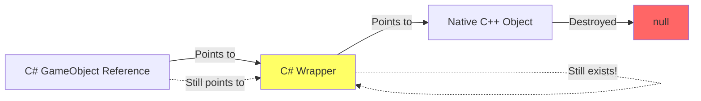

# Unity Null Checks Best Practices

## What Problem Does This Solve?

**The Problem:** In Unity, `if (myObject == null)` and `if (myObject is null)` behave differently
than standard C#. A destroyed GameObject can appear "not null" in C# but "null" in Unity, causing
confusing bugs.

**Why This Happens:** Unity overrides the `==` operator for UnityEngine.Object types to check if the
native C++ object still exists, but C#'s `is null`, `??`, and `?.` operators don't use this
override. This creates a "fake null" problem unique to Unity.

**⚠️ CRITICAL:** The null-conditional (`?.`) and null-coalescing (`??`) operators are **UNSAFE** for Unity objects because they bypass Unity's overloaded null check. Always use explicit `== null` or `!= null` checks instead.

**Real-World Impact:** You check `if (enemy != null)` and it passes, but `enemy.transform` throws
NullReferenceException because the GameObject was actually destroyed.

**The Solution:** Always use `== null` (not `is null`) for Unity objects. This catches 50% of
beginner null reference bugs.

---

## ⚠️ Unity's Fake Null - The Hidden Trap!

**The most important thing to understand**: Unity overrides the `==` operator for
`UnityEngine.Object`, which means `== null` doesn't work the same way as regular C# null checks!

```csharp
GameObject obj = /* destroyed object */;

// These are DIFFERENT in Unity!
if (obj == null)        // ✓ Unity's fake null check (SAFE)
if (obj is null)        // ❌ C# native check (UNSAFE for Unity objects!)
if (ReferenceEquals(obj, null))  // ❌ Native check (UNSAFE!)
```

## Table of Contents

- [The Unity Null Problem](#the-unity-null-problem)
- [When to Use Each Null Check](#when-to-use-each-null-check)
- [Best Practices](#best-practices)
- [Common Pitfalls](#common-pitfalls)
- [Performance Considerations](#performance-considerations)

## The Unity Null Problem

### Why Unity Has "Fake Null"

Unity has a custom null check because:

1. **Unity objects exist in two places**: C# wrapper + native C++ engine
2. **Destroyed objects** aren't immediately collected by C# garbage collector
3. **Scene transitions** can leave "dangling" C# references
4. **Missing references** (like unassigned Inspector fields) need special handling



When you destroy a Unity object, the native C++ object is destroyed, but the C# wrapper still
exists! Unity's `==` operator checks **both** the wrapper and the native object.

### The Three Types of Null

```csharp
// 1. TRUE NULL - Nothing assigned
GameObject obj1 = null;

// 2. FAKE NULL - Destroyed Unity object
GameObject obj2 = new GameObject();
Destroy(obj2);
// obj2 is now "fake null" - C# wrapper exists, native object doesn't

// 3. MISSING REFERENCE - Unassigned in Inspector
[SerializeField] private GameObject obj3;
// If not assigned in Inspector, obj3 is "fake null"
```

## When to Use Each Null Check

### Use `== null` or `!= null` (Unity's Overloaded Operator)

**Always use this for Unity objects!** This is the **ONLY** safe way.

```csharp
// ✓ CORRECT for Unity objects
if (gameObject == null)
    return;

if (myComponent != null)
    myComponent.DoSomething();

// ✓ CORRECT - explicit ternary operator
Transform target = primaryTarget != null ? primaryTarget : secondaryTarget;

// ❌ UNSAFE - null-conditional bypasses Unity's null check!
// rigidbody?.AddForce(Vector3.up);

// ✓ CORRECT - explicit null check
if (rigidbody != null)
    rigidbody.AddForce(Vector3.up);
```

**Use for**: `GameObject`, `Component`, `Transform`, `MonoBehaviour`, `ScriptableObject`,
`Material`, `Texture`, and any other `UnityEngine.Object` derived type.

### Never Use `is null` or `is not null` for Unity Objects

**Pattern matching null checks bypass Unity's operator overload!**

```csharp
GameObject destroyedObj = new GameObject();
Destroy(destroyedObj);

// DANGEROUS - Pattern matching
if (destroyedObj is null)        // ❌ FALSE! (C# wrapper still exists)
if (destroyedObj is not null)    // ❌ TRUE! (But object is destroyed!)

// SAFE - Unity's operator
if (destroyedObj == null)        // ✓ TRUE! (Unity knows it's destroyed)
if (destroyedObj != null)        // ✓ FALSE! (Unity knows it's destroyed)
```

### Never Use `ReferenceEquals` for Unity Objects

```csharp
GameObject obj = someDestroyedObject;

// ❌ UNSAFE - Checks only C# reference
if (ReferenceEquals(obj, null))
    Debug.Log("This might not print even if the object is destroyed!");

// ✓ SAFE - Unity's check
if (obj == null)
    Debug.Log("This correctly detects destroyed objects");
```

### Use Regular C# Checks for Non-Unity Objects

For pure C# objects (not derived from `UnityEngine.Object`), use modern C# patterns:

```csharp
// Pure C# classes
MyDataClass data = GetData();

// ✓ Use modern C# patterns
if (data is null) return;
if (data is not null) DoSomething();

// ✓ Pattern matching
if (data is { IsValid: true })
    ProcessData(data);

// ✓ Null-coalescing assignment
data ??= new MyDataClass();
```

## Best Practices

### 1. Explicit Unity Null Checks

```csharp
// ✓ GOOD - Clear and explicit
if (enemy != null)
{
    enemy.TakeDamage(10);
}

// ✓ GOOD - Guard clause
if (enemy == null)
    return;

enemy.TakeDamage(10);

// ❌ BAD - Null-conditional operator bypasses Unity's null check
// enemy?.TakeDamage(10);
```

### 2. Check Before Every Use After Delays

```csharp
// ✓ GOOD - Check after coroutine yield
private IEnumerator AttackSequence(Enemy enemy)
{
    if (enemy == null) yield break;

    enemy.TakeDamage(10);
    yield return new WaitForSeconds(1f);

    // ⚠️ Enemy might be destroyed during wait!
    if (enemy == null) yield break;  // Check again!

    enemy.TakeDamage(10);
}

// ⚠️ BE CAREFUL WITH async Task - Check after async operation (this should only be used with frameworks like UniTask)
private async Task ProcessTarget(GameObject target)
{
    if (target == null) return;

    await Task.Delay(1000);

    // ⚠️ Target might be destroyed during delay!
    if (target == null) return;  // Check again!

    target.transform.position = Vector3.zero;
}
```

### 3. Avoid Null-Conditional Operators for Unity Objects

```csharp
// ❌ BAD - Null-conditional bypasses Unity's null check
// rigidbody?.AddForce(Vector3.up);

// ✓ GOOD - Explicit null check
if (rigidbody != null)
    rigidbody.AddForce(Vector3.up);

// ❌ BAD - Chained null-conditional bypasses Unity's null check
// enemy?.GetComponent<Health>()?.TakeDamage(10);

// ✓ GOOD - Explicit checks
if (enemy != null)
{
    Health health = enemy.GetComponent<Health>();
    if (health != null)
        health.TakeDamage(10);
}

// ❌ BAD - Null-coalescing bypasses Unity's null check
// Transform target = primaryTarget ?? secondaryTarget ?? transform;

// ✓ GOOD - Explicit null checks with ternary operator
Transform target = primaryTarget != null ? primaryTarget
    : (secondaryTarget != null ? secondaryTarget : transform);

// ✓ BETTER - More readable version
Transform target;
if (primaryTarget != null)
    target = primaryTarget;
else if (secondaryTarget != null)
    target = secondaryTarget;
else
    target = transform;
```

### 4. Check Components After GetComponent

```csharp
// ✓ GOOD - Always check GetComponent results
Rigidbody rb = GetComponent<Rigidbody>();
if (rb != null)
{
    rb.AddForce(Vector3.up * 10);
}

// ✓ BETTER - Use TryGetComponent
if (TryGetComponent<Rigidbody>(out var rb))
{
    rb.AddForce(Vector3.up * 10);
}

// ❌ BAD - Null-conditional bypasses Unity's null check
// GetComponent<Rigidbody>()?.AddForce(Vector3.up * 10);
```

### 5. Validate Inspector References in Awake/Start

```csharp
[SerializeField] private Transform target;
[SerializeField] private AudioSource audioSource;

private void Awake()
{
    // ✓ GOOD - Validate required references
    if (target == null)
    {
        Debug.LogError($"Target not assigned on {gameObject.name}!", this);
    }

    if (audioSource == null)
    {
        Debug.LogError($"AudioSource not assigned on {gameObject.name}!", this);
    }
}

// ✓ BETTER - Use RequireComponent for components
[RequireComponent(typeof(Rigidbody))]
public class PhysicsObject : MonoBehaviour
{
    private Rigidbody rb;

    private void Awake()
    {
        // Guaranteed to exist thanks to RequireComponent
        rb = GetComponent<Rigidbody>();
    }
}
```

### 6. Use Assertions in Development

```csharp
using UnityEngine.Assertions;

private void Start()
{
    // ✓ GOOD - Assertions for development
    Assert.IsNotNull(target, "Target must be assigned!");
    Assert.IsNotNull(audioSource, "AudioSource must be assigned!");

    // These only run in development builds
    // Stripped from release builds
}
```

## Common Pitfalls

### Pitfall 1: Using `is null` Pattern Matching

```csharp
GameObject obj = someDestroyedObject;

// ❌ WRONG - Pattern matching bypasses Unity's null check
if (obj is null)
    return;

if (obj is not null)
    obj.SetActive(true);

// ✓ CORRECT - Use Unity's operator
if (obj == null)
    return;

if (obj != null)
    obj.SetActive(true);
```

### Pitfall 2: Not Checking After Delays

```csharp
// ❌ BAD - No check after delay
private IEnumerator DamageOverTime(Enemy enemy)
{
    for (int i = 0; i < 5; i++)
    {
        enemy.TakeDamage(10);  // ☠️ Might be null after first iteration!
        yield return new WaitForSeconds(1f);
    }
}

// ✓ GOOD - Check every iteration
private IEnumerator DamageOverTime(Enemy enemy)
{
    for (int i = 0; i < 5; i++)
    {
        if (enemy == null)  // ✓ Check before use
            yield break;

        enemy.TakeDamage(10);
        yield return new WaitForSeconds(1f);
    }
}
```

### Pitfall 3: Caching Without Null Checks

```csharp
// ❌ BAD - Cached reference might become invalid
public class CachedReference : MonoBehaviour
{
    private Transform target;

    private void Start()
    {
        target = GameObject.FindGameObjectWithTag("Player").transform;
    }

    private void Update()
    {
        // ☠️ Player might have been destroyed!
        transform.LookAt(target);
    }
}

// ✓ GOOD - Validate cached references
public class SafeCachedReference : MonoBehaviour
{
    private Transform target;

    private void Start()
    {
        GameObject player = GameObject.FindGameObjectWithTag("Player");
        if (player != null)
            target = player.transform;
    }

    private void Update()
    {
        // ✓ Check before use
        if (target != null)
            transform.LookAt(target);
    }
}

// ✓ BETTER - Re-find if missing
public class ResilientReference : MonoBehaviour
{
    private Transform target;

    private void Update()
    {
        // ✓ Auto-recover if target is destroyed and recreated
        if (target == null)
        {
            // ⚠️ FindGameObjectWithTag is expensive - ideally this is done via a faster lookup operation
            GameObject player = GameObject.FindGameObjectWithTag("Player");
            if (player != null)
                target = player.transform;
        }

        if (target != null)
            transform.LookAt(target);
    }
}
```

### Pitfall 4: Comparing Unity Objects with ReferenceEquals

```csharp
GameObject a = GetGameObject();
GameObject b = GetGameObject();

// ❌ WRONG - ReferenceEquals doesn't use Unity's override
if (ReferenceEquals(a, b))
    Debug.Log("Same");

// ❌ WRONG - Doesn't detect destroyed objects
if (!ReferenceEquals(a, null))
    a.SetActive(true);

// ✓ CORRECT - Use Unity's operator
if (a == b)
    Debug.Log("Same");

// ✓ CORRECT - Detects destroyed objects
if (a != null)
    a.SetActive(true);
```

### Pitfall 5: Not Checking FindObjectOfType Results

```csharp
// ❌ BAD - Doesn't check if found
private void Start()
{
    GameManager manager = FindObjectOfType<GameManager>();
    manager.RegisterPlayer(this);  // ☠️ NullReferenceException if not found!
}

// ✓ GOOD - Always check Find results
private void Start()
{
    GameManager manager = FindObjectOfType<GameManager>();
    if (manager != null)
    {
        manager.RegisterPlayer(this);
    }
    else
    {
        Debug.LogError("GameManager not found in scene!");
    }
}

// ❌ BAD - Null-conditional bypasses Unity's null check
// FindObjectOfType<GameManager>()?.RegisterPlayer(this);

// ✓ BETTER - Explicit check
private void Start()
{
    GameManager manager = FindObjectOfType<GameManager>();
    if (manager != null)
        manager.RegisterPlayer(this);
}
```

### Pitfall 6: Accessing Components on Destroyed GameObjects

```csharp
// ❌ BAD - GameObject might be destroyed
public class BadComponentAccess : MonoBehaviour
{
    private Enemy enemy;

    private void Update()
    {
        if (enemy != null)
        {
            // ☠️ Even if enemy isn't null, its components might be!
            enemy.GetComponent<Health>().TakeDamage(1);
        }
    }
}

// ✓ GOOD - Check the component too
public class SafeComponentAccess : MonoBehaviour
{
    private Enemy enemy;

    private void Update()
    {
        if (enemy != null)
        {
            Health health = enemy.GetComponent<Health>();
            if (health != null)
            {
                health.TakeDamage(1);
            }
        }
    }
}

// ❌ BAD - Null-conditional chaining bypasses Unity's null check
// public class BadComponentAccess : MonoBehaviour
// {
//     private Enemy enemy;
//
//     private void Update()
//     {
//         enemy?.GetComponent<Health>()?.TakeDamage(1);
//     }
// }

// ✓ BETTER - Cache the Health component
public class BetterComponentAccess : MonoBehaviour
{
    private Enemy enemy;
    private Health enemyHealth;

    private void CacheEnemy(Enemy newEnemy)
    {
        enemy = newEnemy;
        enemyHealth = enemy != null ? enemy.GetComponent<Health>() : null;
    }

    private void Update()
    {
        if (enemyHealth != null)
        {
            enemyHealth.TakeDamage(1);
        }
    }
}
```

## Performance Considerations

### Unity's Null Check Has Overhead

Unity's `==` operator is **slower** than native C# null checks because it:

1. Calls into native C++ code
2. Checks both the C# wrapper and native object
3. Handles special cases (destroyed objects, missing references)

```csharp
// Slower (but NECESSARY for Unity objects)
if (transform != null)  // ~10-20x slower than native check
    DoSomething();

// Faster (but ONLY safe for pure C# objects)
if (myDataClass != null)  // Native C# speed
    DoSomething();
```

### Cache References When Possible

```csharp
// ❌ BAD - Repeated GetComponent calls
private void Update()
{
    if (GetComponent<Rigidbody>() != null)
        GetComponent<Rigidbody>().AddForce(Vector3.up);
}

// ✓ GOOD - Cache component references
private Rigidbody rb;

private void Awake()
{
    rb = GetComponent<Rigidbody>();
}

private void Update()
{
    if (rb != null)
        rb.AddForce(Vector3.up);
}
```

### Avoid Null Checks in Hot Paths

```csharp
// ❌ BAD - Unnecessary null check every frame
private Transform target;  // Assigned in Awake, never null

private void Update()
{
    if (target != null)  // Wasteful check
        transform.LookAt(target);
}

// ✓ GOOD - Only check when necessary
private Transform target;

private void Awake()
{
    target = GameObject.FindGameObjectWithTag("Player").transform;

    if (target == null)
    {
        Debug.LogError("Player not found!");
        enabled = false;  // Disable this component
    }
}

private void Update()
{
    // No null check needed - validated in Awake (assuming target has not been destroyed, depends on game logic)
    transform.LookAt(target);
}
```

### Use TryGetComponent to Avoid Double Lookups

```csharp
// ❌ LESS EFFICIENT - GetComponent called twice
Rigidbody rb = GetComponent<Rigidbody>();
if (rb != null)
    rb.AddForce(Vector3.up);

// ✓ MORE EFFICIENT - Single lookup + null check
if (TryGetComponent<Rigidbody>(out var rb))
    rb.AddForce(Vector3.up);
```

## Quick Reference

### Safe Null Checks for Unity Objects

```csharp
// ✓ Use these:
if (obj == null) return;
if (obj != null) DoSomething();
Transform t = obj1 != null ? obj1 : (obj2 != null ? obj2 : obj3);
```

### Unsafe Null Checks for Unity Objects

```csharp
// ❌ DON'T use these:
if (obj is null) return;           // Pattern matching bypasses Unity's null check
if (obj is not null) DoSomething(); // Pattern matching bypasses Unity's null check
if (ReferenceEquals(obj, null))    // Reference check bypasses Unity's null check
obj?.DoSomething();                // Null-conditional bypasses Unity's null check
Transform t = obj1 ?? obj2;        // Null-coalescing bypasses Unity's null check
```

### Safe for Pure C# Objects

```csharp
// ✓ Use modern C# for non-Unity objects:
if (data is null) return;
if (data is not null) DoSomething();
if (data is { IsValid: true }) Process();
data ??= new MyClass();
```

## Deep Dive: Why Null-Conditional Operators Fail

This section expands on rule #4 above - why `?.` and `??` are particularly dangerous with Unity objects.

### The Technical Reason

Unity's `Destroy()` tears down the native C++ object but leaves the managed C# wrapper alive. C#'s null-conditional (`?.`) and null-coalescing (`??`) operators check the managed wrapper only, so they silently bypass Unity's overloaded equality operators. The result: code that looks safe still throws exceptions or chooses destroyed objects.

**How it breaks down:**

1. Unity objects are managed wrappers around native C++ instances
2. `Destroy()` removes the native side, leaving the managed wrapper orphaned
3. Unity overrides `==`/`!=` to report destroyed objects as `null`
4. `?.` and `??` ignore operator overloads; they use raw reference null checks

### Real Bug Examples

```csharp
// Destroyed GameObject still passes the C# null-conditional check
GameObject player = destroyedGameObject;
Vector3? position = player?.transform.position; // ☠️ Throws NullReferenceException

Transform target = destroyedTransform ?? fallback; // ☠️ Returns destroyedTransform (which is broken)
```

```csharp
public class PlayerController : MonoBehaviour
{
    [SerializeField] private GameObject target;
    [SerializeField] private Transform defaultTarget;

    private void Update()
    {
        // ❌ Looks safe, but target?.transform throws when the enemy was destroyed
        Transform finalTarget = target?.transform ?? defaultTarget;

        // ✓ Safe version: rely on Unity's operator overload instead
        Transform resolved = target != null ? target.transform : defaultTarget;
    }
}
```

### Prevention Tips

1. **Document the rule** in your team style guide and code reviews
2. **Consider an analyzer** that flags `?.` or `??` when the receiver derives from `UnityEngine.Object`
3. **Add unit tests** around systems where destroyed objects are common (object pooling, combat, async callbacks)
4. **Cache references** after a null check if you need to reuse them

## Summary

**Golden Rules for Unity Null Checks:**

1. **Always use `== null` or `!= null`** for Unity objects
2. **Never use `is null` or `is not null`** for Unity objects (pattern matching)
3. **Never use `ReferenceEquals`** for Unity objects
4. **Never use `?.` or `??`** for Unity objects (null-conditional/coalescing)
5. **Always check after delays** (coroutines, async, animations)
6. **Validate Inspector references** in Awake/Start
7. **Use TryGetComponent** for efficiency
8. **Cache component references** in Awake/Start

**Remember**: Unity's null checking is weird, but it exists for good reason. The `?.` and `??`
operators look convenient but they bypass Unity's overloaded null check, making them dangerous for
Unity objects. Always use explicit `== null` or `!= null` checks for Unity objects!
