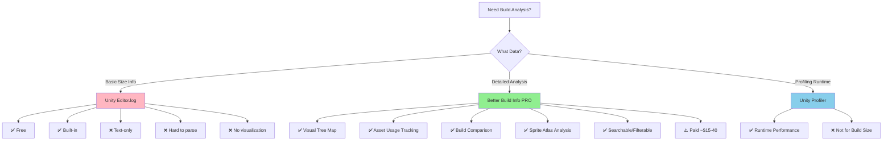

# Better Build Info PRO - Report Tool

> **See inside your build.** Get detailed, actionable insights about what's in your Unity build, how
> much space it takes, and where every byte goes—all in an intuitive interface.

Better Build Info PRO is Unity's most advanced build analysis tool. It answers the critical
questions: "Why is my build so large?", "What changed between versions?", and "Where are my assets
being used?" With visual tree maps, detailed asset tracking, and comprehensive reports, it
transforms build optimization from guesswork into data-driven decisions.

---

## 🚀 Quick Start (30 Seconds)

```
1. Build your project (File → Build Settings → Build)
2. After build completes: Window → Better Build Info
3. See detailed breakdown of your build:
   - Asset sizes
   - Scene contents
   - Sprite atlas usage
   - Code size
   - Everything!
```

**That's it.** Better Build Info automatically captures build reports. No configuration needed.

---

## 📚 Documentation Overview

This documentation is for Unity developers of all skill levels—from solo indies optimizing their
first mobile game to large studios managing complex multi-platform builds.

---

## 🎯 What Problems Does Better Build Info PRO Solve?

### Problem #1: "Why Is My Build So Large?"

**Without Better Build Info PRO:**

```
Your mobile APK is 250MB. App stores recommend < 150MB.

Questions you can't easily answer:
❓ What are the largest files?
❓ Which scenes contribute most?
❓ Are my textures too large?
❓ What's in "Shared Assets"?
❓ Which sprite atlases are bloated?

You're stuck guessing:
❌ "Maybe the textures?"
❌ "Probably the audio?"
❌ "Let's try compressing everything?"

Result: Random optimizations that might not help
```

**With Better Build Info PRO:**

```
Open Better Build Info → See immediately:
✅ Top 20 largest assets (with exact sizes)
✅ Tree map showing relative sizes visually
✅ Texture resolution and format breakdown
✅ Audio clip sizes and compression
✅ Scene-by-scene size breakdown
✅ Sprite atlas contents and sizes

Result: Target the actual problems, reduce build by 30-50%
```

### Problem #2: "What Changed Between Builds?"

**Scenario:** Build size jumped from 100MB to 150MB. What happened?

**Without Better Build Info PRO:**

```
❌ Compare builds manually (impossible)
❌ Check git log (doesn't show size impact)
❌ Guess which assets were added
❌ Hope you remember what changed
❌ Spend hours investigating

Time wasted: 4-8 hours
```

**With Better Build Info PRO:**

```
1. Open Build Report Comparison
2. Select previous build and current build
3. See exact differences:
   ✅ "New texture: LargeSplash.png → +15MB"
   ✅ "Scene3 grew by 8MB (added new models)"
   ✅ "Audio compressed better → -2MB"

Time to find issue: < 5 minutes
```

### Problem #3: "Where Are My Assets Being Used?"

**Scenario:** A 10MB texture is in your build. Is it even being used?

**Without Better Build Info PRO:**

```
❌ Unity build report shows the file exists
❌ Doesn't show WHERE it's used
❌ Can't tell if it's critical or wasteful
❌ Scared to remove it (might break something)

Result: Bloated builds full of "maybe important" assets
```

**With Better Build Info PRO:**

```
✅ Click on the texture in Better Build Info
✅ See exact usage:
   - "Used in Scene: MainMenu.unity"
   - "Referenced by Material: UI_Background.mat"
   - "Included in Sprite Atlas: UI_Common"
✅ Make informed decision (remove, optimize, or keep)

Result: Confident optimization decisions
```

---

## 💡 Why Better Build Info PRO Exists

Unity's built-in build report (Editor.log) is primitive:

| Capability             | Unity Built-in      | Better Build Info PRO |
| ---------------------- | ------------------- | --------------------- |
| View asset sizes       | ✅ Yes (Editor.log) | ✅ Yes (GUI)          |
| Visual tree map        | ❌ No               | ✅ Yes                |
| Asset usage tracking   | ❌ No               | ✅ Yes                |
| Sprite atlas breakdown | ❌ No               | ✅ Yes                |
| Compare builds         | ❌ No               | ✅ Yes                |
| Asset properties       | ⚠️ Limited          | ✅ 25+ properties     |
| Scene size breakdown   | ⚠️ Limited          | ✅ Detailed           |
| Export reports         | ⚠️ Text log only    | ✅ XML (diffable)     |
| Search/filter assets   | ❌ No               | ✅ Yes                |
| Group by type/folder   | ❌ No               | ✅ Yes                |
| Non-technical friendly | ❌ No               | ✅ Yes (tree map)     |

**Unity's Editor.log:**

```
Built player successfully!
Time elapsed: 47.234 seconds
Total size: 142.3 MB

Textures: 45.2 MB
Meshes: 23.1 MB
Audio: 18.5 MB
...
(scrolling through 10,000 lines of text)
```

**Better Build Info PRO:**

```
Interactive GUI with:
- Searchable list of all assets
- Visual tree map (see sizes at a glance)
- Click any asset → see details
- Filter by type, size, usage
- Compare any two builds
- Export to XML for version control
```

---

## 🤝 Comparison: Better Build Info PRO vs Free Alternatives

### Better Build Info PRO

✅ Comprehensive feature set ✅ Visual tree map (best in class) ✅ Asset usage tracking ✅ Sprite
atlas analysis ✅ Build comparison ✅ 25+ asset properties ✅ Great support ⚠️ Costs $30-40

---

## Free Alternatives

### 1. Build Report Inspector (Unity Technologies)

**Cost:** Free & Open Source **Source:**
[GitHub](https://github.com/Unity-Technologies/BuildReportInspector)

**What it does:** Official Unity editor script that adds visual inspector UI for BuildReport data,
showing build time profiling and size analysis

**Installation:**

```
1. Clone or download from GitHub
2. Unity Package Manager → Add package from disk
3. Select package.json in com.unity.build-report-inspector folder
```

**Pros:**

- ✅ Free and open source
- ✅ Official Unity package
- ✅ Works with Unity 6 and recent versions
- ✅ Direct integration with Unity's BuildReport API
- ✅ Cross-platform (works on Windows, Mac, Linux)
- ✅ Visual charts for build time and size

**Cons:**

- ❌ Less feature-rich than Better Build Info
- ❌ No asset usage tracing across scenes
- ❌ No tree map visualization
- ❌ Limited asset property analysis
- ❌ No sprite atlas breakdown
- ❌ No build comparison feature
- ⚠️ No longer in Package Manager (install manually from GitHub)

**Best for:** Developers wanting basic build analysis without cost, or teams with tight budgets

---

### 2. Unity Size Explorer

⚠️ Unmaintained

**Cost:** Free & Open Source **Source:**
[GitHub](https://github.com/aschearer/unitysizeexplorer)

**What it does:** Standalone Windows application that parses Unity's build log to show tree view
and pie charts of asset sizes

**How it works:**

```
1. Build your Unity project
2. Copy Editor.log file (clear it before building for best results)
3. Open Unity Size Explorer
4. Load the log file
5. See folder hierarchy tree view and pie chart
```

**Pros:**

- ✅ Free and open source
- ✅ Good folder hierarchy visualization
- ✅ Interactive filtering for "what-if" analysis
- ✅ No need to rebuild to test exclusions
- ✅ Pie chart shows relative sizes visually
- ✅ Click to expand/collapse folders

**Cons:**

- ❌ **Windows-only** (WPF/.NET 4.5.2)
- ❌ Requires manual log file clearing before builds
- ❌ Can be sluggish with many small files
- ❌ No asset usage tracing
- ❌ No sprite atlas analysis
- ❌ Standalone app (not integrated in Unity Editor)
- ❌ No build comparison

**Best for:** Windows users wanting visual size analysis without installing editor plugins

**Workaround for performance:** Use the filter to hide assets below a size threshold (e.g., hide
files < 100KB)

---

### 3. Manual BuildReport API Approach

**Cost:** Free (built into Unity)

**What it does:** Write custom editor scripts using Unity's
`UnityEditor.Build.Reporting.BuildReport` class

**Example usage:**

```csharp
using UnityEditor;
using UnityEditor.Build.Reporting;

public class CustomBuildReport : IPostprocessBuildWithReport
{
    public int callbackOrder => 0;

    public void OnPostprocessBuild(BuildReport report)
    {
        Debug.Log($"Build size: {report.summary.totalSize} bytes");
        Debug.Log($"Build time: {report.summary.totalTime}");

        foreach (var file in report.files)
        {
            Debug.Log($"{file.path}: {file.size} bytes");
        }
    }
}
```

**Pros:**

- ✅ Completely free (built into Unity)
- ✅ Full control and customization
- ✅ Can integrate with your specific workflow
- ✅ Can automate in CI/CD pipelines
- ✅ Export to any format you want

**Cons:**

- ❌ Requires programming knowledge (C#)
- ❌ Time investment to build tooling
- ❌ No pre-built visualizations
- ❌ Must build everything yourself
- ❌ Maintenance burden

**Best for:** Programmers who want custom analysis or teams with specific automation needs

---

### 4. Unity Editor.log

**Cost:** Free (built-in)

**What it does:** Unity automatically logs build information to Editor.log file

**Location:**

- Windows: `%LOCALAPPDATA%\Unity\Editor\Editor.log`
- Mac: `~/Library/Logs/Unity/Editor.log`
- Linux: `~/.config/unity3d/Editor.log`

**Pros:**

- ✅ Free
- ✅ Built-in (always available)
- ✅ No setup required

**Cons:**

- ❌ Text-only (hard to parse)
- ❌ No visualization
- ❌ No search/filter
- ❌ No comparison
- ❌ Mixed with other log messages

**Best for:** Quick checks or when no other tools are available

---

## Comparison Table

| Feature                   | Better Build Info PRO | Build Report Inspector | Unity Size Explorer | Manual API | Editor.log |
| ------------------------- | --------------------- | ---------------------- | ------------------- | ---------- | ---------- |
| **Price**                 | $30-40                | Free                   | Free                | Free       | Free       |
| Visual tree map           | ✅ Best in class      | ❌                     | ⚠️ Folder tree      | ❌         | ❌         |
| Asset usage tracking      | ✅                    | ❌                     | ❌                  | ⚠️ DIY     | ❌         |
| Sprite atlas breakdown    | ✅                    | ❌                     | ❌                  | ⚠️ DIY     | ❌         |
| Build comparison          | ✅                    | ❌                     | ❌                  | ⚠️ DIY     | ❌         |
| Asset properties (25+)    | ✅                    | ⚠️ Limited             | ❌                  | ⚠️ DIY     | ❌         |
| Search/filter             | ✅                    | ⚠️ Basic               | ⚠️ Size filter      | ⚠️ DIY     | ❌         |
| Editor integration        | ✅                    | ✅                     | ❌ Standalone       | ✅         | ⚠️ File    |
| Cross-platform            | ✅                    | ✅                     | ❌ Windows only     | ✅         | ✅         |
| Ease of use               | ✅ Excellent          | ⚠️ Basic               | ⚠️ Moderate         | ❌ Hard    | ❌ Hard    |
| Non-technical friendly    | ✅                    | ⚠️ Somewhat            | ⚠️ Somewhat         | ❌         | ❌         |
| CI/CD automation          | ⚠️ Possible           | ⚠️ Possible            | ❌                  | ✅         | ✅         |
| Time to get insights      | < 1 minute            | ~2 minutes             | ~5 minutes          | Hours      | 10+ min    |
| Maintenance               | None (paid support)   | None (official)        | None (OSS)          | High       | None       |
| **Recommendation**        | **Best overall**      | **Best free option**   | **Windows viz**     | **Custom** | **Backup** |

---

## Which Should You Choose?

### Choose Better Build Info PRO if:

- 💰 You have budget ($30-40)
- ⏰ Time is valuable (saves hours per optimization task)
- 📊 You need comprehensive analysis (usage tracking, sprite atlases, comparison)
- 👥 Working with non-technical stakeholders (tree map is perfect)
- 🎮 Shipping mobile/console games (size limits matter)

**ROI:** Pays for itself in 1-2 hours of saved time

---

### Choose Build Report Inspector if:

- 💵 Zero budget
- ✅ Basic size analysis is sufficient
- 🔧 Comfortable with manual GitHub installation
- 🖥️ Need cross-platform support
- 📈 Want official Unity tool

**Best free alternative for most users**

---

### Choose Unity Size Explorer if:

- 💵 Zero budget
- 🪟 Windows-only is okay
- 📊 Want visual tree/pie charts
- 🔄 Don't need editor integration
- 🎯 Focus is on folder-level analysis

**Best for Windows users wanting free visualization**

---

### Choose Manual BuildReport API if:

- 💻 Strong C# programming skills
- 🤖 Need custom CI/CD integration
- 🎨 Want specific analysis features
- ⏱️ Have time to build tooling
- 🔧 Need full control

**Best for programmers with specific needs**

---

### Choose Editor.log if:

- 🆘 No other options available
- 🔍 Quick one-time check
- 📝 Comfortable parsing text logs
- ⚡ Need immediate answer (no install time)

**Last resort option**

---

## Verdict

**Better Build Info PRO** is the gold standard for Unity build analysis. However, **Build Report
Inspector** is an excellent free alternative for basic needs, and **Unity Size Explorer** provides
good visualization for Windows users.

For most developers, start with **Build Report Inspector** (free). If you find yourself spending
hours analyzing builds or need advanced features, upgrade to **Better Build Info PRO**—it will pay
for itself quickly.

---

## 🔥 How to Use It

### Basic Usage: View Your Build Report

```
Step 1: Build your project
   File → Build Settings → Build
   (or Build and Run)

Step 2: Open Better Build Info
   Window → Better Build Info → Open

Step 3: The report loads automatically showing:
   ├─ Overview (total size, breakdown by type)
   ├─ Assets List (all files with sizes)
   ├─ Tree Map (visual size representation)
   ├─ Scenes (scene-by-scene breakdown)
   └─ Details (selected asset info)

Step 4: Explore!
   - Click assets to see details
   - Sort by size (largest first)
   - Filter by type (textures, audio, etc.)
   - Search for specific assets
```

### Advanced Usage: Tree Map Visualization

The **Tree Map** is the most powerful feature for non-technical stakeholders.

```
What is a tree map?
- Visual representation where size = area
- Each rectangle = one asset
- Larger rectangles = larger files
- Color-coded by type (blue = textures, green = audio, etc.)

How to use it:
1. Open Better Build Info → Tree Map tab
2. See your entire build at a glance
3. Spot problems immediately:
   ❗ Huge rectangle? → Large asset to optimize
   ❗ Many medium rectangles? → Many assets to batch
   ❗ Unexpected large area? → Investigate

Example:
  You see a massive red rectangle labeled "ExplosionSound.wav"
  → That's 25MB of audio (uncompressed)
  → Compress it → Save 23MB

Time to identify: 5 seconds (vs 30 minutes manually)
```

### Advanced Usage: Sprite Atlas Analysis

**Problem:** Your UI sprite atlas is 10MB. Is that normal?

```
Step 1: Open Better Build Info
Step 2: Navigate to Sprite Atlases section
Step 3: Click your atlas
Step 4: See breakdown:
   - Total atlas size: 10MB
   - Number of sprites: 247
   - Average sprite size: 41KB
   - Largest sprites: [list]
   - Wasted space: 15% (empty areas in atlas)

Step 5: Identify issues:
   ✅ One sprite is 2MB (accidental 4K texture)
   ✅ 50 sprites are duplicates
   ✅ Atlas has 15% wasted space (bad packing)

Step 6: Fix:
   - Resize the 4K texture to 512x512 → Save 1.5MB
   - Remove duplicates → Save 2MB
   - Adjust atlas settings → Save 1MB
   Total saved: 4.5MB (45% reduction!)
```

### Advanced Usage: Build Comparison

**Problem:** Build size increased by 20MB. What changed?

```
Step 1: Better Build Info → Compare Builds
Step 2: Select "Previous Build" (from your archives)
Step 3: Select "Current Build" (latest)
Step 4: See differences:

ADDED ASSETS:
  + NewCharacter.fbx → +8MB
  + NewCharacterTexture.png → +6MB
  + NewLevel.unity → +4MB

REMOVED ASSETS:
  - OldDebugTexture.png → -2MB

MODIFIED ASSETS:
  ± MainMenu.unity → +3MB (what was added?)
  ± UI_Atlas → +1MB (new sprites added)

Total change: +20MB

Step 5: Investigate:
  - NewCharacter → Expected (new feature)
  - NewCharacterTexture → Can we compress this?
  - MainMenu.unity → Why did it grow? Investigate.

Result: Found the cause in 5 minutes
```

---

## ⚠️ Pitfalls & Limitations

### Pitfall #1: Scene Sizes Unavailable on Some Platforms

**Problem:** Better Build Info shows "Scene sizes not available" for your platform.

**Cause:** Unity doesn't expose scene sizes for all platforms (notably WebGL and some consoles).

**Solution:**

```
✅ Scene sizes work on: Windows, Mac, Linux, iOS, Android
❌ Scene sizes don't work on: WebGL, some consoles

Workaround:
1. Build for a supported platform (e.g., Windows)
2. Use that report to analyze scene sizes
3. Apply optimizations
4. Build for your actual platform
5. Verify total size improved
```

### Pitfall #2: Build Reports Can Get Large

**Problem:** Better Build Info stores reports as XML files. Large projects = large files
(50-100MB+).

**Solution:**

```
✅ Keep only recent reports (e.g., last 10 builds)
✅ Don't commit report files to version control (too large)
✅ Use .gitignore to exclude:
   Library/BetterBuildInfo/
   BuildReports/
✅ Archive old reports externally if needed for historical analysis
```

### Pitfall #3: First-Time Setup Can Be Confusing

**Problem:** After installing, you don't see any reports.

**Cause:** Better Build Info only captures reports from builds made **after** installation.

**Solution:**

```
Step 1: Install Better Build Info PRO
Step 2: Build your project (any platform)
Step 3: Open Better Build Info → Report appears
Step 4: Future builds are captured automatically

Note: Can't analyze builds made before installation
```

### Pitfall #4: Asset Properties Require Pro Version

**Problem:** You want to see texture formats, resolutions, etc., but they're not showing.

**Cause:** Detailed asset properties (25+ properties) are a PRO feature.

**Solution:**

```
Free version: Basic size information
PRO version: Full asset properties:
  - Texture: Format, resolution, compression, mip maps
  - Mesh: Vertex count, triangle count, read/write enabled
  - Audio: Compression format, quality, channels
  - And 20+ more properties

If you need detailed analysis → Upgrade to PRO
If basic sizes are enough → Free version is fine
```

### Pitfall #5: "Shared Assets" Category Is Opaque

**Problem:** Unity reports 30MB in "Shared Assets". What is that?

**Cause:** Unity bundles assets used across multiple scenes into "Shared Assets". This is Unity's
behavior, not Better Build Info's.

**Solution:**

```
What are Shared Assets?
- Assets used by 2+ scenes
- Unity automatically shares them to save space
- Better Build Info shows which assets are shared

How to analyze:
1. Open Better Build Info
2. Filter by "Shared Assets"
3. See which assets Unity is sharing
4. Optimize those assets (they impact multiple scenes)

This is actually helpful—optimize shared assets for maximum impact!
```

---

## 🎓 Learning Path

### Beginner (10 minutes)

1. Install Better Build Info PRO from
   [Unity Asset Store](https://assetstore.unity.com/packages/tools/utilities/better-build-info-pro-report-tool-72579)
2. Build your project
3. Open Window → Better Build Info
4. Explore the Overview tab
5. Click on your largest asset
6. View its details

### Intermediate (30 minutes)

1. Open the Tree Map tab and identify your top 10 largest assets
2. For each large asset, determine if it can be optimized
3. Try the Sprite Atlas analysis feature
4. Search for specific asset types (e.g., all .png files)
5. Filter by size (e.g., only assets > 1MB)

### Advanced (1 hour)

1. Build your project twice (before and after a change)
2. Use Build Comparison to see differences
3. Set up a workflow: Build → Analyze → Optimize → Repeat
4. Export a report to XML and review the format
5. Create project guidelines based on your findings
6. Train your team on using Better Build Info
7. Combine with [Asset Usage Finder](../asset-usage-finder/README.md) for deeper analysis

---

## 📊 Comparison Chart



---

## 🔍 Real-World Use Cases

### Use Case 1: Mobile Game APK Reduction

```
Problem: Android APK is 230MB. Google Play recommends < 150MB.

Workflow with Better Build Info PRO:
1. Build game → Open Better Build Info
2. Sort assets by size (largest first)
3. Findings:
   - 45MB: Uncompressed audio files
   - 30MB: 4K UI textures (overkill for mobile)
   - 25MB: Debug textures accidentally included
   - 20MB: Duplicate assets in different folders
   - 15MB: Unused imported assets (use [Asset Usage Finder](../asset-usage-finder/README.md) to verify)

4. Optimizations:
   - Compress audio to OGG Vorbis → Save 35MB
   - Resize UI textures to 1K → Save 25MB
   - Remove debug textures → Save 25MB
   - Deduplicate assets → Save 20MB
   - Delete unused assets → Save 15MB

5. Result: APK reduced to 110MB (52% reduction!)

Time spent: 3 hours
Time saved vs. manual analysis: 20+ hours
```

### Use Case 2: Understanding Build Growth

```
Problem: Last week's build was 180MB. Today's is 210MB. What happened?

Workflow:
1. Better Build Info → Compare Builds
2. Select last week's build vs. today's build
3. Results:
   ADDED:
   + NewBoss.fbx → +12MB
   + NewBossTextures.png → +8MB
   + NewLevel_5.unity → +10MB

   MODIFIED:
   ± MainMenu.unity → +5MB
   ± UI_Atlas → +3MB

4. Investigation:
   - NewBoss assets → Expected (new content)
   - MainMenu growth → Not expected! Investigate.
     → Found: Accidentally added 4K background image
     → Solution: Replace with 1K version → Save 4MB
   - UI_Atlas → New UI elements (expected)

5. Result: Identified accidental bloat, reduced to 205MB

Time to identify issue: 10 minutes
```

### Use Case 3: Pre-Release Optimization

```
Problem: Submitting to console platform. Build must be < 8GB.

Workflow:
1. Build game → 9.2GB (over limit!)
2. Open Better Build Info → Tree Map view
3. Spot massive red area → "Cinematics" folder
4. Click to investigate:
   - 1.2GB: Cinematic_Intro.mp4 (uncompressed)
   - 0.8GB: Cinematic_Ending.mp4 (uncompressed)
   - 0.6GB: Tutorial.mp4 (uncompressed)

5. Optimization:
   - Re-encode cinematics with H.264 at lower bitrate
   - Result: 1.2GB → 200MB, 0.8GB → 150MB, 0.6GB → 100MB
   - Total saved: 2.15GB

6. Final build: 7.05GB (under limit!)

Without Better Build Info: Would have guessed, possibly optimized wrong assets
```

---

<a id="workflow"></a>

## Workflow Integration

### Daily Development

```
✅ After major feature additions:
   1. Build project
   2. Check Better Build Info
   3. Verify build size is reasonable
   4. Catch problems early

✅ Before committing large assets:
   1. Build with new assets
   2. Compare builds (before/after)
   3. Verify size increase is acceptable
   4. Commit with confidence
```

### Weekly Reviews

```
✅ Team meeting agenda:
   1. Review build size trends
   2. Show Better Build Info tree map to team
   3. Identify top 5 opportunities for optimization
   4. Assign optimization tasks
   5. Track progress week-over-week
```

### Pre-Release Checklist

```
✅ One week before release:
   1. Build release candidate
   2. Full Better Build Info analysis
   3. Create optimization task list
   4. Prioritize high-impact optimizations
   5. Re-build and verify

✅ Day before release:
   1. Final build
   2. Compare with previous release
   3. Verify no unexpected size increases
   4. Archive build report for reference
```

---

## 🔗 External Resources

- **[Unity Asset Store - Better Build Info PRO](https://assetstore.unity.com/packages/tools/utilities/better-build-info-pro-report-tool-72579)**
  — Official PRO version
- **[Unity Asset Store - Better Build Info](https://assetstore.unity.com/packages/tools/utilities/better-build-info-report-tool-70329)**
  — Standard version
- **[Unity Forum Thread](https://discussions.unity.com/t/released-better-build-info-an-in-depth-look-at-build-and-assets/639350)**
  — Community discussion
- **[Unity Build Report Inspector](https://docs.unity3d.com/Packages/com.unity.build-report-inspector@0.3/manual/index.html)**
  — Unity's official (limited) tool

---

## 💰 Cost & Value

| Version      | Price   | Features                                                |
| ------------ | ------- | ------------------------------------------------------- |
| **Standard** | ~$15    | Basic analysis, tree map, asset list                    |
| **PRO**      | ~$30-40 | + Asset usage, sprite atlas, 25+ properties, comparison |

**ROI Calculation:**

- Build optimization tasks: 5-10 per project
- Time saved per task: 2-4 hours
- Developer hourly rate: $50-100/hour
- **Total value:** $500-4000 per project

**Recommendation:** PRO version pays for itself on the first project. Essential for:

- Mobile developers (APK/IPA size limits)
- Console developers (submission requirements)
- Teams optimizing build pipelines
- Anyone serious about build optimization

---

## 🎯 Next Steps

**New to Better Build Info?**

1. Install from
   [Unity Asset Store](https://assetstore.unity.com/packages/tools/utilities/better-build-info-pro-report-tool-72579)
2. Build your project
3. Open Window → Better Build Info
4. Explore for 10 minutes

**Want to optimize your build?**

1. Open Tree Map view
2. Identify your top 10 largest assets
3. For each, ask: "Can this be smaller?"
4. Optimize and rebuild
5. Compare builds to verify savings

**Managing a team?**

1. Make Better Build Info part of your CI/CD
2. Track build size in release notes
3. Set build size budgets per feature
4. Review reports in code reviews

---

## 📊 Project Statistics

Projects using Better Build Info PRO typically see:

- ✅ 20-50% smaller build sizes
- ✅ 80-95% faster build analysis (vs. manual)
- ✅ 70-90% faster optimization workflows
- ✅ Near-zero "why is my build so large?" questions
- ✅ Catch 90%+ of accidental build bloat

---

## 💡 Best Practices

### ✅ DO:

- Run Better Build Info after every significant build
- Use Tree Map to communicate with non-technical stakeholders
- Compare builds regularly to catch size regressions
- Archive reports for historical analysis
- Set build size budgets and track against them
- Use asset usage tracking to make informed decisions
- Export reports and track trends over time

### ❌ DON'T:

- Commit build reports to version control (too large)
- Ignore the Tree Map (it's the most powerful feature)
- Delete all reports (keep recent ones for comparison)
- Skip optimization because "it's too hard" (this tool makes it easy)
- Optimize blindly without data (use Better Build Info first)
- Forget to check build size before major releases

---

## 🚨 Common Mistakes

### Mistake #1: Not Using the Tree Map

**Problem:** Spending hours reading asset lists instead of using the visual tree map.

**Solution:** Open Tree Map first. Spot large assets in seconds. Then drill into details.

### Mistake #2: Optimizing Small Assets

**Problem:** Spending time compressing 100KB textures while ignoring 10MB audio files.

**Solution:** Sort by size. Optimize largest assets first. Use the 80/20 rule: 20% of assets = 80%
of size.

### Mistake #3: No Build Size Budget

**Problem:** Build slowly grows from 100MB to 300MB without anyone noticing.

**Solution:** Set a budget (e.g., 150MB). Check Better Build Info after each release. Stay under
budget.

---

## 🤔 FAQ

**Q: Does it slow down builds?** A: No. It reads Unity's build report after the build completes.
Zero build time impact.

**Q: Can it automatically optimize my build?** A: No. It's an analysis tool, not an optimizer. It
tells you WHAT to optimize, you make the changes.

**Q: Do I need the PRO version?** A: For serious build optimization, yes. Asset usage tracking and
sprite atlas analysis alone are worth it.

**Q: Can I use it with custom build scripts?** A: Yes. It hooks into Unity's build pipeline
automatically.

**Q: Does it work with Addressables?** A: Partially.
[Addressables](https://docs.unity3d.com/Manual/com.unity.addressables.html) have their own
analyzers. Better Build Info shows assets in the main build.

**Q: Can I automate reports in CI/CD?** A: Yes. Build reports are XML files. You can parse them in
your CI/CD pipeline for automated checks.

---

## 🎯 Quick Reference Card

```
VIEW BUILD REPORT:
  1. Build project
  2. Window → Better Build Info
  3. Explore tabs: Overview, Assets, Tree Map, Scenes

FIND LARGEST ASSETS:
  1. Open Assets tab
  2. Click "Size" column to sort (largest first)
  3. Top 20 assets = 80% of your optimization opportunity

USE TREE MAP:
  1. Open Tree Map tab
  2. Largest rectangles = largest assets
  3. Click to see details
  4. Show to non-technical stakeholders for approval

COMPARE BUILDS:
  1. Better Build Info → Compare Builds
  2. Select two builds
  3. See what changed
  4. Identify size regressions

SPRITE ATLAS ANALYSIS:
  1. Open Sprite Atlases tab
  2. Click an atlas
  3. See all sprites and sizes
  4. Identify over-sized sprites
```

---

## 💡 Philosophy

Better Build Info PRO embodies one principle:

**"Measure, then optimize."**

You can't improve what you don't measure. Guessing at build size problems wastes time and rarely
works. Better Build Info gives you the data to make informed decisions—turning build optimization
from an art into a science.

This documentation follows the same philosophy: clear examples, practical workflows, and data-driven
advice.

---

**Happy Optimizing!** 📊

_Documentation last updated: 2025-10-15_
