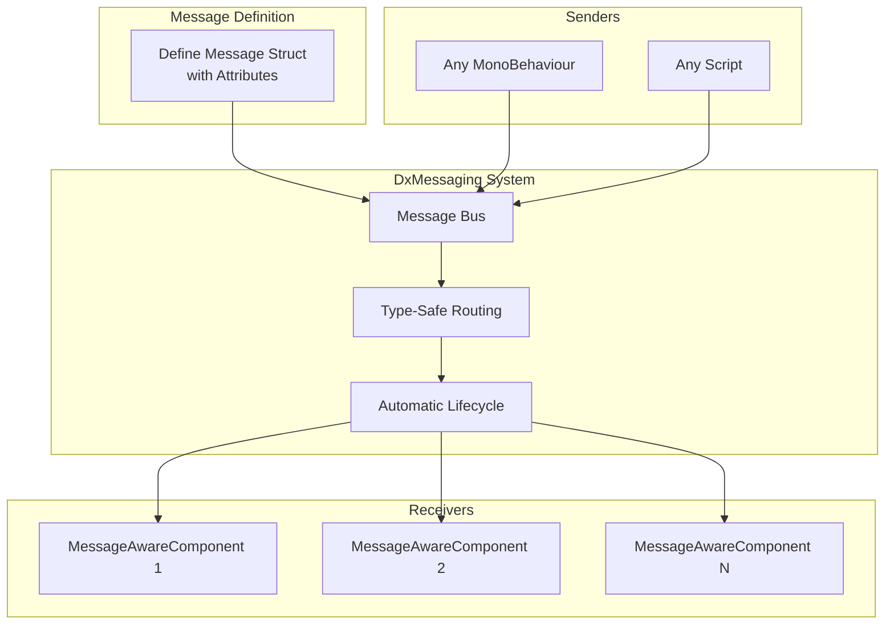
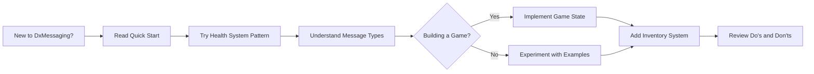

# DxMessaging - Type-Safe Messaging for Unity

A modern, zero-leak messaging system that replaces traditional C# events and UnityEvents with a
performant, debuggable, and maintainable communication framework for Unity games.

---

## 📚 What is DxMessaging?

DxMessaging is a **high-performance messaging system** that solves the age-old problem of how
different parts of your game should communicate. Instead of creating tight coupling between systems
with direct references or dealing with memory leaks from forgotten event unsubscriptions,
DxMessaging provides a clean, observable, and safe way for game systems to talk to each other.

```csharp
// That's it! Type-safe, zero-leak, fully debuggable messaging
[DxTargetedMessage]
[DxAutoConstructor]
public readonly partial struct Heal { public readonly int amount; }

public class Player : MessageAwareComponent {
    protected override void RegisterMessageHandlers() {
        _ = Token.RegisterComponentTargeted<Heal>(this, OnHeal);
    }

    void OnHeal(ref Heal msg) => health += msg.amount;
}

// Send from anywhere
new Heal(50).EmitComponentTargeted(player);
```

---

## 🎯 What Problem Does DxMessaging Solve?

### The Problem: Traditional Event Systems Are Painful

Without a proper messaging system, game communication typically looks like this:

```csharp
// ❌ Problem 1: Memory Leaks from Forgotten Unsubscribes
public class Enemy : MonoBehaviour {
    void Start() {
        GameEvents.OnPlayerDeath += HandlePlayerDeath;
    }
    // Oops! Forgot OnDestroy() - enemy is destroyed but handler still subscribed!
}

// ❌ Problem 2: Tight Coupling
public class HealthUI : MonoBehaviour {
    [SerializeField] private Player player;  // Direct reference required

    void Update() {
        healthText.text = player.Health.ToString();  // Constant polling
    }
}

// ❌ Problem 3: No Visibility
public static class GameEvents {
    public static event Action OnGameOver;
    // Who's subscribed? When did it fire? Can't tell without debugging!
}

// ❌ Problem 4: UnityEvent Boilerplate
public class Door : MonoBehaviour {
    public UnityEvent onOpen;  // Not type-safe
    public UnityEvent onClose; // Lots of inspector wiring
    public UnityEvent onLock;  // Gets messy fast
}
```

**Common Issues:**

- 💥 **Memory Leaks**: Forgot to unsubscribe? Memory leak.
- 🔗 **Tight Coupling**: Every system needs direct references to others
- 🐛 **Hard to Debug**: Who sent this event? Who's listening? No idea.
- 🐌 **Performance**: Polling in Update() or heavyweight UnityEvents
- ⚠️ **Not Type-Safe**: String-based events or weak typing

### The Solution: DxMessaging Handles Everything

```csharp
// ✅ Solution: Zero-leak, decoupled, observable messaging

// Define a message (type-safe!)
[DxTargetedMessage]
[DxAutoConstructor]
public readonly partial struct OpenDoor {
    public readonly int doorId;
}

// Listen for messages (auto-cleanup!)
public class Door : MessageAwareComponent {
    protected override void RegisterMessageHandlers() {
        _ = Token.RegisterComponentTargeted<OpenDoor>(this, OnOpen);
    }  // Token automatically unsubscribes when component is destroyed

    void OnOpen(ref OpenDoor msg) {
        Debug.Log($"Door {msg.doorId} opened");
    }
}

// Send from anywhere (decoupled!)
public class Key : MonoBehaviour {
    void OnTriggerEnter(Collider other) {
        if (other.TryGetComponent<Door>(out var door)) {
            new OpenDoor(doorId).EmitComponentTargeted(door);
        }
    }
}

// ✅ Inspect message flow in Unity Inspector (full visibility!)
// ✅ Zero memory leaks (automatic cleanup)
// ✅ Type-safe (compile-time checking)
// ✅ Performant (zero-allocation design)
```

---

<a id="quick-start"></a>

## 🚀 Quick Start

### Installation

Install via [Unity Package Manager](https://docs.unity3d.com/Manual/upm-ui-giturl.html):

```
1. Open Unity Editor
2. Go to Window → Package Manager
3. Click the "+" dropdown
4. Select "Add package from git URL"
5. Enter: https://github.com/wallstop/DxMessaging.git
6. Click "Add"
```

Alternatively, download from the [GitHub repository](https://github.com/wallstop/DxMessaging).

### Your First Message in 3 Steps

#### Step 1: Define a Message

```csharp
using DxMessaging;

// Use attributes to auto-generate constructor and registration code
[DxTargetedMessage]
[DxAutoConstructor]
public readonly partial struct TakeDamage {
    public readonly int amount;
    public readonly GameObject source;
}
```

**What just happened?** `[DxAutoConstructor]` generates a constructor for you, and
`[DxTargetedMessage]` marks this as a targeted message (sent to specific recipients).

#### Step 2: Listen for Messages

```csharp
using UnityEngine;
using DxMessaging;

public class Player : MessageAwareComponent {
    [SerializeField] private int health = 100;

    protected override void RegisterMessageHandlers() {
        // Register handler - Token automatically unsubscribes when destroyed!
        _ = Token.RegisterComponentTargeted<TakeDamage>(this, OnTakeDamage);
    }

    void OnTakeDamage(ref TakeDamage msg) {
        health -= msg.amount;
        Debug.Log($"Player took {msg.amount} damage from {msg.source.name}");

        if (health <= 0) {
            Die();
        }
    }
}
```

**Key Concepts:**

- `MessageAwareComponent` - Base class that provides messaging capabilities
- `Token` - Manages message subscriptions and automatic cleanup
- `RegisterComponentTargeted<T>()` - Subscribes to targeted messages for this component

#### Step 3: Send Messages

```csharp
using UnityEngine;
using DxMessaging;

public class Spike : MonoBehaviour {
    [SerializeField] private int damage = 25;

    void OnTriggerEnter(Collider other) {
        // Check if the collider has a Player component
        if (other.TryGetComponent<Player>(out var player)) {
            // Send a damage message to the player
            var damageMsg = new TakeDamage(damage, gameObject);
            damageMsg.EmitComponentTargeted(player);
        }
    }
}
```

**That's it!** No subscribe/unsubscribe management, no memory leaks, fully type-safe.

---

## 📖 Core Concepts

### Message Types

DxMessaging supports three types of messages for different communication patterns:

#### 1. Untargeted Messages: "Everyone Listen!"

Global broadcasts that any listener can receive.

```csharp
[DxUntargetedMessage]
[DxAutoConstructor]
public readonly partial struct GameOver {
    public readonly int finalScore;
}

// Listen anywhere
public class UIManager : MessageAwareComponent {
    protected override void RegisterMessageHandlers() {
        _ = Token.RegisterUntargeted<GameOver>(OnGameOver);
    }

    void OnGameOver(ref GameOver msg) {
        ShowGameOverScreen(msg.finalScore);
    }
}

// Emit from anywhere
new GameOver(9999).EmitUntargeted();
```

**Use Cases:**

- Game state changes (pause, unpause, game over)
- Global events (level complete, achievement unlocked)
- System-wide notifications

#### 2. Targeted Messages: "Message for Specific Entity"

Messages sent to a specific component or GameObject.

```csharp
[DxTargetedMessage]
[DxAutoConstructor]
public readonly partial struct Heal {
    public readonly int amount;
}

// Listen on specific component
public class HealthSystem : MessageAwareComponent {
    protected override void RegisterMessageHandlers() {
        _ = Token.RegisterComponentTargeted<Heal>(this, OnHeal);
    }

    void OnHeal(ref Heal msg) {
        currentHealth = Mathf.Min(currentHealth + msg.amount, maxHealth);
    }
}

// Send to specific component
public class HealthPotion : MonoBehaviour {
    void OnTriggerEnter(Collider other) {
        if (other.TryGetComponent<HealthSystem>(out var health)) {
            new Heal(50).EmitComponentTargeted(health);
            Destroy(gameObject);
        }
    }
}
```

**Use Cases:**

- Entity commands (heal player, damage enemy, open door)
- Direct communication between specific objects
- Component-to-component interactions

#### 3. Broadcast Messages: "Observable Events"

Messages that notify observers about state changes.

```csharp
[DxBroadcastMessage]
[DxAutoConstructor]
public readonly partial struct HealthChanged {
    public readonly int newHealth;
    public readonly int maxHealth;
}

// Broadcaster
public class Player : MessageAwareComponent {
    private int health;

    void TakeDamage(int amount) {
        health -= amount;
        // Broadcast the state change
        new HealthChanged(health, maxHealth).EmitBroadcast(this);
    }
}

// Observers
public class HealthUI : MessageAwareComponent {
    protected override void RegisterMessageHandlers() {
        var player = FindObjectOfType<Player>();
        _ = Token.RegisterBroadcast<HealthChanged>(player, OnHealthChanged);
    }

    void OnHealthChanged(ref HealthChanged msg) {
        healthBar.fillAmount = (float)msg.newHealth / msg.maxHealth;
    }
}
```

**Use Cases:**

- UI updates (health bars, score displays)
- State observers (AI awareness, quest tracking)
- Reactive systems

---

## 🎮 Message Flow Diagram



---

## ✅ Do's and ❌ Don'ts

### ✅ DO: Use MessageAwareComponent for Listeners

```csharp
// ✅ CORRECT - Automatic lifecycle management
public class Player : MessageAwareComponent {
    protected override void RegisterMessageHandlers() {
        _ = Token.RegisterComponentTargeted<Heal>(this, OnHeal);
    }
}
```

**Why?** `MessageAwareComponent` provides the `Token` that automatically unsubscribes when the
component is destroyed. Zero memory leaks!

### ❌ DON'T: Manually Manage Subscriptions

```csharp
// ❌ WRONG - Manual subscription management
public class Player : MonoBehaviour {
    void Start() {
        MessageBus.Subscribe<Heal>(OnHeal);  // Who unsubscribes?
    }

    void OnDestroy() {
        MessageBus.Unsubscribe<Heal>(OnHeal);  // Easy to forget!
    }
}
```

### ✅ DO: Use readonly struct for Messages

```csharp
// ✅ CORRECT - Immutable, zero-allocation
[DxTargetedMessage]
[DxAutoConstructor]
public readonly partial struct Attack {
    public readonly int damage;
    public readonly Vector3 direction;
}
```

**Why?** `readonly struct` ensures messages are immutable and don't cause heap allocations.

### ❌ DON'T: Use class for Messages

```csharp
// ❌ WRONG - Heap allocations, mutable
[DxTargetedMessage]
public class Attack {  // Don't use class!
    public int damage;  // Don't use mutable fields!
}
```

### ✅ DO: Use Specific Message Types

```csharp
// ✅ CORRECT - Clear intent, type-safe
[DxTargetedMessage]
[DxAutoConstructor]
public readonly partial struct OpenDoor { public readonly int doorId; }

[DxTargetedMessage]
[DxAutoConstructor]
public readonly partial struct CloseDoor { public readonly int doorId; }
```

**Why?** Separate messages for different actions make code clear and allow different handlers.

### ❌ DON'T: Use Generic Messages

```csharp
// ❌ WRONG - Unclear intent, harder to maintain
[DxTargetedMessage]
[DxAutoConstructor]
public readonly partial struct DoorEvent {
    public readonly int doorId;
    public readonly string action;  // "open", "close", "lock"?
}
```

### ✅ DO: Use Targeted Messages for Specific Actions

```csharp
// ✅ CORRECT - Targeted message for specific entity
void HealPlayer(Player player) {
    new Heal(50).EmitComponentTargeted(player);
}
```

### ❌ DON'T: Use Untargeted Messages for Specific Actions

```csharp
// ❌ WRONG - All Players would receive this!
void HealPlayer(Player player) {
    new Heal(50).EmitUntargeted();  // Every Player gets healed!
}
```

---

<a id="common-patterns"></a>

## 🔥 Common Patterns

### Pattern 1: Health System

```csharp
// Message definitions
[DxTargetedMessage]
[DxAutoConstructor]
public readonly partial struct TakeDamage {
    public readonly int amount;
    public readonly GameObject attacker;
}

[DxTargetedMessage]
[DxAutoConstructor]
public readonly partial struct Heal {
    public readonly int amount;
}

[DxBroadcastMessage]
[DxAutoConstructor]
public readonly partial struct HealthChanged {
    public readonly int current;
    public readonly int max;
}

[DxBroadcastMessage]
[DxAutoConstructor]
public readonly partial struct Died {
    public readonly GameObject killer;
}

// Health component
public class HealthComponent : MessageAwareComponent {
    [SerializeField] private int maxHealth = 100;
    private int currentHealth;

    void Awake() {
        currentHealth = maxHealth;
    }

    protected override void RegisterMessageHandlers() {
        _ = Token.RegisterComponentTargeted<TakeDamage>(this, OnTakeDamage);
        _ = Token.RegisterComponentTargeted<Heal>(this, OnHeal);
    }

    void OnTakeDamage(ref TakeDamage msg) {
        currentHealth -= msg.amount;
        new HealthChanged(currentHealth, maxHealth).EmitBroadcast(this);

        if (currentHealth <= 0) {
            new Died(msg.attacker).EmitBroadcast(this);
        }
    }

    void OnHeal(ref Heal msg) {
        currentHealth = Mathf.Min(currentHealth + msg.amount, maxHealth);
        new HealthChanged(currentHealth, maxHealth).EmitBroadcast(this);
    }
}

// UI Observer
public class HealthBarUI : MessageAwareComponent {
    [SerializeField] private HealthComponent playerHealth;
    [SerializeField] private Image fillImage;

    protected override void RegisterMessageHandlers() {
        _ = Token.RegisterBroadcast<HealthChanged>(playerHealth, OnHealthChanged);
    }

    void OnHealthChanged(ref HealthChanged msg) {
        fillImage.fillAmount = (float)msg.current / msg.max;
    }
}
```

### Pattern 2: Game State Management

```csharp
// Game state messages
[DxUntargetedMessage]
[DxAutoConstructor]
public readonly partial struct GameStarted { }

[DxUntargetedMessage]
[DxAutoConstructor]
public readonly partial struct GamePaused { }

[DxUntargetedMessage]
[DxAutoConstructor]
public readonly partial struct GameResumed { }

[DxUntargetedMessage]
[DxAutoConstructor]
public readonly partial struct GameOver {
    public readonly int finalScore;
}

// Game manager
public class GameManager : MessageAwareComponent {
    private bool isPaused;

    public void StartGame() {
        new GameStarted().EmitUntargeted();
    }

    public void TogglePause() {
        isPaused = !isPaused;
        if (isPaused) {
            Time.timeScale = 0f;
            new GamePaused().EmitUntargeted();
        } else {
            Time.timeScale = 1f;
            new GameResumed().EmitUntargeted();
        }
    }

    public void EndGame(int score) {
        new GameOver(score).EmitUntargeted();
    }
}

// Any system can react to game states
public class Enemy : MessageAwareComponent {
    protected override void RegisterMessageHandlers() {
        _ = Token.RegisterUntargeted<GamePaused>(OnGamePaused);
        _ = Token.RegisterUntargeted<GameResumed>(OnGameResumed);
    }

    void OnGamePaused(ref GamePaused msg) {
        // Disable AI
        enabled = false;
    }

    void OnGameResumed(ref GameResumed msg) {
        // Re-enable AI
        enabled = true;
    }
}
```

### Pattern 3: Inventory System

```csharp
// Inventory messages
[DxTargetedMessage]
[DxAutoConstructor]
public readonly partial struct AddItem {
    public readonly string itemId;
    public readonly int quantity;
}

[DxTargetedMessage]
[DxAutoConstructor]
public readonly partial struct RemoveItem {
    public readonly string itemId;
    public readonly int quantity;
}

[DxBroadcastMessage]
[DxAutoConstructor]
public readonly partial struct InventoryChanged {
    public readonly string itemId;
    public readonly int newQuantity;
}

// Inventory component
public class Inventory : MessageAwareComponent {
    private Dictionary<string, int> items = new();

    protected override void RegisterMessageHandlers() {
        _ = Token.RegisterComponentTargeted<AddItem>(this, OnAddItem);
        _ = Token.RegisterComponentTargeted<RemoveItem>(this, OnRemoveItem);
    }

    void OnAddItem(ref AddItem msg) {
        if (!items.ContainsKey(msg.itemId)) {
            items[msg.itemId] = 0;
        }
        items[msg.itemId] += msg.quantity;

        new InventoryChanged(msg.itemId, items[msg.itemId]).EmitBroadcast(this);
    }

    void OnRemoveItem(ref RemoveItem msg) {
        if (items.ContainsKey(msg.itemId)) {
            items[msg.itemId] -= msg.quantity;
            if (items[msg.itemId] <= 0) {
                items.Remove(msg.itemId);
            }

            new InventoryChanged(msg.itemId, items.GetValueOrDefault(msg.itemId, 0))
                .EmitBroadcast(this);
        }
    }
}

// Item pickup
public class ItemPickup : MonoBehaviour {
    [SerializeField] private string itemId;
    [SerializeField] private int quantity = 1;

    void OnTriggerEnter(Collider other) {
        if (other.TryGetComponent<Inventory>(out var inventory)) {
            new AddItem(itemId, quantity).EmitComponentTargeted(inventory);
            Destroy(gameObject);
        }
    }
}
```

---

## ⚠️ Common Pitfalls

### Pitfall 1: Forgetting to Inherit MessageAwareComponent

```csharp
// ❌ WRONG - Can't register message handlers!
public class Player : MonoBehaviour {
    void Start() {
        // Token doesn't exist!
        _ = Token.RegisterComponentTargeted<Heal>(this, OnHeal);  // Error!
    }
}

// ✅ CORRECT
public class Player : MessageAwareComponent {
    protected override void RegisterMessageHandlers() {
        _ = Token.RegisterComponentTargeted<Heal>(this, OnHeal);
    }
}
```

**Solution:** Always inherit from `MessageAwareComponent` when you need to receive messages.

### Pitfall 2: Emitting Messages Before Handlers Are Registered

```csharp
// ❌ PROBLEM - Message sent before listener is ready
public class GameManager : MonoBehaviour {
    void Start() {
        new GameStarted().EmitUntargeted();  // UI might not be listening yet!
    }
}

public class UIManager : MessageAwareComponent {
    protected override void RegisterMessageHandlers() {
        _ = Token.RegisterUntargeted<GameStarted>(OnGameStarted);
    }
    // If this registers AFTER GameManager.Start(), message is missed!
}

// ✅ SOLUTION - Use script execution order or delay
public class GameManager : MonoBehaviour {
    IEnumerator Start() {
        yield return null;  // Wait one frame for all handlers to register
        new GameStarted().EmitUntargeted();
    }
}
```

**Solution:** Ensure listeners are registered before emitting messages, or use Unity's
[Script Execution Order](https://docs.unity3d.com/Manual/class-MonoManager.html) settings.

### Pitfall 3: Using Mutable Message Fields

```csharp
// ❌ WRONG - Mutable fields can cause bugs
[DxTargetedMessage]
public readonly partial struct Attack {
    public int damage;  // Missing 'readonly'!
}

void ProcessAttack(ref Attack msg) {
    msg.damage *= 2;  // Modifying the message - bad practice!
}

// ✅ CORRECT - Immutable messages
[DxTargetedMessage]
[DxAutoConstructor]
public readonly partial struct Attack {
    public readonly int damage;
}
```

**Solution:** Always use `readonly` for message fields to prevent accidental modification.

### Pitfall 4: Registering in Start Instead of RegisterMessageHandlers

```csharp
// ❌ WRONG - Manual registration
public class Player : MessageAwareComponent {
    void Start() {
        Token.RegisterComponentTargeted<Heal>(this, OnHeal);
    }

    // RegisterMessageHandlers not overridden!
}

// ✅ CORRECT - Use the override
public class Player : MessageAwareComponent {
    protected override void RegisterMessageHandlers() {
        _ = Token.RegisterComponentTargeted<Heal>(this, OnHeal);
    }
}
```

**Solution:** Always register handlers in the `RegisterMessageHandlers()` override.

---

## 🔍 Troubleshooting

### Problem: Messages Not Received

**Symptoms:** Emitting messages but handlers aren't being called.

**Checklist:**

1. ✓ Does the listener inherit `MessageAwareComponent`?
2. ✓ Is `RegisterMessageHandlers()` overridden?
3. ✓ Is the message type correct (Targeted vs Untargeted)?
4. ✓ For targeted messages, is the correct component instance passed?
5. ✓ Is the component enabled?
6. ✓ Are handlers registered before the message is emitted?

**Solution:**

```csharp
// Verify message type matches
[DxTargetedMessage]  // ← Must match
[DxAutoConstructor]
public readonly partial struct Heal { public readonly int amount; }

// Verify registration type matches
_ = Token.RegisterComponentTargeted<Heal>(this, OnHeal);  // ← Must match

// Verify emission type matches
new Heal(50).EmitComponentTargeted(player);  // ← Must match
```

### Problem: "Token not found" Error

**Symptoms:** `Token` is undefined or null.

**Cause:** Not inheriting from `MessageAwareComponent`.

**Solution:**

```csharp
// ❌ WRONG
public class Player : MonoBehaviour { }

// ✅ CORRECT
public class Player : MessageAwareComponent { }
```

### Problem: Performance Concerns

**Symptoms:** Worried about message overhead.

**Facts:**

- DxMessaging is zero-allocation for `readonly struct` messages
- Message routing is O(1) for targeted messages
- Faster than UnityEvents and polling patterns

**When to Optimize:**

- Only if profiling shows messaging is a bottleneck
- Typically happens with 10,000+ messages per frame

**Solution:** Use targeted messages when possible (faster than untargeted).

### Problem: Debugging Message Flow

**Symptoms:** Hard to track who sends/receives messages.

**Solution:** Enable DxMessaging inspector diagnostics.

```csharp
// In Unity Inspector, select any MessageAwareComponent
// The inspector shows:
// - All registered message types
// - Handler methods
// - Message counts
// - Performance stats
```

**Additional Debugging:**

```csharp
void OnHeal(ref Heal msg) {
    Debug.Log($"[{gameObject.name}] Received Heal: {msg.amount}");
}
```

---

## 🎯 When to Use DxMessaging

### ✅ Use DxMessaging When:

| Scenario                       | Why DxMessaging Helps                          |
| ------------------------------ | ---------------------------------------------- |
| **Multi-system communication** | Decouples systems without direct references    |
| **UI updates from gameplay**   | Broadcast messages keep UI reactive            |
| **Complex game state**         | Centralized event flow is easier to debug      |
| **Growing codebase**           | Prevents spaghetti code and tight coupling     |
| **Team development**           | Clear message contracts between features       |
| **Long-term maintenance**      | Zero-leak architecture prevents technical debt |

### ❌ Don't Use DxMessaging When:

| Scenario                 | Use This Instead                       |
| ------------------------ | -------------------------------------- |
| **Tiny prototypes**      | Direct references, simple events       |
| **Local communication**  | Direct method calls                    |
| **Performance-critical** | Direct references (if profiled)        |
| **Synchronous requests** | Direct method calls with return values |

---

## 💡 Quick Reference

### Message Types Cheat Sheet

```csharp
// Untargeted: Global broadcast to all listeners
[DxUntargetedMessage]
[DxAutoConstructor]
public readonly partial struct GamePaused { }

_ = Token.RegisterUntargeted<GamePaused>(OnGamePaused);
new GamePaused().EmitUntargeted();

// Targeted: Sent to specific component
[DxTargetedMessage]
[DxAutoConstructor]
public readonly partial struct Heal { public readonly int amount; }

_ = Token.RegisterComponentTargeted<Heal>(this, OnHeal);
new Heal(50).EmitComponentTargeted(player);

// Broadcast: Observable state changes
[DxBroadcastMessage]
[DxAutoConstructor]
public readonly partial struct ScoreChanged { public readonly int score; }

_ = Token.RegisterBroadcast<ScoreChanged>(scoreManager, OnScoreChanged);
new ScoreChanged(100).EmitBroadcast(this);
```

### Lifecycle Checklist

1. ✓ Define message with `[DxAutoConstructor]`
2. ✓ Inherit `MessageAwareComponent`
3. ✓ Override `RegisterMessageHandlers()`
4. ✓ Register with `Token.Register...`
5. ✓ Emit with `.Emit...()`
6. ✓ No manual cleanup needed!

---

## 🎓 Learning Path



### Beginner (30-45 minutes)

1. Read **Quick Start** section
2. Implement simple health system
3. Try targeted vs untargeted messages
4. Review common pitfalls

### Intermediate (1-2 hours)

1. Build complete game state management
2. Implement inventory system
3. Add UI with broadcast messages
4. Study message flow in Inspector

### Advanced (2-3 hours)

1. Optimize message-heavy systems
2. Debug complex message chains
3. Integrate with existing architecture
4. Review performance characteristics

---

## 🔗 Additional Resources

- **[GitHub Repository](https://github.com/wallstop/DxMessaging)** - Source code and examples
- **[Unity Package Manager Documentation](https://docs.unity3d.com/Manual/upm-ui.html)** -
  Installation help
- **[C# Events and Delegates](https://docs.microsoft.com/en-us/dotnet/csharp/programming-guide/events/)** -
  Background on traditional approach
- **[Installation Guide](#installation)** - Package Manager setup
- **[Common Patterns](#common-patterns)** - Ready-to-use examples

---

## 💬 Summary

DxMessaging solves the fundamental problem of game system communication by providing:

- **Zero Memory Leaks** - Automatic subscription management
- **Decoupled Architecture** - No direct references needed
- **Type Safety** - Compile-time checking
- **Full Observability** - Inspector diagnostics
- **High Performance** - Zero-allocation design

**Perfect For:** Games with multiple interconnected systems that need clean, maintainable
communication.

**Not For:** Tiny prototypes or simple local interactions where direct method calls suffice.

---

**Ready to build cleaner, leak-free game systems?** Start with the [Quick Start](#quick-start) guide
above!
