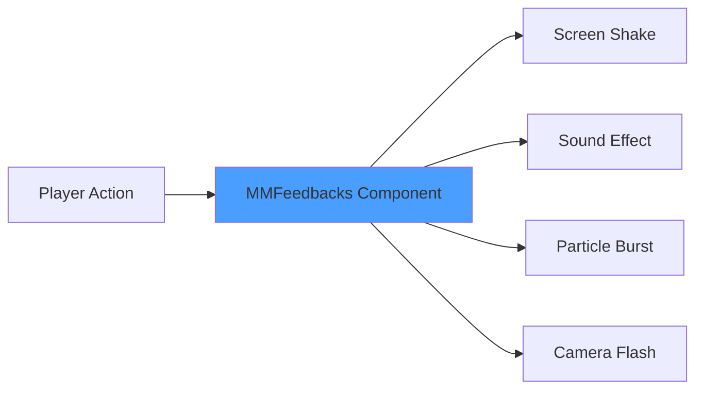
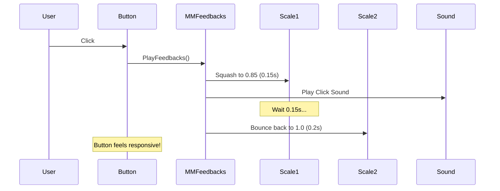
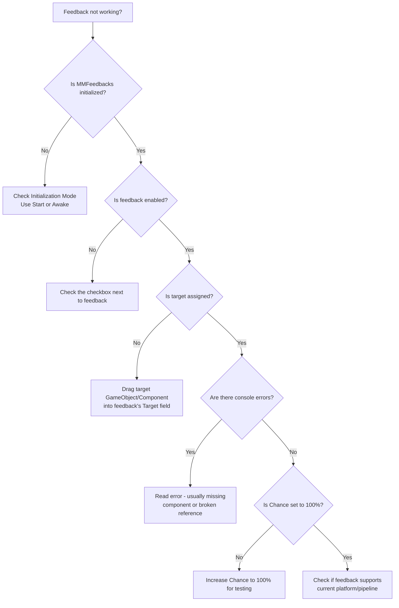

# Getting Started with Feel

> **Quick Start**: Add an `MMFeedbacks` component to any GameObject, click "Add new feedback" in the
> Inspector, select a feedback (like "Camera Shake"), configure it, and call `PlayFeedbacks()` from
> your script or Unity Event — that's it!

## What is Feel?

Feel is a **comprehensive game feel library** that makes your Unity game satisfying and responsive
to play. It provides **150+ ready-to-use feedback effects** that you can drop into your game with
minimal setup — no complex code, no performance worries, just instant juice.

Think of Feel as your **"game feel toolbox"** — instead of writing custom code every time you want a
screen shake, button pulse, or hit flash, you assemble pre-built, battle-tested effects that just
work.



## What Problem Does Feel Solve?

### The Problem: Game Feel is Hard and Time-Consuming

Without Feel, adding simple feedback requires:

```csharp
// ❌ Manual screen shake (30+ lines of code)
public class ManualScreenShake : MonoBehaviour
{
    private Vector3 originalPosition;
    private float shakeTimer;
    private float shakeDuration = 0.3f;
    private float shakeIntensity = 0.5f;

    void Update()
    {
        if (shakeTimer > 0)
        {
            shakeTimer -= Time.deltaTime;
            float damper = shakeTimer / shakeDuration;
            float x = Random.Range(-shakeIntensity, shakeIntensity) * damper;
            float y = Random.Range(-shakeIntensity, shakeIntensity) * damper;
            transform.position = originalPosition + new Vector3(x, y, 0);
        }
        else
        {
            transform.position = originalPosition;
        }
    }

    public void TriggerShake()
    {
        originalPosition = transform.position;
        shakeTimer = shakeDuration;
    }
}

// Plus: Managing particle systems, audio sources, animator states...
// Plus: Performance optimization, pooling, edge cases...
// Plus: Making it work with different rendering pipelines...
```

### The Solution: Feel Does It All For You

With Feel, the same screen shake becomes:

```csharp
// ✅ With Feel (1 line of code)
public class FeelScreenShake : MonoBehaviour
{
    public MMFeedbacks hitFeedback; // Drag from Inspector

    public void OnHit()
    {
        hitFeedback.PlayFeedbacks();
    }
}
```

Then in the Inspector:

1. Click "Add new feedback" → Camera → Camera Shake
2. Set duration: `0.3s`, intensity: `0.5`
3. Done!

**Feel handles:** Shake curves, damping, multi-axis control, performance optimization, cleanup, and
works across all platforms.

## Installation

### Option 1: Unity Asset Store (Recommended)

1. Purchase Feel from
   [Unity Asset Store](https://assetstore.unity.com/packages/tools/particles-effects/feel-183370)
   (€46)
2. Open Package Manager → My Assets → Feel
3. Click Download, then Import
4. Import all assets (or just the core if you have limited storage)

### Option 2: Free Version (MMFeedbacks)

Feel's core feedback system is available for free as a standalone package:

1. Download [MMFeedbacks](https://assetstore.unity.com/packages/tools/utilities/mmfeedbacks-155004)
   from Asset Store
2. Import via Package Manager (free!)
3. ⚠️ Note: This is a subset of Feel with ~80 feedbacks instead of 150+

### Verify Installation

After import, you should see:

- `Assets/Feel/` directory (or `Assets/MMFeedbacks/`)
- New "Add new feedback" options in MMFeedbacks components
- Demo scenes at `Assets/Feel/Demos/`

## Your First Feedback: Bouncy Button

Let's make a UI button that feels **punchy and responsive** when clicked:

### Step 1: Set Up the Scene

```
1. Create a new Scene
2. Add UI → Button (creates Canvas + Button)
3. Select the Button GameObject
4. Add Component → MMFeedbacks
```

### Step 2: Add Feedbacks

In the MMFeedbacks Inspector:

```
1. Click "Add new feedback" dropdown
2. Navigate to Transform → Scale
   - Duration: 0.15
   - Target: (drag your Button's RectTransform here)
   - Animate Scale: To Destination
   - Destination Scale: (0.85, 0.85, 1)

3. Click "Add new feedback" again
4. Navigate to Transform → Scale (yes, another one!)
   - Duration: 0.2
   - Initial Delay: 0.15 (plays after first scale)
   - Target: (same Button's RectTransform)
   - Destination Scale: (1, 1, 1)
   - Curve: AnimationCurve with "ease out back" shape (overshoot)

5. Click "Add new feedback" one more time
6. Navigate to Audio → Sound
   - Sfx: (drag a UI click sound here, or use any AudioClip)
   - Volume: 0.5
```

### Step 3: Wire It Up

On the Button component (not MMFeedbacks):

```
1. Scroll to "OnClick ()" event
2. Click the "+" button
3. Drag the MMFeedbacks GameObject into the object slot
4. Select Function → MMFeedbacks → PlayFeedbacks()
```

### Step 4: Test It

Press Play and click the button. You should see:

- Button **squashes down** slightly (0.85 scale)
- Then **bounces back** with overshoot (springs past 1.0)
- Sound plays **instantly**



### What Just Happened?

1. **MMFeedbacks** is a container for multiple feedback effects
2. **Individual feedbacks** (Scale, Sound) run when you call `PlayFeedbacks()`
3. **Feedbacks play in order** from top to bottom (unless using `Initial Delay`)
4. **No code required** — Unity Events connect buttons to MMFeedbacks

## Core Concepts

### 1. MMFeedbacks Component

The **central controller** for all feedback effects. Think of it as a "playlist" of juicy effects.

```csharp
// Reference in code
public MMFeedbacks hitFeedback;
public MMFeedbacks jumpFeedback;
public MMFeedbacks deathFeedback;

void OnCollisionEnter(Collision collision)
{
    if (collision.gameObject.CompareTag("Enemy"))
        hitFeedback.PlayFeedbacks();
}
```

**Key Settings in Inspector:**

- **Direction**: Top-to-Bottom (normal) or Bottom-to-Top (reverse)
- **Intensity**: Global multiplier (0-1) affecting all feedbacks
- **Initialization**: When to setup feedbacks (Start, Awake, Script)
- **Safety Checks**: Prevent playing while already playing

### 2. Individual Feedbacks

**Building blocks** that do one thing well. Over 150 types available:

| Category            | Examples                              | Use Cases                                     |
| ------------------- | ------------------------------------- | --------------------------------------------- |
| **Camera**          | Shake, Zoom, Flash, Fade              | Explosions, screen transitions, focus effects |
| **Audio**           | Sound, Pitch, Volume                  | SFX, dynamic music, audio feedback            |
| **Transform**       | Position, Rotation, Scale             | Movement, spinning, growing/shrinking         |
| **Particles**       | Instantiate, Play, Stop               | Dust, sparks, magic effects                   |
| **UI**              | Image Color, Canvas Group, Text       | Menu transitions, health bars, notifications  |
| **Post Processing** | Bloom, Vignette, Chromatic Aberration | Hit flashes, dramatic moments                 |
| **Time**            | Slow Motion, Freeze Frame             | Bullet time, impactful hits                   |
| **Haptics**         | Light, Medium, Heavy                  | Mobile vibration feedback                     |

### 3. Timing Controls

Each feedback has fine-grained timing:

```
┌─────────────────────────────────────────┐
│ Initial Delay: 0.5s                      │  ← Wait before starting
├─────────────────────────────────────────┤
│ [========== Duration: 1.0s ==========]   │  ← How long the effect lasts
├─────────────────────────────────────────┤
│ Cooldown: 0.2s                           │  ← Wait before next feedback
└─────────────────────────────────────────┘
```

**Example: Staggered UI Panel Reveal**

```
Feedback 1: Fade In Canvas Group
  - Initial Delay: 0s
  - Duration: 0.3s

Feedback 2: Scale Panel
  - Initial Delay: 0.1s  ← Starts while fade is running
  - Duration: 0.4s

Feedback 3: Slide Title Text
  - Initial Delay: 0.3s  ← Starts after fade completes
  - Duration: 0.3s
```

### 4. Initialization Modes

**Start (Recommended)**

- Feedbacks initialize when the scene starts
- Safe for most use cases
- Good for UI, gameplay objects

**Awake (Advanced)**

- Initializes immediately when GameObject is created
- Use when you need to play feedbacks in `Start()` of other scripts
- Required for very early game systems

**Script (Expert)**

- Manual initialization via `myFeedback.Initialization(gameObject);`
- Use when dynamically spawning feedback objects
- Gives full control but requires more code

```csharp
// Script initialization example
public class DynamicFeedbackSpawner : MonoBehaviour
{
    public MMFeedbacks feedbackPrefab;

    void SpawnFeedback(Vector3 position)
    {
        MMFeedbacks instance = Instantiate(feedbackPrefab, position, Quaternion.identity);
        instance.Initialization(gameObject); // ← Manual init required!
        instance.PlayFeedbacks();
    }
}
```

## Common Use Cases

### Screen Shake on Hit

```
MMFeedbacks → Add Feedback → Camera → Camera Shake
  - Duration: 0.2s
  - Amplitude: 1.5 (how far)
  - Frequency: 25 (how fast)
```

### Object Spawn with Pop-In

```
MMFeedbacks → Multiple Feedbacks:
  1. Transform → Scale
     - Animate Scale: From → To Destination
     - Initial Scale: (0, 0, 0)
     - Destination Scale: (1.2, 1.2, 1.2)
     - Duration: 0.15s

  2. Transform → Scale
     - Initial Delay: 0.15s
     - Destination Scale: (1, 1, 1)
     - Duration: 0.1s
     - Curve: Ease Out

  3. Particles → Instantiate
     - Particle Prefab: (dust puff effect)
```

### Player Jump Feedback

```
MMFeedbacks:
  1. Audio → Sound (jump sound)
  2. Particles → Instantiate (dust at feet)
  3. Transform → Squash (0.1s)
     - Scale: (1.2, 0.8, 1) ← wider, flatter
```

### UI Health Bar Damage Flash

```
MMFeedbacks:
  1. UI → Image Color
     - Target: Health Bar Fill Image
     - Destination Color: Red
     - Duration: 0.1s

  2. UI → Image Color
     - Initial Delay: 0.1s
     - Destination Color: (original color)
     - Duration: 0.2s

  3. Camera → Flash
     - Color: Red with 30% alpha
     - Duration: 0.15s
```

### Chest Open Sequence

```
MMFeedbacks:
  1. Time → Slow Motion
     - Duration: 0.5s
     - Time Scale: 0.3 (70% slower)

  2. Transform → Rotation (lid)
     - Target: Chest Lid Transform
     - Rotation: (75, 0, 0) ← opens upward
     - Duration: 0.8s

  3. Particles → Instantiate
     - Initial Delay: 0.3s
     - Particle: Sparkles

  4. Audio → Sound
     - Initial Delay: 0.3s
     - Sfx: Chest open sound

  5. Time → Resume Normal
     - Initial Delay: 0.5s
```

## Practical Workflow Tips

### Organizing Feedbacks

```
Create hierarchy:
  - Player
    ├─ Visuals (sprites/models)
    ├─ Feedbacks
    │   ├─ JumpFeedback (MMFeedbacks)
    │   ├─ LandFeedback (MMFeedbacks)
    │   ├─ HitFeedback (MMFeedbacks)
    │   └─ DeathFeedback (MMFeedbacks)
    └─ Scripts
```

### Testing Feedbacks Quickly

1. Select GameObject with MMFeedbacks
2. In Inspector, find the **"Play"** button at the top of MMFeedbacks
3. Click it in Edit Mode to preview (works for many feedback types!)
4. Use the **"Stop"** button to reset

### Copying Feedbacks Between Objects

**✅ DO:**

1. In MMFeedbacks Inspector, click the **three dots** menu
2. Select "Copy all feedbacks"
3. On target GameObject's MMFeedbacks, click three dots → "Paste all feedbacks"

**❌ DON'T:**

- Use Unity's "Copy Component Values" — this breaks references!

### Debugging When Feedbacks Don't Work



**Common Issues:** | Problem | Solution | |---------|----------| | Nothing happens | Check
initialization mode (use Start) | | Feedback plays once then stops | Look for "Play Once" or "Number
of Repeats" settings | | Target is null error | Assign the target GameObject/Component in Inspector
| | Effect too subtle | Increase Intensity on MMFeedbacks (global multiplier) | | Post-processing
feedbacks don't work | Ensure you have URP/HDRP Volume components in scene |

## Next Steps

Now that you understand the basics:

1. **[Why Feel?](02-why-feel.md)** — What makes Feel different from other solutions
2. **[Feedback Catalog](03-feedback-catalog.md)** — Complete reference of all 150+ feedbacks
3. **[Advanced Techniques](04-advanced-techniques.md)** — Sequences, scripting, custom feedbacks
4. **[Troubleshooting](05-troubleshooting.md)** — Solutions to common problems

## Quick Reference Card

```csharp
using MoreMountains.Feedbacks;

// Playing feedbacks
public MMFeedbacks myFeedback;
myFeedback.PlayFeedbacks();           // Play from start
myFeedback.StopFeedbacks();           // Stop all
myFeedback.ResetFeedbacks();          // Reset to initial state

// Control
myFeedback.Initialization(gameObject); // Manual init (Script mode only)
myFeedback.Pause();                    // Pause
myFeedback.Resume();                   // Resume

// Properties
myFeedback.IsPlaying                   // Check if playing
myFeedback.FeedbacksIntensity = 0.5f;  // Set global intensity (0-1)

// Events (hook into feedback lifecycle)
myFeedback.Events.OnPlay.AddListener(() => Debug.Log("Started!"));
myFeedback.Events.OnComplete.AddListener(() => Debug.Log("Done!"));
```

---

**Pro Tip**: Explore Feel's demo scenes at `Assets/Feel/Demos/` — they're interactive playgrounds
showing every feedback type in action. The "Snake" demo is particularly impressive!
