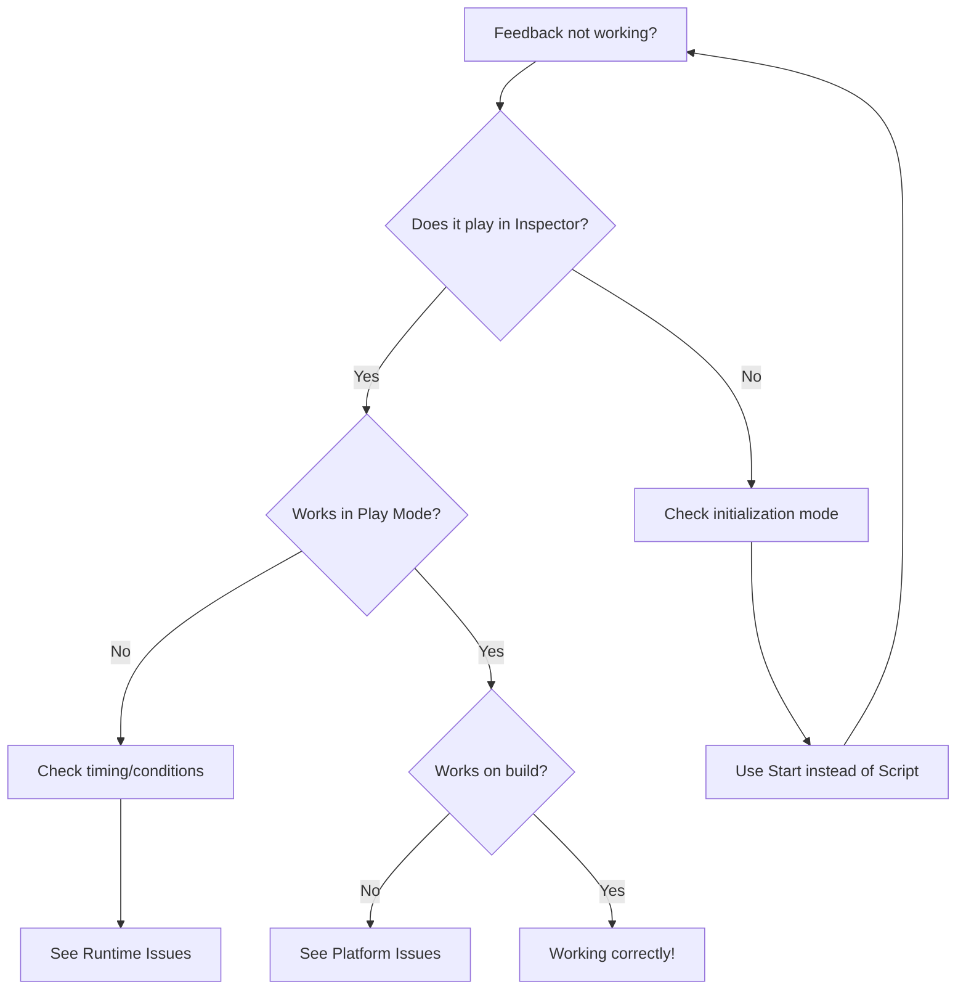

# Troubleshooting

> **Problem Solver's Guide**: Quick solutions to common Feel issues, organized by symptom.

## Quick Diagnostic Flowchart



## Nothing Happens When I Call PlayFeedbacks()

### Symptom

You call `myFeedback.PlayFeedbacks()` but no effects occur.

### Solutions

#### 1. Check Initialization Mode

**Most common cause!**

```
In MMFeedbacks Inspector:
  Initialization Mode: Start (or Awake)
  ❌ NOT "Script"
```

**If you must use Script mode:**

```csharp
void Start()
{
    myFeedback.Initialization(gameObject); // Initialize manually!
    myFeedback.PlayFeedbacks();
}
```

#### 2. Verify Feedbacks Are Enabled

Each feedback has a checkbox — make sure it's checked:

```
✅ Camera Shake ← Enabled
❌ Sound ← Disabled (won't play!)
```

#### 3. Check Target References

Ensure all Target fields are assigned:

```
Camera Shake feedback:
  Target: ❌ None (Transform) ← Assign your camera!
```

#### 4. Look for Console Errors

Common errors:

- `NullReferenceException`: Missing target reference
- `MMFeedbacks not initialized`: Use Start/Awake init mode
- `Component required`: Feedback needs a component (e.g., CanvasGroup for fade)

---

## Feedback Plays Once, Then Stops Working

### Symptom

First `PlayFeedbacks()` call works, subsequent calls do nothing.

### Solutions

#### 1. Check Cooldown Settings

```
In MMFeedbacks Inspector:
  Cooldown Duration: 5.0 ← You have a 5-second cooldown!

Solution: Reduce or set to 0
```

#### 2. Check "Play Once" Settings

Some feedbacks have a "Play Once" or "Number of Repeats" setting:

```
Particles feedback:
  Number of Repeats: 1 ← Only plays once!

Solution: Set to -1 for infinite or higher number
```

#### 3. Feedback Isn't Resetting

Some feedbacks need explicit reset:

```csharp
void PlayAgain()
{
    myFeedback.ResetFeedbacks(); // Reset to initial state
    myFeedback.PlayFeedbacks();
}
```

---

## Transform Feedback Doesn't Return to Original State

### Symptom

After playing a Position/Rotation/Scale feedback, the object stays at the destination instead of
returning to start.

### Solutions

#### 1. Use "ToDestinationThenBack" Mode

```
Transform → Position feedback:
  Animate Position: To Destination Then Back ← Automatically returns!
  Duration: 0.5s (0.25s forward, 0.25s back)
```

#### 2. Add a Second Feedback to Return

```
Feedback 1: Scale
  - Destination: (1.5, 1.5, 1.5)
  - Duration: 0.3s

Feedback 2: Scale
  - Initial Delay: 0.3s ← After first finishes
  - Destination: (1.0, 1.0, 1.0) ← Back to normal
  - Duration: 0.2s
```

#### 3. Use Reset on Disable

```csharp
void OnDisable()
{
    myFeedback.ResetFeedbacks(); // Returns everything to initial state
}
```

---

## Post Processing Feedbacks Don't Work

### Symptom

Bloom, Vignette, Chromatic Aberration, etc. have no visible effect.

### Solutions

#### 1. Add Volume Component to Scene

**Required for all post-processing feedbacks:**

```
1. Create empty GameObject named "Global Volume"
2. Add Component → Volume (from URP/HDRP)
3. Set Profile: Create new Volume Profile
4. Add Override → Click the effect you want (Bloom, Vignette, etc.)
5. Enable the effect and set a base value
```

#### 2. Verify Rendering Pipeline

Post-processing only works with URP or HDRP, not Built-in Renderer:

```
Check: Edit → Project Settings → Graphics → Render Pipeline Asset
  Must be: UniversalRenderPipelineAsset or HDRenderPipelineAsset
  ❌ NOT: None (Built-in Renderer)
```

**If using Built-in:**

- Switch to URP (Window → Rendering → Render Pipeline Converter)
- Or use alternative feedbacks (Camera Flash instead of Bloom)

#### 3. Enable Post Processing on Camera

```
Select Main Camera:
  ✅ Post Processing (checkbox in Camera component)
```

#### 4. Check Volume Profile Override

The effect must exist in your Volume Profile:

```
Select Volume → Profile →
  ✅ Bloom (enabled with non-zero intensity)
  ❌ Vignette (not added yet)
```

---

## Haptics Don't Vibrate on Mobile

### Symptom

MMF_Haptics feedback doesn't cause phone vibration.

### Solutions

#### 1. Enable Vibration Permission (Android)

**In Unity:**

```
Edit → Project Settings → Player → Android → Other Settings
  ✅ Vibrate (under Configuration)
```

#### 2. Check Device Support

Not all devices support haptics:

- **iOS**: Requires iPhone 7 or newer (Taptic Engine)
- **Android**: Varies by device; some lack haptic motors

**Test on real device, not simulator!**

#### 3. Verify Nice Vibrations Settings

```
In MMFeedbacks Inspector:
  Feedback: Haptics
  Haptic Types: Light, Medium, Heavy (try different types)

  iOS Haptic Type: Impact ← Must match device capability
```

#### 4. Check System Settings

User may have disabled vibration in OS settings:

- iOS: Settings → Sounds & Haptics → System Haptics
- Android: Settings → Sound → Vibration

**Your app can't override this!**

---

## Camera Shake Doesn't Shake

### Symptom

MMF_CameraShake feedback plays but camera doesn't move.

### Solutions

#### 1. Check Amplitude and Frequency

```
Camera Shake feedback:
  Shake Amplitude: 0.01 ← Too weak! Increase to 0.5+
  Shake Frequency: 1 ← Too slow! Increase to 20+
```

#### 2. Verify Camera Reference

```
Camera Shake feedback:
  Shake Cameras: Main Camera ← Must be assigned!
```

**If using Cinemachine:**

```
Use "MMF_CinemachineImpulse" instead of "MMF_CameraShake"
```

#### 3. Check Camera Parent Hierarchy

If camera is child of another transform that's being moved, shake may be unnoticeable:

```
Player (moves)
  └─ CameraRig (follows player)
      └─ Main Camera (tries to shake but is constrained)

Solution: Attach MMFeedbacks to Camera directly, not parent
```

#### 4. Verify Shake Mode

```
Camera Shake feedback:
  Shake Mode: Full ← All axes
  ❌ NOT: PositionX only (too subtle)
```

---

## UI Feedbacks Don't Affect UI Elements

### Symptom

UI feedbacks (CanvasGroup, RectTransform, Image) don't change UI.

### Solutions

#### 1. Assign Correct Target

```
CanvasGroup feedback:
  Target CanvasGroup: ❌ None ← Assign your UI's CanvasGroup!

If CanvasGroup doesn't exist:
  1. Select UI Panel
  2. Add Component → Canvas Group
  3. Assign to feedback
```

#### 2. Check Canvas Render Mode

Some feedbacks require specific Canvas settings:

```
Canvas component:
  Render Mode: Screen Space - Overlay (works with most feedbacks)
  ❌ World Space may have issues with RectTransform feedbacks
```

#### 3. Verify Alpha Blocksraycasts

```
CanvasGroup feedback:
  Destination Alpha: 0 (invisible)
  ✅ Also Change Blocksraycasts: True
  ✅ Also Change Interactable: False

Without these, UI is invisible but still clickable!
```

#### 4. RectTransform Anchors

RectTransform feedbacks respect anchors:

```
If anchors are stretched (0,0 to 1,1):
  Position feedback may not work as expected

Solution: Use anchored position or change anchors to center
```

---

## Feedbacks Play Too Fast or Too Slow

### Symptom

Feedback timing feels wrong (rushed or sluggish).

### Solutions

#### 1. Check Time.timeScale

```csharp
// If you've used time slow-motion:
Debug.Log(Time.timeScale); // Should be 1.0 for normal speed

// Reset:
Time.timeScale = 1.0f;
```

#### 2. Verify Feedback Timing Mode

```
In MMFeedbacks Inspector:
  Timing → Update:
    - Normal (affected by timeScale)
    - Unscaled (ignores timeScale) ← Use for UI that should always be responsive
```

#### 3. Check Individual Feedback Duration

```
Each feedback:
  Duration: 0.3s ← Adjust to taste
  Initial Delay: 0.0s ← No delay

Total time = Initial Delay + Duration
```

#### 4. Sequence Timing

```
If feedbacks feel delayed:
  Feedback 1: Duration 0.5s, Delay 0.0s → Plays 0.0-0.5s
  Feedback 2: Duration 0.3s, Delay 0.5s → Plays 0.5-0.8s

  Total sequence: 0.8s (not 0.8s, overlaps!)
```

---

## Particles Feedback Spawns But Doesn't Play

### Symptom

MMF_Particles_Instantiate spawns the prefab but particles don't appear.

### Solutions

#### 1. Check ParticleSystem Autoplay

```
Select Particle Prefab → Particle System component:
  ✅ Play On Awake (particles start automatically)
```

#### 2. Use Play Feedback Instead

```
If particle system already exists in scene:
  Use: MMF_Particles_Play (not Instantiate)
  Target: Existing ParticleSystem
```

#### 3. Verify Particle Settings

```
ParticleSystem:
  Start Lifetime: 1.0+ seconds ← Must be visible long enough
  Start Size: 0.1+ ← Not too small
  Max Particles: 100+ ← Enough to be visible
```

#### 4. Check Render Mode and Material

```
ParticleSystem → Renderer:
  Render Mode: Billboard (usually)
  Material: Assigned and visible ← Not transparent/missing
```

---

## Audio Feedback Doesn't Play Sound

### Symptom

MMF_Sound feedback executes but no audio plays.

### Solutions

#### 1. Assign Audio Clip

```
Sound feedback:
  Sfx: ❌ None (Audio Clip) ← Assign your sound!
```

#### 2. Check Volume

```
Sound feedback:
  Volume: 0.0 ← Silent! Increase to 0.5-1.0
```

#### 3. Verify Audio Listener

```
Scene must have exactly ONE Audio Listener:
  Main Camera: ✅ Audio Listener component

If missing: Add Component → Audio Listener
If multiple: Remove extras (causes conflicts)
```

#### 4. Check Audio Mixer Settings

```
If using Audio Mixer:
  Master volume: -80 dB ← Muted!
  Solution: Set to 0 dB or higher
```

#### 5. Test Audio Source Settings

```
If using MMF_AudioSource (not MMF_Sound):
  AudioSource component:
    ✅ Play On Awake: False (controlled by feedback)
    Volume: 1.0
    Mute: ❌ Unchecked
```

---

## Feedback Works in Editor But Not in Build

### Symptom

Feedback plays correctly in Unity Editor but fails in build.

### Solutions

#### 1. Check Build Settings - Stripping

```
Edit → Project Settings → Player → Other Settings
  Managed Stripping Level: Low (or Minimal)

High stripping may remove Feel code!
```

#### 2. Verify Scene Includes

```
File → Build Settings → Scenes In Build
  ✅ Your scene is included and enabled
```

#### 3. Platform-Specific Features

Some feedbacks are platform-specific:

```
Haptics: Only works on mobile/console
Post Processing: Requires URP/HDRP (check build target)
Cinemachine: Must be in project packages
```

#### 4. Check Resources and Prefabs

```
If dynamically loading feedbacks:
  Ensure prefabs are in Resources folder or use Addressables
```

#### 5. IL2CPP Builds

```
If using IL2CPP (iOS, console):
  Edit → Project Settings → Player → Other Settings
    API Compatibility Level: .NET Standard 2.1
```

---

## Performance Issues / Frame Drops

### Symptom

Feedback causes noticeable frame rate drops.

### Solutions

#### 1. Identify Expensive Feedbacks

```
Common culprits:
  - Multiple particle systems
  - Post-processing stacking (many effects at once)
  - High-frequency camera shake (frequency > 50)
  - Physics-based feedbacks on many objects
```

#### 2. Reduce Particle Counts

```
ParticleSystem:
  Max Particles: 500 → 100 ← Reduce
  Emission Rate: 100 → 20 ← Lower
```

#### 3. Limit Post-Processing Feedbacks

```
Don't stack many post-processing effects:
  ❌ Bloom + Vignette + Chromatic Aberration + Motion Blur (all at once)
  ✅ Pick 1-2 most impactful effects
```

#### 4. Use Pooling

```csharp
// Pre-instantiate feedback objects, reuse them
// (See "Advanced Techniques" → Performance Optimization)
```

#### 5. Disable Feedbacks on Low-End Devices

```csharp
void Start()
{
    if (SystemInfo.processorFrequency < 2000) // Low - end device
    {
        // Disable expensive feedbacks
        MMF_Particles particles = myFeedback.GetFeedbackOfType<MMF_Particles>();
        if (particles != null) particles.Active = false;
    }
}
```

---

## Feedback Plays at Wrong Position

### Symptom

Position-based feedbacks (particles, instantiate) spawn in wrong location.

### Solutions

#### 1. Check Position Parameter

```csharp
// Wrong:
myFeedback.PlayFeedbacks(); // Uses MMFeedbacks GameObject position

// Right:
myFeedback.PlayFeedbacks(transform.position); // Uses specified position
```

#### 2. Verify Instantiation Settings

```
Instantiate feedback:
  Position: At Transform (use assigned transform's position)
  Transform: ❌ None ← Assign target!
```

#### 3. Local vs World Space

```
Position feedback:
  Space: World (absolute position)
  OR
  Space: Local (relative to parent)
```

#### 4. Parent Transform Issues

```
If feedback is child of moving object:
  Particle spawns relative to parent

Solution: Reparent feedback or use world space
```

---

## MMFeedbacks Component Shows Warnings

### Common Warnings and Fixes

#### "Target is null"

```
Solution: Assign the Target field in the feedback settings
```

#### "Initialization mode is Script but not initialized"

```
Solution:
  Option 1: Change to Start/Awake
  Option 2: Call myFeedback.Initialization(gameObject) in code
```

#### "Playing feedback on disabled object"

```
Solution: Don't play feedbacks on disabled GameObjects
  Check: if (gameObject.activeInHierarchy) before PlayFeedbacks()
```

#### "Chance is 0%"

```
Solution: Feedback has 0% chance to play
  Increase Chance to 50-100%
```

#### "Out of range"

```
Solution: Feedback has Range enabled, target is too far
  Increase Range or disable Range check
```

---

## Still Having Issues?

### Debugging Checklist

- [ ] Check Console for errors
- [ ] Test feedback in Inspector using Play button
- [ ] Verify all Target fields are assigned
- [ ] Confirm Initialization Mode is Start/Awake
- [ ] Check feedback checkboxes are enabled
- [ ] Look for Cooldown/Chance settings preventing play
- [ ] Test in fresh scene with minimal setup
- [ ] Check Feel version (update to latest)

### Getting Help

**Feel Official Resources:**

- Documentation: [Feel docs](https://feel-docs.moremountains.com/)
- Discord: More Mountains community server
- Forum: Unity Asset Store review questions

**When Asking for Help, Include:**

1. Feel version number
2. Unity version
3. Rendering pipeline (Built-in, URP, HDRP)
4. Platform (Editor, PC build, Mobile, etc.)
5. Console errors (full stack trace)
6. Screenshot of MMFeedbacks Inspector
7. Code snippet showing how you call PlayFeedbacks()

**Common Issue Database:**

- See Feel GitHub (community-maintained issue tracker)
- Check Unity Asset Store reviews for similar issues

---

**Pro Tip**: When debugging, create a minimal test scene with just the problematic feedback. This
isolates the issue from your complex project and makes it easier to identify the root cause.

## Quick Reference: Issue → Solution

| Issue                   | Quick Fix                                        |
| ----------------------- | ------------------------------------------------ |
| Nothing happens         | Check Initialization Mode (use Start)            |
| Plays once only         | Check Cooldown settings                          |
| No camera shake         | Increase Amplitude (0.5+) and Frequency (20+)    |
| No post-processing      | Add Volume component to scene                    |
| No haptics              | Enable Vibrate permission (Android)              |
| No sound                | Assign Audio Clip, check volume                  |
| Position wrong          | Pass position to PlayFeedbacks(position)         |
| Performance issues      | Reduce particle count, disable on low-end        |
| Build doesn't work      | Lower stripping level, check platform features   |
| Transform doesn't reset | Use ToDestinationThenBack or add return feedback |

---

That's it! You should now be able to diagnose and fix any Feel issues. Return to:

- **[Getting Started](01-getting-started.md)** for basics
- **[Advanced Techniques](04-advanced-techniques.md)** for power-user features
