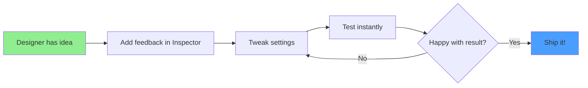

# Feel Documentation

## What is Feel?

Feel (by More Mountains) is a **comprehensive game feel library** for Unity that provides **150+
ready-to-use feedback effects**. It transforms flat, unresponsive games into juicy, satisfying
experiences with **minimal code** and **maximum designer control**.

Instead of writing hundreds of lines of code for screen shakes, particle effects, camera zooms,
audio triggers, and UI animations, you assemble pre-built feedbacks in the Inspector and call a
single method: `PlayFeedbacks()`.

**Feel makes game feel accessible to everyone** — no programming expertise required.

---

## Alternatives

### Tween Library Alternatives (Different Approach)

If you only need **animations** (not full game feel), consider these FREE tween libraries:

**[PrimeTween](https://assetstore.unity.com/packages/tools/animation/primetween-high-performance-animations-and-sequences-252960)**
(FREE - Zero allocation)

- ✅ Completely free
- ✅ Zero GC allocation, ultra-fast
- ✅ Great for code-driven animations
- ❌ No pre-built "feedbacks" — purely code-based
- 💡 **Best for:** Performance-critical animations, code-first approach
- 📖 See [PrimeTween docs](../primetween/README.md) in this repository

**[LitMotion](https://github.com/AnnulusGames/LitMotion)** (FREE - DOTS-based, Open Source)

- ✅ Completely free, MIT license
- ✅ Extremely fast (DOTS/ECS architecture)
- ✅ Zero allocation
- ❌ More complex API than PrimeTween or Feel
- 💡 **Best for:** High-performance projects, advanced users

**[DOTween](https://dotween.demigiant.com/)** (FREE)

- ✅ Free version fully functional
- ✅ Most popular Unity tween library
- ✅ Simple API
- ⚠️ Allocates memory (GC)
- ⚠️ Slower than modern alternatives
- 💡 **Best for:** Prototyping, compatibility with existing projects

**[LeanTween](https://assetstore.unity.com/packages/tools/animation/leantween-3595)** (FREE)

- ✅ Completely free, lightweight
- ✅ No dependencies
- ⚠️ Older API, less feature-rich
- 💡 **Best for:** Ultra-lightweight projects

### Which Should You Choose?

| Your Need                      | Recommendation                  | Price |
| ------------------------------ | ------------------------------- | ----- |
| **Commercial game**            | **Feel**                        | ~$50  |
| **Code-first animations only** | **PrimeTween**                  | FREE  |
| **Maximum performance**        | **LitMotion** or **PrimeTween** | FREE  |
| **Complete game feel system**  | **Feel**                        | ~$50  |

### Recommendation

**If you only need animations:** Use **PrimeTween** (FREE, zero allocation, very fast)

---

## Quick Start

```csharp
// 1. Add MMFeedbacks component to any GameObject
// 2. In Inspector: "Add new feedback" → Camera → Camera Shake
// 3. Configure duration (0.3s), amplitude (0.5), frequency (25)
// 4. Call from your script:

public MMFeedbacks screenShakeFeedback;

void OnHit()
{
    screenShakeFeedback.PlayFeedbacks(); // That's it!
}
```

**Result**: Professional-quality screen shake with damping, multiple axes, and smooth curves — no
complex code needed.

---

## Documentation Structure

### For Beginners

**Start here if you've never used Feel before:**

1. **[Getting Started](01-getting-started.md)** ⭐ **Start Here**

   - What is Feel and what problems does it solve?
   - Installation guide (Asset Store or free MMFeedbacks)
   - Your first feedback: bouncy UI button walkthrough
   - Core concepts (MMFeedbacks, individual feedbacks, timing)
   - Common use cases with step-by-step examples
   - Quick reference card

2. **[Why Feel?](02-why-feel.md)**
   - What is "game feel" and why does it matter?
   - Feel vs manual code (100+ lines → 1 line)
   - Feel vs alternatives (DOTween, Animator, Timeline)
   - When to use Feel (and when not to)
   - Cost-benefit analysis
   - Real-world success stories

### For Practitioners

**Once you understand the basics:**

1. **[Feedback Catalog](03-feedback-catalog.md)** 📚 **Reference**
   - Complete list of all 150+ feedbacks organized by category
   - What each feedback does
   - Common use cases
   - Key Inspector settings
   - Quick setup examples
   - Perfect for: "I want to do X, which feedback should I use?"

### For Power Users

**Master advanced techniques:**

1. **[Advanced Techniques](04-advanced-techniques.md)** 🚀 **Advanced**
   - Scripting with MMFeedbacks (dynamic intensity, events, control)
   - Advanced timing and sequencing patterns
   - Creating custom feedbacks (extend Feel!)
   - Performance optimization (pooling, conditional execution)
   - Advanced patterns (health-based feedback, context-aware selection)
   - Data-driven feedback systems

### For Troubleshooters

**When things go wrong:**

1. **[Troubleshooting](05-troubleshooting.md)** 🔧 **Debug**
   - Quick diagnostic flowchart
   - Common issues and solutions
   - Platform-specific problems
   - Performance troubleshooting
   - Getting help guide

---

## Feature Highlights

### 🎮 150+ Built-In Feedbacks

Feel includes feedbacks for:

- **Camera**: Shake, Zoom, Flash, Fade, Field of View, Cinemachine
- **Audio**: Sound, Pitch, Volume, Audio Mixer, Filters
- **Transform**: Position, Rotation, Scale, Wiggle, Spring, Squash & Stretch
- **Particles**: Instantiate, Play, Stop, Pause
- **UI**: Canvas Group, Image, RectTransform, Floating Text
- **Post Processing**: Bloom, Vignette, Chromatic Aberration, Color Grading
- **Time**: Slow Motion, Freeze Frame, Time Scale
- **Haptics**: Mobile vibration, console rumble (iOS, Android, all platforms)
- **Physics**: Rigidbody forces, torque, velocity
- **Materials**: Color, properties, shaders, flicker
- **And much more...**

### 🎨 Designer-Friendly Workflow



**No programmer required** for iteration. Designers own game feel from start to finish.

### ⚡ Performance Optimized

- **Zero allocations** after warmup
- **Object pooling** for particles and audio
- **Automatic cleanup** when objects are destroyed
- **Conditional execution** (chance %, range checks)
- Battle-tested in shipped games

### 🌍 Platform-Aware

Feel automatically handles:

- **Mobile**: iOS haptics (Taptic Engine), Android vibration
- **Console**: Gamepad rumble
- **PC**: Gracefully skips unsupported features
- **VR**: Special camera handling
- **All rendering pipelines**: Built-in, URP, HDRP

### 🧩 Modular and Composable

Stack feedbacks like LEGO blocks:

```
Epic Sword Slash:
  ├─ Audio → Whoosh sound
  ├─ Particles → Slash trail
  ├─ Camera → Shake
  ├─ Time → 0.1s slow-motion
  ├─ Haptics → Light vibration
  ├─ Transform → Weapon spin
  └─ Post Processing → Chromatic aberration burst

Created in 5 minutes via Inspector!
```

---

## Installation

### Option 1: Feel (Full Version) — €46

- 150+ feedbacks
- All rendering pipelines (Built-in, URP, HDRP)
- Nice Vibrations haptics system
- 20+ demo scenes
- Complete source code
- Free lifetime updates

**Purchase**:
[Unity Asset Store](https://assetstore.unity.com/packages/tools/particles-effects/feel-183370)

### Option 2: MMFeedbacks (Free Version)

- ~80 core feedbacks (Audio, Camera, Transform, Particles, UI)
- Perfect for prototyping and small projects

**Download**:
[Unity Asset Store](https://assetstore.unity.com/packages/tools/utilities/mmfeedbacks-155004)

### Import Steps

1. Open Package Manager → My Assets → Feel (or MMFeedbacks)
2. Click Download, then Import
3. Import all assets
4. Verify: `Assets/Feel/` directory exists
5. Explore demo scenes: `Assets/Feel/Demos/`

---

## Learning Path

### Phase 1: Foundations (30 minutes)

1. Read [Getting Started](01-getting-started.md)
2. Build the "Bouncy Button" tutorial
3. Play Feel's demo scenes (`Assets/Feel/Demos/Snake`)
4. Create one feedback of your own (screen shake on collision)

**Goal**: Understand MMFeedbacks component and basic workflow.

### Phase 2: Application (2-4 hours)

1. Read [Why Feel?](02-why-feel.md)
2. Skim [Feedback Catalog](03-feedback-catalog.md) (don't memorize, just browse)
3. Add 5-10 feedbacks to your game (jump, hit, UI clicks, etc.)
4. Experiment with combining multiple feedbacks

**Goal**: Become comfortable adding feedback to your game.

### Phase 3: Mastery (ongoing)

1. Read [Advanced Techniques](04-advanced-techniques.md)
2. Try scripting with MMFeedbacks (dynamic intensity, events)
3. Create a custom feedback for your game's unique needs
4. Optimize feedback performance

**Goal**: Unlock Feel's full power for production games.

### Phase 4: Troubleshooting (as needed)

1. Keep [Troubleshooting](05-troubleshooting.md) bookmarked
2. Reference when issues arise
3. Use diagnostic flowcharts to quickly identify problems

**Goal**: Solve any Feel issue independently.

---

## Common Use Cases

### UI/UX Polish

- Button hover/click feedback (scale, sound, haptics)
- Menu transitions (fade, slide, scale)
- Notification popups (floating text, sound)
- Health bars (color change, shake)
- Loading screens (particle effects, animations)

### Player Actions

- Jump (squash animation, dust particles, sound)
- Attack (screen shake, slow-mo, camera punch)
- Damage taken (red flash, haptics, vignette)
- Pickup items (scale pop, sparkles, sound)
- Death (freeze frame, fade to black, dramatic zoom)

### Environmental Effects

- Door opens (rotation animation, sound, particles)
- Chest unlocks (shake, glow, slow-mo reveal)
- Switch activation (click sound, light flash, haptics)
- Destructible objects (shake, particles, sound, slow-mo)

### Camera Effects

- Explosions (heavy shake, flash, chromatic aberration)
- Cutscene transitions (zoom, fade, time scale)
- Focus shifts (zoom, depth of field)
- Impact moments (freeze frame, shake)

### Audio Feedback

- Footsteps on different surfaces (sounds, subtle shake)
- Ambient effects (looping sounds, particle systems)
- Music transitions (fade in/out, pitch shifts)
- UI sounds (clicks, whooshes, confirmations)

---

## Philosophy

Feel is built on the principle that **game feel should be accessible to everyone**. You shouldn't
need to be a graphics programmer to make your game feel great.

### Core Beliefs

**1. Iteration Speed > Control** Fast iteration beats perfect control. Feel prioritizes rapid
prototyping so you can try 100 ideas and keep the 10 that work.

**2. Designer Empowerment** Designers understand game feel better than programmers. Feel puts
feedback control directly in their hands.

**3. "Good Enough" is Great** Feel's 150+ feedbacks cover 95% of use cases. For the remaining 5%,
you can extend Feel with custom feedbacks.

**4. Composition Over Complexity** Stack simple feedbacks to create complex effects. No monolithic
systems, just LEGO blocks.

---

## Real-World Impact

### Before Feel

```
Workflow:
  Designer: "Can we make the screen shake harder?"
  Programmer: "Sure, let me adjust the code..."
  (30 minutes later)
  Programmer: "How's this?"
  Designer: "Better, but can we add a red flash?"
  Programmer: *sighs*

Iteration cycle: Hours to days
Game feel: Mediocre (limited by programmer time)
```

### After Feel

```
Workflow:
  Designer: *Opens Inspector*
  Designer: *Adjusts Camera Shake intensity slider*
  Designer: *Adds Camera Flash feedback with red color*
  Designer: *Hits Play*
  Designer: "Perfect! Shipped."

Iteration cycle: Seconds to minutes
Game feel: Excellent (unlimited designer iteration)
```

**Real Quote from Indie Developer:**

> "Feel transformed my game from 'meh' to 'wow' in days. I'm a solo dev — I don't have time to write
> custom feedback systems. Feel let me focus on level design while still having insanely juicy game
> feel."

---

## Community and Support

### Official Resources

- **Documentation**: [Feel docs](https://feel-docs.moremountains.com/)
- **Asset Store**: [Feel](https://assetstore.unity.com/packages/tools/particles-effects/feel-183370)
  | [MMFeedbacks (Free)](https://assetstore.unity.com/packages/tools/utilities/mmfeedbacks-155004)
- **Discord**: More Mountains community server
- **Forum**: Unity Asset Store Q&A

### Community Resources

- **GitHub Extensions**: [FeelExtensions](https://github.com/reunono/FeelExtensions) —
  Community-created feedback scripts
- **YouTube Tutorials**: Search "Feel Unity tutorial" or "MMFeedbacks tutorial"
- **Reddit**: r/Unity3D has Feel discussions

### Getting Help

When asking for help, include:

1. Feel version and Unity version
2. Rendering pipeline (Built-in, URP, HDRP)
3. Platform (Editor, PC build, Mobile)
4. Console errors (full stack trace)
5. Screenshot of MMFeedbacks Inspector
6. Code showing how you call PlayFeedbacks()

---

## FAQ

**Q: Is Feel worth €46?** A: If it saves you 2 days of work, yes. Most developers report 1-2 weeks
saved on feedback systems. See [Why Feel?](02-why-feel.md) for cost-benefit analysis.

**Q: Can I use the free MMFeedbacks version?** A: Yes! It includes ~80 core feedbacks. Upgrade to
Feel when you need post-processing, haptics, or advanced features.

**Q: Does Feel work with DOTween/LeanTween?** A: Yes! They serve different purposes. Use DOTween for
code-driven animations, Feel for game feel. Many projects use both.

**Q: Does Feel work with URP/HDRP?** A: Yes, fully supported. Post-processing feedbacks require
URP/HDRP with Volume components.

**Q: Can I extend Feel with custom feedbacks?** A: Absolutely! See
[Advanced Techniques](04-advanced-techniques.md) → Creating Custom Feedbacks.

**Q: Does Feel impact performance?** A: Minimal impact. Zero allocations after warmup, object
pooling included. See [Advanced Techniques](04-advanced-techniques.md) → Performance Optimization.

**Q: Does Feel work on mobile?** A: Yes! Includes mobile haptics for iOS (Taptic Engine) and
Android. Automatically handles platform differences.

**Q: Can I use Feel in commercial games?** A: Yes, no royalties or restrictions. Buy once, use in
unlimited projects.

---

## Quick Examples

### Example 1: Screen Shake on Hit

```
1. Add MMFeedbacks component to Player
2. Add Feedback → Camera → Camera Shake
3. Set: Duration 0.3s, Amplitude 0.5, Frequency 25
4. In script: screenShakeFeedback.PlayFeedbacks();
```

### Example 2: Floating Damage Numbers

```
1. Add MMFeedbacks component to Enemy
2. Add Feedback → UI → Floating Text
3. Set: Text "-50", Color Red, Movement Up
4. Add Feedback → Audio → Sound (damage sound)
5. In script: damageNumberFeedback.PlayFeedbacks();
```

### Example 3: Button Click Feedback

```
1. Add MMFeedbacks component to Button
2. Add Feedback → Transform → Scale
   - Destination: (0.9, 0.9, 1) [squash]
   - Duration: 0.1s
3. Add Feedback → Transform → Scale
   - Initial Delay: 0.1s
   - Destination: (1, 1, 1) [return]
   - Duration: 0.15s
   - Curve: Ease Out Back [overshoot]
4. Add Feedback → Audio → Sound (click sound)
5. Add Feedback → Haptics → Light
6. Wire Button OnClick() → MMFeedbacks.PlayFeedbacks()
```

---

## Version Compatibility

**Feel**: v5.8+ (latest as of Oct 2025) **Unity**: 2019.4+ (all LTS versions supported) **Rendering
Pipelines**: Built-in, URP, HDRP **Platforms**: PC, Mac, Linux, iOS, Android, Console, WebGL, VR

---

## Next Steps

**Ready to make your game feel amazing?**

👉 **[Start with Getting Started](01-getting-started.md)**

Or jump to:

- [Why Feel?](02-why-feel.md) — Convince yourself (or your team)
- [Feedback Catalog](03-feedback-catalog.md) — Browse all 150+ feedbacks
- [Advanced Techniques](04-advanced-techniques.md) — Power-user features
- [Troubleshooting](05-troubleshooting.md) — Fix issues quickly

---

**Happy juicing! 🎮✨**

_Documentation by the Unity community, for the Unity community. Feel is created by
[More Mountains](https://moremountains.com/)._
