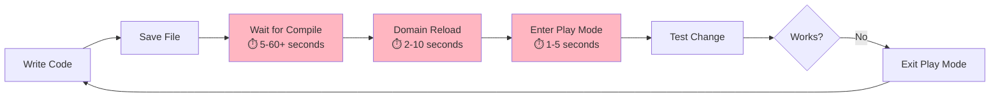
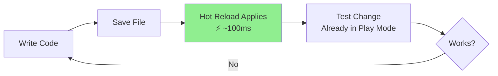

# Hot Reload for Unity

> **Edit code without compiling.** See your C# changes instantly in Play Mode, Edit Mode, and even
> on-device—no domain reload required.

Hot Reload is a C# compiler extension for Unity that eliminates the compile-wait-test loop. Make a
code change, and see the result in milliseconds. Your game keeps running, your state stays intact,
and you stay in flow.

---

## 🚀 Quick Start (30 Seconds)

```csharp
// 1. Start Play Mode
// 2. Edit this method in your IDE:
void Update()
{
    Debug.Log("Hello World");  // Change this text
}
// 3. Save the file
// 4. See the change instantly—no recompile!
```

**That's it.** Hot Reload watches your files and swaps the changed methods in real-time.

---

## 📚 Documentation Structure

### For Unity Developers of All Skill Levels

**🌱 [Getting Started](01-GETTING-STARTED.md)** — _10-minute read_

- What is Hot Reload?
- Installation (3 steps)
- Your first hot reload
- How it works under the hood
- Opening the Hot Reload window
- Basic workflow

**🎯 [Why Hot Reload?](02-WHY-HOT-RELOAD.md)** — _15-minute read_

- The compile-time problem
- Time and cost savings ($300/month per developer)
- Workflow comparison: Before vs After
- What Hot Reload can and cannot do
- Supported vs unsupported changes
- Alternative solutions (Fast Script Reload comparison)

**🔧 [How to Use It](03-HOW-TO-USE.md)** — _15-minute read_

- Opening Hot Reload window (Alt+Shift+H)
- Making hot reload changes
- Manual recompile button
- Using with different IDEs (VS Code, Rider, Visual Studio)
- On-device hot reload
- Working in Edit Mode vs Play Mode
- Integration with your workflow

**⚠️ [Common Pitfalls & Troubleshooting](04-TROUBLESHOOTING.md)** — _Reference guide_

- Changes not applying? Here's why
- "Auto Refresh" conflicts
- When to use manual recompile
- JetBrains Rider conflicts
- Performance issues
- Build inclusion problems
- Network/firewall issues
- Step-by-step troubleshooting checklist

**💡 [Best Practices & Examples](05-BEST-PRACTICES.md)** — _Cookbook_

- When to use Hot Reload vs full recompile
- Workflow patterns for maximum productivity
- Multi-developer team usage
- Hot Reload + unit tests
- Excluding from builds
- State management during development
- Common use cases with examples

---

## 🎯 What Problems Does Hot Reload Solve?

### The Pain: Unity's Compile Loop

Traditional Unity development looks like this:



**Total time per iteration:** 8-75+ seconds

### The Solution: Hot Reload's Workflow



**Total time per iteration:** < 1 second

### Real-World Impact

| Project Size            | Compile Time | Hot Reload Time | **Time Saved per Change** |
| ----------------------- | ------------ | --------------- | ------------------------- |
| Small (< 50 scripts)    | 5-10s        | 0.1s            | **~9.9s**                 |
| Medium (50-500 scripts) | 15-30s       | 0.1s            | **~29.9s**                |
| Large (500+ scripts)    | 30-60s+      | 0.1s            | **~59.9s**                |

**Average developer:** Makes ~100-200 code changes per day

**Time saved per day:** 15-200+ minutes (that's **2-3 hours!**)

---

## 💡 Why Hot Reload Exists

Unity's compilation process is designed for safety and correctness, but it's slow:

1. **Full compilation** — Even small changes recompile dependent scripts
2. **Domain reload** — Unity reloads all assemblies, resetting static state
3. **Scene reload** — In Play Mode, often requires re-entering the scene

**Hot Reload bypasses this** by:

- Only compiling the specific method that changed
- Swapping the method implementation at runtime
- Preserving all game state, static variables, and scene data

This is similar to hot reload in web development (e.g., React Fast Refresh) or native mobile
development (e.g., Flutter Hot Reload).

---

## 🚦 How to Use It: Quick Reference

### Opening Hot Reload

```
Option 1: Unity menu → Window → Hot Reload
Option 2: Keyboard shortcut → Alt + Shift + H (Windows/Linux) or ⌥ + ⇧ + H (Mac)
```

### Basic Workflow

```csharp
// 1. Enter Play Mode (or stay in Edit Mode)
void Start()
{
    Debug.Log("Version 1");
}

// 2. Edit the code while game is running
void Start()
{
    Debug.Log("Version 2 - hot reloaded!");
}

// 3. Save the file (Ctrl+S / Cmd+S)
// 4. Hot Reload applies the change instantly
// 5. The new code runs immediately
```

### When Changes Don't Apply

**Use the Recompile button** in the Hot Reload window for:

- Adding new methods, fields, or classes
- Changing method signatures
- Adding/removing using statements
- Modifying attributes

These changes require full compilation, but Hot Reload makes it one click away.

---

## ⚠️ How NOT to Use It

### ❌ Don't: Rely on it for structural changes

Hot Reload **cannot** hot reload:

- New classes
- New methods (must recompile first, then subsequent edits are hot reload-able)
- Changed method signatures
- New fields or properties
- Assembly definition changes

**Solution:** Use the **Recompile button** in Hot Reload window. It's faster than Unity's default
compile.

---

### ❌ Don't: Expect it to replace all compilation

```csharp
// This requires recompile (adding new field)
public class Player : MonoBehaviour
{
    [SerializeField] private int newHealthValue; // ← New field

    void TakeDamage()
    {
        Debug.Log("Took damage"); // ← This CAN be hot reloaded after recompile
    }
}
```

**What works:**

1. Add the field → Click Recompile
2. Edit the method body → Hot Reload applies automatically

---

### ❌ Don't: Use Auto Refresh alongside Hot Reload

Hot Reload manages Unity's Auto Refresh for you. Enabling it manually causes conflicts:

```
Unity → Edit → Preferences → Asset Pipeline → Auto Refresh: Off ✓
```

Hot Reload automatically enables/disables this as needed. **Don't touch it.**

---

### ❌ Don't: Include Hot Reload in builds

Hot Reload is for development only. It should **never** be in production builds.

**Solution:** Hot Reload automatically excludes itself from builds, but verify by:

- Checking build logs for Hot Reload files
- Testing a development build
- Using conditional compilation if needed

---

## 🐛 Common Pitfalls & Solutions

### 1. "Changes aren't applying"

**Symptoms:** You save code, but nothing changes in Unity.

**Causes & Fixes:**

| Cause                     | Solution                                                       |
| ------------------------- | -------------------------------------------------------------- |
| Unsupported change type   | Click **Recompile** button in Hot Reload window                |
| Hot Reload isn't running  | Open Hot Reload window: Alt+Shift+H                            |
| Compilation error         | Check Console for errors (Hot Reload can't apply invalid code) |
| File save didn't register | Re-save the file (Ctrl+S)                                      |

---

### 2. JetBrains Rider conflicts

**Symptoms:** Files keep recompiling when you don't expect it.

**Cause:** Rider's "Automatically Refresh Assets in Unity" conflicts with Hot Reload.

**Solution:**

```
Rider → Settings → Languages & Frameworks → Unity Engine
→ Uncheck "Automatically Refresh Assets in Unity"
```

---

### 3. First-time setup download

**Symptoms:** Hot Reload pauses on first startup.

**Cause:** Hot Reload downloads a platform-specific binary (~50-100MB).

**What's happening:**

```
Hot Reload → Downloads server binary → Stores at:
- Windows: %LocalAppData%/singularitygroup-hotreload/
- Mac: ~/Library/Application Support/singularitygroup-hotreload/
- Linux: ~/.local/share/singularitygroup-hotreload/
```

**Solution:** Wait for download (one-time only). Check firewall if it fails.

---

### 4. Static state preservation confusion

**Symptoms:** You expect a variable to reset, but it doesn't.

**Cause:** Hot Reload preserves static variables—that's a feature!

```csharp
public class GameManager : MonoBehaviour
{
    private static int score = 0; // ← This persists across hot reloads!

    void Start()
    {
        score++; // If you hot reload this, score keeps incrementing
        Debug.Log($"Score: {score}");
    }
}
```

**Solution:** Manually reset state if needed, or exit/re-enter Play Mode.

---

### 5. Large projects feel slow

**Symptoms:** Hot Reload takes 1-3 seconds instead of milliseconds.

**Cause:** Usually not Hot Reload itself, but Unity's background compilation.

**Solution:**

- Close Hot Reload window when not actively iterating
- Disable Unity's Assembly Recompilation if you're not changing assemblies
- Use assembly definitions to isolate code

---

## 🔍 Troubleshooting Checklist

**If Hot Reload isn't working, check these in order:**

- [ ] Is Hot Reload window open? (Alt+Shift+H)
- [ ] Are there compilation errors in the Console?
- [ ] Did you save the file after editing? (Ctrl+S)
- [ ] Is the change supported by Hot Reload? (Try Recompile button)
- [ ] Using JetBrains Rider? Disable "Automatically Refresh Assets"
- [ ] Firewall blocking first-time download?
- [ ] Try restarting Unity
- [ ] Check Hot Reload window for status messages

---

## 💼 Real-World Examples

### Example 1: Tweaking Game Balance

```csharp
public class Enemy : MonoBehaviour
{
    void TakeDamage(int amount)
    {
        // ❌ Before Hot Reload:
        // 1. Change damage value → 2. Wait 30s compile → 3. Re-enter Play Mode → 4. Test
        // Total: ~45 seconds per iteration

        // ✅ With Hot Reload:
        // 1. Change damage value → 2. Save → 3. Instant reload → 4. Test
        // Total: ~2 seconds per iteration

        health -= amount * 1.5f; // Tweak this multiplier freely!

        if (health <= 0)
            Die();
    }
}
```

**Result:** Balance 10 enemies in 30 seconds instead of 10 minutes.

---

### Example 2: Debugging Visual Effects

```csharp
public class VFXController : MonoBehaviour
{
    void PlayExplosion()
    {
        // Hot reload these values while watching the effect play!
        float size = 2.5f;      // ← Change this
        float duration = 1.2f;  // ← Change this
        Color color = Color.red; // ← Change this

        // See the result immediately without restarting
        explosionVFX.transform.localScale = Vector3.one * size;
        explosionVFX.Play();
    }
}
```

**Result:** Perfect your VFX in seconds instead of minutes.

---

### Example 3: Iterating on AI Behavior

```csharp
public class AIController : MonoBehaviour
{
    void Update()
    {
        float detectionRange = 10f; // ← Hot reload this while AI is running

        if (Vector3.Distance(transform.position, player.position) < detectionRange)
        {
            // ← Hot reload this entire logic block
            ChasePlayer();
        }
        else
        {
            Patrol();
        }
    }
}
```

**Result:** Test AI parameters in real-time without re-entering scenes.

---

## 📊 Performance & Compatibility

### Performance

| Metric                 | Hot Reload                  | Unity Default  |
| ---------------------- | --------------------------- | -------------- |
| Method edit apply time | ~100ms                      | 10-60+ seconds |
| Memory overhead        | Minimal (~10-50MB)          | N/A            |
| Build time impact      | None (excluded from builds) | N/A            |
| CPU usage while idle   | Near zero                   | N/A            |

### Compatibility

| Platform                  | Supported | Notes                       |
| ------------------------- | --------- | --------------------------- |
| **Windows**               | ✅ Yes    | Fully supported             |
| **Mac (Intel)**           | ✅ Yes    | Fully supported             |
| **Mac (Apple Silicon)**   | ✅ Yes    | Native ARM support          |
| **Linux**                 | ✅ Yes    | Fully supported             |
| **On-device iOS/Android** | ✅ Yes    | Requires network connection |
| **WebGL**                 | ❌ No     | Not supported               |

### Unity Version Support

- **Unity 2019.4+**: Supported
- **Unity 2020.3 LTS+**: Fully supported
- **Unity 2021.3 LTS+**: Fully supported
- **Unity 2022.3 LTS+**: Fully supported
- **Unity 6 (2023.2+)**: Fully supported

---

## 🎓 Learning Path

### Beginner (15 minutes)

1. Read **[Getting Started](01-GETTING-STARTED.md)** — Install and make your first hot reload
2. Try **Example 1** above — Edit a Debug.Log statement while in Play Mode
3. Open the Hot Reload window (Alt+Shift+H) and explore

### Intermediate (30 minutes)

1. Read **[Why Hot Reload?](02-WHY-HOT-RELOAD.md)** — Understand what's possible
2. Read **[How to Use It](03-HOW-TO-USE.md)** — Master the workflow
3. Try **Examples 2-3** above — Practice with your own project

### Advanced (1 hour)

1. Read **[Troubleshooting](04-TROUBLESHOOTING.md)** — Prepare for edge cases
2. Read **[Best Practices](05-BEST-PRACTICES.md)** — Optimize your workflow
3. Experiment with on-device hot reload

---

## 🔗 External Resources

- **[Official Website](https://hotreload.net/)** — Downloads, pricing, updates
- **[Documentation](https://hotreload.net/documentation/getting-started)** — Official guides
- **[Unity Asset Store](https://assetstore.unity.com/packages/tools/utilities/hot-reload-edit-code-without-compiling-254358)**
  — Reviews and updates
- **[Unity Forum](https://forum.unity.com/)** — Community support

**Open-source alternative:**

- **[Fast Script Reload](https://github.com/handzlikchris/FastScriptReload)** — Free, GitHub-hosted
  alternative with similar functionality

---

## 💰 Cost & Value

| Edition   | Price         | Target Audience              |
| --------- | ------------- | ---------------------------- |
| **Free**  | $0            | Hobbyists, small projects    |
| **Indie** | ~$10-15/month | Solo developers, small teams |
| **Pro**   | ~$30-40/month | Studios, large projects      |

**ROI Calculation:**

- Average time saved: 2-3 hours/day
- Developer hourly rate: $50-100/hour
- **Value delivered:** ~$300-600/month per developer

**Recommendation:** Even the paid tiers pay for themselves within days.

---

## 🎯 Next Steps

**New to Hot Reload?** → Start with **[Getting Started](01-GETTING-STARTED.md)**

**Want to understand the limits?** → Read **[Why Hot Reload?](02-WHY-HOT-RELOAD.md)**

**Ready to optimize your workflow?** → Check out **[How to Use It](03-HOW-TO-USE.md)**

**Running into issues?** → See **[Troubleshooting](04-TROUBLESHOOTING.md)**

**Want proven patterns?** → Browse **[Best Practices](05-BEST-PRACTICES.md)**

---

## 🤝 Contributing to These Docs

Found an issue or want to add an example? These docs live in:

- `docs/hot-reload/README.md` (this file)
- `docs/hot-reload/01-GETTING-STARTED.md`
- `docs/hot-reload/02-WHY-HOT-RELOAD.md`
- `docs/hot-reload/03-HOW-TO-USE.md`
- `docs/hot-reload/04-TROUBLESHOOTING.md`
- `docs/hot-reload/05-BEST-PRACTICES.md`

---

## 💡 Philosophy

Hot Reload embodies one principle:

**"Stay in flow."**

Compilation breaks focus, disrupts iteration, and kills momentum. Hot Reload eliminates the wait, so
you can stay immersed in building your game.

These docs follow the same philosophy: clear examples, real-world patterns, and pragmatic advice for
developers of all skill levels.

---

**Happy Hot Reloading!** ⚡

_Documentation last updated: 2025-10-15_
