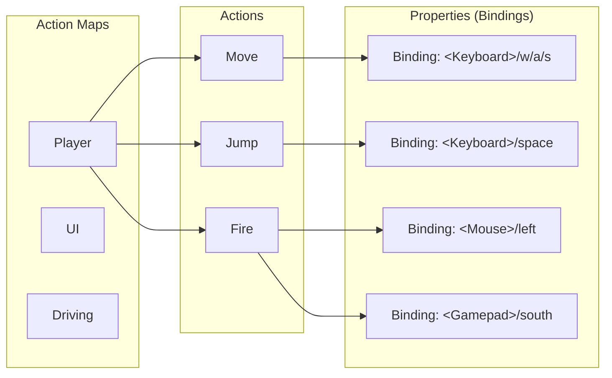

# Getting Started with Unity's Input System

> **Quick Start**: Install the Input System package, create an Input Actions asset, add a
> PlayerInput component, and subscribe to action events — that's it!

## What is the Input System?

Unity's Input System is a **modern, flexible framework** for handling player input across all
devices and platforms. Instead of writing polling code that checks for specific keys every frame,
you define abstract "actions" that players trigger with any input device — and your code responds to
events when those actions happen.

```csharp
// Old way (Input Manager)
void Update()
{
    if (Input.GetKeyDown(KeyCode.Space))  // Hardcoded key, polling every frame
        Jump();
}

// New way (Input System)
void Awake()
{
    _jumpAction.performed += ctx => Jump();  // Event-driven, any device
}
```

## What Problem Does the Input System Solve?

### The Problem: The Legacy Input Manager is Limited

Without the Input System, handling input requires:

```csharp
// ❌ Polling every frame (wasteful)
void Update()
{
    // Hardcoded key names - not rebindable
    if (Input.GetKeyDown(KeyCode.Space) || Input.GetButtonDown("Jump"))
    {
        Jump();
    }

    // Platform-specific code
    #if UNITY_STANDALONE
        float horizontal = Input.GetAxis("Horizontal");
    #elif UNITY_MOBILE
        float horizontal = virtualJoystick.Horizontal;
    #elif UNITY_GAMEPAD
        float horizontal = Input.GetAxis("LeftStickX");
    #endif

    Move(horizontal);
}

// ❌ No runtime rebinding - players can't customize controls
// ❌ Tedious gamepad support - different button layouts per manufacturer
// ❌ Complex multiplayer - manually tracking which device belongs to which player
// ❌ String-based API - no IntelliSense, prone to typos
```

### The Solution: Input System Does It All For You

With the Input System:

```csharp
// ✅ Event-driven (zero waste)
void Awake()
{
    _controls = new PlayerControls();  // Generated class from Input Actions

    // Subscribe to events - no Update() needed!
    _controls.Player.Jump.performed += OnJump;
    _controls.Player.Move.performed += OnMove;
}

void OnEnable() => _controls.Enable();
void OnDisable() => _controls.Disable();

void OnJump(InputAction.CallbackContext context)
{
    Jump();  // Works with Space, Gamepad South Button, or custom binding!
}

void OnMove(InputAction.CallbackContext context)
{
    Vector2 movement = context.ReadValue<Vector2>();
    Move(movement);  // Works with WASD, Arrow Keys, Gamepad Stick, or Touch!
}

// ✅ Runtime rebinding built-in
// ✅ Automatic gamepad support (Xbox, PlayStation, Switch, etc.)
// ✅ Native multiplayer with PlayerInput component
// ✅ Type-safe generated classes with IntelliSense
// ✅ Cross-platform - same code on PC, console, mobile
```

**Key Benefits:**

- ⚡ **Better Performance**: Event-driven instead of polling every frame
- 🎮 **Universal Device Support**: One action works on keyboard, gamepad, touch, and custom
  controllers
- 🔧 **Runtime Rebinding**: Players can customize controls without code changes
- 👥 **Native Multiplayer**: Each player gets their own input instance automatically
- 🌍 **Cross-Platform**: Write once, works everywhere
- 📝 **Type-Safe**: Generated C# classes with IntelliSense support

## Installation

### Step 1: Install the Package

Unity's Input System is distributed as a package via the Package Manager.

```
1. Open Unity Editor
2. Go to Window → Package Manager
3. In the top-left dropdown, select "Unity Registry"
4. Search for "Input System"
5. Click "Install" (or "Update" if already installed)
6. Unity will prompt you to restart the Editor - click "Yes"
```

**Why the restart?** The Input System replaces Unity's backend input handling, requiring an editor
restart to switch.

### Step 2: Enable the New Input System

After restarting, Unity needs to know which input backend to use.

```
1. Go to Edit → Project Settings
2. Select "Player" in the left sidebar
3. Scroll down to "Active Input Handling"
4. Select one of:
   - "Input System Package (New)" - Recommended for new projects
   - "Both" - If you need to support old Input Manager code during migration
```

**Recommendation**: Use "Input System Package (New)" for new projects to avoid confusion. Use "Both"
only if migrating an existing project.

### Step 3: Verify Installation

Create a simple test to verify everything works:

```csharp
using UnityEngine;
using UnityEngine.InputSystem;

public class InputSystemTest : MonoBehaviour
{
    void Update()
    {
        // Test keyboard
        if (Keyboard.current != null && Keyboard.current.spaceKey.wasPressedThisFrame)
            Debug.Log("Space pressed!");

        // Test gamepad
        if (Gamepad.current != null && Gamepad.current.buttonSouth.wasPressedThisFrame)
            Debug.Log("Gamepad button pressed!");
    }
}
```

Attach this script to any GameObject and press Space or a gamepad button. If you see logs, the Input
System is working!

## Your First Input Actions Asset

The **Input Actions Asset** is the heart of the Input System. It's where you define:

- **Actions**: What the player can do (Jump, Move, Fire, etc.)
- **Bindings**: Which buttons/keys trigger those actions
- **Control Schemes**: Device configurations (Keyboard, Gamepad, Touch)

### Creating an Input Actions Asset

```
1. Right-click in the Project window
2. Select Create → Input Actions
3. Name it "PlayerControls" (or any name you like)
4. Double-click the asset to open the Input Actions Editor
```

### Understanding the Input Actions Editor

The editor has three main sections:



**Action Maps**: Different input contexts (e.g., "Player" for gameplay, "UI" for menus) **Actions**:
Individual inputs the player can trigger **Properties**: The actual buttons/keys that trigger each
action

### Building Your First Action Map

Let's create a basic player control scheme:

#### Step 1: Create an Action Map

```
1. In the Input Actions Editor, the default "Action Map" is already created
2. Rename it to "Player" (click the name to edit)
```

#### Step 2: Add Actions

```
1. Click the "+" next to Actions
2. Add these actions:
   - "Move" (for WASD/analog stick movement)
   - "Jump" (for jumping)
   - "Look" (for camera/aiming)
   - "Interact" (for object interaction)
```

#### Step 3: Configure Action Types

Select the "Move" action and configure it:

```
Inspector Panel:
- Action Type: Value
- Control Type: Vector2
```

Why? Movement is continuous (not a one-time button press) and outputs a 2D direction.

Select the "Jump" action:

```
Inspector Panel:
- Action Type: Button
- Control Type: Button
```

Why? Jumping is a one-shot action triggered by pressing a button.

#### Step 4: Add Bindings

**For "Move" action:**

```
1. Select "Move" in the Actions column
2. Click the "+" next to "Move" in Properties
3. Select "Add Up/Down/Left/Right Composite"
4. This creates a WASD-style input that outputs Vector2

Configure the composite:
- Up: <Keyboard>/w
- Down: <Keyboard>/s
- Left: <Keyboard>/a
- Right: <Keyboard>/d

5. Add another binding for gamepad:
   - Click "+" next to "Move" again
   - Select "Add Binding"
   - Click "Listen" and move your gamepad stick
   - Or manually type: <Gamepad>/leftStick
```

**For "Jump" action:**

```
1. Select "Jump"
2. Click "+" → "Add Binding"
3. Click "Listen" and press Space
4. Add another binding for gamepad:
   - Click "+" → "Add Binding"
   - Type: <Gamepad>/buttonSouth (A on Xbox, X on PlayStation)
```

#### Step 5: Generate C# Class (Recommended)

This creates a type-safe class for easy access:

```
1. In the top of the Input Actions Editor window
2. Check ✅ "Generate C# Class"
3. Set Class Name: "PlayerControls"
4. Set Namespace: (optional, leave blank or use your project namespace)
5. Click "Apply"
6. Click "Save Asset"
```

Unity will create a `PlayerControls.cs` file next to your Input Actions asset. This generated class
provides IntelliSense and type safety!

### Understanding the Generated Class

After generating, you can use it like this:

```csharp
PlayerControls controls = new PlayerControls();

// Access actions via properties
controls.Player.Move.performed += OnMove;
controls.Player.Jump.performed += OnJump;
```

No more string-based lookups! IntelliSense shows all available actions.

## Your First Complete Example

Let's build a simple player controller that uses the Input Actions we created.

### Step 1: Create the Scene

```
1. Create a new Scene
2. Add a Plane (GameObject → 3D Object → Plane) for the ground
3. Add a Capsule (GameObject → 3D Object → Capsule) for the player
4. Position the Capsule above the Plane (Y = 1)
```

### Step 2: Create the Player Script

```csharp
using UnityEngine;
using UnityEngine.InputSystem;

public class PlayerController : MonoBehaviour
{
    [Header("Movement")]
    [SerializeField] private float moveSpeed = 5f;
    [SerializeField] private float jumpForce = 5f;

    private PlayerControls _controls;
    private Rigidbody _rigidbody;
    private bool _isGrounded;

    void Awake()
    {
        // Get components
        _rigidbody = GetComponent<Rigidbody>();

        // Create input controls instance
        _controls = new PlayerControls();

        // Subscribe to input events
        _controls.Player.Jump.performed += OnJump;
        _controls.Player.Move.performed += OnMove;
        _controls.Player.Move.canceled += OnMove;  // Handle stick release
    }

    void OnEnable()
    {
        // Enable the Player action map
        _controls.Player.Enable();
    }

    void OnDisable()
    {
        // Disable when the component is disabled
        _controls.Player.Disable();
    }

    void OnDestroy()
    {
        // Always unsubscribe to prevent memory leaks!
        _controls.Player.Jump.performed -= OnJump;
        _controls.Player.Move.performed -= OnMove;
        _controls.Player.Move.canceled -= OnMove;
    }

    void OnMove(InputAction.CallbackContext context)
    {
        // Read the movement vector (Vector2 from WASD or analog stick)
        Vector2 input = context.ReadValue<Vector2>();

        // Convert to 3D movement (XZ plane)
        Vector3 movement = new Vector3(input.x, 0, input.y);

        // Apply movement
        _rigidbody.velocity = new Vector3(
            movement.x * moveSpeed,
            _rigidbody.velocity.y,  // Preserve vertical velocity
            movement.z * moveSpeed
        );
    }

    void OnJump(InputAction.CallbackContext context)
    {
        // Only jump if grounded
        if (_isGrounded)
        {
            _rigidbody.AddForce(Vector3.up * jumpForce, ForceMode.Impulse);
            _isGrounded = false;
        }
    }

    void OnCollisionEnter(Collision collision)
    {
        // Simple ground detection
        if (collision.gameObject.CompareTag("Ground"))
        {
            _isGrounded = true;
        }
    }
}
```

### Step 3: Set Up the Player

```
1. Attach PlayerController script to the Capsule
2. Add a Rigidbody component to the Capsule
3. Freeze Rotation on X and Z axes (Inspector → Rigidbody → Constraints)
4. Tag the Plane as "Ground" (Inspector → Tag → Ground, create if needed)
```

### Step 4: Test It!

Press Play and:

- **WASD** or **Left Stick** to move
- **Space** or **Gamepad South Button** to jump

It works on keyboard and gamepad simultaneously with zero extra code!

## What Just Happened?

Let's break down the magic:

1. **Input Actions Asset** defined abstract actions ("Move", "Jump")
2. **Bindings** mapped multiple inputs (WASD, gamepad stick, Space, gamepad button) to those actions
3. **Generated Class** provided type-safe access to actions
4. **Event Subscription** connected input to game logic
5. **ReadValue<T>()** extracted the actual input data from the event
6. **Enable/Disable** controlled when input was active

### Key Concepts Demonstrated

**Event-Driven**: No `Update()` loop checking input every frame — callbacks fire only when input
changes.

**Device Agnostic**: The same action works for keyboard, gamepad, or any other device without extra
code.

**Type Safety**: The generated class provides IntelliSense and compile-time checking.

**Lifecycle Management**:

- `Awake()`: Create input instance and subscribe
- `OnEnable()`: Enable input
- `OnDisable()`: Disable input
- `OnDestroy()`: Unsubscribe to prevent memory leaks

## Alternative: Using PlayerInput Component

If you prefer a component-based approach instead of writing code, Unity provides the **PlayerInput**
component.

### Setup with PlayerInput

```
1. Add a PlayerInput component to your player GameObject
2. In the Inspector, assign your Input Actions asset
3. Select "Invoke Unity Events" for Behavior
4. Unfold the "Events" section
5. Add callbacks for each action (Move, Jump, etc.)
```

### Using UnityEvents

```csharp
using UnityEngine;
using UnityEngine.InputSystem;

public class PlayerInputController : MonoBehaviour
{
    [SerializeField] private float moveSpeed = 5f;
    private Rigidbody _rigidbody;

    void Awake()
    {
        _rigidbody = GetComponent<Rigidbody>();
    }

    // Called automatically by PlayerInput component
    public void OnMove(InputValue value)
    {
        Vector2 input = value.Get<Vector2>();
        Vector3 movement = new Vector3(input.x, 0, input.y);
        _rigidbody.velocity = new Vector3(
            movement.x * moveSpeed,
            _rigidbody.velocity.y,
            movement.z * moveSpeed
        );
    }

    // Called automatically by PlayerInput component
    public void OnJump(InputValue value)
    {
        if (value.isPressed)
            _rigidbody.AddForce(Vector3.up * 5f, ForceMode.Impulse);
    }
}
```

**Pros of PlayerInput Component:**

- No need to manually subscribe/unsubscribe
- Visual setup in Inspector
- Perfect for prototyping

**Cons:**

- Less control over timing (only .performed equivalent)
- Harder to debug (UnityEvents are less visible than code)
- String-based method names (prone to typos)

**Recommendation**: Use the scripted approach for production code, PlayerInput for quick prototypes.

## Input Actions Best Practices

### ✅ DO: Organize Actions into Action Maps

```
Player (Action Map)
  ├─ Move
  ├─ Jump
  ├─ Interact
  └─ Attack

UI (Action Map)
  ├─ Navigate
  ├─ Submit
  └─ Cancel

Driving (Action Map)
  ├─ Steer
  ├─ Accelerate
  └─ Brake
```

Why? You can enable/disable entire contexts at once:

```csharp
_controls.Player.Disable();  // Disable gameplay input
_controls.UI.Enable();        // Enable menu input
```

### ✅ DO: Use Composite Bindings for Directional Input

For WASD-style movement, use "2D Vector Composite" instead of individual key bindings.

```
Move (Action)
  └─ 2D Vector Composite
      ├─ Up: W
      ├─ Down: S
      ├─ Left: A
      └─ Right: D
```

This automatically:

- Combines four keys into a single Vector2
- Normalizes diagonal movement (prevents moving faster diagonally)
- Works seamlessly with analog sticks

### ✅ DO: Generate C# Classes

Always check "Generate C# Class" for:

- IntelliSense support
- Type safety
- Refactoring safety (rename actions and get compile errors if missed)

### ✅ DO: Enable/Disable Action Maps Appropriately

```csharp
void ShowPauseMenu()
{
    _controls.Player.Disable();  // Stop gameplay input
    _controls.UI.Enable();        // Enable menu navigation
    Time.timeScale = 0;
}

void ClosePauseMenu()
{
    _controls.UI.Disable();
    _controls.Player.Enable();
    Time.timeScale = 1;
}
```

### ❌ DON'T: Forget to Unsubscribe

```csharp
// ❌ Memory leak!
void Awake()
{
    _controls.Player.Jump.performed += OnJump;
}
// Missing OnDestroy to unsubscribe!

// ✅ Proper cleanup
void OnDestroy()
{
    _controls.Player.Jump.performed -= OnJump;
}
```

### ❌ DON'T: Mix Input Manager and Input System

```csharp
// ❌ Confusing and inconsistent
void Update()
{
    if (Input.GetKeyDown(KeyCode.Space))  // Old Input Manager
        Jump();

    Vector2 move = _moveAction.ReadValue<Vector2>();  // New Input System
}

// ✅ Stick to one system
void Awake()
{
    _jumpAction.performed += OnJump;
    _moveAction.performed += OnMove;
}
```

### ❌ DON'T: Poll in Update() if Using Events

```csharp
// ❌ Wastes performance - polling when you have events!
void Update()
{
    if (_jumpAction.triggered)
        Jump();
}

// ✅ Use events instead
void Awake()
{
    _jumpAction.performed += ctx => Jump();
}
```

## When to Use the Input System vs Alternatives

### Use Input System When:

✅ **Cross-platform support**: Your game targets PC, console, and/or mobile ✅ **Gamepad support**:
You want plug-and-play controller support ✅ **Runtime rebinding**: Players need to customize
controls ✅ **Local multiplayer**: Multiple players on one device ✅ **Complex input**: Combos,
charge attacks, or context-sensitive controls ✅ **Event-driven architecture**: You prefer callbacks
over polling ✅ **Future-proofing**: You want long-term Unity support

### Use Legacy Input Manager When:

⚠️ **Rapid prototyping**: Very early concept testing (but consider learning curve) ⚠️ **Legacy
project**: Migrating isn't worth the effort (but consider technical debt) ⚠️ **Simple PC-only
game**: Keyboard-only with no special features

### Don't Use Either — Use a Plugin When:

🔌 **Rewired**: If you need even more features than Input System (MMO hotbars, admin consoles) 🔌
**InControl**: Legacy projects that prefer a lightweight third-party solution

**Recommendation**: For new projects in 2024+, use Unity's Input System. It's the official,
supported, and most future-proof option.

## Common Questions

### Q: Can I use both Input Manager and Input System?

**A:** Yes, Unity allows "Both" mode in Project Settings, but it's **not recommended**. It's
confusing for new developers and can cause unexpected behavior. Only use "Both" during migration,
then switch to "Input System Package (New)" when done.

### Q: Will the Input System work on mobile?

**A:** Yes! The Input System supports touch input, accelerometer, gyroscope, and on-screen controls.
See [Advanced Techniques](./03-advanced-techniques.md#mobile-input) for details.

### Q: Can I rebind controls at runtime?

**A:** Yes! The Input System has a full rebinding API. Players can remap any action to any
button/key. See [Advanced Techniques](./03-advanced-techniques.md#runtime-rebinding) for a complete
guide.

### Q: Does it work with Unity UI?

**A:** Yes! The Input System integrates seamlessly with both legacy Unity UI and UI Toolkit. See
[Common Patterns](./04-common-patterns.md#menu-navigation) for setup.

### Q: How do I handle multiple players?

**A:** Use the **PlayerInputManager** component to spawn players dynamically, or manually create
multiple **PlayerInput** components. See
[Advanced Techniques](./03-advanced-techniques.md#multiplayer) for details.

### Q: What about Steam Input API?

**A:** The Input System can integrate with Steam Input for advanced controller glyphs and Steam Deck
support. The IshoBoy project demonstrates this — see `KInputService.cs` for an example. More details
in [Advanced Techniques](./03-advanced-techniques.md#steam-input).

### Q: Is it slower than Input.GetKey()?

**A:** No! In fact, event-driven input is typically **faster** because you only process input when
it changes, rather than checking every frame. The Input System uses efficient native code for device
polling.

### Q: Can I use it with networked multiplayer?

**A:** Yes, but you'll need to send input state over the network yourself. The Input System doesn't
handle networking — it only manages local input. You typically serialize input actions and send them
to the server, then replay on clients.

## Next Steps

Now that you've created your first Input Actions and built a basic player controller:

1. **[Core Concepts](./02-core-concepts.md)** — Deep dive into Action Types, Control Schemes,
   Processors, and Interactions
2. **[Common Patterns](./04-common-patterns.md)** — Ready-to-use patterns for movement, aiming,
   menus, and more
3. **[Advanced Techniques](./03-advanced-techniques.md)** — Runtime rebinding, multiplayer, mobile,
   and Steam Input
4. **[Troubleshooting](./05-troubleshooting.md)** — Solutions to common problems and optimization
   tips

## Quick Reference Card

```csharp
using UnityEngine.InputSystem;

// Create Input Actions instance
PlayerControls controls = new PlayerControls();

// Subscribe to actions
controls.Player.Jump.started += OnJumpStarted;      // Button pressed
controls.Player.Jump.performed += OnJumpPerformed;  // Action triggered
controls.Player.Jump.canceled += OnJumpCanceled;    // Button released

// Enable/disable
controls.Enable();              // Enable all action maps
controls.Player.Enable();       // Enable specific action map
controls.Player.Disable();      // Disable specific action map

// Read values
bool pressed = jumpAction.triggered;                // Was triggered this frame?
Vector2 move = moveAction.ReadValue<Vector2>();     // Current value

// In callbacks
void OnMove(InputAction.CallbackContext context)
{
    Vector2 value = context.ReadValue<Vector2>();
    bool pressed = context.ReadValueAsButton();
}

// Cleanup
void OnDestroy()
{
    controls.Player.Jump.performed -= OnJumpPerformed;
}
```

---

**Ready to dive deeper?** Continue to [Core Concepts](./02-core-concepts.md) to understand how the
Input System really works!
