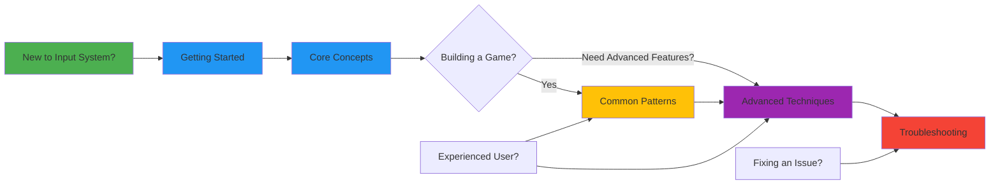

# Unity's New Input System - Complete Guide

Welcome to the comprehensive guide for **Unity's Input System**, the modern, flexible approach to
handling player input that replaces the legacy Input Manager with a powerful, event-driven
architecture.

---

## 📚 What is the Input System?

Unity's Input System is a **modern input handling framework** that gives you complete control over
how your game responds to player actions. Instead of polling for key presses and hardcoding button
names, you define abstract "actions" that players can trigger with any input device — keyboards,
gamepads, touchscreens, or even custom controllers.

```csharp
// That's it! No Update() polling, no GetKey() checks, just clean events
playerInput.actions["Jump"].performed += OnJump;
```

---

## 🎯 Why Use the Input System?

| Legacy Input Manager                  | New Input System            |
| ------------------------------------- | --------------------------- |
| Hardcoded key names (`KeyCode.Space`) | Abstract actions (`"Jump"`) |
| Polling in Update()                   | Event-driven callbacks      |
| Manual controller support             | Automatic device detection  |
| No runtime rebinding                  | Built-in control remapping  |
| Single player focus                   | Native multiplayer support  |
| Platform-specific code                | Cross-platform by default   |

**Result:** Less code, better performance, happier players across all devices.

---

## 🚀 Quick Start

```csharp
using UnityEngine;
using UnityEngine.InputSystem;

public class SimplePlayer : MonoBehaviour
{
    private PlayerInput _playerInput;
    private InputAction _moveAction;
    private InputAction _jumpAction;

    void Awake()
    {
        _playerInput = GetComponent<PlayerInput>();
        _moveAction = _playerInput.actions["Move"];
        _jumpAction = _playerInput.actions["Jump"];

        // Subscribe to events (no Update() needed!)
        _jumpAction.performed += OnJump;
    }

    void Update()
    {
        // Read continuous input only when needed
        Vector2 movement = _moveAction.ReadValue<Vector2>();
        transform.Translate(new Vector3(movement.x, 0, movement.y) * Time.deltaTime);
    }

    void OnJump(InputAction.CallbackContext context)
    {
        Debug.Log("Jump triggered!");
    }

    void OnDestroy()
    {
        _jumpAction.performed -= OnJump;
    }
}
```

---

## 📖 Documentation Structure

This guide is organized into comprehensive sections to take you from beginner to expert:

### 1. 🟢 [Getting Started](./01-GETTING-STARTED.md)

**Perfect for:** First-time users and those evaluating the Input System

**What's inside:**

- What is the Input System and why use it?
- Installation and project setup
- Creating your first Input Actions Asset
- Your first interactive character in under 10 minutes
- When to use the Input System vs alternatives

**⏱️ Time to read:** 15-20 minutes | **📄 Skip to:**
[Installation Guide](./01-GETTING-STARTED.md#installation)

---

### 2. 🔵 [Core Concepts](./02-CORE-CONCEPTS.md)

**Perfect for:** Understanding how the Input System works

**What's inside:**

- Input Actions, Action Maps, and Bindings
- Control Schemes (keyboard, gamepad, touchscreen)
- Action Types (Button, Value, Pass Through)
- Reading input values and handling events
- Composite Bindings (WASD, analog stick modifiers)
- Device auto-switching and detection
- The PlayerInput component deep-dive

**⏱️ Time to read:** 25-30 minutes | **📄 TL;DR available** at top of guide

---

### 3. 🟣 [Advanced Techniques](./03-ADVANCED-TECHNIQUES.md)

**Perfect for:** Building production-quality input systems

**What's inside:**

- Runtime control rebinding
- Multi-device support (keyboard + gamepad simultaneously)
- Local multiplayer with multiple PlayerInput instances
- Custom Processors and Interactions
- Input buffering and combo detection
- Touch and mobile input best practices
- Steam Input integration
- UI input handling (EventSystem integration)
- Debugging and profiling input

**⏱️ Time to read:** 35-45 minutes | **📄 TL;DR available** | **Skip sections you don't need!**

---

### 4. 🟡 [Common Patterns](./04-COMMON-PATTERNS.md)

**Perfect for:** Solving specific input challenges

**What's inside:**

- Character movement (2D & 3D)
- Aim and look controls
- Menu navigation
- Inventory hotkeys
- Charging attacks (hold to charge, release to fire)
- Context-sensitive actions (same button, different results)
- Input hints and on-screen prompts
- Save/load control schemes
- Accessibility features

**⏱️ Time to read:** 30-40 minutes | **Browse as needed** — each pattern is self-contained!

---

### 5. 🔴 [Troubleshooting & Best Practices](./05-TROUBLESHOOTING.md)

**Perfect for:** Fixing common issues and optimizing

**What's inside:**

- Common pitfalls and solutions
- Performance optimization
- Memory management
- Input response feels laggy/unresponsive
- Actions firing multiple times
- Gamepad not detected
- Mobile touch not working
- UI consuming gameplay input
- Migration from legacy Input Manager

**⏱️ Time to read:** 20-25 minutes | **📄 Jump to:**
[Common Issues](./05-TROUBLESHOOTING.md#common-issues)

---

## 🎓 Learning Path



### For Beginners

1. Start with **[Getting Started](./01-GETTING-STARTED.md)** to install and create your first Input
   Actions
2. Read **[Core Concepts](./02-CORE-CONCEPTS.md)** to understand the architecture
3. Follow **[Common Patterns](./04-COMMON-PATTERNS.md)** for your specific use case
4. Reference **[Troubleshooting](./05-TROUBLESHOOTING.md)** when you hit issues

### For Experienced Developers

1. Skim **[Getting Started](./01-GETTING-STARTED.md)** for setup overview
2. Jump to **[Common Patterns](./04-COMMON-PATTERNS.md)** for implementation examples
3. Explore **[Advanced Techniques](./03-ADVANCED-TECHNIQUES.md)** for complex features
4. Check **[Troubleshooting](./05-TROUBLESHOOTING.md)** for optimization tips

### For Migrating from Input Manager

1. Read **"Why Migrate?"** in **[Getting Started](./01-GETTING-STARTED.md)**
2. Follow **[Migration Guide](./05-TROUBLESHOOTING.md#migration-guide)** in Troubleshooting
3. Study **[Core Concepts](./02-CORE-CONCEPTS.md)** to learn the new paradigm
4. Rebuild features using **[Common Patterns](./04-COMMON-PATTERNS.md)**

---

## 🔥 Key Features

### Core Features

| Feature                | Description                                            |
| ---------------------- | ------------------------------------------------------ |
| **Event-Driven**       | Subscribe to actions instead of polling in Update()    |
| **Device Agnostic**    | One action works on keyboard, gamepad, touch, and more |
| **Runtime Rebinding**  | Let players customize controls in-game                 |
| **Control Schemes**    | Automatically switch between keyboard/gamepad/mobile   |
| **Composite Bindings** | Combine multiple inputs (WASD → Vector2)               |
| **Action Maps**        | Switch entire input contexts (gameplay/menu/driving)   |
| **Native Multiplayer** | Each player gets their own input instance              |
| **UI Integration**     | Works seamlessly with Unity's UI systems               |
| **Cross-Platform**     | Identical code works on PC, console, mobile            |

### What Problems Does It Solve?

**Without Input System:**

```csharp
void Update()
{
    // ❌ Polling every frame (wasteful)
    if (Input.GetKeyDown(KeyCode.Space) ||
        Input.GetButtonDown("Jump")) // Hardcoded names
    {
        Jump();
    }

    // ❌ Platform-specific code
    #if UNITY_STANDALONE
        float move = Input.GetAxis("Horizontal");
    #elif UNITY_MOBILE
        float move = touchJoystick.Horizontal;
    #endif

    // ❌ No runtime rebinding
    // ❌ No easy gamepad support
    // ❌ Manual multiplayer handling
}
```

**With Input System:**

```csharp
void Awake()
{
    // ✅ Event-driven (efficient)
    _jumpAction.performed += ctx => Jump();

    // ✅ Automatic device handling
    _moveAction.performed += ctx =>
    {
        Vector2 move = ctx.ReadValue<Vector2>();
        Move(move);
    };

    // ✅ Runtime rebinding built-in
    // ✅ Gamepad automatically supported
    // ✅ Multiplayer with PlayerInput component
}
```

---

## 💡 Quick Reference Card

### Essential Input System Patterns

#### Creating Input Actions (in Inspector)

```
1. Right-click in Project → Create → Input Actions
2. Name it "PlayerControls"
3. Double-click to open Input Actions Editor
4. Add Action Maps (e.g., "Player", "UI")
5. Add Actions (e.g., "Move", "Jump", "Fire")
6. Add Bindings (e.g., <Keyboard>/space for Jump)
7. Check "Generate C# Class" for type-safe access
8. Click "Apply" and "Save Asset"
```

#### Subscribing to Actions

```csharp
// Get reference to action
InputAction jumpAction = playerInput.actions["Jump"];

// Subscribe to events
jumpAction.started += OnJumpStarted;     // Button pressed
jumpAction.performed += OnJumpPerformed; // Action triggered
jumpAction.canceled += OnJumpCanceled;   // Button released

// Don't forget to unsubscribe!
void OnDestroy()
{
    jumpAction.performed -= OnJumpPerformed;
}
```

#### Reading Values

```csharp
// Button (bool)
if (_jumpAction.triggered)
    Jump();

// Value - Continuous (float, Vector2, etc.)
Vector2 movement = _moveAction.ReadValue<Vector2>();

// In callback context
void OnMove(InputAction.CallbackContext context)
{
    Vector2 value = context.ReadValue<Vector2>();
}
```

#### Enabling/Disabling Input

```csharp
// Enable/disable entire action map
playerInput.actions.FindActionMap("Player").Enable();
playerInput.actions.FindActionMap("Player").Disable();

// Enable/disable specific action
_jumpAction.Enable();
_jumpAction.Disable();

// Switch action maps
playerInput.SwitchCurrentActionMap("UI"); // From "Player" to "UI"
```

#### Generated C# Class Usage (Recommended)

```csharp
// If you enabled "Generate C# Class" in Input Actions Asset
public class PlayerController : MonoBehaviour
{
    private PlayerControls _controls;

    void Awake()
    {
        _controls = new PlayerControls();

        // Type-safe access!
        _controls.Player.Jump.performed += OnJump;
        _controls.Player.Move.performed += OnMove;
    }

    void OnEnable() => _controls.Enable();
    void OnDisable() => _controls.Disable();

    void OnJump(InputAction.CallbackContext context)
    {
        Debug.Log("Jump!");
    }

    void OnMove(InputAction.CallbackContext context)
    {
        Vector2 move = context.ReadValue<Vector2>();
        transform.Translate(new Vector3(move.x, 0, move.y));
    }
}
```

---

## 🎮 Common Use Cases

| Use Case                        | Recommended Approach                          | Guide Section                                                        |
| ------------------------------- | --------------------------------------------- | -------------------------------------------------------------------- |
| **2D/3D character movement**    | Composite Binding (WASD/Arrow Keys → Vector2) | [Common Patterns](./04-COMMON-PATTERNS.md#character-movement)        |
| **Jump/shoot/interact buttons** | Button action with `.performed` event         | [Core Concepts](./02-CORE-CONCEPTS.md#action-types)                  |
| **Camera/aim controls**         | Value action (Vector2) with Delta processor   | [Common Patterns](./04-COMMON-PATTERNS.md#camera-controls)           |
| **Menu navigation**             | UI Action Map with Submit/Cancel actions      | [Common Patterns](./04-COMMON-PATTERNS.md#menu-navigation)           |
| **Gamepad support**             | Control Schemes with automatic switching      | [Core Concepts](./02-CORE-CONCEPTS.md#control-schemes)               |
| **Runtime control rebinding**   | Rebinding Operations API                      | [Advanced Techniques](./03-ADVANCED-TECHNIQUES.md#runtime-rebinding) |
| **Local multiplayer**           | Multiple PlayerInput components               | [Advanced Techniques](./03-ADVANCED-TECHNIQUES.md#multiplayer)       |
| **Mobile touch controls**       | Touch Action + On-Screen Controls             | [Advanced Techniques](./03-ADVANCED-TECHNIQUES.md#mobile-input)      |
| **Charging attacks**            | Hold Interaction with duration                | [Common Patterns](./04-COMMON-PATTERNS.md#charging-attacks)          |
| **Context-sensitive actions**   | Action Map switching                          | [Common Patterns](./04-COMMON-PATTERNS.md#context-actions)           |

---

## ⚠️ Common Mistakes to Avoid

| Mistake                       | Problem                               | Solution                                       |
| ----------------------------- | ------------------------------------- | ---------------------------------------------- |
| Not enabling actions          | Actions don't fire                    | Call `.Enable()` or enable in PlayerInput      |
| Forgetting to unsubscribe     | Memory leaks and null refs            | Always unsubscribe in OnDestroy/OnDisable      |
| Reading wrong value type      | Exceptions at runtime                 | Match action type (Button→bool, Value→Vector2) |
| Using Input.GetKey alongside  | Inconsistent behavior                 | Pick one system (prefer Input System)          |
| Not handling device switches  | Gamepad/keyboard conflicts            | Use Control Schemes or device filtering        |
| Polling triggered in Update() | Performance waste                     | Use events (.performed) instead                |
| Not testing on all platforms  | Controls don't work on mobile/console | Test with actual devices early                 |

See **[Troubleshooting](./05-TROUBLESHOOTING.md)** for detailed solutions.

---

## 🔧 System Requirements

- **Unity Version:** 2019.4 or newer (2021.3+ recommended)
- **Input System Package:** 1.0.2 or newer (install via Package Manager)
- **Scripting:** C# (basic knowledge required)
- **Platforms:** All Unity platforms supported

---

## 📦 What's Included in This Guide

✅ Complete beginner-to-expert tutorial ✅ Installation and setup instructions ✅ 15+ ready-to-use
code examples ✅ Visual diagrams and flowcharts ✅ Do's and don'ts with explanations ✅ Performance
optimization tips ✅ Common problem solutions ✅ Real-world patterns from IshoBoy project ✅ Steam
Input integration examples ✅ Official documentation references

---

## 🌐 Additional Resources

### Official Resources

- **[Official Documentation](https://docs.unity3d.com/Packages/com.unity.inputsystem@1.0/manual/index.html)** -
  Complete API reference
- **[GitHub Repository](https://github.com/Unity-Technologies/InputSystem)** - Open source, report
  issues
- **[Unity Forums](https://forum.unity.com/)** - Community support
- **[Input System Samples](https://github.com/Unity-Technologies/InputSystem/tree/develop/Assets/Samples)** -
  Official examples

### Community Resources

- **[Game Dev Beginner Guide](https://gamedevbeginner.com/input-in-unity-made-easy-complete-guide-to-the-new-system/)** -
  Excellent tutorial
- **[Brackeys Tutorial](https://www.youtube.com/watch?v=Yjee_e4fICc)** - YouTube walkthrough (if
  available)

---

## 🎯 Quick Navigation

### I want to...

- **Learn what the Input System is** → [Getting Started](./01-GETTING-STARTED.md)
- **Install and set it up** → [Installation Guide](./01-GETTING-STARTED.md#installation)
- **Understand how it works** → [Core Concepts](./02-CORE-CONCEPTS.md)
- **Make a character move** →
  [Common Patterns: Movement](./04-COMMON-PATTERNS.md#character-movement)
- **Support gamepads** → [Core Concepts: Control Schemes](./02-CORE-CONCEPTS.md#control-schemes)
- **Add runtime rebinding** → [Advanced: Rebinding](./03-ADVANCED-TECHNIQUES.md#runtime-rebinding)
- **Fix an issue** → [Troubleshooting](./05-TROUBLESHOOTING.md)
- **Migrate from old Input Manager** → [Migration Guide](./05-TROUBLESHOOTING.md#migration-guide)
- **Implement local multiplayer** → [Advanced: Multiplayer](./03-ADVANCED-TECHNIQUES.md#multiplayer)
- **Optimize performance** → [Troubleshooting: Performance](./05-TROUBLESHOOTING.md#performance)

---

## 💬 About This Guide

This guide is based on:

- Official Unity Input System documentation (v1.0+)
- Real-world usage in the **IshoBoy** project
- Community best practices and patterns
- Years of production experience with cross-platform input

**Key Project Example:** The IshoBoy project demonstrates:

- Multi-device support (keyboard, gamepad, Steam Input API)
- Dynamic glyph/icon switching based on active device
- Event-driven input architecture
- Cross-platform compatibility
- Custom input service abstraction

See `IshoBoy/Assets/Scripts/Gameplay/Input/KInputService.cs` for production implementation.

---

## 🚀 Ready to Get Started?

### New to the Input System?

**Start here:** [Getting Started Guide](./01-GETTING-STARTED.md)

Install the package, create your first Input Actions, and build an interactive character in under 15
minutes.

### Already familiar with basics?

**Jump to:** [Common Patterns](./04-COMMON-PATTERNS.md)

Browse 10+ ready-to-use implementation patterns for movement, shooting, menus, and more.

### Need advanced features?

**Check out:** [Advanced Techniques](./03-ADVANCED-TECHNIQUES.md)

Runtime rebinding, multiplayer, custom processors, Steam Input, and more.

### Troubleshooting an issue?

**Go to:** [Troubleshooting Guide](./05-TROUBLESHOOTING.md)

Solutions to common problems, performance tips, and migration help.

---

**Happy Gaming! 🎮**

_This guide covers Unity Input System 1.0+ for Unity 2019.4 and newer_
