# Odin Inspector & Serializer Documentation

> **Serialize ANYTHING. Expose EVERYTHING.** The Unity Inspector was never meant to be this powerful.

Odin Inspector & Serializer transforms Unity's Inspector from a basic viewer into a professional development tool. It solves Unity's two biggest serialization problems: **you can't serialize dictionaries** and **you can't easily run code from the Inspector**. With Odin, you can serialize any C# type (including dictionaries, properties, and custom classes) and create powerful Inspector buttons, validation, custom drawers, and visual workflows—all without writing a single custom editor.

---

## 🚀 Quick Start (30 Seconds)

```csharp
using Sirenix.OdinInspector;
using System.Collections.Generic;

public class PlayerInventory : SerializedMonoBehaviour  // Step 1: Inherit SerializedMonoBehaviour
{
    // ✨ DICTIONARY SERIALIZATION - Unity can't do this!
    [SerializeField]
    private Dictionary<string, int> _itemCounts = new();

    // ✨ INSPECTOR BUTTONS - Run code without entering play mode!
    [Button]
    private void AddRandomItem()
    {
        _itemCounts["Potion"] = Random.Range(1, 10);
    }

    // ✨ VISUAL PROPERTIES - Even works on properties!
    [ShowInInspector]
    public int TotalItems => _itemCounts.Values.Sum();
}
```

In the Inspector, you'll see:
- ✅ A fully editable dictionary with add/remove buttons
- ✅ A clickable "Add Random Item" button that runs immediately
- ✅ A read-only display of TotalItems that updates in real-time

That's the power of Odin. **Serialize anything. Do anything.**

---

## 📚 Documentation Structure

### For Unity Developers of All Skill Levels

**🌱 [Getting Started](01-GETTING-STARTED.md)** — *10-minute read*
- What problems does Odin solve?
- Installation and setup
- Your first serialized dictionary
- Your first Inspector button
- Attribute quick reference
- Migration from vanilla Unity

**💪 [Core Features](02-CORE-FEATURES.md)** — *25-minute read*
- Odin Serializer (dictionaries, properties, interfaces, polymorphism)
- Odin Inspector (buttons, validation, custom drawers, conditional visibility)
- Common attributes with examples
- Attribute combinations and patterns
- Performance considerations

**📖 [Advanced Techniques](03-ADVANCED-TECHNIQUES.md)** — *30-minute read*
- Custom attribute processors
- Editor-only fields and workflows
- Complex validation systems
- Custom type drawers
- Integration with external systems
- Build pipeline considerations

**🎯 [Common Patterns](04-COMMON-PATTERNS.md)** — *Cookbook*
- Dictionary patterns (item databases, state tracking, config management)
- Button patterns (dev tools, testing utilities, asset generation)
- Validation patterns (data integrity, reference checks)
- Editor workflow patterns (quick actions, batch operations)
- UI/UX patterns (tabs, foldouts, groups)
- Architecture patterns (data-driven design, designer-friendly systems)

**⚠️ [Best Practices & Pitfalls](05-BEST-PRACTICES.md)** — *What to do and what NOT to do*
- Serialization best practices
- Performance optimization
- Common mistakes and solutions
- Editor vs runtime considerations
- Version control and team workflows
- Build size management
- Pre-ship checklist

---

## 🎯 Why Use Odin?

### Problem #1: Unity Can't Serialize Dictionaries

**Without Odin:**
```csharp
// ❌ This doesn't work in vanilla Unity
[SerializeField] private Dictionary<string, GameObject> _prefabs;
// Inspector shows: "Type is not supported"

// You have to do THIS instead:
[System.Serializable]
public class StringGameObjectPair
{
    public string key;
    public GameObject value;
}
[SerializeField] private List<StringGameObjectPair> _prefabList;
// Then manually convert list to dictionary at runtime... 😭
```

**With Odin:**
```csharp
// ✅ Just works!
[SerializeField] private Dictionary<string, GameObject> _prefabs = new();
// Inspector shows a beautiful, fully editable dictionary
```

| Without Odin | With Odin |
|--------------|-----------|
| Can't serialize dictionaries | ✅ Serialize dictionaries |
| Can't serialize properties | ✅ Serialize properties |
| Can't serialize interfaces | ✅ Serialize interfaces |
| Can't serialize nullable types | ✅ Serialize nullable types |
| Can't serialize tuples | ✅ Serialize tuples |
| Custom class serialization is fragile | ✅ Robust custom class support |

### Problem #2: Unity Can't Run Code from the Inspector

**Without Odin:**
```csharp
// Want to test a method? You have to:
// 1. Enter play mode (slow!)
// 2. Write test code in Update() or Start()
// 3. Hope it works
// 4. Exit play mode
// 5. Repeat...

public void GenerateLevel()
{
    // Complex logic here...
}

// No way to call this from Inspector without play mode!
```

**With Odin:**
```csharp
[Button("Generate Level Now!")]
public void GenerateLevel()
{
    // Complex logic here...
}

// ✅ Click button in Inspector → Code runs immediately!
// ✅ Works in edit mode AND play mode
// ✅ No need to enter play mode for testing
```

### Problem #3: Unity's Inspector is Inflexible

**Without Odin:**
```csharp
// All fields always visible, no organization, no validation
[SerializeField] private float _health;
[SerializeField] private float _maxHealth;
[SerializeField] private float _armor;
[SerializeField] private bool _isInvincible;
[SerializeField] private GameObject _deathEffect;
```

**With Odin:**
```csharp
[FoldoutGroup("Health Settings")]
[Range(0, 100)] private float _health = 100;

[FoldoutGroup("Health Settings")]
[Range(0, 100)] private float _maxHealth = 100;

[ShowIf(nameof(_isInvincible), false)]
[FoldoutGroup("Health Settings")]
private float _armor;

[FoldoutGroup("Health Settings")]
private bool _isInvincible;

[Required("Must assign death effect!")]  // Shows error if null
[AssetsOnly]  // Only accepts prefabs, not scene objects
private GameObject _deathEffect;
```

---

## 🔥 Key Features at a Glance

### Odin Serializer

| Feature | Description | Vanilla Unity Support |
|---------|-------------|----------------------|
| **Dictionaries** | Serialize Dictionary<TKey, TValue> | ❌ No |
| **Properties** | Serialize auto-properties and properties with backing fields | ❌ No |
| **Interfaces** | Serialize interface references with polymorphism | ❌ No |
| **Generic Classes** | Serialize List<CustomClass<T>> and nested generics | ⚠️ Limited |
| **Nullable Types** | Serialize int?, float?, bool?, etc. | ❌ No |
| **Tuples** | Serialize (int, string) and ValueTuple types | ❌ No |
| **Multi-dimensional Arrays** | Serialize int[,] and jagged arrays | ⚠️ Limited |
| **Cyclic References** | Handle circular object references safely | ❌ No (causes errors) |

### Odin Inspector Attributes

| Category | Key Attributes | Use Cases |
|----------|---------------|-----------|
| **Buttons** | `[Button]`, `[ButtonGroup]` | Dev tools, testing, asset generation |
| **Validation** | `[Required]`, `[ValidateInput]`, `[AssetsOnly]` | Data integrity, null checks, reference validation |
| **Conditional Display** | `[ShowIf]`, `[HideIf]`, `[EnableIf]`, `[DisableIf]` | Context-sensitive Inspector layout |
| **Grouping** | `[FoldoutGroup]`, `[TabGroup]`, `[BoxGroup]`, `[HorizontalGroup]` | Organize complex components |
| **Styling** | `[Title]`, `[InfoBox]`, `[GUIColor]`, `[LabelText]` | Improve Inspector readability |
| **References** | `[AssetsOnly]`, `[SceneObjectsOnly]`, `[InlineEditor]` | Control reference types |
| **Collections** | `[TableList]`, `[ListDrawerSettings]`, `[DictionaryDrawerSettings]` | Better collection editing |
| **Custom Values** | `[ValueDropdown]`, `[EnumToggleButtons]`, `[FilePath]` | Designer-friendly value selection |

---

## 🏗️ Real-World Use Cases

### Use Case 1: Item Database (Dictionaries)

```csharp
using Sirenix.OdinInspector;
using UnityEngine;
using System.Collections.Generic;

public class ItemDatabase : SerializedMonoBehaviour
{
    [InfoBox("Define all game items here. Key = item ID, Value = item data.")]
    [DictionaryDrawerSettings(KeyLabel = "Item ID", ValueLabel = "Item Prefab")]
    [SerializeField]
    private Dictionary<string, GameObject> _itemPrefabs = new();

    [DictionaryDrawerSettings(KeyLabel = "Item ID", ValueLabel = "Base Price")]
    [SerializeField]
    private Dictionary<string, int> _itemPrices = new();

    [Button("Add Example Items"), PropertyOrder(-1)]
    private void AddExampleItems()
    {
        _itemPrices["health_potion"] = 50;
        _itemPrices["mana_potion"] = 75;
        _itemPrices["iron_sword"] = 200;
    }

    [Button("Validate All Items")]
    private void ValidateDatabase()
    {
        foreach (var id in _itemPrefabs.Keys)
        {
            if (!_itemPrices.ContainsKey(id))
                Debug.LogError($"Missing price for item: {id}");
        }
    }
}
```

### Use Case 2: Inspector Buttons for Dev Tools

```csharp
using Sirenix.OdinInspector;
using UnityEngine;

public class PlayerController : SerializedMonoBehaviour
{
    [Title("Player Stats")]
    [SerializeField] private int _health = 100;
    [SerializeField] private int _gold = 0;

    [Title("Debug Tools", "Only visible in Editor")]
    [Button(ButtonSizes.Large), GUIColor(0.4f, 0.8f, 1f)]
    private void FullHeal()
    {
        _health = 100;
        Debug.Log("Player fully healed!");
    }

    [Button(ButtonSizes.Medium), GUIColor(1f, 0.8f, 0.4f)]
    private void AddGold()
    {
        _gold += 100;
        Debug.Log($"Added 100 gold. Total: {_gold}");
    }

    [Button("Kill Player"), GUIColor(1, 0.3f, 0.3f)]
    private void Die()
    {
        _health = 0;
        Debug.Log("Player died!");
    }

    [Button("Reset Everything")]
    private void ResetPlayer()
    {
        _health = 100;
        _gold = 0;
        transform.position = Vector3.zero;
    }
}
```

### Use Case 3: Validation and Safety

```csharp
using Sirenix.OdinInspector;
using UnityEngine;

public class SpawnManager : SerializedMonoBehaviour
{
    [Required("You must assign a spawn point!")]
    [AssetsOnly]  // Only accept prefabs, not scene objects
    [SerializeField] private GameObject _enemyPrefab;

    [Required]
    [SceneObjectsOnly]  // Only accept scene objects, not prefabs
    [SerializeField] private Transform _spawnPoint;

    [MinValue(1), MaxValue(100)]
    [InfoBox("Too many enemies will cause performance issues!", InfoMessageType.Warning, nameof(_maxEnemies), 50)]
    [SerializeField] private int _maxEnemies = 10;

    [ValidateInput(nameof(ValidateSpawnInterval), "Interval must be at least 0.5 seconds!")]
    [SerializeField] private float _spawnInterval = 1f;

    private bool ValidateSpawnInterval(float value)
    {
        return value >= 0.5f;
    }

    [Button(ButtonSizes.Large), DisableInEditorMode]
    private void SpawnEnemy()
    {
        if (_enemyPrefab != null && _spawnPoint != null)
        {
            Instantiate(_enemyPrefab, _spawnPoint.position, _spawnPoint.rotation);
        }
    }
}
```

---

## 📊 Comparison Chart

```mermaid
graph TD
    A[Unity Serialization Needs] --> B{Choose System}

    B -->|Simple Fields Only| C[Vanilla Unity]
    B -->|Dictionaries, Properties, Interfaces| D[Odin Serializer]
    B -->|Complex Inspector UX| E[Odin Inspector]
    B -->|Everything!| F[Odin Complete]

    C --> C1[✅ Fast]
    C --> C2[❌ No Dictionaries]
    C --> C3[❌ Limited Validation]
    C --> C4[❌ No Buttons]

    D --> D1[✅ Serialize Anything]
    D --> D2[✅ Robust]
    D --> D3[⚠️ Slightly Slower]

    E --> E1[✅ Amazing UX]
    E --> E2[✅ Validation]
    E --> E3[✅ Buttons]
    E --> E4[⚠️ Still No Dictionaries]

    F --> F1[✅ All Features]
    F --> F2[✅ Best Developer Experience]
    F --> F3[⚠️ Larger Build Size]

    style F fill:#90EE90
    style D fill:#87CEEB
    style E fill:#87CEEB
    style C fill:#FFB6C1
```



---

## 🎓 Learning Path

### Beginner (20 minutes)
1. Read [Getting Started](01-GETTING-STARTED.md) — Learn what Odin solves
2. Try serializing a dictionary
3. Add your first `[Button]` method
4. Browse [Common Patterns](04-COMMON-PATTERNS.md) for inspiration

### Intermediate (1 hour)
1. Read [Core Features](02-CORE-FEATURES.md) — Master attributes
2. Study [Common Patterns](04-COMMON-PATTERNS.md) — Learn proven recipes
3. Review [Best Practices](05-BEST-PRACTICES.md) — Avoid pitfalls
4. Implement a complete item database with validation

### Advanced (2+ hours)
1. Deep dive into [Advanced Techniques](03-ADVANCED-TECHNIQUES.md)
2. Create custom attribute processors
3. Build designer-friendly tools with buttons
4. Read all of [Best Practices](05-BEST-PRACTICES.md)

---

## 🔍 Quick Reference

### Most Common Patterns

#### Serialize a Dictionary
```csharp
using Sirenix.OdinInspector;

public class Example : SerializedMonoBehaviour
{
    [SerializeField]
    private Dictionary<string, int> _myDict = new();
}
```

#### Add Inspector Buttons
```csharp
[Button]
private void DoSomething()
{
    Debug.Log("Button clicked!");
}

[Button("Custom Label"), GUIColor(0, 1, 0)]
private void DoSomethingElse() { }
```

#### Conditional Visibility
```csharp
[SerializeField] private bool _useAdvanced;

[ShowIf(nameof(_useAdvanced))]
[SerializeField] private float _advancedSetting;
```

#### Validation
```csharp
[Required]
[AssetsOnly]
[SerializeField] private GameObject _prefab;

[MinValue(0), MaxValue(100)]
[SerializeField] private float _percentage;
```

#### Grouping and Organization
```csharp
[TabGroup("Stats")]
[SerializeField] private int _health;

[TabGroup("Stats")]
[SerializeField] private int _mana;

[TabGroup("Visuals")]
[SerializeField] private Material _material;
```

### Performance Best Practices

✅ **DO**:
- Use `SerializedMonoBehaviour` instead of `MonoBehaviour` for Odin features
- Use `[ShowInInspector]` sparingly (editor-only performance cost)
- Mark heavy buttons with `[DisableInEditorMode]` if they shouldn't run outside play mode
- Use `[OnValueChanged]` instead of checking every frame
- Serialize dictionaries instead of parallel lists

❌ **DON'T**:
- Use Odin serialization for every script (vanilla Unity is faster for simple cases)
- Put expensive logic in `[ShowInInspector]` properties (they re-evaluate constantly)
- Serialize huge dictionaries (>1000 entries) without testing performance
- Use `[Button]` methods that modify scene objects in edit mode without undo support
- Forget to use `[HideInInspector]` or `[NonSerialized]` for internal fields

[Full checklist →](05-BEST-PRACTICES.md)

---

## 🎯 When to Use Odin vs Vanilla Unity

### Use Odin When:
✅ You need to serialize dictionaries or other complex types
✅ You want Inspector buttons for development tools
✅ You need validation and conditional visibility
✅ You're building designer-friendly systems
✅ You want to serialize properties or interfaces
✅ You need better Inspector organization (tabs, groups)

### Use Vanilla Unity When:
✅ You're serializing simple fields only (int, float, string, GameObject)
✅ Build size is critical (Odin adds ~2-5MB)
✅ You need maximum serialization performance
✅ You're working with Unity versions < 2020.3
✅ Your team doesn't have Odin licenses

### Use Both:
✅ Odin for complex editor tools and data structures
✅ Vanilla Unity for simple gameplay scripts
✅ Odin for ScriptableObjects and config data
✅ Vanilla Unity for runtime performance-critical code

---

## 🔗 External Resources

- **[Official Odin Website](https://odininspector.com/)** — Download and documentation
- **[Unity Asset Store](https://assetstore.unity.com/packages/tools/utilities/odin-inspector-and-serializer-89041)** — Purchase page
- **[Official Documentation](https://odininspector.com/documentation/sirenix.odininspector)** — Complete API reference
- **[Attribute Examples](https://odininspector.com/attributes)** — Visual attribute gallery
- **[Discord Community](https://discord.gg/SirenixDev)** — Community support

---

## 📊 Project Statistics

Odin typically provides:
- ✅ 50-70% reduction in serialization boilerplate code
- ✅ 10x faster iteration for designer-facing tools
- ✅ 90% fewer custom editor scripts needed
- ✅ 100% more dictionaries! (Up from 0 in vanilla Unity 😄)

---

## 🎯 Next Steps

**New to Odin?**
→ Start with [Getting Started](01-GETTING-STARTED.md)

**Need to serialize dictionaries or complex types?**
→ Read [Core Features: Odin Serializer](02-CORE-FEATURES.md#odin-serializer)

**Want Inspector buttons and validation?**
→ Read [Core Features: Odin Inspector](02-CORE-FEATURES.md#odin-inspector)

**Need specific examples?**
→ Browse [Common Patterns](04-COMMON-PATTERNS.md)

**Want full advanced techniques?**
→ See [Advanced Techniques](03-ADVANCED-TECHNIQUES.md)

**Avoiding mistakes?**
→ Study [Best Practices & Pitfalls](05-BEST-PRACTICES.md)

---

## 🤝 Contributing to These Docs

Found an issue or want to add an example? These docs live in:
- `docs/odin/README.md` (this file)
- `docs/odin/01-GETTING-STARTED.md`
- `docs/odin/02-CORE-FEATURES.md`
- `docs/odin/03-ADVANCED-TECHNIQUES.md`
- `docs/odin/04-COMMON-PATTERNS.md`
- `docs/odin/05-BEST-PRACTICES.md`

---

## 💡 Philosophy

Odin embodies three principles:

1. **Serialize Anything** — If it's C#, Odin can serialize it
2. **Empower Designers** — Make data editing delightful, not painful
3. **Developer Velocity** — Spend time building features, not fighting the Inspector

These docs follow the same philosophy: clear examples, real-world patterns, and pragmatic advice from production experience.

---

**Happy Serializing!** 🎉

*Documentation last updated: 2025-10-15*
