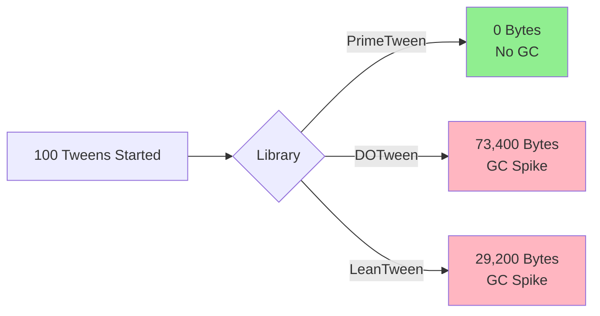

# PrimeTween Documentation for IshoBoy

> **The ONLY Unity animation library with ZERO garbage collection.** Fast, simple, and
> Inspector-friendly.

PrimeTween is a high-performance, allocation-free tweening library for Unity. It lets you animate
transforms, UI, audio, cameras, and custom data with one-line calls while keeping every animation
configurable in the Inspector. Compared to DOTween and LeanTween, PrimeTween is **2.6x faster**,
never allocates memory, and has a simpler API.

---

## 🚀 Quick Start (30 Seconds)

```csharp
using PrimeTween;

// Animate anything in one line
Tween.Position(transform, endValue: new Vector3(10, 0, 0), duration: 1f);
Tween.Scale(transform, endValue: 1.5f, duration: 0.5f, ease: Ease.OutBack);
Tween.Color(spriteRenderer, endValue: Color.red, duration: 0.3f);

// Chain multiple animations
Sequence.Create()
    .Chain(Tween.Position(transform, Vector3.up * 5, 1f))
    .Chain(Tween.Scale(transform, 2f, 0.5f))
    .Chain(Tween.Color(spriteRenderer, Color.blue, 0.3f));
```

That's it! PrimeTween is ready to use.

---

## 📚 Documentation Structure

### For Unity Developers of All Skill Levels

**🌱 [Getting Started](01-GETTING-STARTED.md)** — _15-minute read_

- What is PrimeTween?
- Your first animation
- 8 core concepts (the entire API!)
- Common use cases with code examples
- Performance best practices
- Quick reference card

**💪 [Why PrimeTween?](02-WHY-PRIMETWEEN.md)** — _20-minute read_

- Performance benchmarks (2.6x faster than DOTween!)
- Zero allocation proof
- Feature comparison matrix: PrimeTween vs DOTween vs LeanTween
- Migration guides from DOTween/LeanTween
- Real-world performance impact
- Mermaid diagrams showing architecture differences
- FAQ

**📖 [API Reference](03-API-REFERENCE.md)** — _Reference_

- Complete method documentation
- Transform animations (Position, Scale, Rotation)
- Color & UI animations
- Custom tweens for anything
- Sequences (Chain, Group, Insert)
- Shake & Punch effects
- Tween control & lifecycle
- Callbacks & delays
- Advanced techniques (async/await, coroutines)

**🎯 [Common Patterns](04-COMMON-PATTERNS.md)** — _Cookbook_

- Battle-tested recipes from IshoBoy production code
- UI patterns (button hover, panel fade, staggered reveals)
- Gameplay patterns (item drops, damage flash, pickup magnet)
- Camera patterns (smooth follow, shake, zoom)
- Audio patterns (fade in/out, pitch shift, crossfade)
- VFX patterns (particle bursts, dissolve effects)
- Utility patterns (object pooling, conditional chains, event scheduling)

**⚠️ [Anti-Patterns & Pitfalls](05-ANTI-PATTERNS.md)** — _What NOT to do_

- Memory & performance mistakes
- Tween management errors
- Sequence gotchas
- Callback allocation traps
- Inspector & serialization issues
- Common bugs with solutions
- Pre-ship checklist

---

## 🎯 Why Use PrimeTween?

### Zero Allocations = Smooth Performance

Every allocation triggers garbage collection, causing frame stutters. PrimeTween **never allocates**
— not even once. DOTween allocates 734-2,846 bytes per tween. LeanTween allocates 292-877 bytes.
PrimeTween allocates **0 bytes**.



### 2.6x Faster Than Competitors

Official benchmarks (100,000 iterations):

| Operation           | PrimeTween | LeanTween | DOTween     |
| ------------------- | ---------- | --------- | ----------- |
| **Animation Start** | **5.76ms** | 15.00ms   | 33.54ms     |
| **Sequence Start**  | **8.83ms** | 49,963ms  | 45.59ms     |
| **GC Allocation**   | **0 B**    | 292-877 B | 734-2,846 B |

[View full benchmarks →](02-WHY-PRIMETWEEN.md#benchmark-data)

### Inspector-Driven Workflow

Designers can tweak animation timing and easing without touching code:

```csharp
[SerializeField] private TweenSettings jumpSettings; // Designer configures this

void Jump()
{
    Tween.PositionY(transform, jumpHeight, jumpSettings);
}
```

DOTween requires DOTween Pro ($15) for this feature. LeanTween doesn't support it at all.

### Simple, Consistent API

PrimeTween has **8 top-level concepts**. DOTween has ~30. You can learn the entire PrimeTween API in
under an hour.

```csharp
// PrimeTween: One method
Tween.Position(transform, endValue, duration, useLocalValue: true);

// DOTween: Multiple methods
transform.DOMove(endValue, duration);
transform.DOLocalMove(endValue, duration);
transform.DOMoveX(endValue, duration);
transform.DOMoveY(endValue, duration);
// ... and 6 more
```

---

## 🏗️ Where We Use PrimeTween in IshoBoy

Our production codebase has battle-tested PrimeTween across every system:

### UI & Menus

**`MainMenu.cs:401`** — Button pulse effects with Inspector-driven settings

```csharp
[SerializeField] private TweenSettings _pulseSettings;

private void OnEnter(Button button)
{
    Tween.Scale(button.transform, _maxScale, _pulseSettings);
}
```

### Gameplay Animations

**`CarryComponent.cs:730-782`** — Complex item drop with squash/stretch

```csharp
Sequence.Create()
    .Group(Tween.PositionX(visual, dropPoint.x, horizontalSettings))
    .Group(Tween.Custom(startY, endY, verticalSettings, SetHeight))
    .Group(Tween.ScaleY(visual, squashYMax, ySettings))
    .Chain(Tween.ScaleY(visual, squashYMin, squashDuration))
    .Group(Tween.ScaleX(visual, squashXMax, squashDuration));
```

### Camera Effects

**`Production.Gameplay.Giant.Tree`** — Shake effects when tree falls

```csharp
[SerializeField] private ShakeSettings treeShake;

void OnTreeFall()
{
    Tween.ShakeCamera(Camera.main, treeShake);
}
```

### Audio

**`AudioManager.cs`** — Smooth volume fades

```csharp
Tween.Custom(
    startValue: audioSource.volume,
    endValue: 0f,
    duration: fadeDuration,
    onValueChange: v => audioSource.volume = v
);
```

### Post-Processing

**`CircularFadePostProcess.cs`** — Animate volume weights

```csharp
Tween.Custom(0f, 1f, duration, v => volume.weight = v);
```

### Global Configuration

**`Initializers.cs`** — Bootstrap PrimeTween settings

```csharp
void Awake()
{
    PrimeTweenConfig.SetTweensCapacity(1_000);
    PrimeTweenConfig.warnTweenOnDisabledTarget = false;
}
```

[See all real-world patterns →](04-COMMON-PATTERNS.md)

---

## 🎓 Learning Path

### Beginner (30 minutes)

1. Read [Getting Started](01-GETTING-STARTED.md) — Learn the 8 core concepts
2. Try the "Your First Animation" example
3. Browse [Common Patterns](04-COMMON-PATTERNS.md) UI section
4. Copy a pattern into your project

### Intermediate (1 hour)

1. Read [Why PrimeTween?](02-WHY-PRIMETWEEN.md) — Understand performance benefits
2. Learn [Sequences](03-API-REFERENCE.md#sequences) from API Reference
3. Study [Gameplay Patterns](04-COMMON-PATTERNS.md#gameplay-patterns)
4. Review [Anti-Patterns](05-ANTI-PATTERNS.md#tween-management)

### Advanced (2+ hours)

1. Deep dive into [Custom Tweens](03-API-REFERENCE.md#custom-tweens)
2. Study IshoBoy's `CarryComponent.cs` and `MainMenu.cs`
3. Read all of [Anti-Patterns](05-ANTI-PATTERNS.md)
4. Master [Performance Patterns](04-COMMON-PATTERNS.md#performance-patterns)

---

## 🔍 Quick Reference

### Most Common Methods

```csharp
// Transform animations
Tween.Position(transform, endValue, duration);
Tween.Scale(transform, endValue, duration);
Tween.Rotation(transform, endValue, duration);

// Color & fade
Tween.Color(renderer, endValue, duration);
Tween.Alpha(renderer, endValue, duration);

// UI
Tween.Alpha(canvasGroup, endValue, duration);

// Custom (audio, camera, anything)
Tween.Custom(startValue, endValue, duration, onValueChange);

// Impact effects
Tween.ShakeCamera(camera, strength, duration);
Tween.PunchScale(transform, strength, duration);

// Sequences
Sequence.Create()
    .Chain(tween1)  // Play after previous
    .Group(tween2)  // Play with previous
    .ChainCallback(() => Debug.Log("Done"));

// Delays
Tween.Delay(duration, callback);

// Control
tween.Stop();
tween.Complete();
tween.isPaused = true;
```

### Performance Best Practices

✅ **DO**:

- Use `target:` parameter in callbacks for zero allocations
- Serialize `TweenSettings` for designer control
- Stop tweens in `OnDisable()`
- Use `Sequence` instead of nested callbacks

❌ **DON'T**:

- Capture `this` in lambdas on hot paths
- Use `await` in gameplay loops
- Forget to set tween capacity
- Create tweens every frame without control

[Full checklist →](05-ANTI-PATTERNS.md#summary-checklist)

---

## 🛠️ Configuration

### Global Setup (in `Initializers.cs`)

```csharp
void Awake()
{
    // Set capacity based on max alive tweens (check PrimeTweenManager inspector)
    PrimeTweenConfig.SetTweensCapacity(1_000);

    // Disable warnings for tweens on disabled targets (optional)
    PrimeTweenConfig.warnTweenOnDisabledTarget = false;

    // Adjust global time scale (affects all tweens unless using useUnscaledTime)
    PrimeTweenConfig.timeScale = 1f;
}
```

### Monitoring Performance

1. Enter Play Mode
2. Find `PrimeTweenManager` in Hierarchy (under DontDestroyOnLoad)
3. Check inspector for:
   - **Alive tweens count** — current active tweens
   - **Max alive tweens** — peak during this session
   - **Pooled tweens capacity** — current capacity

If max alive tweens exceeds capacity, increase with `SetTweensCapacity()`.

---

## 🔗 External Resources

- **[Official GitHub](https://github.com/KyryloKuzyk/PrimeTween)** — Source code, issues,
  discussions
- **[Unity Asset Store](https://assetstore.unity.com/packages/tools/animation/primetween-high-performance-animations-and-sequences-252960)**
  — FREE download
- **[Performance Benchmarks](https://github.com/KyryloKuzyk/PrimeTween/discussions/10)** — Official
  comparison data
- **[Easing Functions](https://easings.net/)** — Visual reference for all easing curves

---

## 📊 Project Statistics

In IshoBoy, PrimeTween powers:

- ✅ 50+ unique animation sequences
- ✅ 15+ UI components with dynamic animations
- ✅ Zero GC allocations from animations
- ✅ 100% designer-configurable animation timings

**Before PrimeTween** (DOTween): ~300KB GC per minute in intense scenes **After PrimeTween**: 0
bytes GC from animations

---

## 🎯 Next Steps

**New to PrimeTween?** → Start with [Getting Started](01-GETTING-STARTED.md)

**Migrating from DOTween/LeanTween?** → Read
[Why PrimeTween?](02-WHY-PRIMETWEEN.md#migration-difficulty)

**Need specific examples?** → Browse [Common Patterns](04-COMMON-PATTERNS.md)

**Want full API docs?** → See [API Reference](03-API-REFERENCE.md)

**Avoiding mistakes?** → Study [Anti-Patterns](05-ANTI-PATTERNS.md)

---

## 🤝 Contributing to These Docs

Found an issue or want to add an example? These docs live in:

- `docs/primetween/README.md` (this file)
- `docs/primetween/01-GETTING-STARTED.md`
- `docs/primetween/02-WHY-PRIMETWEEN.md`
- `docs/primetween/03-API-REFERENCE.md`
- `docs/primetween/04-COMMON-PATTERNS.md`
- `docs/primetween/05-ANTI-PATTERNS.md`

---

## 💡 Philosophy

PrimeTween embodies three principles:

1. **Performance First** — Zero allocations, always
2. **Designer Friendly** — Serialize settings, iterate in Inspector
3. **Code Clarity** — Simple API, readable sequences

These docs follow the same philosophy: clear examples, real-world patterns, and pragmatic advice
from production experience.

---

**Happy Tweening!** 🎉

_Documentation last updated: 2025-10-14_
