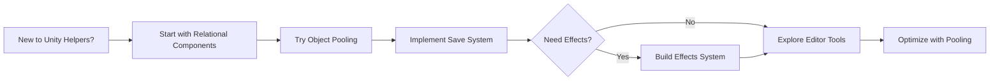

# Unity Helpers - Production-Ready Utilities

Stop writing boilerplate. Start shipping features. A comprehensive toolkit of battle-tested
utilities that eliminates repetitive coding and accelerates Unity development.

---

## 📚 What is Unity Helpers?

Unity Helpers is a **production-grade utility library** designed to eliminate the tedious,
repetitive tasks every Unity developer faces. Instead of writing the same component caching code,
serialization logic, or pooling systems for every project, Unity Helpers provides robust, tested,
and optimized solutions that just work.

**The Promise:** Save 30-40% of development time by using professional-grade utilities instead of
reinventing the wheel.

```csharp
// Before Unity Helpers: Boilerplate everywhere
private SpriteRenderer sprite;
void Awake()
{
    sprite = GetComponentInChildren<SpriteRenderer>();
    if (sprite == null)
    {
        sprite = GetComponentInParent<SpriteRenderer>();
    }
}

// After Unity Helpers: One attribute
[SiblingComponent] private SpriteRenderer sprite;
// Done! Automatically wired in Awake()
```

---

## 🎯 What Problem Does Unity Helpers Solve?

### The Problem: Repetitive Boilerplate Slows Development

Every Unity project has the same tedious patterns:

```csharp
// ❌ Problem 1: Component Lookup Boilerplate
public class Player : MonoBehaviour
{
    private Rigidbody rb;
    private Animator animator;
    private SpriteRenderer sprite;

    void Awake()
    {
        rb = GetComponent<Rigidbody>();
        animator = GetComponent<Animator>();
        sprite = GetComponentInChildren<SpriteRenderer>();

        if (rb == null) Debug.LogError("Missing Rigidbody!");
        if (animator == null) Debug.LogError("Missing Animator!");
        if (sprite == null) Debug.LogError("Missing SpriteRenderer!");
    }
}

// ❌ Problem 2: Serialization Headaches
[System.Serializable]
public class SaveData
{
    public string playerName;
    public int level;
    // Want to save a Vector3? Good luck with JSON.NET!
    // Want to save a GameObject reference? Can't do it!
}

// ❌ Problem 3: Manual Object Pooling
public class BulletPool : MonoBehaviour
{
    private Queue<Bullet> pool = new Queue<Bullet>();

    public Bullet Get()
    {
        if (pool.Count > 0) return pool.Dequeue();
        return Instantiate(bulletPrefab);
    }

    public void Release(Bullet bullet)
    {
        bullet.gameObject.SetActive(false);
        pool.Enqueue(bullet);
    }
    // Missing cleanup, missing buffer management, allocates on empty!
}

// ❌ Problem 4: Buff/Debuff System From Scratch
// Every game needs one, every developer writes their own version...
// Stacking? Duration? Conflicts? Reimplement every time!
```

### The Solution: Unity Helpers Does It For You

```csharp
// ✅ Solution 1: Automatic Component Wiring
public class Player : MonoBehaviour
{
    [SelfComponent] private Rigidbody rb;
    [SelfComponent] private Animator animator;
    [ChildComponent] private SpriteRenderer sprite;
    // All automatically wired in Awake() with error checking!
}

// ✅ Solution 2: Unity-Aware Serialization
public class SaveData
{
    public string playerName;
    public int level;
    public Vector3 position;      // Just works!
    public Color playerColor;     // Just works!
    public GameObjectRef weapon;  // GameObject references work!
}
byte[] data = SaveSystem.Serialize(saveData);  // JSON, Protobuf, or Binary

// ✅ Solution 3: Professional Object Pooling
using var lease = Buffers<Bullet>.List.Get(out List<Bullet> pool);
// Zero allocation, automatic cleanup, thread-safe!

// ✅ Solution 4: Data-Driven Effects System
[CreateAssetMenu]
public class HasteEffect : Effect
{
    public float speedMultiplier = 1.5f;
    public float duration = 5f;
}

player.ApplyEffect(hasteEffect);  // Auto-stacking, duration management, done!
```

---

<a id="quick-start"></a>

## 🚀 Quick Start

### Installation

Install via [Unity Package Manager](https://docs.unity3d.com/Manual/upm-ui-giturl.html)
(recommended):

```
1. Open Unity Editor
2. Go to Window → Package Manager
3. Click the "+" dropdown
4. Select "Add package from git URL"
5. Enter: https://github.com/wallstop/unity-helpers.git
6. Click "Add"
```

**Alternative:** Download the latest
[Unity Package](https://github.com/wallstop/unity-helpers/releases) and import into your project.

**Via OpenUPM CLI:** Install using the [OpenUPM CLI](https://github.com/openupm/openupm-cli):

```bash
openupm add com.wallstop-studios.unity-helpers
```

**Via npm registry:** Install straight from the
[npm registry manifest](https://registry.npmjs.org/com.wallstop-studios.unity-helpers).

### Your First Helper in 30 Seconds

#### Before Unity Helpers: 10 Lines of Code

```csharp
public class Enemy : MonoBehaviour
{
    private Rigidbody rb;
    private Animator animator;

    void Awake()
    {
        rb = GetComponent<Rigidbody>();
        if (rb == null)
        {
            Debug.LogError($"{gameObject.name} is missing Rigidbody!");
        }

        animator = GetComponentInChildren<Animator>();
        if (animator == null)
        {
            Debug.LogError($"{gameObject.name} is missing Animator!");
        }
    }
}
```

#### After Unity Helpers: 3 Lines of Code

```csharp
public class Enemy : MonoBehaviour
{
    [SelfComponent] private Rigidbody rb;
    [ChildComponent] private Animator animator;
    // Done! Auto-wired with error checking in Awake()
}
```

**That's it!** Unity Helpers automatically finds and caches components, with built-in validation.

---

## 📖 Core Features

### Feature 1: Relational Components (Auto-Wiring)

Automatically find and cache components using attributes. No more boilerplate.

#### Available Attributes

```csharp
public class ComponentExample : MonoBehaviour
{
    // Find on same GameObject
    [SelfComponent] private Rigidbody rb;

    // Find in children
    [ChildComponent] private SpriteRenderer childSprite;

    // Find in parent
    [ParentComponent] private Canvas parentCanvas;

    // Find in siblings (parent's other children)
    [SiblingComponent] private AudioSource siblingAudio;

    // All automatically wired in Awake()!
}
```

#### Advanced Options

```csharp
public class AdvancedExample : MonoBehaviour
{
    // Optional - no error if not found
    [SelfComponent(required: false)]
    private AudioSource optionalAudio;

    // Search up the hierarchy
    [ParentComponent(includeInactive: true)]
    private GameManager manager;

    // Find multiple components
    [ChildComponent]
    private SpriteRenderer[] allChildSprites;
}
```

#### What It Replaces

```csharp
// ❌ Before (10+ lines)
private Rigidbody rb;
private SpriteRenderer sprite;
private AudioSource audio;

void Awake()
{
    rb = GetComponent<Rigidbody>();
    sprite = GetComponentInChildren<SpriteRenderer>();
    audio = GetComponentInChildren<AudioSource>();

    if (rb == null) Debug.LogError("Missing Rigidbody!");
    if (sprite == null) Debug.LogError("Missing SpriteRenderer!");
    // audio is optional
}

// ✅ After (3 lines)
[SelfComponent] private Rigidbody rb;
[ChildComponent] private SpriteRenderer sprite;
[ChildComponent(required: false)] private AudioSource audio;
```

---

### Feature 2: Data-Driven Effects System

Create buffs, debuffs, and status effects as ScriptableObjects. Automatic stacking, duration, and
state management.

#### Defining an Effect

Effects are implemented as
[ScriptableObjects](https://docs.unity3d.com/Manual/class-ScriptableObject.html), making them
data-driven and reusable.

```csharp
using UnityHelpers;

[CreateAssetMenu(menuName = "Effects/Haste")]
public class HasteEffect : Effect
{
    public float speedMultiplier = 1.5f;

    public override void OnApplied(GameObject target)
    {
        if (target.TryGetComponent<PlayerMovement>(out var movement))
        {
            movement.Speed *= speedMultiplier;
        }
    }

    public override void OnRemoved(GameObject target)
    {
        if (target.TryGetComponent<PlayerMovement>(out var movement))
        {
            movement.Speed /= speedMultiplier;
        }
    }
}
```

#### Applying Effects

```csharp
public class Player : MonoBehaviour
{
    [SerializeField] private EffectManager effectManager;

    void OnCollisionEnter(Collision collision)
    {
        if (collision.gameObject.TryGetComponent<EffectPickup>(out var pickup))
        {
            // Apply effect - automatic duration management!
            effectManager.ApplyEffect(pickup.effect, duration: 5f);
        }
    }
}
```

#### Effect Features

- **Automatic Stacking** - Refresh duration or stack intensity
- **Duration Management** - Auto-remove after time expires
- **State Tracking** - Query active effects
- **Tags & Categories** - Filter and group effects
- **Interactions** - Effects can modify each other

```csharp
// Check for specific effect
if (effectManager.HasEffect<HasteEffect>())
{
    Debug.Log("Player is hasted!");
}

// Remove all debuffs
effectManager.RemoveEffectsWithTag("debuff");

// Get all active effects
foreach (var effect in effectManager.ActiveEffects)
{
    Debug.Log($"Active: {effect.Name}");
}
```

---

### Feature 3: Unity-Aware Serialization

Serialize Unity-specific types (Vector3, Color, GameObject, etc.) with JSON, Protobuf, or Binary.
Schema evolution support prevents data loss.

#### Basic Serialization

```csharp
using UnityHelpers;

[System.Serializable]
public class PlayerSaveData
{
    public string playerName;
    public int level;
    public Vector3 position;          // Unity type - just works!
    public Color favoriteColor;       // Unity type - just works!
    public GameObjectRef weapon;      // GameObject reference!
    public List<ItemData> inventory;
}

// Save to JSON
PlayerSaveData data = new PlayerSaveData { /*...*/ };
byte[] jsonBytes = SaveSystem.SerializeJson(data);
File.WriteAllBytes("save.json", jsonBytes);

// Load from JSON
byte[] loadedBytes = File.ReadAllBytes("save.json");
PlayerSaveData loaded = SaveSystem.DeserializeJson<PlayerSaveData>(loadedBytes);
Debug.Log($"Loaded {loaded.playerName} at position {loaded.position}");
```

#### Supported Unity Types

```csharp
public class UnityTypeExample
{
    // Primitives
    public Vector2 position2D;
    public Vector3 position3D;
    public Vector4 data;
    public Quaternion rotation;

    // Colors
    public Color color;
    public Color32 color32;

    // Bounds
    public Bounds bounds;
    public Rect rect;

    // References (via GameObjectRef wrapper)
    public GameObjectRef targetObject;
    public GameObjectRef prefab;

    // Collections
    public List<Vector3> waypoints;
    public Dictionary<string, Color> colorPalette;
}
```

#### Schema Evolution (Prevent Data Loss)

Unity Helpers supports [schema evolution](https://en.wikipedia.org/wiki/Schema_evolution) to handle
save data changes gracefully.

```csharp
// Version 1
[System.Serializable]
public class PlayerData
{
    public string name;
    public int level;
}

// Version 2 - Add new field with default
[System.Serializable]
public class PlayerData
{
    public string name;
    public int level;

    [DefaultValue(100)]  // Old saves get this default
    public int maxHealth = 100;
}

// Old saves still load correctly!
```

---

### Feature 4: Professional Object Pooling

Zero-allocation buffer management. Eliminates garbage collection spikes.

#### Basic Pooling

```csharp
using UnityHelpers;

public class BulletSpawner : MonoBehaviour
{
    void FireBullet()
    {
        // Get a pooled list - zero allocations!
        using var lease = Buffers<Bullet>.List.Get(out List<Bullet> bullets);

        // Use the list
        bullets.Add(CreateBullet());
        bullets.Add(CreateBullet());

        // Automatically returned to pool when lease is disposed
    }
}
```

#### Available Pool Types

```csharp
// Lists
using var listLease = Buffers<Enemy>.List.Get(out List<Enemy> enemies);

// HashSets
using var setLease = Buffers<string>.HashSet.Get(out HashSet<string> tags);

// Dictionaries
using var dictLease = Buffers<int, string>.Dictionary.Get(
    out Dictionary<int, string> idToName
);

// Arrays
using var arrayLease = Buffers<Transform>.Array.Get(100, out Transform[] transforms);
```

#### What It Prevents

```csharp
// ❌ Before - Allocates every frame!
void Update()
{
    List<Enemy> nearbyEnemies = new List<Enemy>();  // Allocation!
    foreach (var enemy in allEnemies)
    {
        if (Vector3.Distance(transform.position, enemy.position) < range)
        {
            nearbyEnemies.Add(enemy);
        }
    }
    // GC pressure builds up, causes stuttering
}

// ✅ After - Zero allocations
void Update()
{
    using var lease = Buffers<Enemy>.List.Get(out List<Enemy> nearbyEnemies);
    foreach (var enemy in allEnemies)
    {
        if (Vector3.Distance(transform.position, enemy.position) < range)
        {
            nearbyEnemies.Add(enemy);
        }
    }
    // List returned to pool automatically, zero GC
}
```

---

<a id="editor-tools"></a>

### Feature 5: Editor Tools Suite

Unity Helpers includes powerful editor tools for automating tedious tasks. These tools are accessed
through Unity's editor menus and windows, not called directly from code.

#### Sprite Automation

Access sprite tools through the Unity editor menu:

- **Sprite Cropper** - `Tools → Wallstop Studios → Unity Helpers → Sprite Cropper` - Automatically
  removes transparent pixels from selected sprites
- **Sprite Atlas Generator** - `Tools → Wallstop Studios → Unity Helpers → Sprite Atlas Generator` -
  Generates optimized sprite atlases from folders
- **Sprite Settings Applier** -
  `Tools → Wallstop Studios → Unity Helpers → Sprite Settings Applier` - Opens editor window to
  batch adjust sprite import settings
- **Texture Settings Applier** -
  `Tools → Wallstop Studios → Unity Helpers → Texture Settings Applier` - Opens editor window to
  batch adjust texture import settings
- **Sprite Pivot Adjuster** - `Tools → Wallstop Studios → Unity Helpers → Sprite Pivot Adjuster` -
  Adjust sprite pivot points
- **Texture Resizer** - `Tools → Wallstop Studios → Unity Helpers → Texture Resizer` - Resize
  textures

#### Animation Tools

- **Animation Creator** - `Tools → Wallstop Studios → Unity Helpers → Animation Creator` - Create
  animations from sprite sequences
- **Sprite Sheet Animation Creator** -
  `Tools → Wallstop Studios → Unity Helpers → Sprite Sheet Animation Creator` - Generate animations
  from sprite sheets
- **Animation Copier** - `Tools → Wallstop Studios → Unity Helpers → Animation Copier` - Copy
  animations between objects
- **Sprite Animation Editor** -
  `Tools → Wallstop Studios → Unity Helpers → Sprite Animation Editor` - Visual editor for sprite
  animations

#### Prefab Validation

- **Prefab Checker** - `Tools → Wallstop Studios → Unity Helpers → Prefab Checker` - Ensures prefabs
  have required components

**Note:** These are editor GUI tools accessed through Unity's menu system (under
`Tools → Wallstop Studios → Unity Helpers`), similar to Unity's built-in tools like the Animation
window or Sprite Packer. They are not script APIs to be called from your game code.

---

## ✅ Do's and ❌ Don'ts

### Relational Components

#### ✅ DO: Use Specific Attributes

```csharp
// ✅ CORRECT - Clear intent
[SelfComponent] private Rigidbody rb;
[ChildComponent] private SpriteRenderer sprite;
```

#### ❌ DON'T: Call GetComponent Manually

```csharp
// ❌ WRONG - Defeats the purpose!
[SelfComponent] private Rigidbody rb;

void Awake()
{
    rb = GetComponent<Rigidbody>();  // Redundant!
}
```

### Effects System

#### ✅ DO: Use ScriptableObjects for Effect Definitions

```csharp
// ✅ CORRECT - Reusable, data-driven
[CreateAssetMenu]
public class HasteEffect : Effect { }
```

#### ❌ DON'T: Store State in ScriptableObjects

```csharp
// ❌ WRONG - All instances share this!
[CreateAssetMenu]
public class HasteEffect : Effect
{
    public float remainingDuration;  // BAD! Shared state!
}

// ✅ CORRECT - State in component
public class HasteEffect : Effect
{
    public float baseDuration;  // Config only
}
// EffectManager tracks duration per-instance
```

### Serialization

#### ✅ DO: Use GameObjectRef for References

```csharp
// ✅ CORRECT - Serializable reference
[System.Serializable]
public class WeaponData
{
    public GameObjectRef weaponPrefab;  // Works!
}
```

#### ❌ DON'T: Serialize GameObject Directly

```csharp
// ❌ WRONG - Can't serialize directly
[System.Serializable]
public class WeaponData
{
    public GameObject weaponPrefab;  // Won't serialize!
}
```

### Object Pooling

#### ✅ DO: Use 'using' for Automatic Disposal

```csharp
// ✅ CORRECT - Automatic cleanup
void ProcessEnemies()
{
    using var lease = Buffers<Enemy>.List.Get(out List<Enemy> enemies);
    // Use enemies
} // Automatically returned to pool
```

#### ❌ DON'T: Forget to Dispose

```csharp
// ❌ WRONG - Memory leak!
void ProcessEnemies()
{
    var lease = Buffers<Enemy>.List.Get(out List<Enemy> enemies);
    // Use enemies
    // Missing lease.Dispose()!
}
```

---

## 🔥 Common Patterns

### Pattern 1: Player Controller with Auto-Wiring

```csharp
using UnityEngine;
using UnityHelpers;

public class PlayerController : MonoBehaviour
{
    // Components automatically wired
    [SelfComponent] private Rigidbody rb;
    [SelfComponent] private Animator animator;
    [ChildComponent] private SpriteRenderer sprite;
    [SelfComponent] private EffectManager effectManager;

    [Header("Movement")]
    [SerializeField] private float baseSpeed = 5f;

    void Update()
    {
        // All components ready to use!
        float speed = baseSpeed;

        // Check for haste effect
        if (effectManager.HasEffect<HasteEffect>())
        {
            speed *= 1.5f;
        }

        Vector3 movement = new Vector3(Input.GetAxis("Horizontal"), 0, 0);
        rb.velocity = movement * speed;

        animator.SetFloat("Speed", rb.velocity.magnitude);
    }
}
```

### Pattern 2: Save System

```csharp
using UnityEngine;
using UnityHelpers;
using System.IO;

[System.Serializable]
public class GameSaveData
{
    public string playerName;
    public int level;
    public Vector3 playerPosition;
    public List<string> unlockedLevels;
    public Dictionary<string, int> inventory;
    public GameObjectRef currentWeapon;
}

public class SaveManager : MonoBehaviour
{
    private const string SavePath = "save.dat";

    public void SaveGame(GameSaveData data)
    {
        // Serialize to JSON
        byte[] jsonData = SaveSystem.SerializeJson(data);
        File.WriteAllBytes(SavePath, jsonData);
        Debug.Log("Game saved!");
    }

    public GameSaveData LoadGame()
    {
        if (!File.Exists(SavePath))
        {
            Debug.LogWarning("No save file found");
            return new GameSaveData();
        }

        byte[] jsonData = File.ReadAllBytes(SavePath);
        GameSaveData data = SaveSystem.DeserializeJson<GameSaveData>(jsonData);
        Debug.Log($"Game loaded! Level {data.level}");
        return data;
    }

    // Alternative: Binary serialization for smaller file size
    public void SaveGameBinary(GameSaveData data)
    {
        byte[] binaryData = SaveSystem.SerializeBinary(data);
        File.WriteAllBytes(SavePath, binaryData);
    }

    public GameSaveData LoadGameBinary()
    {
        byte[] binaryData = File.ReadAllBytes(SavePath);
        return SaveSystem.DeserializeBinary<GameSaveData>(binaryData);
    }
}
```

### Pattern 3: Buff/Debuff System

```csharp
using UnityEngine;
using UnityHelpers;

// Define effects as ScriptableObjects
[CreateAssetMenu(menuName = "Effects/Haste")]
public class HasteEffect : Effect
{
    public float speedMultiplier = 1.5f;

    public override void OnApplied(GameObject target)
    {
        Debug.Log($"{target.name} is hasted!");
    }

    public override void OnRemoved(GameObject target)
    {
        Debug.Log($"{target.name} is no longer hasted");
    }
}

[CreateAssetMenu(menuName = "Effects/Poison")]
public class PoisonEffect : Effect
{
    public int damagePerSecond = 5;

    public override void OnUpdate(GameObject target, float deltaTime)
    {
        if (target.TryGetComponent<Health>(out var health))
        {
            health.TakeDamage(damagePerSecond * deltaTime);
        }
    }
}

// Apply effects
public class EffectPickup : MonoBehaviour
{
    [SerializeField] private Effect effect;
    [SerializeField] private float duration = 5f;

    void OnTriggerEnter(Collider other)
    {
        if (other.TryGetComponent<EffectManager>(out var manager))
        {
            manager.ApplyEffect(effect, duration);
            Destroy(gameObject);
        }
    }
}

// Query effects
public class PlayerUI : MonoBehaviour
{
    [SelfComponent] private EffectManager effectManager;

    void Update()
    {
        // Show active effects
        foreach (var effect in effectManager.ActiveEffects)
        {
            Debug.Log($"Active: {effect.Name} ({effect.RemainingDuration:F1}s)");
        }

        // Check for specific effect
        if (effectManager.HasEffect<PoisonEffect>())
        {
            ShowPoisonWarning();
        }
    }
}
```

### Pattern 4: Optimized Enemy AI with Pooling

```csharp
using UnityEngine;
using UnityHelpers;

public class EnemyAI : MonoBehaviour
{
    [SelfComponent] private Rigidbody rb;
    [SerializeField] private float detectionRange = 10f;

    void Update()
    {
        FindNearbyPlayers();
    }

    void FindNearbyPlayers()
    {
        // Use pooled list - zero allocations!
        using var lease = Buffers<Player>.List.Get(out List<Player> nearbyPlayers);

        // Find all players
        var allPlayers = FindObjectsOfType<Player>();
        foreach (var player in allPlayers)
        {
            float distance = Vector3.Distance(transform.position, player.transform.position);
            if (distance <= detectionRange)
            {
                nearbyPlayers.Add(player);
            }
        }

        // Process nearby players
        if (nearbyPlayers.Count > 0)
        {
            ChaseNearestPlayer(nearbyPlayers);
        }

        // List automatically returned to pool here
    }

    void ChaseNearestPlayer(List<Player> players)
    {
        Player nearest = null;
        float minDistance = float.MaxValue;

        foreach (var player in players)
        {
            float distance = Vector3.Distance(transform.position, player.transform.position);
            if (distance < minDistance)
            {
                minDistance = distance;
                nearest = player;
            }
        }

        if (nearest != null)
        {
            Vector3 direction = (nearest.transform.position - transform.position).normalized;
            rb.velocity = direction * 3f;
        }
    }
}
```

---

## ⚠️ Common Pitfalls

### Pitfall 1: Forgetting to Use 'using' with Pooled Buffers

```csharp
// ❌ WRONG - Memory leak!
void Update()
{
    var lease = Buffers<Enemy>.List.Get(out List<Enemy> enemies);
    // Do work...
    // Forgot to dispose! Buffer never returned to pool
}

// ✅ CORRECT
void Update()
{
    using var lease = Buffers<Enemy>.List.Get(out List<Enemy> enemies);
    // Do work...
} // Automatically disposed
```

**Solution:** Always use the `using` keyword with buffer leases.

### Pitfall 2: Using Relational Attributes on Public Fields

```csharp
// ❌ WRONG - Mixing concerns
[SelfComponent]
public Rigidbody rb;  // Public AND auto-wired?

// ✅ CORRECT - Keep auto-wired fields private
[SelfComponent]
private Rigidbody rb;

public Rigidbody Rigidbody => rb;  // Public accessor if needed
```

**Solution:** Use relational attributes on private fields for proper encapsulation.

### Pitfall 3: Storing Runtime State in Effects

```csharp
// ❌ WRONG - ScriptableObjects are shared!
[CreateAssetMenu]
public class DamageOverTimeEffect : Effect
{
    public float damageDealt = 0f;  // BAD! All instances share this!
}

// ✅ CORRECT - State managed by EffectManager
[CreateAssetMenu]
public class DamageOverTimeEffect : Effect
{
    public float damagePerSecond = 5f;  // Config only

    public override void OnUpdate(GameObject target, float deltaTime)
    {
        // Use local variable for state
        float damage = damagePerSecond * deltaTime;
        // Apply damage...
    }
}
```

**Solution:** Effects define behavior, EffectManager tracks state.

### Pitfall 4: Not Handling Missing Components

```csharp
// ❌ RISKY - What if component is missing?
[SelfComponent(required: false)]
private AudioSource audio;

void PlaySound()
{
    audio.Play();  // NullReferenceException if not found!
}

// ✅ CORRECT - Check for null
[SelfComponent(required: false)]
private AudioSource audio;

void PlaySound()
{
    if (audio != null)
    {
        audio.Play();
    }
}

// ❌ UNSAFE - ?. bypasses Unity's null check (see best-practices/10-null-conditional-operators.md)
// void PlaySound()
{
//     audio?.Play();
// }
```

**Solution:** Always check optional components before use.

---

## 🔍 Troubleshooting

### Problem: Component Not Auto-Wired

**Symptoms:** Field with `[SelfComponent]` is null at runtime.

**Checklist:**

1. ✓ Is the attribute spelled correctly? (`[SelfComponent]` not `[Self Component]`)
2. ✓ Is the component actually on the GameObject?
3. ✓ Is the field private or serialized?
4. ✓ Are you accessing it in `Awake()`? (Use `Start()` instead)

**Solution:**

```csharp
// ❌ WRONG - Accessing in Awake before wiring
void Awake()
{
    rb.velocity = Vector3.zero;  // rb is null!
}

// ✅ CORRECT - Access in Start or later
void Start()
{
    rb.velocity = Vector3.zero;  // rb is wired now
}
```

### Problem: Serialization Fails for Custom Types

**Symptoms:** Custom class doesn't serialize/deserialize correctly.

**Checklist:**

1. ✓ Is the class marked `[System.Serializable]`?
2. ✓ Are all fields serializable types?
3. ✓ Is the class `public`?

**Solution:**

```csharp
// ❌ WRONG - Missing attribute
public class CustomData
{
    public string name;
}

// ✅ CORRECT
[System.Serializable]
public class CustomData
{
    public string name;
}
```

### Problem: Pooled Buffers Causing Unexpected Behavior

**Symptoms:** List has old data from previous use.

**Cause:** Buffers are recycled and may contain old data.

**Solution:**

```csharp
// ✅ CORRECT - Clear buffer before use
using var lease = Buffers<Enemy>.List.Get(out List<Enemy> enemies);
enemies.Clear();  // Clear any old data
// Now use the list...
```

Or use the auto-clearing overload:

```csharp
// ✅ EVEN BETTER - Auto-cleared on retrieval
using var lease = Buffers<Enemy>.List.Get(out List<Enemy> enemies, clearOnGet: true);
// List is already empty
```

### Problem: Effect Not Applying

**Symptoms:** `ApplyEffect()` called but effect doesn't work.

**Checklist:**

1. ✓ Is the Effect ScriptableObject assigned in Inspector?
2. ✓ Does the target have an EffectManager component?
3. ✓ Are `OnApplied()` methods overridden correctly?

**Solution:**

```csharp
// Verify effect is assigned
if (effectToApply == null)
{
    Debug.LogError("Effect is not assigned!");
    return;
}

// Verify EffectManager exists
if (!target.TryGetComponent<EffectManager>(out var manager))
{
    Debug.LogError("Target missing EffectManager!");
    return;
}

manager.ApplyEffect(effectToApply, duration);
```

---

## 🎯 When to Use Unity Helpers

### ✅ Use Unity Helpers When:

| Scenario                         | Why Unity Helpers Helps                    |
| -------------------------------- | ------------------------------------------ |
| **Starting a new project**       | Avoid reinventing common utilities         |
| **Repetitive component lookups** | Attributes eliminate boilerplate           |
| **Need save/load system**        | Unity-aware serialization just works       |
| **Building buff/debuff systems** | Data-driven effects save time              |
| **Performance optimization**     | Zero-allocation pooling prevents GC spikes |
| **Team development**             | Standard utilities reduce inconsistency    |

### ❌ Don't Use Unity Helpers When:

| Scenario                  | Use This Instead                |
| ------------------------- | ------------------------------- |
| **Learning Unity basics** | Understand fundamentals first   |
| **Minimal prototypes**    | Keep it simple until needed     |
| **Unique requirements**   | Custom solution might be better |

---

## 💡 Quick Reference

### Relational Components

```csharp
[SelfComponent] private Rigidbody rb;           // Same GameObject
[ChildComponent] private SpriteRenderer sprite;  // In children
[ParentComponent] private Canvas canvas;         // In parents
[SiblingComponent] private AudioSource audio;    // In siblings
```

### Effects System

```csharp
// Define effect
[CreateAssetMenu]
public class MyEffect : Effect
{
    public override void OnApplied(GameObject target) { }
    public override void OnRemoved(GameObject target) { }
    public override void OnUpdate(GameObject target, float dt) { }
}

// Apply effect
effectManager.ApplyEffect(myEffect, duration: 5f);

// Query effects
bool hasEffect = effectManager.HasEffect<MyEffect>();
effectManager.RemoveEffect<MyEffect>();
```

### Serialization

```csharp
// Serialize
byte[] data = SaveSystem.SerializeJson(myObject);
byte[] data = SaveSystem.SerializeBinary(myObject);

// Deserialize
MyClass obj = SaveSystem.DeserializeJson<MyClass>(data);
MyClass obj = SaveSystem.DeserializeBinary<MyClass>(data);
```

### Pooling

```csharp
// Get pooled buffer
using var lease = Buffers<T>.List.Get(out List<T> list);
using var lease = Buffers<T>.HashSet.Get(out HashSet<T> set);
using var lease = Buffers<K, V>.Dictionary.Get(out Dictionary<K, V> dict);
// Auto-disposed when out of scope
```

---

## 🎓 Learning Path



### Beginner (30-45 minutes)

1. Replace `GetComponent()` calls with relational attributes
2. Try pooled buffers in one performance-critical method
3. Experiment with serialization for save data

### Intermediate (1-2 hours)

1. Implement complete save/load system
2. Build data-driven effects for player abilities
3. Use editor tools for sprite/prefab automation

### Advanced (2-3 hours)

1. Optimize entire project with pooling
2. Create complex effect interactions
3. Build custom editor tools using helpers

---

## 📊 Feature Comparison

| Task               | Without Unity Helpers | With Unity Helpers | Time Saved |
| ------------------ | --------------------- | ------------------ | ---------- |
| Component caching  | 10 lines              | 1 attribute        | 90%        |
| Save/load system   | 100+ lines            | 10 lines           | 90%        |
| Object pooling     | 50+ lines             | 1 line             | 95%        |
| Buff/debuff system | 200+ lines            | 20 lines           | 90%        |

---

## 🔗 Additional Resources

- **[GitHub Repository](https://github.com/wallstop/unity-helpers)** - Source code and examples
- **[OpenUPM CLI Instructions](https://github.com/openupm/openupm-cli)** - Install with
  `openupm add com.wallstop-studios.unity-helpers`
- **[npm Registry Manifest](https://registry.npmjs.org/com.wallstop-studios.unity-helpers)** -
  Package metadata for manual installs
- **[Releases](https://github.com/wallstop/unity-helpers/releases)** - Unity packages
- **[Unity Package Manager Documentation](https://docs.unity3d.com/Manual/upm-ui.html)** -
  Installation help
- **[ScriptableObject Documentation](https://docs.unity3d.com/Manual/class-ScriptableObject.html)** -
  For Effects system

---

## 💬 Summary

Unity Helpers eliminates boilerplate code by providing:

- **Automatic Component Wiring** - No more manual `GetComponent()` calls
- **Data-Driven Effects** - Buffs/debuffs as ScriptableObjects
- **Unity-Aware Serialization** - Save Vector3, Color, GameObjects seamlessly
- **Zero-Allocation Pooling** - Prevent garbage collection stutters
- **Editor Automation** - Bulk sprite/animation/prefab operations

**Perfect For:** Developers who want to focus on game features instead of repetitive infrastructure
code.

**Proven:** 4,000+ automated tests, production-tested, zero dependencies,
[IL2CPP](https://docs.unity3d.com/Manual/IL2CPP.html)/[WebGL](https://docs.unity3d.com/Manual/webgl-building.html)
ready.

---

**Ready to accelerate your Unity development?** Start with [Quick Start](#quick-start) and replace
your first `GetComponent()` calls!
